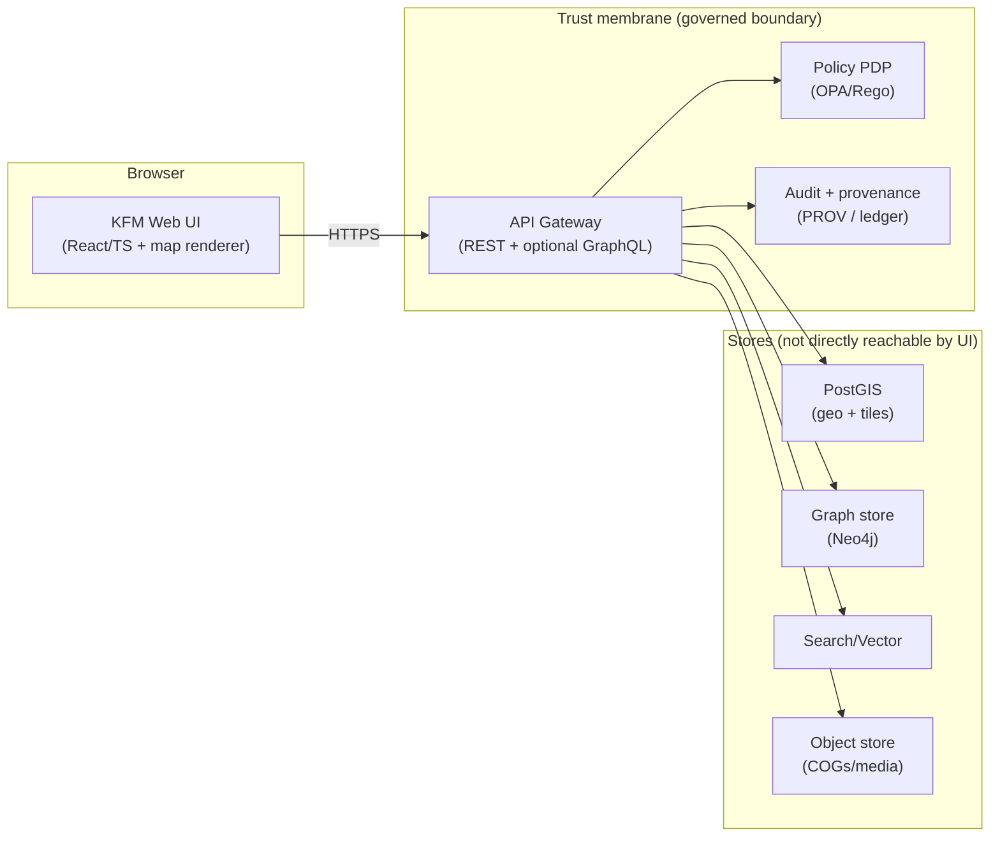

<!--
GOVERNED ARTIFACT NOTICE
This README is part of the KFM trust boundary: it encodes non-negotiable UI invariants.
If you change meaning (not just phrasing), route through the governance review path.
-->

# KFM Web UI (`web/`)

The **KFM Web UI** is the browser client for KFM’s governed geospatial + historical system:
**maps + time + Story Nodes + evidence review + Focus Mode (citation-backed Q&A)**.

> [!IMPORTANT]
> **Trust membrane (frontend):** the UI never talks to databases, object storage, or internal services directly.
> All access goes through the **governed API gateway**, which enforces **policy** (fail-closed) and writes **audit/provenance** records.

---

## Table of contents

- [What the UI is responsible for](#what-the-ui-is-responsible-for)
- [Non-negotiables](#non-negotiables)
- [System architecture](#system-architecture)
- [Directory layout (foundation rebuilt)](#directory-layout-foundation-rebuilt)
- [Import boundaries](#import-boundaries)
- [Evidence + citations (UI contract)](#evidence--citations-ui-contract)
- [ViewState (shared context)](#viewstate-shared-context)
- [Environment configuration](#environment-configuration)
- [Development](#development)
- [Testing](#testing)
- [Security checklist](#security-checklist)
- [How to add a new feature](#how-to-add-a-new-feature)
- [Related docs](#related-docs)

---

## What the UI is responsible for

- **Map exploration:** render layers, inspect features, filter by time/context
- **Story Nodes:** read narrative steps with citations and interactive map actions
- **Focus Mode:** ask questions and receive **citations or abstain**
- **Evidence + audit:** open provenance chains, see *why allowed/denied*, review sources

---

## Non-negotiables

### 1) Trust membrane (fail-closed)

- ✅ UI calls **API gateway only** (REST and/or GraphQL behind the same policy boundary)
- ✅ **Policy fails closed:** if policy/evidence checks are uncertain, the UI shows denial/abstain
- 🚫 No direct PostGIS/Neo4j/S3/OpenSearch calls from the browser (ever)
- 🚫 No “temporary bypass” endpoints without policy + audit

### 2) Evidence-first UX (cite or abstain)

- Focus Mode responses must include:
  - `answer_markdown`
  - `citations[]` (structured, resolvable)
  - `audit_ref` (opens audit/provenance view)
- If citations are empty, the UI renders an explicit **abstention** state with next-step guidance.

### 3) Sensitive data handling

- Some datasets require **redaction/generalization** (e.g., protected sites).
- Redaction is enforced server-side; UI must **not** attempt to reconstruct restricted fields.
- Avoid persisting sensitive content in local storage/logs by default.

### 4) Safe rendering

- Treat Story Node markdown and Focus Mode `answer_markdown` as **untrusted**.
- Sanitize output and restrict allowed elements to prevent XSS.

---

## System architecture



> [!NOTE]
> Concrete tech choices (Vite/Next.js, MapLibre/Cesium, query libs, etc.) are **not confirmed in repo**
> unless reflected by actual files like `web/package.json` and `web/src/*`.

---

## Directory layout (foundation rebuilt)

This layout is designed so the UI can grow without collapsing into:
- a `components/` dumping ground,
- random `fetch(...)` calls everywhere,
- duplicated evidence/citation rendering,
- blurred boundaries between “app wiring” and “feature behavior.”

### Design principles (the foundation)

1. **Feature-first slicing**: map/story/focus/audit/evidence evolve independently.
2. **Single API boundary**: networking is centralized and typed.
3. **Evidence is first-class**: citations resolve to human-readable evidence views consistently.
4. **Generated code is quarantined**: API types/clients live in a read-only zone.
5. **Boundaries are enforceable**: lint rules + import maps make this structural, not aspirational.

### Tree (with lines)

```text
web/
├── README.md
├── package.json
├── tsconfig.json
├── vite.config.ts                 # (or framework config) (not confirmed in repo)
├── index.html                     # (not confirmed in repo)
├── public/
│   └── ...static assets...
├── src/
│   ├── main.tsx
│   │
│   ├── app/                       # App shell: routing, layouts, providers
│   │   ├── App.tsx
│   │   ├── routes.tsx
│   │   ├── layouts/
│   │   ├── providers/
│   │   └── error/
│   │
│   ├── gen/                       # GENERATED (read-only)
│   │   └── openapi/               # typed clients + schemas from API contract
│   │
│   ├── lib/                       # Shared primitives (no feature logic)
│   │   ├── api/                   # the only place that does fetch/http
│   │   ├── auth/                  # token handling, guards (if enabled)
│   │   ├── policy/                # policy-explain helpers (deny reasons, banners)
│   │   ├── telemetry/             # logging/metrics hooks (if enabled)
│   │   ├── evidence/              # citation model + resolver primitives
│   │   ├── ui/                    # reusable UI primitives (buttons/panels/dialogs)
│   │   └── utils/                 # tiny pure helpers (not a dumping ground)
│   │
│   ├── features/                  # Feature slices (own behavior + orchestration)
│   │   ├── map/
│   │   │   ├── components/
│   │   │   ├── hooks/
│   │   │   ├── state/
│   │   │   ├── services/
│   │   │   └── types.ts
│   │   ├── story/
│   │   │   ├── components/
│   │   │   ├── hooks/
│   │   │   ├── state/
│   │   │   ├── services/
│   │   │   ├── markdown/
│   │   │   └── types.ts
│   │   ├── focus/
│   │   │   ├── components/
│   │   │   ├── hooks/
│   │   │   ├── state/
│   │   │   ├── services/
│   │   │   └── types.ts
│   │   ├── audit/
│   │   │   ├── components/
│   │   │   ├── hooks/
│   │   │   ├── state/
│   │   │   ├── services/
│   │   │   └── types.ts
│   │   └── evidence/
│   │       ├── components/        # evidence cards/drawer/views
│   │       ├── hooks/
│   │       ├── services/          # orchestration around resolver + UI
│   │       └── types.ts
│   │
│   ├── styles/
│   │   ├── globals.css
│   │   └── tokens.css
│   │
│   ├── assets/
│   │   ├── brand/
│   │   ├── icons/
│   │   └── images/
│   │
│   └── types/
│       └── ambient.d.ts
│
└── tests/
    ├── contract/                  # API/citation/audit contract tests (must-have)
    ├── unit/
    └── e2e/                       # Playwright/Cypress (if used)
```

### What goes where (the “why”, not just the “what”)

| Path | Purpose | Owns logic? | Hard rule |
|---|---|---:|---|
| `src/app/` | App shell wiring: routes, layouts, providers | Minimal | No feature logic dumps here |
| `src/features/*/` | Feature behavior + orchestration | Yes | Features do **not** do raw networking |
| `src/lib/api/` | **Single API boundary** (http client, retries, auth headers) | Yes | 🚫 no `fetch` outside `lib/api` |
| `src/gen/openapi/` | Generated typed clients/types | No | Read-only; generated in CI/dev |
| `src/lib/evidence/` | Citation model + resolver primitives | Yes | Shared: story/focus/map/audit |
| `src/features/evidence/` | Evidence UI views | Yes | Must resolve `citation.ref` reliably |
| `tests/contract/` | Guards KFM invariants (cite/abstain, resolver, audit links) | Yes | Must run in CI |

> [!TIP]
> The moment two features copy the same logic, it belongs in `lib/` (primitive) or `features/evidence/` (evidence UI).
> Don’t create a “shared/” junk drawer.

---

## Import boundaries

These rules keep the tree meaningful.

### Allowed imports

- `src/app/*` → may import from `features/*`, `lib/*`, `gen/*`
- `src/features/*` → may import from `lib/*`, `gen/*`, and its own subtree
- `src/lib/*` → must **not** import from `features/*`
- `src/gen/*` → imports nothing from `src/` (generated output)

### Recommended enforcement (not confirmed in repo)

- ESLint import boundaries (e.g., `eslint-plugin-boundaries` or equivalent)
- TS path aliases:
  - `@app/*`, `@features/*`, `@lib/*`, `@gen/*`

---

## Evidence + citations (UI contract)

### Citation model (UI-facing)

The UI should treat citations as structured objects (not strings).

```ts
export type Citation = {
  ref: string;              // resolvable reference: prov://, stac://, dcat://, doc://, graph://
  label?: string;           // short display label
  locator?: string;         // page/feature/id hint
  confidence?: number;      // optional, if the API exposes it
};
```

### Evidence resolution requirement

> [!IMPORTANT]
> Given any `citation.ref` in a Story Node or Focus Mode answer, the UI must be able to render a
> human-readable evidence view (card/drawer/page) via the governed API.

**Acceptance target:** resolve in **≤ 2 API calls** per citation (cache-friendly).

---

## ViewState (shared context)

The UI maintains a single **ViewState** representing user context for grounded queries.

```ts
export type ViewState = {
  timeRange: [string, string];              // ISO strings
  bbox: [number, number, number, number];   // [minLon, minLat, maxLon, maxLat]
  activeLayers: string[];                   // layer IDs
  storyNodeId?: string;
  storyStepId?: string;
  userRole?: string;                        // if surfaced client-side
};
```

---

## Environment configuration

> [!NOTE]
> Exact variable names and tooling are **not confirmed in repo**. If you use Vite, prefer `VITE_*`.

Example `.env.local`:

```ini
# Governed API gateway base URL
VITE_KFM_API_BASE_URL=http://localhost:8080

# Optional auth (OIDC) if enabled
VITE_KFM_AUTH_ENABLED=false
VITE_KFM_OIDC_ISSUER=
VITE_KFM_OIDC_CLIENT_ID=
```

---

## Development

> [!IMPORTANT]
> Verify scripts in `web/package.json`. Commands below are conventional defaults.

```sh
cd web
npm install
npm run dev
```

Typical checks:

```sh
npm run lint
npm run typecheck
npm test
npm run build
```

### Generated API client (recommended) (not confirmed in repo)

A common pattern is to generate `src/gen/openapi/*` from the governed API schema:

- `npm run gen:openapi`
- CI regenerates and verifies that generated output matches the committed contract

---

## Testing

### Contract tests (must-have)

These protect KFM’s credibility.

- **Cite-or-abstain UX**
  - If `citations.length === 0`, the UI renders an explicit abstain state
  - UI suggests next steps: tighten time range, activate layers, open evidence search
- **Evidence resolution**
  - For each `citation.ref`, UI can render an evidence card/view
  - Resolver returns a meaningful failure mode (no silent “null”)
- **Audit link presence**
  - Every Focus Mode answer exposes `audit_ref`
  - UI can open the audit/provenance view for that reference

### E2E (recommended)

- Map → hover feature → open evidence/provenance
- Story step → updates ViewState → citations remain resolvable
- Focus query → answer + citations → open evidence drawer → open audit timeline

---

## Security checklist

- [ ] Sanitize markdown/HTML output (Story + Focus) with an allowlist
- [ ] Safe external links (`rel="noopener noreferrer"`, clear external indicators)
- [ ] Avoid logging tokens or sensitive payloads client-side
- [ ] Minimal persistence by default (localStorage/sessionStorage opt-in only)
- [ ] CSP aligned with deployment (where applicable)
- [ ] Dependency scanning and lockfile hygiene

---

## How to add a new feature

Example: adding a `features/timeline/` module.

1. Create the slice:
   - `src/features/timeline/components/`
   - `src/features/timeline/hooks/`
   - `src/features/timeline/state/`
   - `src/features/timeline/services/`
   - `src/features/timeline/types.ts`

2. Add API calls only via `src/lib/api/` (or a tiny wrapper in `services/` that calls `lib/api`).

3. If it needs citations/evidence:
   - Use `@lib/evidence` primitives
   - Render via `features/evidence` UI components (don’t invent a new evidence view)

4. Wire into `src/app/routes.tsx` and/or a layout in `src/app/layouts/`.

5. Add at least one contract test in `tests/contract/` if it touches:
   - citations
   - evidence resolution
   - audit references
   - policy-deny UX

**Definition of done (feature):**
- [ ] No raw `fetch` outside `lib/api`
- [ ] Uses shared evidence resolver + UI where relevant
- [ ] Has a contract test covering its invariant
- [ ] Error/deny states are explicit and human-readable

---

## Related docs

- Root `README.md` (system overview)
- `CONTRIBUTING.md` (workflow + standards)
- `SECURITY.md` (reporting + policy)
- API schemas (OpenAPI/GraphQL) used to generate `src/gen/openapi/`
