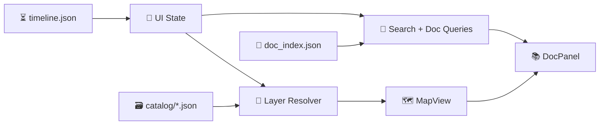

# 🌾🗺️ `web/` — Kansas Frontier Matrix Web Viewer


A browser-based **interactive map + timeline** experience for the Kansas Frontier Matrix (KFM).  
This is where users **explore spatiotemporal layers**, **toggle eras**, and **open linked documents / insights** in a human-centered way. 🧭✨

> ✅ Designed to deploy to **GitHub Pages** (static-first), while still supporting a richer **React app** path when needed.

---

## 🧭 Table of contents

- [🎯 Goals](#-goals)
- [🧩 What lives in `web/`](#-what-lives-in-web)
- [🧰 Viewer modes](#-viewer-modes)
- [🚀 Quickstart](#-quickstart)
- [⚙️ Configuration](#-configuration)
- [🗂️ Recommended structure](#️-recommended-structure)
- [🧠 Architecture model](#-architecture-model)
- [🗺️ Data contracts](#️-data-contracts)
- [⏳ Timeline semantics](#-timeline-semantics)
- [🌐 Optional API integration](#-optional-api-integration)
- [♿ Accessibility](#-accessibility)
- [⚡ Performance](#-performance)
- [🛡️ Security](#️-security)
- [🚢 Deployment](#-deployment)
- [🧪 Dev quality](#-dev-quality)
- [✅ Roadmap](#-roadmap)
- [📚 Project Reading Room](#-project-reading-room)
- [🔙 Back to root](#-back-to-root)

---

## 🎯 Goals

What this viewer should feel like:

- 🗺️ **Exploration-first**: map is primary, narrative is always one click away
- ⏳ **Time-aware**: slider, stepping, and playback drive what’s visible
- 🔍 **Findable**: search places / themes / eras, jump-to results
- 🧾 **Traceable**: every layer has provenance, notes, and a “how derived” story
- ♿ **Accessible**: keyboard, labels, contrast, and mobile layouts are non-negotiable

---

## 🧩 What lives in `web/`

This folder is the **front-end viewer** and **GitHub Pages-ready site**:

- 🧾 Static entrypoints (`index.html`, `app.js`, `style.css`) for lightweight deploy 🚀  
- 🗃️ Precomputed JSON the UI consumes (`data/catalog`, `timeline.json`, `doc_index.json`) 🧾  
- 🗺️ Interactive map UI (MapLibre/Leaflet) rendering tiled raster + vectors  
- 📚 Document linking UX (feature → citations/excerpts → source jump-outs)

---

## 🧰 Viewer modes

KFM supports two approaches (and they can coexist):

### ✅ Static viewer
- MapLibre/Leaflet + vanilla JS
- Fast iteration, minimal toolchain
- Easy to publish via Pages

### ⚛️ App viewer
- React components (MapView / Sidebar / Timeline / Panels)
- More complex UI patterns: search, bookmarks, tables, charts
- Typically Vite-based

### 🌍 Optional 3D mode
- CesiumJS globe mode for terrain + draped overlays
- Shares the same **timeline state** + **catalog semantics**

---

## 🚀 Quickstart

> ⚠️ Do not open `index.html` by double-clicking (CORS/file issues). Always run a local server.

### Option A — Static viewer, no build step ✅

```bash
cd web

# Python
python -m http.server 8000

# Or Node
npx serve -l 8000
```

Open:
- `http://localhost:8000`

### Option B — React dev server ⚛️

If you have `web/package.json`:

```bash
cd web
npm install
npm run dev   # or: npm start
```

### Option C — Docker preview 🐳

```bash
docker run --rm -p 8000:80 \
  -v "$(pwd)/web:/usr/share/nginx/html:ro" nginx:alpine
```

Open:
- `http://localhost:8000`

---

## ⚙️ Configuration

Front-end builds often need **public configuration** (tile endpoints, style URL, public keys).

Create a local env file **without committing secrets**:

```bash
cp ../.env.example ../.env
# or (web-scoped)
cp .env.example .env
```

### Recommended env keys

```bash
# Backend API
VITE_API_BASE_URL=http://localhost:8080

# Map styles/tiles
VITE_MAP_STYLE_URL=./data/styles/kfm-style.json
VITE_TILE_BASE_URL=./tiles

# Optional public provider key (domain-restricted + rate-limited)
VITE_MAPTILER_KEY=YOUR_PUBLIC_KEY
```

✅ Frontend tokens are **public enough** by definition.  
If it’s a secret, it must **not** ship in the bundle.

---

## 🗂️ Recommended structure

This layout keeps the static approach clean while still allowing an app build:

```text
web/
├─ 🧾 README.md
├─ 🧾 index.html
├─ 🎨 style.css
├─ 🧠 app.js                  # static entry (or built entry)
├─ 📦 package.json            # optional (React/tooling)
├─ 🧩 src/                    # optional (React source)
│  ├─ 🗺️ components/
│  │  ├─ MapView/
│  │  ├─ Sidebar/
│  │  ├─ TimelineSlider/
│  │  ├─ DocPanel/
│  │  ├─ ChartPanel/
│  │  └─ DataTable/
│  ├─ 🔌 api/
│  ├─ 🧱 state/
│  └─ 🧪 tests/
├─ 📚 data/
│  ├─ 🗃️ catalog/             # STAC-like layer manifests (JSON)
│  ├─ ⏳ timeline.json         # timeline config (ticks, eras)
│  ├─ 🧾 doc_index.json        # document KB index (precomputed)
│  ├─ 🗺️ styles/              # MapLibre style JSON + sprites/fonts
│  └─ 🧭 ui_config.json        # default UI state (optional)
└─ 🖼️ assets/
   ├─ 🏷️ badges/              # local SVG badges (avoid external URLs)
   ├─ logos/
   └─ icons/
```

---

## 🧠 Architecture model

### Mental model

- 🗺️ **MapView**: owns map instance, layer lifecycle, feature selection
- 🧰 **Sidebar**: toggles, legend, filters, provenance, layer metadata
- ⏳ **TimelineSlider**: global time control (ticks + playback)
- 📚 **DocPanel**: linked excerpts + citations + “open source” actions
- 📈 **ChartPanel**: time-series & comparisons (Plotly/Chart.js/D3)
- 📋 **DataTable**: exportable tables + provenance

State patterns:
- 🧠 Global state (selected time, active layers, selected feature) via Redux or Context/hooks
- 🔗 Keep URL-deep-linkable state when possible (shareable exploration links)

### Data flow sketch



---

## 🗺️ Data contracts

KFM is built around **traceable, reproducible, time-aware layers**.

### 1) Layer catalog

**Goal:** one file per layer (STAC-like manifest), describing how to render it and how it behaves over time.

Minimum recommended fields:

- `id`, `title`, `description`
- `bbox` (WGS84 lon/lat), `crs`
- `time` coverage: `static`, `range`, or `steps`
- `assets`:
  - `raster_tiles` (XYZ/WMTS)
  - `vector` (GeoJSON or vector tiles)
  - optional: `cog`, `pmtiles`, `kml`, `kmz`
- `provenance`:
  - source name + linkable reference
  - license
  - processing steps
  - uncertainty / caveats

Example manifest:

```json
{
  "id": "ks_hillshade",
  "title": "Kansas LiDAR Hillshade",
  "description": "Precomputed hillshade tiles for terrain context.",
  "bbox": [-102.05, 36.99, -94.59, 40.00],
  "crs": "EPSG:3857",
  "time": { "type": "static" },
  "assets": {
    "raster_tiles": {
      "type": "xyz",
      "url": "./tiles/ks_hillshade/{z}/{x}/{y}.png",
      "attribution": "Source: KARS GeoPlatform (ArcGIS REST)"
    }
  },
  "render": {
    "opacity": 0.75,
    "minzoom": 5,
    "maxzoom": 14
  },
  "provenance": {
    "source_name": "KARS GeoPlatform",
    "license": "see source",
    "processing": ["download", "reproject", "COG", "tile"],
    "notes": "Check for seam artifacts at z=12+"
  }
}
```

### 2) Document index

**Goal:** allow the UI to find linked documents by place, time, theme, and geometry.

Recommended capabilities:
- Search by `place_name`, `tags`, `era`, `date_range`
- Link to geometry (point/line/polygon) or nearest-feature association
- Provide citations/excerpts for “feature → doc panel” experiences

Example shape:

```json
{
  "id": "doc_1847_fort_leavenworth_letter",
  "title": "Letter from Fort Leavenworth",
  "date": "1847-05-12",
  "era": "Frontier",
  "tags": ["trade", "military", "transport"],
  "places": ["Fort Leavenworth", "Kansas River"],
  "geometry": { "type": "Point", "coordinates": [-94.922, 39.368] },
  "excerpt": "…",
  "citation": "Archive Ref XYZ",
  "assets": {
    "pdf": "./docs/letters/1847_fort_leavenworth.pdf"
  }
}
```

### 3) Validation

**Target:** a validator that runs in CI and locally.

Suggested scripts:

```bash
# examples (implement whichever stack fits the repo)
npm run validate:data
python scripts/validate_catalog.py
```

---

## ⏳ Timeline semantics

Time changes should synchronize:

- 🗺️ visible layers (swap sources or filter features)
- 📈 chart indicators (vertical marker at current time)
- 📚 doc relevance (mentions near viewport at time)
- 🔗 bookmarks / share links (deep-linking)

Recommended patterns:

- **Discrete steps** for episodic datasets (historic map sheets by year)
- **Continuous slider with snapping** for dense time series (remote sensing)

**Implementation expectations:**
- Use ISO 8601 (`YYYY-MM-DD`) for dates
- Make “era” a first-class concept (human navigation), not just dates
- Decide “time snapping rules” per layer (some layers update yearly, others daily)

---

## 🌐 Optional API integration

If backend services are running, the viewer can:

- fetch catalog manifests via REST
- query docs by bbox/time
- stream progress via SSE/WebSockets for job status

Suggested endpoints:

- `GET /api/catalog`
- `GET /api/layers/:id?time=YYYY-MM-DD`
- `GET /api/docs?bbox=...&time=...`
- `GET /api/search?q=...&time=...`
- `WS /ws` or `GET /sse`

---

## ♿ Accessibility

Non-negotiables 🧑‍🤝‍🧑🌱

- ⌨️ Keyboard navigation:
  - sidebar focus order
  - timeline control (left/right step, space play/pause)
  - escape closes dialogs/panels
- 🏷️ ARIA labels:
  - timeline slider
  - layer toggles
  - dialogs / popovers
- 🎨 Color is not the only signal:
  - patterns + labels + tooltips
- 📱 Mobile-first:
  - map + panels stack cleanly
  - “map is always reachable” (no trapped scroll)

---

## ⚡ Performance

Geospatial web apps can melt laptops 🔥💻 — keep it smooth:

- 🧊 Prefer **tiled raster** and **vector tiles** for large layers
- 🧬 Simplify geometry at small zooms (server-side or build-time)
- 🧰 Lazy-load heavy layers (load on toggle, not on boot)
- 🧠 Cache aggressively:
  - long-lived caching for tiles/manifests
  - hashed assets for builds
- 🧵 Offload parsing to Web Workers for big GeoJSON
- 🗜️ Compress JSON (gzip/brotli) and consider NDJSON for large streams

---

## 🛡️ Security

- ✅ Treat all frontend keys as public
- 🔒 Avoid embedding secrets in `VITE_*`
- 🧼 Sanitize any document excerpts that might contain HTML
- 🧾 Always show provenance where decisions are made
- 🧯 Add a strict Content Security Policy when possible (especially on Pages)

---

## 🚢 Deployment

### GitHub Pages

This folder is designed to be the **publish root**:

- Keep paths relative (`./data/...`, `./assets/...`)
- Avoid absolute `/` paths unless you control the domain root
- If using Vite/React, set the base path so routing works on Pages

Vite example:

```js
// vite.config.js
export default {
  base: "/<repo-name>/"
}
```

---

## 🧪 Dev quality

- 📏 Follow repo-wide `../.editorconfig`
- 🧷 Use pre-commit hooks `../.pre-commit-config.yaml` when available
- 🧾 Keep map styling reviewable (JSON style files + small diffs)
- 🧪 Prefer testable pure functions for:
  - time filtering
  - layer resolution
  - doc linking and ranking

---

## ✅ Roadmap

### P0 — Make the viewer real
- [ ] Finalize `data/catalog/*.json` schema + validator
- [ ] Implement TimelineSlider with ticks + play/pause tied to layer visibility
- [ ] Implement Layer Resolver:
  - [ ] supports `static`, `range`, `steps`
  - [ ] supports raster XYZ + vector GeoJSON
- [ ] Ship a “demo dataset” bundle for instant onboarding 📦

### P1 — Make it useful
- [ ] “Document mentions near view” panel (bbox + time query)
- [ ] Search:
  - [ ] place name
  - [ ] tags/themes
  - [ ] date range
- [ ] Robust error UI:
  - [ ] missing tiles
  - [ ] slow network
  - [ ] stale manifests

### P2 — Make it delightful
- [ ] Deep links:
  - [ ] `?t=YYYY-MM-DD`
  - [ ] `?layers=a,b,c`
  - [ ] `?feature=<id>`
- [ ] Bookmarks panel + share button
- [ ] Optional 3D mode alignment with timeline state 🌍

---

## 📚 Project Reading Room

> Multidisciplinary by design: mapping, visualization, data engineering, simulation, AI, statistics, and ethics.

<details>
<summary><b>📖 Expand library</b></summary>

### 🌐 Web and UI and graphics
- `responsive-web-design-with-html5-and-css3.pdf` :contentReference[oaicite:0]{index=0}  
- `webgl-programming-guide-interactive-3d-graphics-programming-with-webgl.pdf` :contentReference[oaicite:1]{index=1}  

### 🗺️ GIS and mapping and remote sensing
- `Geographic Information System Basics - geographic-information-system-basics.pdf` :contentReference[oaicite:2]{index=2}  
- `making-maps-a-visual-guide-to-map-design-for-gis.pdf` :contentReference[oaicite:3]{index=3}  
- `python-geospatial-analysis-cookbook.pdf` :contentReference[oaicite:4]{index=4}  
- `google-maps-javascript-api-cookbook.pdf` :contentReference[oaicite:5]{index=5}  
- `Cloud-Based Remote Sensing with Google Earth Engine-Fundamentals and Applications.pdf` :contentReference[oaicite:6]{index=6}  
- `Google Earth Engine Applications.pdf` :contentReference[oaicite:7]{index=7}  

### 🧱 Architecture and systems and DevOps
- `clean-architectures-in-python.pdf` :contentReference[oaicite:8]{index=8}  
- `Node.js Notes for Professionals - NodeJSNotesForProfessionals.pdf` :contentReference[oaicite:9]{index=9}  
- `PostgreSQL Notes for Professionals - PostgreSQLNotesForProfessionals.pdf` :contentReference[oaicite:10]{index=10}  
- `MySQL Notes for Professionals - MySQLNotesForProfessionals.pdf` :contentReference[oaicite:11]{index=11}  
- `Introduction-to-Docker.pdf` :contentReference[oaicite:12]{index=12}  

### 🤝 Human-centered foundations
- `Introduction to Digital Humanism.pdf` :contentReference[oaicite:13]{index=13}  
- `Principles of Biological Autonomy - book_9780262381833.pdf` :contentReference[oaicite:14]{index=14}  

### 🧠 Project knowledge base
- `Unified Knowledge Base_ Future-Proof Tech Documentation.docx` :contentReference[oaicite:15]{index=15}  

</details>

---

## 🔙 Back to root

- Back to project root: `../README.md`
