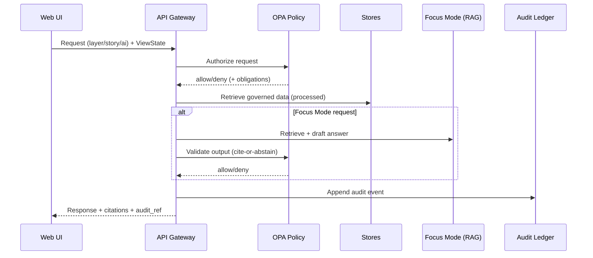

# Kansas Frontier Matrix — Web UI (KFM-Web)


KFM-Web is the **React/TypeScript + MapLibre** interface for exploring **governed geospatial/historical knowledge**:
- **Map + time** exploration (layers, inspection, filtering)
- **Story Nodes** (narratives synchronized to map/time state)
- **Focus Mode** (Q&A that must **cite or abstain**)
- **Evidence & audit** UX (inspect provenance, licensing, and policy decisions)

> [!IMPORTANT]
> KFM-Web is **not** “just a map UI.” It is an **evidence-first product surface**: every dataset, claim, and AI answer must be inspectable via citations/provenance, and access is enforced at the **API + policy boundary**.

---

## Table of contents

- [What lives in `web/`](#what-lives-in-web)
- [Product mental model](#product-mental-model)
- [Non-negotiables](#non-negotiables)
- [Architecture at a glance](#architecture-at-a-glance)
- [Core UI components](#core-ui-components)
- [State contract: `ViewState`](#state-contract-viewstate)
- [Evidence UX: citations, provenance, audit](#evidence-ux-citations-provenance-audit)
- [Local development quickstart](#local-development-quickstart)
- [Testing & quality gates](#testing--quality-gates)
- [Troubleshooting](#troubleshooting)
- [Where to look next](#where-to-look-next)

---

## What lives in `web/`

This directory contains the **client application**.

KFM’s canonical repository layout separates concerns to preserve governance boundaries:

- `web/` — **React UI** (build/test/a11y + “no direct DB” checks)
- `src/` — backend (clean layers: domain/usecases/adapters/infrastructure)
- `policy/` — OPA policies (default deny, cite-or-abstain)
- `data/` — raw/work/processed zones + catalogs (STAC/DCAT/PROV)
- `docs/` — governed documentation + Story Nodes
- `.github/` — CI workflows enforcing gates

> [!NOTE]
> If you’re new: start here (Web), then follow the “truth path” into catalogs, policy, and the API.

---

## Product mental model

KFM-Web is built around a simple “loop”:

1. **Pick a layer** → understand what it is (metadata + license)
2. **Inspect features** → see provenance where available
3. **Adjust time range** → changes both map rendering and story context
4. **Open a story** → step-by-step narrative updates the map/time state
5. **Ask Focus Mode** → get a cited answer + audit reference
6. **Open evidence** → resolve citations to a human-readable evidence view

**If a claim can’t be backed by evidence, the system abstains.**

---

## Non-negotiables

> [!WARNING]
> These are architectural invariants. Breaking them creates governance risk and future refactors.

### ✅ Trust membrane (must hold)
- The **frontend never talks to databases directly**.
- Every request that returns data, stories, or AI output is enforced through:
  - **API Gateway** (service boundary)
  - **Policy evaluation** (OPA/Rego)
  - **Audit/provenance** captured on the request path

### ✅ Evidence-first UX (must ship)
- Every layer exposes **provenance + licensing metadata**
- Story Nodes require citations for factual claims
- Focus Mode answers must include **citations + audit reference**
- Evidence must be resolvable in the UI (see [Evidence UX](#evidence-ux-citations-provenance-audit))

### ✅ Processed zone only (publishable truth)
- `processed/` is the only publishable source of truth
- `raw/` and `work/` are never served directly to end users

---

## Architecture at a glance

```mermaid
flowchart LR
  UI[Web UI<br/>React/TS + MapLibre] -->|API calls| GW[API Gateway<br/>FastAPI REST<br/>(optional GraphQL)]
  GW -->|authorize| OPA[Policy PDP<br/>OPA/Rego]
  GW -->|read| STORES[(Stores)]
  STORES --> PG[(PostGIS<br/>geo + tiles)]
  STORES --> N4J[(Neo4j<br/>knowledge graph)]
  STORES --> OS[(Search/Vector<br/>OpenSearch or PG)]
  STORES --> OBJ[(Object Store<br/>COGs + media)]
  GW -->|append| AUD[(Audit Ledger<br/>append-only)]
  GW --> UI
```

### Key runtime sequence (conceptual)



---

## Core UI components

These are the canonical UI building blocks and their evidence responsibilities:

| Component | Responsibility | Evidence behavior |
|---|---|---|
| `MapCanvas` | Render map + layers + inspect | Shows provenance for hovered features (where available) |
| `LayerPanel` | Toggle/filter layers | Links each layer to dataset metadata + license |
| `Timeline` | Control time range / playback | Records time range into `ViewState` passed to Focus Mode |
| `StoryViewer` | Render story steps | Displays citations inline; step actions update `ViewState` |
| `FocusPanel` | Chat Q&A | Renders footnotes; links to evidence-resolver views |
| `AuditDrawer` | Audit/provenance viewer | Fetches PROV chains + audit ledger entries |

> [!TIP]
> If you’re adding a new UI feature, decide **which component owns it** and **which evidence obligation it introduces**.

---

## State contract: `ViewState`

The UI and the rest of the system synchronize via a small, explicit state object.

```ts
export type ViewState = {
  timeRange: [string, string];
  bbox: [number, number, number, number];
  activeLayers: string[];
  storyNodeId?: string;
  storyStepId?: string;
  userRole?: string;
};
```

### Why this matters
- Stories become reproducible: “this claim is about **this view** at **this time**”
- Focus Mode becomes grounded: the AI sees the user’s current map/time context
- Audit becomes meaningful: we can replay context during review

---

## Evidence UX: citations, provenance, audit

### Evidence resolver (acceptance criterion)
The UI must be able to resolve a `citation.ref` to a **human-readable evidence view** in **≤ 2 API calls**.

**Practical implication:** design the UI so citations are *clickable* and resolve quickly, with:
- source document / dataset
- page range or geometry/time bounds
- provenance chain (PROV)
- license/attribution text

### “Cite or abstain” in the UI
- If the API returns an abstention, the UI should:
  - show the abstention clearly (no hallucinated phrasing)
  - provide a “what evidence is missing?” hint (if present in payload)
  - allow users to open audit context to understand why

### Sensitivity handling (UI behavior)
If sensitive locations or culturally restricted knowledge exist:
- show generalized derivatives for public audiences
- keep precise data behind policy-controlled access
- present content warnings where appropriate

> [!IMPORTANT]
> **Never “work around” missing access** by caching restricted responses in the client.

---

## Local development quickstart

KFM’s default local dev workflow is **Docker Compose**.

### Start the stack

```bash
cp .env.example .env
docker compose up --build
```

### Default dev URLs
- Web UI: `http://localhost:3000`
- API docs (Swagger): `http://localhost:8000/docs`

### Baseline services (conceptual)
Your compose baseline should include:

- `web`
- `api`
- `postgis`
- `neo4j`
- `opensearch`
- `opa`

> [!NOTE]
> If you’re running UI-only (host-native), inspect `web/package.json` for available scripts and use the same API base URL configured in `.env`.

---

## Testing & quality gates

KFM treats docs/data/policy/UI as **governed artifacts**. The web app must be testable and CI-friendly.

### Minimum expectations for `web/`
- ✅ Unit tests for state and reducers (where applicable)
- ✅ Integration tests for:
  - layer toggling
  - timeline changes
  - story step → ViewState updates
  - focus answer rendering (citations & audit_ref)
- ✅ Accessibility checks for critical flows (keyboard navigation, readable citations)
- ✅ “No direct DB access” guardrail:
  - UI only talks to the API gateway (never directly to PostGIS/Neo4j/OpenSearch)

### Definition of Done (UI feature)
- [ ] Uses `ViewState` where relevant
- [ ] Includes evidence affordances (metadata/license/provenance as appropriate)
- [ ] Handles abstentions safely (no client-side “fill in the blanks”)
- [ ] Adds/updates tests
- [ ] Does not introduce new network paths that bypass API + policy boundary

---

## Troubleshooting

### Ports already in use
If you already have services bound to common ports (e.g., 5432/7474/8000/3000), update compose port mappings or stop the conflicting service.

### Web container not reflecting code changes
If hot reload isn’t working:
- confirm `web/src` is mounted correctly in compose
- rebuild after dependency changes: `docker compose up --build`

### Performance: map rendering
Map rendering performance is heavily style/data dependent. If you see slowdowns:
- verify layer filters and feature counts at the current zoom
- profile React renders and MapLibre source/layer configuration
- consider tile strategy for heavy layers (vector tiles, PMTiles, etc.)

---

## Where to look next

### System blueprints (governance + architecture)
- **Next-Gen Blueprint & Primary Guide** (architecture, UI blueprint, trust membrane, local dev, CI)
- **Comprehensive Data Source Integration Blueprint** (dataset promotion gates, catalogs, invariants)

### Key repo areas (typical)
- `policy/` → OPA/Rego rules for access + cite-or-abstain
- `docs/` → Story Nodes and governed documentation
- `data/processed/` → publishable artifacts + STAC/DCAT/PROV catalogs
- `src/` → API gateway + clean architecture backend

---

<details>
<summary><strong>Appendix: MapLibre integration notes</strong></summary>

KFM-Web uses MapLibre for rendering.

Common approaches in the React ecosystem include:
- MapLibre-focused wrapper: `@vis.gl/react-maplibre`
- Dual Mapbox/MapLibre wrapper: `react-map-gl` (MapLibre endpoint supported)

When designing layers, keep an eye on:
- style JSON complexity
- feature counts by zoom
- tile format and hosting strategy (vector tiles, PMTiles/MBTiles where applicable)

</details>

---

## Contributing (web)

If you’re adding UI capabilities:

1. Start with the **evidence obligation**:
   - What must the user be able to inspect?
   - Where does provenance/licensing appear?
   - How do citations resolve?
2. Preserve the **trust membrane**:
   - Only call the API gateway
   - Never add direct DB endpoints
3. Add tests and keep changes reviewable:
   - small PRs
   - clear acceptance criteria
   - update docs if UI behavior changes

---

**KFM principle:** if it can’t be cited, it can’t be shipped.