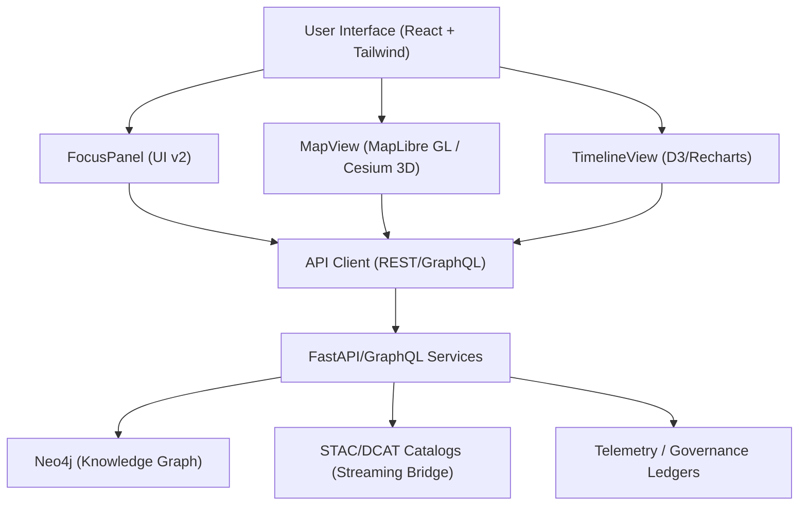

<div align="center">

# 🌐 **Kansas Frontier Matrix — Web Application & Focus Mode Platform**
`web/README.md`

**Purpose:**  
Describe the modular, accessible, and FAIR+CARE-aligned **KFM Web Platform** — including **Focus Mode v2**, Data Explorer, and Governance Dashboard — with architecture, directory layout, contracts, and CI/CD touchpoints for reproducible releases.

[](../docs/README.md)
[](../LICENSE)
[](../docs/standards/faircare.md)
[](../releases/v10.0.0/manifest.zip)

</div>

---

## 📘 Overview

The **KFM Web Platform** is the user-facing layer for viewing **timeline + map** narratives and AI **Focus Mode** insights backed by a **Neo4j** knowledge graph and **FastAPI/GraphQL** services.  
It is **standards-first** (STAC 1.0, DCAT 3.0, JSON-LD, WCAG 2.1 AA) and governed by **MCP v6.3** with telemetry and immutable ledgers per release.

**v10 Highlights**
- **Focus Mode v2**: adaptive narratives, explainability overlays, CARE guardrails  
- **3D Temporal Scenes**: Cesium-based deep-time and projections  
- **Streaming STAC bridge**: live catalog updates in the UI  
- **Accessibility & Sustainability**: Lighthouse/axe gates + build energy metrics

---

## 🗂️ Directory Layout

```
web/
├── README.md                          # This file
├── ARCHITECTURE.md                    # Web architecture specification
│
├── public/                            # Static assets (no secrets)
│   ├── images/
│   ├── icons/
│   └── manifest.json
│
├── src/                               # React + TypeScript application
│   ├── components/                    # MapView, TimelineView, FocusPanel, StoryNode, etc.
│   ├── pages/                         # Route-level screens (Home, Explore, Governance)
│   ├── hooks/                         # useTelemetry, useFocus, useGovernance
│   ├── context/                       # Providers (Theme, Focus, Auth)
│   ├── services/                      # REST/GraphQL clients, STAC/DCAT fetchers
│   ├── utils/                         # Formatters, schema guards, a11y helpers
│   └── styles/                        # Tailwind config, tokens, variables
│
├── package.json                       # Pinned dependencies & scripts
└── vite.config.ts                     # Vite build config (or next.config.js)
```

---

## 🧩 Web Architecture



- **Focus Mode v2 (UI):** renders adaptive AI summaries, subgraph relationships, and explainability overlays.  
- **MapView:** open-source spatial rendering (2D/3D) with accessible controls and basemap toggles.  
- **TimelineView:** time brushing, density plots, and predictive overlays.  
- **API Client:** typed DTOs; retries, pagination, and ETag caching; JSON-LD support for provenance.

---

## 🧠 Focus Mode (AI Context Engine v2)

| Aspect | Implementation |
|---|---|
| API | `GET /api/focus/{entity_id}` → subgraph + AI narrative + citations + ethics flags |
| Model | `focus_transformer_v2` (server inference only; streaming refresh supported) |
| Explainability | SHAP/LIME-linked visuals; “Why this?” insight chips in FocusPanel |
| CARE | Sensitive content gates; consent & provenance chips; obfuscation where required |
| Telemetry | Focus interactions, model drift, and ethics filters exported to `../releases/v10.0.0/focus-telemetry.json` |

---

## ⚙️ Frontend Stack

| Layer | Tooling | Role |
|---|---|---|
| Framework | React 18 + TypeScript | UI + state |
| Build | Vite (or Next) | Fast, deterministic builds |
| Styling | Tailwind CSS | Tokenized, responsive design |
| Map | MapLibre GL JS (+ Cesium) | 2D/3D geospatial rendering |
| Charts | D3 / Recharts | Time-series & density charts |
| State | React Context + lightweight store | Focus, theme, a11y |
| A11y | Semantic HTML + ARIA + Headless UI | WCAG 2.1 AA |
| Data | STAC/DCAT + GraphQL + JSON-LD | Interoperable catalogs and graph entities |

---

## ⚖️ FAIR+CARE & Accessibility

- **A11y:** keyboard navigation, focus rings, alt text, skip links; contrast ≥ 4.5:1.  
- **Ethics:** CARE flags on Focus content; consent/provenance chips; cultural site obfuscation.  
- **Docs:** see `../docs/standards/ui_accessibility.md` and `../docs/standards/faircare.md`.

---

## 🧾 Contracts & Validation

| Contract | Purpose | Validator |
|---|---|---|
| STAC Items/Collections | Layer discovery & metadata | `stac-validate.yml` |
| DCAT 3.0 | Catalog interop | `stac-dcat-bridge.yml` |
| API DTOs | Typed responses for UI | Schema guards in `src/services` |
| A11y Contract | Route-level checks | `accessibility_scan.yml` (Lighthouse/axe) |

**Runtime Provenance:** JSON-LD contexts attached to entities returned by `/api/*` endpoints.

---

## 🔁 CI/CD — Workflow → Artifact Mapping

| Workflow | Enforces | Artifact |
|---|---|---|
| `docs-lint.yml` | Markdown/YAML/JSON conformance | `reports/self-validation/docs/lint_summary.json` |
| `build-and-deploy.yml` | Build & deploy web app | `docs/reports/telemetry/build_metrics.json` |
| `telemetry-export.yml` | Merge workflow metrics | `../releases/v10.0.0/focus-telemetry.json` |
| `codeql.yml` / `trivy.yml` | Security scanning | `reports/security/*` |
| `accessibility_scan.yml` | A11y budget (axe/Lighthouse) | `reports/self-validation/web/a11y_summary.json` |

---

## ♿ Design Tokens (Accessibility-First)

| Token | Location | Standard |
|---|---|---|
| Colors | `../docs/design/tokens/color-palette.md` | WCAG 2.1 AA |
| Typography | `../docs/design/tokens/typography-system.md` | ISO 9241-210 |
| Spacing | `../docs/design/tokens/spacing-grid.md` | MCP Layout |
| A11y | `../docs/design/tokens/accessibility-tokens.md` | FAIR+CARE |

---

## 📊 Web Sustainability Signals

| Metric | Target | Verified By |
|---|---|---|
| Page Weight | ≤ 1.5 MB (critical routes) | CI |
| Accessibility | ≥ 95 (Lighthouse) | `accessibility_scan.yml` |
| Energy / Perf | Tracked per build | `docs/reports/telemetry/build_metrics.json` |

---

## 🚀 Local Development

```bash
# Install dependencies
npm --prefix web install

# Start dev server
npm --prefix web run dev    # http://localhost:3000

# Lint & typecheck
npm --prefix web run lint
npm --prefix web run typecheck

# Build
npm --prefix web run build
```

Environment variables are managed via `.env.local` (do **not** commit secrets).  
See `../.github/workflows/build-and-deploy.yml` for CI build parity.

---

## 🕰️ Version History

| Version | Date | Author | Summary |
|---|---|---|---|
| v10.0.0 | 2025-11-09 | Web Architecture Team | Upgraded to v10: Focus v2 integration, 3D temporal scenes, streaming STAC bridge, A11y/energy budgets, telemetry schema v2. |
| v9.7.0 | 2025-11-05 | KFM Core Team | Contracts, CI artifacts, a11y & ethics notes, telemetry schema v1. |
| v9.6.0 | 2025-11-03 | KFM Core Team | Governance sync and Focus explainability. |
| v9.5.0 | 2025-11-02 | KFM Core Team | Accessibility tokens and monitoring. |

---

<div align="center">

**© 2025 Kansas Frontier Matrix — MIT / CC-BY 4.0**  
Maintained under **Master Coder Protocol v6.3** · FAIR+CARE Certified · Diamond⁹ Ω / Crown∞Ω Ultimate Certified  
[Back to Documentation Index](../docs/README.md) · [Web Architecture](ARCHITECTURE.md)

</div>