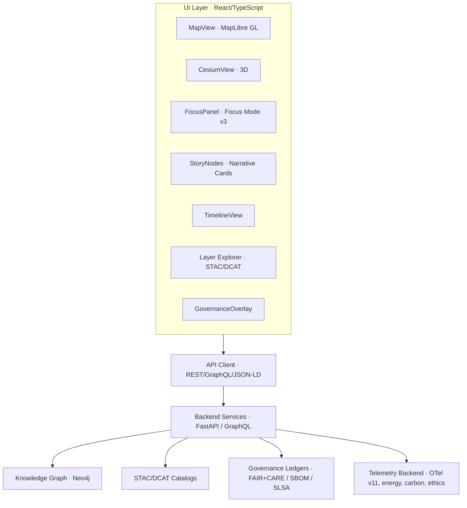

# 🌐 **Kansas Frontier Matrix — Web Application & Focus Mode Platform (v11)**  
`web/README.md`  

Defines the complete **architecture and behavioral contract** for the Kansas Frontier Matrix (KFM) v11 Web Platform, including:  
UI/UX design system, 2D/3D rendering pipelines, **Focus Mode v3** intelligence, **Story Node v3** integration, STAC/DCAT explorers, provenance overlays, A11y-first patterns, FAIR+CARE governance hooks, and full-stack telemetry instrumentation.

· 
· 

---

## 📘 1. Overview

The **KFM Web Application** is a spatial–temporal intelligence interface integrating:

- 🗺️ **MapLibre GL** for 2D vector/raster cartography  
- 🌍 **CesiumJS** for high-fidelity 3D terrain and deep-time exploration  
- 🎯 **Focus Mode v3** for entity-centric reasoning, narratives, and explainability  
- 📖 **Story Node v3** narrative units synchronized with map and timeline  
- 📦 **STAC/DCAT Explorer** for dataset discovery, lineage, and temporal slicing  
- 🧠 **Neo4j-backed reasoning** via REST/GraphQL/JSON-LD APIs  
- 🕒 **Timeline Engine** with multi-range brushing and linked filtering  
- ♿ **A11y-first React/TypeScript** design compliant with WCAG 2.1 AA+  
- ⚖️ **Governance overlays** (CARE labels, provenance chips, SBOM/SLSA indicators)  
- 📈 **OpenTelemetry v11** hooks for performance, energy, carbon, and ethics metrics  

The Web Platform is the **primary public entrypoint** into KFM and must consistently reflect:

- FAIR+CARE governance  
- Indigenous data sovereignty  
- Sustainability commitments  
- Security & supply-chain integrity  

---

## 🎯 2. Purpose of this Document

This specification:

- Establishes the **v11 Web Platform architecture** for `web/**`.  
- Aligns frontend implementation with:
  - System architecture (`../ARCHITECTURE.md`)  
  - GitHub infrastructure (`../.github/ARCHITECTURE.md`)  
  - Data & validation contracts (`../docs/data/contracts/**`, `../schemas/**`).  
- Sets expectations for:
  - Focus Mode v3 behavior and guardrails.  
  - Story Node v3 presentation and interaction patterns.  
  - STAC/DCAT exploration workflows.  
  - Governance overlays, telemetry hooks, and AI usage constraints.  
- Serves as the **review reference** for:
  - Frontend engineers  
  - FAIR+CARE and sovereignty reviewers  
  - A11y and ethics governance  
  - Observability and sustainability analysts  

---

## 📍 3. Scope

### 3.1 In Scope

All code and assets under `web/**`, including:

- React components, pages, layouts, routing.  
- Hooks, context providers, and state management.  
- MapLibre/Cesium integration and visualization layers.  
- Focus Mode v3 and Story Node v3 presentation logic.  
- STAC/DCAT explorer components and dataset previews.  
- Governance overlays (CARE labels, provenance, SBOM/SLSA).  
- Telemetry emission for web events and performance metrics.  
- Theming, design tokens, and adaptive UI behaviors.  

### 3.2 Out of Scope

- Backend ETL/AI pipelines (see `src/pipelines/**`, `src/ai/**`).  
- Low-level storage and indexing internals (DB schemas, data lake layout).  
- CI/CD workflow definitions (see `.github/workflows/**`).  
- Local Neo4j and API infrastructure setup (covered by backend docs).  

**Related Documents**

- `../ARCHITECTURE.md`  
- `../.github/ARCHITECTURE.md`  
- `../docs/architecture/system_overview.md`  
- `../docs/standards/governance/ROOT-GOVERNANCE.md`  

---

## 📚 4. Key Concepts & Definitions

- **Focus Mode v3** — AI-assisted, entity-centric exploration interface that uses graph context, Story Nodes, and datasets to generate governance-safe explanations.  
- **Story Node v3** — Structured narrative objects (text, time, space, relations) rendered as cards, overlays, and timeline entries (see `docs/standards/story-nodes/**`).  
- **STAC Explorer** — UI for browsing, filtering, and previewing STAC Collections/Items with map-based previews and lineage links.  
- **DCAT Explorer** — UI for dataset-level metadata browsing, license awareness, and FAIR+CARE attributes.  
- **Governance Overlay** — Visual layer carrying CARE labels, provenance icons, risk flags, and enforcement hints (e.g., masking, generalization).  
- **Deep-Time Mode** — Combined timeline + 3D mode that visualizes paleogeography and future scenarios (e.g., ancient seas, 2050 climate).  

All concepts must align with the ontologies and policies under `../docs/standards/**`.

---

## 🏗 5. High-Level Web Architecture

The Web Platform is **read-only** against core content (except for local preferences) and must never bypass backend governance or CARE enforcement.

---

## 🗂 6. Web Directory Layout (v11.2.2)

~~~text
web/
├── 📄 README.md                      # This web platform overview (architecture & behavior)
├── 🧱 ARCHITECTURE.md                # Detailed web architecture specification
│
├── 📦 public/                        # Static assets
│   ├── 🖼️ images/                    # Images, screenshots, logos
│   ├── 🧿 icons/                     # Icons & favicons
│   ├── 📜 manifest.json              # PWA manifest (if applicable)
│   ├── 🤖 robots.txt                 # Crawler rules
│   └── 🪪 favicon.ico                # Default favicon
│
├── 🧩 src/                           # React/TypeScript SPA
│   ├── 🧱 components/                # Map, focus panel, story cards, overlays, dialogs
│   ├── 📄 pages/                     # Route-level containers (Home, Explore, Focus, About)
│   ├── 🧵 hooks/                     # useFocusMode, useTimeline, useMap, useStacExplorer, etc.
│   ├── 🧠 context/                   # Theme, Focus, Time, A11y, Governance state providers
│   ├── 🌐 services/                  # API clients: REST, GraphQL, STAC/DCAT, telemetry
│   ├── 🛠 utils/                     # Helpers: formatting, schema utils, JSON-LD builders
│   └── 🎨 styles/                    # CSS/Tailwind, design tokens, map & 3D styles
│
├── 📦 package.json                   # Dependencies & npm scripts
├── 📦 package-lock.json              # Deterministic dependency lock
└── ⚙️ vite.config.ts                 # Build configuration (Vite or equivalent)
~~~

Any structural changes to `web/**` MUST be reflected here and in `web/ARCHITECTURE.md`.

---

## 🎛 7. Major UI Modules & Responsibilities

### 7.1 MapView (MapLibre GL)

- Render basemaps, historical maps, and STAC-derived overlays.  
- Respond to Focus Mode context (highlight focal places, events, H3 cells).  
- Indicate generalized vs precise locations (e.g., masked archaeological sites).  
- Support Story Node footprints (Points, Lines, Polygons, Multi*).  

### 7.2 CesiumView (3D)

- Provide 3D views for terrain, extruded features, and time-aware geometry.  
- Host deep-time visualizations and camera paths.  
- Synchronize with timeline and Focus Mode for “fly-through” narratives.  

### 7.3 FocusPanel (Focus Mode v3)

- Present AI-generated, governance-filtered narratives about the current focus entity.  
- Show provenance chips, CARE labels, and references to underlying datasets.  
- Provide “Why am I seeing this?” and “Show supporting data” affordances.  
- Respect `ai_transform_prohibited` (no speculative additions, no governance override).  

### 7.4 StoryNode Cards (Story Node v3)

- Render narrative cards with title, summary, spatial footprint, time range, and graph relations.  
- Synchronize with map & timeline (hover/click → highlight on map/timeline).  
- Enforce sovereignty, sensitivity, and masking rules per Story Node metadata.  

### 7.5 TimelineView

- Implement multi-range brushing & zoom across full KFM temporal coverage.  
- Coordinate time filters across MapView, CesiumView, FocusPanel, StoryNodes, and layers.  
- Distinguish historical vs modeled/future dynamics via styling and captioning.  

### 7.6 Layer Explorer (STAC/DCAT)

- Query STAC Collections/Items and DCAT Datasets.  
- Filter by time, space, license, FAIR+CARE attributes, and dataset type.  
- Preview layers directly on MapView/CesiumView with provenance + risk badges.  

### 7.7 GovernanceOverlay

- Show CARE labels, sovereignty status, and masking indicators for data.  
- Convey risk and sensitivity visually (e.g., generalized location notices).  
- Expose A11y and AI-behavior hints (e.g., “AI summarization limited for this content”).  

---

## ⚖️ 8. Ethics, FAIR+CARE, Sovereignty & AI Behavior

The web layer must:

- Display CARE labels and sovereignty indicators where applicable.  
- Clearly mark generalized/redacted content and why it is limited.  
- Separate:
  - archival content,  
  - derived model output,  
  - AI-generated text.  
- Enforce **AI transform restrictions**:
  - Only allowed transforms: summaries, semantic highlighting, A11y adaptations, diagram/metadata extraction.  
  - Prohibited: speculative additions, unverified historical claims, governance override, content alteration.  

All AI behavior in Focus Mode must comply with:

- `../docs/standards/faircare/FAIRCARE-GUIDE.md`  
- `../docs/standards/sovereignty/INDIGENOUS-DATA-PROTECTION.md`  
- `../docs/standards/governance/ROOT-GOVERNANCE.md`  

Any new UI pattern touching governed content requires FAIR+CARE review.

---

## ♿ 9. Accessibility (WCAG 2.1 AA+)

Accessibility requirements include:

- Full keyboard navigation; no trapped focus; logical tab order.  
- Screen reader support (semantic HTML, ARIA roles/labels).  
- High-contrast theme; color is never the sole encoding.  
- Reduced motion option for animation, camera fly-throughs, and 3D transitions.  
- Clear focus states, text scaling, and responsive layout.  

Accessibility is validated via CI (Axe, Lighthouse) and manual checks on key flows  
(Explore, Focus, Story Node explore, STAC/DCAT browsing).

---

## 📈 10. Telemetry & Observability

The Web Platform emits telemetry (OpenTelemetry v11) for:

- Performance metrics (LCP, TTFB, route transitions, render cost).  
- Component-level usage (aggregated, non-PII).  
- A11y usage signals (high contrast, keyboard-only, reduced motion).  
- Focus Mode failures, fallbacks, and error boundaries.  

Telemetry:

- Conforms to `../schemas/telemetry/web-readme-v11.json`.  
- Is aggregated into `../releases/<version>/focus-telemetry.json`.  
- Excludes PII and any attributes prohibited under FAIR+CARE and sovereignty policies.  

---

## 🧪 11. Testing & QA Requirements

Changes to `web/**` MUST be covered by:

- Unit tests (components, hooks, reducers, utilities).  
- Integration tests (map–timeline–focus–story-node interactions).  
- E2E tests for canonical workflows (Explore → Focus → Story Node → STAC).  
- Snapshot tests for core visual components where stable.  
- Accessibility tests (Axe, Lighthouse, keyboard-only E2E).  
- Telemetry event-schema tests.  

No changes may be merged if these checks fail in CI.

---

## 🕰 12. Version History

| Version | Date       | Summary                                                                                                  |
|--------:|------------|----------------------------------------------------------------------------------------------------------|
| v11.2.2 | 2025-11-30 | Aligned with KFM-MDP v11.2.2; added signature/attestation, energy/carbon v2, AI behavior constraints.   |
| v11.2.1 | 2025-11-28 | Updated metadata, directory layout, and architecture narrative; synced with latest Focus Mode v3.       |
| v11.0.1 | 2025-11-27 | Web platform refinement; clarified Focus Mode v3 + Story Node v3 contracts.                             |
| v11.0.0 | 2025-11-24 | v11 upgrade; integrated Focus Mode v3, Story Node v3, STAC/DCAT explorer, and telemetry v11.            |
| v10.4.0 | 2025-11-15 | v10.4 architecture; Focus v2.5, Story Node v3, telemetry v3, FAIR+CARE overlays.                        |
| v10.3.2 | 2025-11-14 | Deep rebuild; 3D integration and initial STAC/DCAT explorer flows.                                      |
| v10.3.1 | 2025-11-13 | Early v10.3 web architecture and A11y improvements.                                                     |

---

© 2025 Kansas Frontier Matrix — CC-BY 4.0  
[⬅️ Back to Repo Root](../README.md) · [🧭 System Architecture](../ARCHITECTURE.md) · [🛡 Governance](../docs/standards/governance/ROOT-GOVERNANCE.md)

