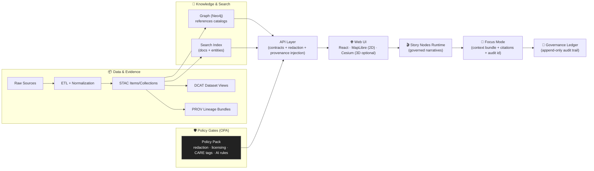

# 🌾 Kansas Frontier Matrix — Web UI (`web/`)

> **KFM Web** is the user-facing interface for exploring Kansas (and later other regions) as a **living atlas**:  
> **maps (2D/3D) + timeline + evidence + narratives**, with optional **Focus Mode (AI)** that is **opt‑in**, **citation‑backed**, and **policy‑gated**.

> [!IMPORTANT]
> **This README is a contract** ✅  
> It states what the Web UI **must do**, what it **must never do**, and how it stays aligned with the **v13 canonical pipeline**:  
> **ETL → STAC/DCAT/PROV → Graph → API → UI → Story Nodes → Focus Mode**.

---

## 🧭 Quick Links (v13 canonical map)

- 📘 **Master Guide (v13):** `../docs/MASTER_GUIDE_v13.md`
- 🧱 **Redesign Blueprint (v13):** `../docs/architecture/KFM_REDESIGN_BLUEPRINT_v13.md`
- 🧾 **Markdown + Repo Structure Standard (v13):** `../docs/standards/` (see `KFM_*` profiles)
- 🧬 **Architecture & ADRs:** `../docs/architecture/`
- ⚖️ **Governance (FAIR+CARE):** `../docs/governance/`
- 🧾 **Story Nodes (canonical):** `../docs/reports/story_nodes/` (`draft/` → `published/`)
- 🧰 **Schemas:** `../schemas/` (including `schemas/storynodes/`, `schemas/ui/`, `schemas/telemetry/`)
- 🧱 **API boundary:** `../src/server/` *(v13 canonical home; UI never bypasses it)*
- 🧩 **Graph build tooling:** `../src/graph/`
- 🧪 **Pipelines/ETL:** `../src/pipelines/`
- 📦 **Catalogs:** `../data/stac/`, `../data/catalog/dcat/`, `../data/prov/`

> [!NOTE]
> If your branch still has legacy paths (e.g., `api/` or `api/scripts/policy/`), treat them as **migration candidates** toward v13’s **one canonical home per subsystem** principle.

---

## 🧾 Table of Contents

- [✨ What KFM Web is](#-what-kfm-web-is)
- [🧱 v13 UI Pillars](#-v13-ui-pillars)
- [🚫 Non‑Negotiables](#-nonnegotiables)
- [🏗️ System Flow](#️-system-flow)
- [🧭 Information Architecture](#-information-architecture)
- [🔁 One shared state model](#-one-shared-state-model)
- [🔌 UI ↔ API contracts](#-ui--api-contracts)
- [🗺️ Map + 3D viewer stack](#️-map--3d-viewer-stack)
- [⏳ Timeline](#-timeline)
- [🧾 Provenance UX](#-provenance-ux)
- [🎬 Story Nodes](#-story-nodes)
- [🧠 Focus Mode (AI) — Hard Gate](#-focus-mode-ai--hard-gate)
- [📦 Offline & Field Mode](#-offline--field-mode)
- [🔴 Realtime & dashboards](#-realtime--dashboards)
- [🛡️ Security & privacy](#️-security--privacy)
- [♿ Accessibility](#-accessibility)
- [📈 Observability & telemetry](#-observability--telemetry)
- [🚀 Local development](#-local-development)
- [✅ CI / Quality gates](#-ci--quality-gates)
- [🧩 Contribution recipes](#-contribution-recipes)
- [🧭 Roadmap — high impact](#-roadmap--high-impact)
- [📚 Project library](#-project-library)
- [📜 License & attribution](#-license--attribution)

---

## ✨ What KFM Web is

KFM Web is a **map-centric evidence browser** that can also run guided narratives (Story Nodes) and optionally provide **governed AI synthesis** (Focus Mode). The UI is intentionally **not** a data silo, and it is **not** a backdoor to raw sources.

**If it renders in the browser, it must have:**
- ✅ an **API contract**
- ✅ a **catalog identity** (STAC/DCAT)
- ✅ **lineage** (PROV)
- ✅ a **license + attribution path**
- ✅ **sensitivity/classification behavior** (CARE-aware)

---

## 🧱 v13 UI Pillars

### 1) 🗺️ Map-first exploration
- 2D map view **always available**
- Optional 3D view (terrain / 3D Tiles) when it adds value
- Layer catalog (toggle / style / opacity / attribution)
- Timeline slider for temporal navigation (range + playhead)
- Feature inspection + metadata + provenance drill-down

### 2) 🔎 Evidence-first trust
- Every visualization traces back to cataloged evidence (**STAC/DCAT/PROV**)
- Users can open **“the map behind the map”** at any time (source, license, lineage)
- Shares/exports preserve attribution + provenance links

### 3) 🎬 Narrative-first learning (Story Nodes)
- Step-based narratives synced with map state + time
- Stories are **governed content**, versioned and reviewable
- Citations are visible and clickable inside stories

### 4) 🧠 Safe AI assistance (Focus Mode)
- **Opt-in only**
- Always labeled **AI-generated**
- **Citations required**, resolvable to evidence
- **Policy-gated** (redaction + sensitive-data protections)
- “Why am I seeing this?” disclosure (datasets used + redactions applied + audit id when required)

---

## 🚫 Non‑Negotiables

### 1) 🔁 Pipeline ordering is absolute (v13 invariant)
No stage may “skip ahead” of prior boundary artifacts:

**ETL → STAC/DCAT/PROV → Graph → API → UI → Story Nodes → Focus Mode**

### 2) 🚪 The UI is a client — never a data backdoor
The UI **never**:
- queries Neo4j directly
- reads PostGIS directly
- reads raw datasets directly
- bundles “mystery data” in the client to bypass governance

### 3) 🧾 Provenance-first rendering
If it shows up in the UI, it must be:
- discoverable via **API** (contracted)
- traceable to **STAC/DCAT/PROV** (provable)
- licensed/attributed (reusable)
- classification-aware (safe at this zoom/detail level)

### 4) 🎬 Story state must be reproducible
- Same story id + story version → same map/time behavior
- Any shared view carries enough metadata to reproduce later (not just a screenshot)

### 5) 🧠 Focus Mode is advisory, transparent, governed
- AI output is **not** official truth  
- It is **cited synthesis** (and may refuse when data is missing or sensitive)
- Where governance requires: AI output is **auditable** (append-only ledger + audit id)

---

## 🏗️ System Flow



---

## 🧭 Information Architecture

### 🗺️ Core screens (minimum)
- **Map Explorer** (default): map + layers + timeline + inspector
- **Catalog**: dataset discovery (facets + filters + licensing + sensitivity)
- **Story**: Story Nodes runtime (step-based narrative)
- **Evidence**: provenance + lineage views (per layer / per feature / per claim)
- **Search**: places, datasets, stories, entities/documents (as contracts exist)
- **Settings**: accessibility, performance, privacy, AI opt-in/out, offline mode controls

### 🔐 Admin / moderation surfaces (when enabled)
- Story review queue (draft → published)
- Dataset review & governance gates
- Telemetry dashboards (privacy-respecting)

---

## 🔁 One shared state model

Everything the UI can show must be representable as a serializable **View State** (URL-safe):

- map camera (2D or 3D) + viewport bounds
- active layers + styles + opacity
- timeline range + playhead
- filters (space/time/category/sensitivity)
- selected feature(s)
- story id + version + step index (when in story mode)
- focus context scope (when Focus Mode is enabled)

**Why it matters:** bookmarkable URLs, share links, Story Nodes, offline packs, reproducibility, and governance audits.

> [!TIP]
> Treat View State as an explicit schema (see `schemas/ui/`) and validate it on load. Bad state should fail safely.

---

## 🔌 UI ↔ API Contracts

> If a UI feature can’t be expressed as an API contract, it’s not ready to ship.

### Required contract categories
- **Catalog discovery:** DCAT view + KFM extensions (facets, license, sensitivity)
- **STAC:** items/collections + asset links
- **Tiles & distributions:** vector tiles, rasters, 3D Tiles, downloads
- **Feature query:** by bbox, id, and time range
- **Graph views:** related entities/events/documents (via API, never direct Neo4j)
- **Search:** place/dataset/story/entity/document search (as implemented)
- **Story Nodes:** list/get story content by `draft|published` + version
- **Focus Mode:** request/response shape includes:
  - answer (markdown/text)
  - citations list (resolvable to evidence)
  - datasets used + redactions applied
  - uncertainty/confidence signal (even coarse)
  - audit id (when required)
- **Realtime:** polling and/or WebSockets (optional)

### UI-side validation (strongly recommended ✅)
- Validate API responses against JSON Schema (`schemas/*`)
- Fail “loudly” with a safe UX message (no silent junk rendering)
- Contract breaks should be visible in dev + captured in telemetry

---

## 🗺️ Map + 3D viewer stack

### 🗺️ 2D: MapLibre GL JS (always-on)
- Primary 2D renderer for vector tiles + overlays
- Must work with “low power” devices (performance mode)

### 🌍 3D: CesiumJS (optional)
- Used for terrain, 3D Tiles, volumetric/time-aware visualization
- 3D is not the default “because it’s cool” — it’s a tool for terrain/structure context

### 🔁 2D ↔ 3D state preservation
Switching viewers should preserve:
- camera intent (center/zoom/heading)
- active layers (where equivalent exists)
- timeline state + playhead

### 🧠 Performance rules (non-negotiable)
- 2D must remain usable even if 3D fails or is disabled
- No blocking work on the main thread for heavy parsing → use Web Workers
- Prefer tiles + paging over large GeoJSON payloads

---

## ⏳ Timeline

Timeline supports:
- **range** (start/end)
- **playhead** (animation)
- **event markers** from graph (where contracts exist)

Layer temporal behavior:
- Layers declare temporal validity
- UI signals when a layer is out-of-range (and handles gracefully)
- Story steps can set timeline deterministically

---

## 🧾 Provenance UX

### 🧾 “Map behind the map” (baseline)
For any active layer, the UI must provide:
- source org
- license & attribution text
- STAC/DCAT links (dataset identity)
- PROV link (lineage)
- sensitivity/classification tags
- “prepared by / processed on” (when present)

### 🔎 Feature inspection (click → evidence)
When a user clicks a feature:
- show properties + units
- show provenance links
- show related graph entities/events/documents (via API)
- show quality indicators when available (uncertainty, completeness)

### 🔐 Sensitivity-aware affordances
The UI must make restrictions visible and understandable:
- 🔒 **padlock icon** / ⚠️ warning icon for restricted layers
- coarse representations where needed (e.g., generalized polygons / hex bins)
- explicit disclaimer: **“Generalized for sovereignty / safety”**
- “Why can’t I see this?” → policy-guided explanation (no leaking details)

---

## 🎬 Story Nodes

Story Nodes are **machine-ingestible storytelling**:
- authored in **Markdown** (narrative, media, citations)
- paired with **JSON storyboard** (camera/layers/timeline/highlights)

### ✅ Canonical location (v13)
- Draft: `../docs/reports/story_nodes/draft/<story_slug>/`
- Published: `../docs/reports/story_nodes/published/<story_slug>/`

### Story runtime expectations
- Step-based (next/prev; optional scroll-driven)
- Each step can:
  - activate/deactivate layers
  - set camera (2D/3D compatible when possible)
  - set timeline range/playhead
  - highlight features/regions safely
  - attach citations + source cards

### Story Builder GUI (planned 🧰)
A future Story Builder should:
- let authors “record” steps by using the map/timeline
- generate JSON + Markdown
- enforce schema + citations + review gates

> [!NOTE]
> Until Story Builder exists: use templates + examples + strict publish review.

---

## 🧠 Focus Mode (AI) — Hard Gate

Focus Mode is a **policy-gated assistant**, not a truth oracle.

### The rules (must not regress)
- **Opt-in:** never appears by default
- **Clearly labeled:** always marked “AI-generated”
- **Citations required:** no uncited assertions
- **No speculation:** if KFM doesn’t have the data, say so
- **No sensitive leaks:** generalize/omit restricted locations and attributes
- **Policy-gated output:** OPA checks can block/redact/require disclaimers
- **Auditability:** where required, every interaction is logged with policy version hash + audit id

### Required UI behaviors
- Dedicated **Citations** area (click → open evidence record)
- Visible **uncertainty indicator**
- “Why am I seeing this?” disclosure:
  - datasets used
  - time range used
  - redactions applied
  - policy decision summary (safe)
  - model/version info (when appropriate)
- Clear “report an issue” affordance for governance learning

### Prompt-injection & tool safety (UI + platform aligned)
- UI treats user prompts as untrusted input
- Focus Mode runs with **whitelisted tools only** (no arbitrary actions)
- Client should never expose secrets; enforce strong CSP; rely on server-side enforcement

---

## 📦 Offline & Field Mode (PWA + Offline Packs)

### Use cases
- museums/exhibits with weak connectivity 🏛️
- field researchers & rural classrooms 🧑‍🏫
- “KFM in a box” travel installs 🧳

### Offline pack concept (planned)
User selects region + layers + stories → download a **bundle** containing:
- cached story content + citations
- offline tiles (e.g., PMTiles/MBTiles) + metadata
- minimal offline feature query (bounded + safe)

> [!IMPORTANT]
> Offline packs must still respect governance: no bundle may include restricted detail beyond its approved audience.

---

## 🔴 Realtime & dashboards

KFM Web is designed to extend into:
- realtime sensor dashboards (river gauges, air quality, transit)
- live map layers (points/alerts updating on cadence)
- simulation viewers (“model projection” labels required)
- remote sensing time-series workflows (NDVI trends tied to timeline)

> Rule: model outputs are labeled as **models**, not facts, and remain evidence-linked.

---

## 🛡️ Security & privacy

### Baseline expectations
- Enforce least privilege in the browser (no secrets, no raw access)
- Strong CSP + safe iframe/embed policies
- Rate-limiting and abuse protections (especially around Focus Mode)
- Protect against inference attacks: repeated-query auditing + aggregation where needed
- Do not permit the UI to become a “sensitive location detector”

### Privacy-preserving patterns (align with policy gates)
- generalization (coarse geometry)
- suppression/removal (omit attributes entirely)
- aggregation (hex bins / county rollups)
- explicit disclaimers and “why” explanations
- audit trails for sensitive access and redactions

---

## ♿ Accessibility

Non-negotiable:
- keyboard navigation for all controls
- visible focus states
- ARIA labels for map controls + panels
- high-contrast option
- avoid color-only encoding (legends must carry meaning)
- respect reduced motion preferences

---

## 📈 Observability & telemetry

Telemetry is **privacy-respecting** and supports governance:
- performance metrics (p95/p99 for key actions)
- contract failure counters
- redaction notices shown (e.g., `focus_mode_redaction_notice_shown`)
- story publish workflow events
- offline pack usage signals (bounded + anonymized)

> [!NOTE]
> Telemetry schemas should be versioned and validated (`schemas/telemetry/`), just like data and story schemas.

---

## 🗂️ What Lives in `web/`

Recommended v13-friendly structure (adjust to your actual tooling):

```text
web/
├─ 📄 README.md
├─ 📄 package.json
├─ 📁 public/                      # static assets (favicons, manifest, etc.)
└─ 📁 src/
   ├─ 🧭 app/                       # routes + layout shell
   ├─ 🧩 components/                # shared UI components
   ├─ 🗺️ viewers/                   # MapLibre + Cesium adapters + shared map state
   ├─ ⏳ timeline/                  # timeline components + helpers
   ├─ 🎬 story_nodes/               # runtime only (viewer); content loads via API
   ├─ 🧠 focus_mode/                # citations renderer + disclosure UI + audit link UI
   ├─ 🔌 services/                  # API clients, caching, schema validation, auth helpers
   ├─ 🧠 state/                     # global state (redux/context) + view-state serializer
   ├─ 🧪 __tests__/                 # unit/integration tests
   ├─ 🧵 workers/                   # Web Workers (parsing, heavy compute)
   ├─ 🎨 styles/                    # tokens + themes + a11y helpers
   └─ 🧰 utils/                     # shared utilities
```

> [!NOTE]
> Story Node **content** does not live in `web/` in v13 — it lives under `docs/reports/story_nodes/` and is loaded via governed endpoints.

---

## 🚀 Local development

> Toolchain-agnostic. Confirm exact scripts in `web/package.json`.

### Prereqs
- Node.js (LTS recommended)
- Running KFM API (REST + optional GraphQL)
- Optional: tile/asset service
- Optional: auth provider (for roles/moderation)

### Typical commands
```bash
cd web
npm install
npm run dev
```

### Build
```bash
npm run build
npm run preview
```

### Recommended `.env` interface
Create `web/.env.local`:

```dotenv
# Core APIs
KFM_API_BASE_URL=http://localhost:8000
KFM_GRAPHQL_URL=http://localhost:8000/graphql

# Optional: tiles & assets
KFM_TILE_BASE_URL=http://localhost:8000/tiles
KFM_ASSET_BASE_URL=http://localhost:8000/assets

# Feature flags (UI-only; server may enforce too)
KFM_ENABLE_3D=true
KFM_ENABLE_FOCUS_MODE=true
KFM_ENABLE_REALTIME=false
KFM_ENABLE_OFFLINE_PACKS=false
KFM_ENABLE_STORY_BUILDER=false
```

---

## ✅ CI / Quality gates

Minimum gates for UI-related changes:
- ✅ Markdown + front-matter validation
- ✅ link/reference validation
- ✅ JSON Schema validation (Story Nodes, UI view-state, telemetry where applicable)
- ✅ unit/integration tests (map render, layer toggle, inspect, story step)
- ✅ a11y checks (keyboard + ARIA + contrast)
- ✅ security scans (deps, secrets, supply chain hygiene)
- ✅ dependency hygiene (audit, updates)
- ✅ provenance attestations & SBOMs (where pipeline is configured)

> [!IMPORTANT]
> If you add a UI feature that references new data, you’re responsible for ensuring upstream contracts and metadata exist and validate.

---

## 🧩 Contribution recipes

### 🗺️ Add a new layer
1) Upstream verification  
   - STAC entry exists  
   - DCAT entry exists  
   - PROV lineage exists  
   - API exposes it with redaction rules

2) UI wiring  
   - register layer (id/type/styles/source)
   - implement legend + attribution rendering
   - honor sensitivity tags (blur/generalize/hide)

3) Story + Focus integration  
   - citations resolve to evidence records
   - sensitive datasets cannot leak restricted details via Focus Mode

4) Tests  
   - layer registry test
   - feature click → evidence panel provenance links
   - story step safe usage test (if applicable)

### 🎬 Add a Story Node
- create: `docs/reports/story_nodes/draft/<story_slug>/`
- include:
  - `story.md` (narrative + citations)
  - `story.json` (steps + map state + timeline)
  - `assets/` if needed
- validate schema
- submit PR → review → publish to `published/`

### 🧠 Change Focus Mode UI
Must keep:
- opt‑in gate
- AI labeling
- citations + evidence rendering
- disclosure panel (datasets used + redactions)
- safe fallback for refusals / missing data
- audit id rendering (when provided)

Add tests:
- “no citations → blocked render”
- “sensitive dataset → generalized output + warning”
- “audit id present → link renders”

---

## 🧭 Roadmap — high impact

High-trust, high-leverage next builds:
- 🧾 Evidence Panel v1 (citations + provenance summaries + “open lineage”)
- 🧭 Layer Provenance Panel v1 (active layers list + licenses + sensitivity)
- 🧠 Focus Mode “Why” panel v1 (datasets used + redactions + policy summary)
- 🎬 Story Builder GUI (reduce JSON friction; preserve governance)
- 📦 Offline Pack Builder (region + layers + stories → export bundle)
- 🔴 Realtime layer demo (e.g., river gauge or air quality) with provenance stamps
- 🧪 Scenario viewer (render sandbox simulation outputs clearly labeled “simulated”)

---

## 📚 Project library

<details>
<summary><strong>🏛️ KFM Core (architecture + UI + governance)</strong></summary>

- `MARKDOWN_GUIDE_v13.md` 🧾 — repo structure + invariants (pipeline ordering, canonical homes)  [oai_citation:0‡MARKDOWN_GUIDE_v13.md.gdoc](file-service://file-UYVruFXfueR8veHMUKeugU)
- `Kansas Frontier Matrix (KFM) – Comprehensive UI System Overview (Technical Architecture Guide).pdf` 🧭 — modular UI, bookmarkable URLs, provenance enforcement  [oai_citation:1‡Kansas Frontier Matrix (KFM) – Comprehensive UI System Overview (Technical Architecture Guide).pdf](file-service://file-MbEYbsLWBmpXVYXVF79c38)
- `Kansas Frontier Matrix (KFM) – Comprehensive Technical Documentation.pdf` 🧱 — implementation, CI/policy gates, supply chain provenance, SBOM/attestations  [oai_citation:2‡Kansas Frontier Matrix (KFM) – Comprehensive Technical Documentation.pdf](file-service://file-VgLA7nv34M5muqZ5MQxBLG)
- `Kansas Frontier Matrix (KFM) – Comprehensive Architecture, Features, and Design.pdf` 🧬 — platform capabilities, governance-by-design, OPA policy-as-code  [oai_citation:3‡Kansas Frontier Matrix (KFM) – Comprehensive Architecture, Features, and Design.pdf](file-service://file-Qj23Z329hf1Q1WD86hXYfL)
- `Kansas Frontier Matrix (KFM) – Comprehensive Platform Overview and Roadmap.pdf` 🗺️ — roadmap, scenarios (`kfm-sim-run`), dashboards/simulations  [oai_citation:4‡Kansas Frontier Matrix (KFM) – Comprehensive Platform Overview and Roadmap.pdf](file-service://file-J9i6fUc35zPWB2U62zUnEN)
- `Kansas Frontier Matrix (KFM) – AI System Overview 🧭🤖.pdf` 🤖 — Focus Mode flow, citations enforcement, policy checks, sandboxing, CSP/rate limits  [oai_citation:5‡Kansas Frontier Matrix (KFM) – AI System Overview 🧭🤖.pdf](file-service://file-P4zHoJicw1HG6bXmqFygG8)
- `Kansas-Frontier-Matrix_ Open-Source Geospatial Historical Mapping Hub Design.pdf` 🧠 — open-source mapping hub patterns and UI ideas  [oai_citation:6‡Kansas-Frontier-Matrix_ Open-Source Geospatial Historical Mapping Hub Design.pdf](file-service://file-64djFYQUCmxN1h6L6X7KUw)
- `Kansas-Frontier-Matrix Design Audit – Gaps and Enhancement Opportunities.pdf` 🔍 — targeted improvements and gap analysis  [oai_citation:7‡Kansas-Frontier-Matrix Design Audit – Gaps and Enhancement Opportunities.pdf](file-service://file-TkRzAfTnxCYDUHauCf1NcH)

</details>

<details>
<summary><strong>🧪 Data, privacy, and research protocol (supports governance & UX signals)</strong></summary>

- `Data Mining Concepts & applications.pdf` 🛡️ — privacy-aware mining, inference risk, audit patterns  [oai_citation:8‡Data Mining Concepts & applictions.pdf](file-service://file-2uwEbQAFVKpXaTtWgUirAH)
- `Scientific Method _ Research _ Master Coder Protocol Documentation.pdf` 🧪 — documentation rigor, repeatability, protocol mindset  [oai_citation:9‡Scientific Method _ Research _ Master Coder Protocol Documentation.pdf](file-service://file-HTpax4QbDgguDwxwwyiS32)
- `KFM- python-geospatial-analysis-cookbook…pdf` 🧰 — geospatial analysis patterns (routing/rasters) informing future UI extensions  [oai_citation:10‡KFM- python-geospatial-analysis-cookbook-over-60-recipes-to-work-with-topology-overlays-indoor-routing-and-web-application-analysis-with-python.pdf](file-service://file-2gpiGDZS8iw6EdxGswEdHp)

</details>

<details>
<summary><strong>📦 Reference Packs (PDF portfolios with embedded books/resources)</strong></summary>

These are **PDF portfolios** (embedded resources). GitHub previews may not show the embedded docs — open with a PDF reader that supports portfolios.

- `AI Concepts & more.pdf` 🤖  [oai_citation:11‡AI Concepts & more.pdf](file-service://file-K6BctJjeUwvyCahLf9qdwr)  
  Includes (examples): *Building LLM Powered Applications*, *OpenAI Cookbook*, *AI Safety Theory*, *Practical Ethics for AI*, *Deep Learning in 3D*…

- `Maps-GoogleMaps-VirtualWorlds-Archaeological-Computer Graphics-Geospatial-webgl.pdf` 🗺️🎮  [oai_citation:12‡Maps-GoogleMaps-VirtualWorlds-Archaeological-Computer Graphics-Geospatial-webgl.pdf](file-service://file-RshcX5sNY2wpiNjRfoP6z6)  
  Includes (examples): *WebGL Programming Guide*, *WebGL Insights*, *Designing Virtual Worlds*, *3D GIS for Archaeological Investigations*, *Google Earth Engine Applications*…

- `Mapping-Modeling-Python-Git-HTTP-CSS-Docker-GraphQL-Data Compression-Linux-Security.pdf` 🧑‍💻🔧  [oai_citation:13‡Mapping-Modeling-Python-Git-HTTP-CSS-Docker-GraphQL-Data Compression-Linux-Security.pdf](file-service://file-2QvRgQbts8ENJQSRC6oGme)  
  Includes (examples): *Beej’s Guide to Git*, *Beej’s Guide to Network Programming*, Docker/HTTP/CSS/GraphQL/security primers…

- `Geographic Information-Security-Git-R coding-SciPy-MATLAB-ArcGIS-Apache Spark-Type Script-Web Applications.pdf` 🌐🛡️  [oai_citation:14‡Geographic Information-Security-Git-R coding-SciPy-MATLAB-ArcGIS-Apache Spark-Type Script-Web Applications.pdf](file-service://file-TH7HttQXn8Bh1hVhcj858V)  
  Includes (examples): ArcGIS cookbooks, R/SciPy/MATLAB resources, security & web app materials…

- `Data Managment-Theories-Architures-Data Science-Baysian Methods-Some Programming Ideas.pdf` 🗄️📊  [oai_citation:15‡Data Managment-Theories-Architures-Data Science-Baysian Methods-Some Programming Ideas.pdf](file-service://file-RrXMFY7cP925exsQYermf2)  
  Includes (examples): *An Introduction to Statistical Learning*, *Bayesian Methods for Hackers*, *Machine Learning for Hackers*…

- `Various programming langurages & resources 1.pdf` 📚  [oai_citation:16‡Various programming langurages & resources 1.pdf](file-service://file-4wp3wSSZs7gk5qHWaJVudi)

</details>

---

## 📜 License & attribution

KFM’s trust model depends on:
- showing license + attribution wherever data is displayed
- preserving provenance links (STAC/DCAT/PROV)
- making citations clickable in Story Nodes and Focus Mode
- ensuring exports/shares carry proper credit

If you change UI behavior that affects *what is shown*, verify it doesn’t weaken:
- 🔗 traceability
- 🫥 sensitivity protections
- 📜 attribution

---

<!--
Governance alignment cross-check:
- docs/governance/ROOT_GOVERNANCE.md
- docs/governance/ETHICS.md
- docs/governance/SOVEREIGNTY.md
- docs/governance/REVIEW_GATES.md
-->