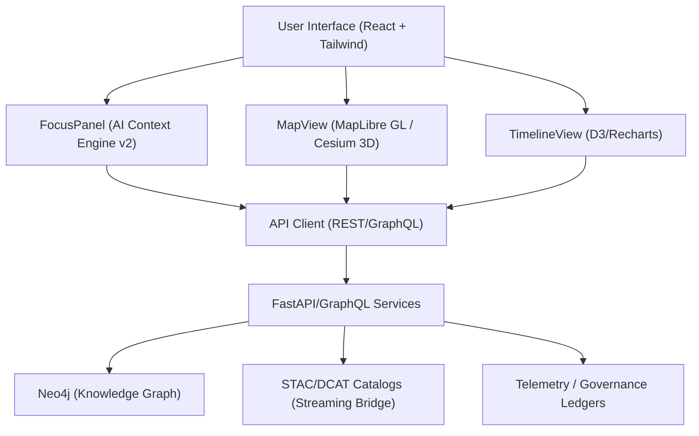

<div align="center">

# 🌐 **Kansas Frontier Matrix — Web Application & Focus Mode Platform**
`web/README.md`

**Purpose:**  
Document the modular, accessible, and FAIR+CARE-certified **KFM Web Platform**, detailing **Focus Mode v2**, data explorer, governance dashboards, contracts, and CI/CD touchpoints for reproducible, ethics-aligned releases.

[](../docs/README.md)
[](../LICENSE)
[](../docs/standards/faircare.md)
[](../releases/v10.0.0/manifest.zip)

</div>

---

## 📘 Overview

The **KFM Web Platform** serves as the front-end interface for exploring **timeline + map narratives** and AI **Focus Mode** insights, powered by a **Neo4j knowledge graph** and **FastAPI/GraphQL** backend.  
Built for **standards-first interoperability** (STAC 1.0, DCAT 3.0, JSON-LD, WCAG 2.1 AA), it is fully **MCP v6.3**-governed with immutable telemetry ledgers per release.

**v10 Key Enhancements**
- **Focus Mode v2:** Adaptive AI narratives with explainability and CARE-compliant filters.  
- **3D Temporal Scenes:** Cesium-based visualization for deep-time and predictive projections.  
- **Streaming STAC Bridge:** Real-time catalog updates surfaced within the web UI.  
- **Sustainability & A11y Metrics:** Lighthouse/axe validation with energy and performance tracking.

---

## 🗂️ Directory Layout

```
web/
├── README.md                          # This file
├── ARCHITECTURE.md                    # Web architecture overview
│
├── public/                            # Static assets (no secrets)
│   ├── images/
│   ├── icons/
│   └── manifest.json
│
├── src/                               # React + TypeScript codebase
│   ├── components/                    # UI modules: MapView, TimelineView, FocusPanel, StoryNode
│   ├── pages/                         # Route-level screens (Home, Explore, Governance)
│   ├── hooks/                         # Reusable hooks (useFocus, useTelemetry, useGovernance)
│   ├── context/                       # Providers for state & theme management
│   ├── services/                      # REST/GraphQL clients & STAC/DCAT handlers
│   ├── utils/                         # Formatters, schema guards, accessibility helpers
│   └── styles/                        # Tailwind configuration & design tokens
│
├── package.json                       # Dependencies and npm scripts
└── vite.config.ts                     # Vite build configuration
```

---

## 🧩 Web Architecture



- **Focus Mode v2 (UI):** Displays AI narratives, explainability overlays, and ethical provenance chips.  
- **MapView:** Handles 2D/3D rendering with accessible controls and basemap toggles.  
- **TimelineView:** Implements zoomable brushing, density plots, and predictive overlays.  
- **API Client:** Supports typed DTOs, pagination, caching, and JSON-LD provenance linking.

---

## 🧠 Focus Mode (AI Context Engine v2)

| Component | Implementation |
|---|---|
| API | `GET /api/focus/{entity_id}` → Subgraph + AI narrative + citations + ethics flags |
| Model | `focus_transformer_v2` — Dual-encoder, cross-modal attention |
| Explainability | SHAP/LIME overlays, “Why this?” chips, causal highlight traces |
| CARE | Sensitive data gating, consent flags, provenance display |
| Telemetry | Interaction logs, drift metrics, ethical filter audits (`focus-telemetry.json`) |

---

## ⚙️ Frontend Stack

| Layer | Tool | Function |
|---|---|---|
| Framework | React 18 + TypeScript | Core UI architecture |
| Build | Vite (or Next.js) | Deterministic, high-speed builds |
| Styling | Tailwind CSS | Tokenized, responsive design system |
| Map | MapLibre GL JS / Cesium | 2D & 3D geospatial rendering |
| Charts | D3 / Recharts | Temporal and analytical visualizations |
| State | React Context + Local Store | Shared app state (focus, a11y, theme) |
| A11y | Semantic HTML + ARIA | WCAG 2.1 AA compliance |
| Data | STAC/DCAT + GraphQL + JSON-LD | Interoperable linked datasets |

---

## ⚖️ FAIR+CARE & Accessibility

- **Accessibility:** keyboard navigation, semantic regions, skip links, focus rings, alt text, contrast ≥ 4.5:1.  
- **Ethics:** CARE-informed design — provenance indicators, data consent prompts, Indigenous data governance.  
- **Compliance Docs:** See `../docs/standards/ui_accessibility.md` and `../docs/standards/faircare.md`.

---

## 🧾 Validation & Governance Contracts

| Contract | Function | Validator |
|---|---|---|
| STAC v1.0 | Geospatial layer registration | `stac-validate.yml` |
| DCAT 3.0 | Catalog interoperability | `stac-dcat-bridge.yml` |
| API DTOs | Typed response models | `src/services/schemaGuards.ts` |
| A11y Budget | Lighthouse/axe thresholds | `accessibility_scan.yml` |

**Provenance:** JSON-LD contexts attached to all `/api/*` payloads for traceability.

---

## 🔁 CI/CD — Workflow → Artifact Mapping

| Workflow | Ensures | Output Artifact |
|---|---|---|
| `docs-lint.yml` | Schema + Markdown compliance | `reports/self-validation/docs/lint_summary.json` |
| `build-and-deploy.yml` | Build & deployment validation | `docs/reports/telemetry/build_metrics.json` |
| `telemetry-export.yml` | Merge & export telemetry | `../releases/v10.0.0/focus-telemetry.json` |
| `codeql.yml` / `trivy.yml` | Security compliance | `reports/security/*.json` |
| `accessibility_scan.yml` | Accessibility validation | `reports/self-validation/web/a11y_summary.json` |

---

## ♿ Design Tokens (Accessibility-First)

| Token Type | File Reference | Standard |
|---|---|---|
| Colors | `../docs/design/tokens/color-palette.md` | WCAG 2.1 AA |
| Typography | `../docs/design/tokens/typography-system.md` | ISO 9241-210 |
| Spacing | `../docs/design/tokens/spacing-grid.md` | MCP Layout |
| Accessibility | `../docs/design/tokens/accessibility-tokens.md` | FAIR+CARE |

---

## 📊 Web Sustainability & Telemetry

| Metric | Target | Verified By |
|---|---|---|
| Page Weight | ≤ 1.5 MB (core routes) | Build CI |
| Accessibility | ≥ 95 (Lighthouse) | `accessibility_scan.yml` |
| Energy / Perf | Recorded each release | `build_metrics.json` |

---

## 🚀 Local Development

```bash
# Install dependencies
npm --prefix web install

# Run dev server
npm --prefix web run dev   # → http://localhost:3000

# Typecheck & lint
npm --prefix web run typecheck
npm --prefix web run lint

# Build for production
npm --prefix web run build
```

Secrets are managed through `.env.local` (never committed).  
See CI parity in `.github/workflows/build-and-deploy.yml`.

---

## 🕰️ Version History

| Version | Date | Author | Notes |
|---|---|---|---|
| v10.0.0 | 2025-11-09 | Web Architecture Team | Focus v2, 3D temporal scenes, streaming STAC bridge, A11y/energy telemetry v2. |
| v9.7.0 | 2025-11-05 | KFM Core Team | Contracts, ethics, telemetry schema v1. |
| v9.6.0 | 2025-11-03 | KFM Core Team | Governance synchronization, explainability updates. |
| v9.5.0 | 2025-11-02 | KFM Core Team | Introduced A11y tokens and monitoring. |

---

<div align="center">

**© 2025 Kansas Frontier Matrix — MIT / CC-BY 4.0**  
Maintained under **Master Coder Protocol v6.3** · FAIR+CARE Certified · Diamond⁹ Ω / Crown∞ Ω Ultimate Certified  
[⬅ Back to Documentation Index](../docs/README.md) · [Web Architecture →](ARCHITECTURE.md)

</div>
