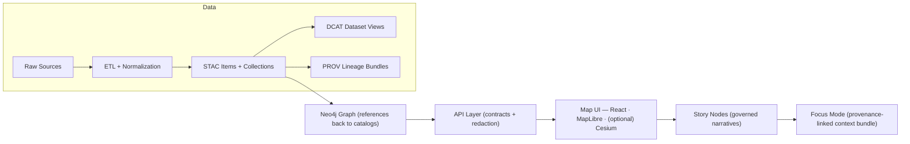

# 🌐 KFM Web UI (`/web`) — Map · Timeline · Story Nodes · Focus Mode


> 🧭 **What this is:** the **user-facing** frontend for **Kansas Frontier Matrix (KFM)** — a provenance-first, evidence-driven “living atlas” of Kansas.  
> 🧱 **Hard rule:** the UI **does not** talk to databases directly — it only consumes **governed API** endpoints.

---

## ✨ What lives in this folder?

`web/` is the **single source of truth** for the KFM client application:
- **React + TypeScript** app (map-centric, narrative + analysis UI)
- **2D map** via **MapLibre GL JS**
- Optional/future **3D** via **CesiumJS**
- UI primitives like **TimelineSlider**, **LayerControl**, **StoryPanel**, **SearchBar**
- **Focus Mode** chat UI (AI assistant) — *UI calls backend endpoints; never calls the model directly*

---

## 🧭 Core UX (what the UI is built to do)

- 🗺️ **Explore map layers** (historic trails, hydrology, parcels, rasters, etc.)
- 🕰️ **Scrub time** with a timeline slider (and “play” style animation)
- 📚 **Story Nodes**: guided narrative steps that move the map/timeline
- 🧵 **Scrollytelling (next-stage)**: scroll-driven narrative where map + timeline animate in sync
- 🔎 **Search** datasets + evidence through the catalog/search API
- 🧠 **Focus Mode**: ask questions, get answers *with provenance-linked context*

---

## 🏗️ Architecture at a glance



---

## 🚀 Quick start (recommended) — run full stack via Docker

> If your repo supports Docker Compose, this is the fastest way to get **API + Web** running together.

1) From repo root, create your env file:
- Copy `.env.example` → `.env`

2) Start the stack:
```bash
docker compose up --build
# or: docker-compose up --build
```

3) Open the app:
- Web UI: `http://localhost:3000`
- API docs (Swagger): `http://localhost:8000/docs`

---

## 🧪 Web-only dev (without Docker)

> Use this when the API is already running elsewhere (local or remote).

```bash
cd web
npm install
npm start
```

Then point the UI at the API base URL via `REACT_APP_API_URL` (see below).

---

## 🔧 Configuration (environment variables)

KFM uses a simple env setup so the **Web port** and **API base URL** are configurable.

| Variable | Scope | Meaning | Typical |
|---|---:|---|---|
| `WEB_PORT` | Web | Dev server port | `3000` |
| `FASTAPI_PORT` | API | API port | `8000` |
| `REACT_APP_API_URL` | Web | Base URL the UI calls for REST/GraphQL | `http://localhost:8000` |
| `OLLAMA_MODEL` | AI/backend | Model name for Focus Mode (backend-side) | *(varies)* |

> 🧠 **Note:** `OLLAMA_MODEL` is included here because the web UI exposes Focus Mode, but the **model runs server-side**.

---

## 🗂️ Expected folder layout

> Names can vary a bit depending on whether this is CRA/Vite/etc., but the structure below matches the intended architecture.

```text
web/
├─ 📄 README.md
├─ 📄 package.json
├─ 📁 public/
└─ 📁 src/
   ├─ 📁 components/
   │  ├─ 🗺️ MapViewer/         # MapLibre (2D) + optional Cesium toggle
   │  ├─ 🕰️ TimelineSlider/    # time scrubber + playback controls
   │  ├─ 📚 StoryPanel/        # Story Nodes + (future) scrollytelling
   │  ├─ 🔎 SearchBar/         # catalog + text search entry
   │  └─ 🧩 LayerControl/      # layer toggles + legend
   ├─ 🧠 store/                # global state (Redux/Context)
   ├─ 🔌 services/             # API client wrappers (fetch/GraphQL)
   ├─ 🎨 styles/               # CSS/Sass + theming
   └─ ⚙️ App.tsx               # routing/layout shell (if routing is used)
```

---

## 🧩 Key UI components

### 🗺️ `MapViewer`
- Initializes **MapLibre** map instance for 2D vector/raster rendering
- Adds layers from:
  - **Tile endpoints** (vector `.pbf` / raster `.png` or `.webp`) for large datasets
  - **GeoJSON overlays** for smaller/simpler datasets
- Optional toggle to **Cesium** for 3D globe/terrain mode

### 🕰️ `TimelineSlider`
- Controls current “time slice” (year/period)
- Updates global state so **map layers** and **story state** stay synchronized

### 📚 `StoryPanel`
- Renders **Story Nodes** (step-based narrative)
- Supports “Next” actions that update map/timeline
- Next-stage: **scroll-linked** narrative (“scrollytelling”)

### 🔎 `SearchBar`
- Hooks into catalog search (`/api/v1/catalog/search`), plus full-text search if exposed

### 🧩 `LayerControl`
- Toggles layers on/off and manages legend/symbology

---

## 🔌 API integration (what the UI expects)

The frontend consumes **governed API endpoints** for:
- 📦 **Dataset metadata** (DCAT summary + asset links)
- 🧭 **Catalog search** (keyword + bbox + time range)
- 🧱 **Tiles** (vector/raster) for map rendering
- 🧠 **Focus Mode** query endpoint (AI assistant)

Examples of endpoints the UI may call:
- `GET /api/v1/datasets/{id}`
- `GET /api/v1/catalog/search`
- `GET /api/v1/datasets/{id}/data?format=geojson&bbox=...`
- `GET /tiles/{layer}/{z}/{x}/{y}.pbf`
- `GET /tiles/{layer}/{z}/{x}/{y}.png`

---

## 🧠 Focus Mode (AI assistant) — UI contract

✅ The UI includes a Focus Mode chat interface.  
✅ The UI calls backend endpoints such as `POST /focus-mode/query`.  
🚫 The UI does *not* call the LLM runtime directly.

This keeps the frontend “model-agnostic” and ensures governance + provenance rules stay enforced at the API boundary.

---

## ⚡ Performance & UX standards (map-heavy UI)

Because map layers can be huge:
- Prefer **tiled services** for large geometries/rasters
- Use **progressive loading** and **generalization** (simplify when zoomed out)
- Provide **visible feedback** during tile/layer loading (spinner/dimmer)
- Keep interactions intuitive: clicking a list item should highlight/pan/zoom on the map, and vice versa

Also: “standard UI foundations” matter — clear layouts, consistent patterns, and immediate feedback.

---

## 🧱 Deployment notes (reverse proxy friendly)

A common pattern is serving the React bundle and proxying API routes via Nginx:
- Proxy `/api/` to the API service (e.g. `localhost:8000/api/`)
- Similarly proxy `/graphql` and Focus Mode endpoints
- Configure compression/caching for static assets
- Ensure CORS is configured correctly if the UI and API are on different origins

---

## 🧯 Troubleshooting

### The UI loads but shows no data
- Confirm `REACT_APP_API_URL` points to the running API
- Verify API is reachable (try: `http://localhost:8000/docs`)
- Confirm dataset catalog endpoints are responding (`/api/v1/catalog/search`, `/api/v1/datasets/{id}`)

### Port already in use
- Adjust `WEB_PORT` / `FASTAPI_PORT` and restart
- Watch for conflicts around common ports like `8000` and `3000`

### CORS errors
- Ensure API allows the frontend origin via CORS config
- If behind a reverse proxy, align paths (`/api`, `/graphql`, `/focus-mode/...`) so browser stays same-origin

---

## 🧭 Glossary (UI terms)

- **Story Node** 🧾: a governed narrative artifact that is machine-ingestible and provenance-linked.
- **Focus Mode** 🧠: an interactive map-and-narrative experience powered by provenance-linked evidence (AI is constrained by policy + evidence).

---

<details>
<summary>📚 Grounding (project-file references used to write this README)</summary>

- KFM is provenance-first; UI never talks to DB directly; Focus Mode constrained by policy.  
   [oai_citation:0‡Kansas Frontier Matrix (KFM) – Comprehensive Technical Blueprint.pdf](sediment://file_000000006dbc71f89a5094ce310a452d)

- `web/` is React/TypeScript and includes core components (MapViewer, TimelineSlider, StoryPanel, SearchBar, LayerControl) and global state.  
   [oai_citation:1‡Kansas Frontier Matrix (KFM) – Comprehensive Technical Blueprint.pdf](sediment://file_000000006dbc71f89a5094ce310a452d)

- State management + routing expectations; services/utilities; styling; MapLibre + Cesium details.  
   [oai_citation:2‡Kansas Frontier Matrix (KFM) – Comprehensive Technical Blueprint.pdf](sediment://file_000000006dbc71f89a5094ce310a452d)  
   [oai_citation:3‡Kansas Frontier Matrix (KFM) – Comprehensive Technical Blueprint.pdf](sediment://file_000000006dbc71f89a5094ce310a452d)

- Focus Mode UI calls backend endpoint (e.g. `/focus-mode/query`); API orchestrates retrieval + Ollama.  
   [oai_citation:4‡Kansas Frontier Matrix Comprehensive System Documentation.pdf](sediment://file_00000000ef40722faf17987b69730695)

- API dataset/catalog/tile endpoints consumed by the UI.  
   [oai_citation:5‡Kansas Frontier Matrix Comprehensive System Documentation.pdf](sediment://file_00000000ef40722faf17987b69730695)

- Docker dev setup: ports and Swagger docs at `localhost:8000/docs`.  
   [oai_citation:6‡Kansas Frontier Matrix (KFM) – Comprehensive Technical Blueprint.pdf](sediment://file_000000006dbc71f89a5094ce310a452d)

- Env vars: `FASTAPI_PORT`, `WEB_PORT`, `REACT_APP_API_URL`, `OLLAMA_MODEL`.  
   [oai_citation:7‡Kansas Frontier Matrix (KFM) – Comprehensive Technical Blueprint.pdf](sediment://file_000000006dbc71f89a5094ce310a452d)

- “Scrollytelling” roadmap: scroll-linked story where map/timeline animate in sync.  
   [oai_citation:8‡Kansas Frontier Matrix (KFM) – Comprehensive Technical Blueprint.pdf](sediment://file_000000006dbc71f89a5094ce310a452d)

- v13 invariants: API boundary rule; pipeline ordering; UI must not query graph/DB directly.  
   [oai_citation:9‡MARKDOWN_GUIDE_v13.md.gdoc](file-service://file-UYVruFXfueR8veHMUKeugU)

- Map library choices & timeline slider concept (MapLibre/Leaflet, Cesium future).  
   [oai_citation:10‡Kansas-Frontier-Matrix_ Open-Source Geospatial Historical Mapping Hub Design.pdf](file-service://file-ShqHKgjxCS9UT9vbcxDNzA)

- UX foundations (usability + feedback) and map-UI performance strategies.  
   [oai_citation:11‡Kansas Frontier Matrix Comprehensive System Documentation.pdf](sediment://file_00000000ef40722faf17987b69730695)  
   [oai_citation:12‡Kansas Frontier Matrix Comprehensive System Documentation.pdf](sediment://file_00000000ef40722faf17987b69730695)

</details>