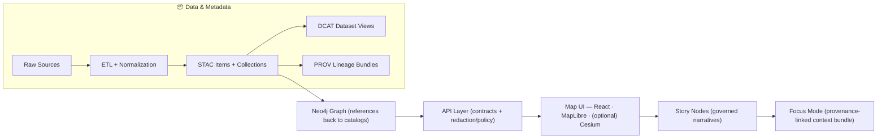

# 🌾 Kansas Frontier Matrix (KFM) — Web Frontend (`web/`) 🗺️


> [!IMPORTANT]
> `web/` is **KFM’s user-facing interface**: a **React + TypeScript** app for map-based exploration that **only talks to the governed backend API** (REST/GraphQL) and **never touches databases or raw data directly**.  
> This is a *hard system boundary* — breaking it breaks trust.

---

## 🧭 Quick links (repo map)

- 📘 **Master Guide (v13)**: `docs/MASTER_GUIDE_v13.md`
- 🧱 **Architecture**: `docs/architecture/`
- 🧾 **Governance / Ethics / Sovereignty**: `docs/governance/`
- 🧩 **UI schemas**: `schemas/ui/`
- 🧠 **API implementation (the only gateway)**: `src/server/`
- 🗺️ **Story Nodes** (governed narratives): `docs/reports/story_nodes/`
- 🧰 **Story Node template**: `docs/templates/TEMPLATE__STORY_NODE_V3.md`
- 🔌 **API contract extension template**: `docs/templates/TEMPLATE__API_CONTRACT_EXTENSION.md`

---

## ✨ What this UI is (and is not)

### ✅ It *is*
- A **map-first “living atlas” UI** for exploring Kansas-focused historical + geospatial knowledge: layers, timelines, stories, comparisons.
- A **renderer**: it visualizes what the backend returns (tiles/GeoJSON, metadata, citations, story content).
- The canonical home for web client code: **React components**, map state, layer configs, UI utilities, styling, accessibility.

### ❌ It is *not*
- A place to stash data files, “just this one query,” or bypass governance.
- A data pipeline, a catalog writer, or a provenance generator.
- A backdoor around restricted access or redaction rules.

---

## 🧱 KFM invariants this UI must never violate

> [!WARNING]
> These are non-negotiable “do not regress” rules. If a feature proposal breaks one, the feature proposal is flawed.

- **Pipeline ordering is absolute**:  
  `ETL → STAC/DCAT/PROV → Graph → API → UI → Story Nodes → Focus Mode`
- **API boundary rule**: the UI **never** queries Neo4j / PostGIS / search indexes directly.
- **Provenance-first**: nothing is displayed without a traceable origin (dataset/story/claim/citation).
- **Evidence-first narrative**: Story Nodes & Focus Mode must not introduce unsourced claims.
- **Sovereignty & classification propagation**: the UI must not “leak” sensitive data via zooming, caching, tooltips, or reconstruction.

---

## 🧩 Architecture at a glance (where `web/` sits)



---

## 🧰 Tech stack & core UI concepts

### Core stack 🧱
- **React SPA** + **TypeScript** for type safety
- **MapLibre GL JS** for interactive **2D** maps
- **CesiumJS** for **3D** globe/terrain (typically as a 2D ↔ 3D toggle)
- **Global state store** (Redux Toolkit or React Context) to keep map, timeline, layers, and story panels synchronized

### First-class UI concepts 🗺️
- 🧭 **Map Viewer**: pan/zoom, feature inspection, legend, layer toggles
- 🕰️ **Time controls**: timeline slider, animations, time filtering, range selection
- 🧩 **Layer registry**: a single source of truth for what layers exist and how they render
- 📖 **Story Nodes**: narrative content linked to map states (evolving toward scrollytelling)
- 🧠 **Focus Mode**: policy-governed AI assistant that returns *cited* answers (UI only renders what the API returns)

---

## 🚀 Quickstart (recommended): run via Docker Compose

> [!NOTE]
> KFM’s development workflow expects a compose stack with `api` + stores + `web` for hot reload and realistic end-to-end testing.

### 1) Start everything (from repo root)
```bash
docker-compose up --build
# (If your system uses the newer Docker plugin:)
# docker compose up --build
```

Expected services (typical):
- `api` → `http://localhost:8000`
- `web` → `http://localhost:3000`
- PostGIS (5432), Neo4j (7474/7687), plus optional policy/search tooling

### 2) Open the UI + API docs
- 🌐 Web UI: `http://localhost:3000`
- 📚 API docs (Swagger): `http://localhost:8000/docs`
- 🧠 GraphQL (if enabled): `http://localhost:8000/graphql`

### 3) Hot reload expectations 🔥
- Editing `web/src/*` should trigger React hot reload
- If you change env vars: restart containers (common: `down` then `up`)

---

## 🔧 Configuration (environment variables)

> [!TIP]
> `.env.example` and `docker-compose.yml` are the source of truth for wiring.

Typical variables you may see:
- `FASTAPI_PORT=8000`
- `WEB_PORT=3000`
- `REACT_APP_API_URL=http://localhost:8000` (CRA-style prefix)

> [!NOTE]
> AI model configuration (Ollama/OpenAI/etc.) is typically **backend-owned**.  
> The UI calls the API and renders policy-filtered results.

---

## 🗂️ Folder guide (typical layout)

```text
web/
├─ public/                       🧷 Static assets (icons, manifest, robots.txt)
└─ src/
   ├─ components/                🧩 UI blocks (MapViewer, TimelineSlider, StoryPanel…)
   ├─ features/                  🧱 Feature modules (layers, stories, focus-mode, search…)
   ├─ state/                     🧠 Global store (map/timeline/layers/session)
   ├─ services/                  🔌 API clients (REST/GraphQL), caching, request utils
   ├─ layers/                    🗺️ Layer registry + legend helpers + style adapters
   ├─ hooks/                     🪝 Reusable hooks (debounce, map events, hotkeys)
   ├─ styles/                    🎨 Theme tokens + global styles
   ├─ types/                     🧾 Shared TS types (API DTOs, layer models, citations)
   ├─ pages/ (optional)          🧭 Route-level screens (if using React Router)
   └─ App.tsx                    🏁 App shell / routing
```

---

## 🗺️ Working with maps

### 2D (MapLibre GL JS) 🧭
**Rule of thumb:** serve big data as tiles, small data as GeoJSON.

- **Vector/raster tiles** (best for large datasets)
- **GeoJSON overlays** (best for small, interactive overlays)
- The UI styles layers and drives:
  - legend entries
  - layer toggles
  - feature click/hover inspection

**Example: vector tiles endpoint (illustrative)**  
`/api/tiles/historic_trails/{z}/{x}/{y}.pbf`

> [!IMPORTANT]
> Don’t ship datasets in the frontend bundle.  
> The UI should request tiles/GeoJSON/metadata from the API and render what it receives.

### 3D (CesiumJS) 🌎
Cesium is used for:
- 3D globe + terrain viewing
- Flyovers / tours / camera bookmarks (often story-driven)
- Future-facing: 3D Tiles (meshes, point clouds, photogrammetry) as governed layers

---

## 🧩 Layer registry (the UI contract that prevents “map drift”)

> [!NOTE]
> The KFM guide treats the layer registry as a **contract artifact** for the UI subsystem.

A good registry makes layers:
- discoverable (name/description/source)
- renderable (style defaults + legend)
- governable (classification, redaction hints, access requirements)
- testable (stable IDs + predictable behaviors)

**Suggested shape (TypeScript example)**
```ts
export type LayerSource =
  | { kind: "vector-tiles"; urlTemplate: string }
  | { kind: "raster-tiles"; urlTemplate: string }
  | { kind: "geojson"; url: string };

export type LayerLegendItem = {
  label: string;
  // keep legend semantic; UI can map to style tokens
  symbol: "line" | "fill" | "circle" | "icon";
};

export type KfmLayer = {
  id: string;                     // stable ID (contract)
  title: string;
  description?: string;
  source: LayerSource;
  legend?: LayerLegendItem[];
  minZoom?: number;
  maxZoom?: number;
  supportsTime?: boolean;
  classification?: "public" | "restricted" | "sensitive";
};
```

---

## 🕰️ Timeline, time filtering, and “time as a first-class dimension”

KFM is explicitly designed for time-oriented exploration:
- Timeline slider updates what’s drawn
- Animations can play through years/periods
- Stories can “snap” time and map state together

**Design patterns worth using**:
- **Dynamic queries**: map updates live as the user scrubs time (debounce for performance).
- **Brushing & linking**: selecting a time range highlights matching map features and charts.
- **Focus + context**: show overview + zoomed window for long time spans (e.g., 1800–2020).

---

## 📖 Story Nodes & scrollytelling

Story Nodes link narrative content with map states:
- “Next”/“Previous” steps can update layers, camera, and time
- Future evolution: **scroll-linked scrollytelling** (text scroll drives map/timeline)

**Implementation note (planned pattern):**
- Use the **Intersection Observer API** to trigger map/timeline changes as narrative sections enter the viewport.

---

## 🧠 Focus Mode (AI assistant) — UI responsibilities

Focus Mode is:
- policy-governed
- evidence-linked
- citation-forward

### UI checklist ✅
- Provide an input surface (question + optional context)
- POST the question to the API (example: `POST /ai/query`)
- Render the response **with citations** and clickable source affordances
- Treat responses as **policy-filtered** output; never attempt to reconstruct redacted content

---

## 🛡️ Security, governance, and “no leak” rules

> [!WARNING]
> UI work can accidentally undermine governance via caching, tooltips, map zoom behavior, or dev shortcuts.

Non-negotiables:
- ✅ All data access routes through the API
- ✅ No direct DB access (Neo4j/PostGIS/search)
- ✅ No “hidden” packaged datasets inside the web bundle
- ✅ Don’t cache sensitive data in LocalStorage/IndexedDB unless explicitly approved
- ✅ Tooltips, downloads, and deep-zoom behavior must respect redaction/classification constraints
- ✅ Prefer “fail closed” UI behavior if access is unclear (don’t guess)

---

## ♿ Accessibility & cartographic design 🎨

KFM’s UI must be usable in workshops and field devices:
- responsive layouts
- keyboard navigation
- accessible contrast and clear focus states
- legends and symbology that explain themselves

### Cartography rules of thumb 🗺️
- Use **figure–ground**: keep the basemap subtle; make the “theme layer” pop.
- Always ship a **legend** with meaningful labels.
- Provide **scale** (and north/heading indicator if applicable).
- Prefer clear, minimal encodings; avoid “rainbow confusion” unless justified.
- If a layer is qualitative vs quantitative, style appropriately (categories vs gradients).

---

## 🧪 Testing expectations

Testing varies by tooling, but the contract expectations don’t:
- Component tests for critical UI building blocks
- Integration tests for map + timeline + layer toggles
- Contract awareness: don’t silently break API response expectations

**Good targets:**
- `LayerControl` toggles render the right sources
- timeline changes request the right filters
- Focus Mode renders citations correctly
- restricted content is not displayed or cached

---

## 🧯 Troubleshooting

<details>
<summary><strong>Port conflicts</strong> (Postgres 5432, Neo4j 7474/7687, API 8000, Web 3000)</summary>

Stop the conflicting local services or adjust compose port mappings / `.env`.
</details>

<details>
<summary><strong>Web container not hot reloading</strong></summary>

Common cause: volume mount issues (especially Windows/macOS).  
Confirm `web/src` is mounted correctly in `docker-compose.yml`.
</details>

<details>
<summary><strong>Rebuild after dependency changes</strong></summary>

```bash
docker-compose up --build
# or
docker-compose build
```
</details>

---

## 🤝 Contributing to the UI (the “KFM way”)

> [!TIP]
> Keep subsystem boundaries crisp. If it feels like UI needs DB access, it’s an API feature.

### When adding a UI feature
1) 🧩 Add/modify components in `web/src/components/` or a feature module in `web/src/features/`  
2) 🔌 Route all data access through `web/src/services/` (API wrappers only)  
3) 🧠 Update global state if it affects map viewport, time selection, layers, story focus  
4) 🗺️ Update the **layer registry** if you introduced/modified a layer  
5) ♿ Run an accessibility pass for any new interactive UI  
6) 🧪 Add or update tests (especially for contract-ish behavior)  
7) 🛡️ Verify governance: no leaks, no bypasses, no hidden data

### If you need a new API endpoint
Use the template: `docs/templates/TEMPLATE__API_CONTRACT_EXTENSION.md`  
(Contracts are first-class artifacts.)

---

## 📚 References & further reading 📚

- 📘 `docs/MASTER_GUIDE_v13.md` — canonical pipeline & subsystem contracts
- 🧾 `docs/architecture/` — system design docs
- 🧠 `src/server/` — the governed API boundary
- 🗺️ `docs/reports/story_nodes/` — governed narrative content
- 🎨 *Making Maps: A Visual Guide to Map Design for GIS* — cartographic design principles
- 🕰️ *Visualization of Time-Oriented Data* — timeline interaction patterns (focus+context, brushing/linking)