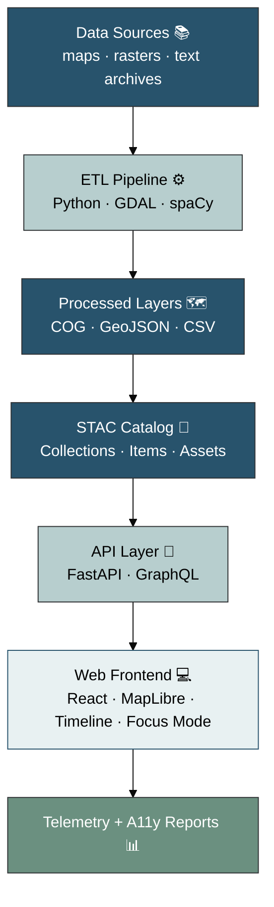
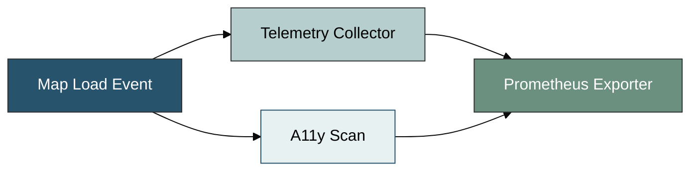

<div align="center">

# 🧩 **Kansas Frontier Matrix — Web Frontend (v2.1.0 · Tier-Ω+∞ Certified · Developer Edition)**
`📁 web/README.md`

### *“Time · Terrain · History · Knowledge Graphs”*

[](../../.github/workflows/site.yml)
[](../../.github/workflows/stac-validate.yml)
[](../../.github/workflows/codeql.yml)
[](../../.github/workflows/trivy.yml)
[](../../docs/)
[](../../LICENSE)

</div>

---

## ⚡ Quick Reference
| Task | Command | Description |
|:--|:--|:--|
| 🚀 Start Dev Server | `pnpm run dev` | Launch Vite with hot-reload |
| 🧱 Build Production | `pnpm run build` | Outputs `dist/` bundle |
| 🧪 Run Tests | `pnpm run test` | Jest + RTL unit/integration |
| 🧭 Validate STAC | `make stac-validate` | Ensures schema & checksum integrity |
| 🔍 Lint All Files | `pnpm run lint` | ESLint + Prettier + Markdownlint |

---

## 📘 Context & Scope
Defines the **developer implementation** of the KFM Web Frontend — a reproducible React + MapLibre GL interface binding **spatial, temporal, and semantic** data to the Neo4j / FastAPI backend.

---

## 🧭 Operational Context
| Environment | URL / Target | Deployment | Notes |
|:--|:--|:--|:--|
| **Dev** | http://localhost:3000 | Vite Dev Server | mock API + hot reload |
| **Stage** | https://staging.kfm.ai | GitHub Pages (staging branch) | nightly build + telemetry |
| **Prod** | https://kfm.ai | GitHub Pages (tagged release) | signed provenance bundle |

---

## 🗂️ Directory Layout
```text
web/
├─ src/
│  ├─ components/   # Map · Timeline · Panels · Search · AIAssistant
│  ├─ hooks/       # useMap · useTimeline · useStac · useSearch
│  ├─ context/     # timeline window · focus mode · layer toggles
│  ├─ utils/       # api.ts · geo.ts · formatter.ts
│  ├─ styles/      # Tailwind tokens · themes · z-index
│  └─ types/       # TypeScript interfaces (API/graph/config)
├─ public/         # static assets (icons, manifest)
├─ config/         # layers.json · app.config.json
└─ vite.config.ts   # Vite build configuration
```

---

## ⚙️ Technology Stack
| Layer | Tech | Purpose |
|:--|:--|:--|
| Core | React 18 + TypeScript | Modular SPA foundation |
| Mapping | MapLibre GL JS | Vector/raster rendering |
| Timeline | D3 + Canvas | Chronological visualization |
| API | Fetch + GraphQL | Data integration layer |
| Tooling | Vite · ESLint · Prettier | Build · lint · format |
| Testing | Jest + RTL | Unit + integration |
| UI | Tailwind + shadcn-ui | Accessible component system |
| A11y | axe-core + Lighthouse | Compliance validation |

---

## 🧩 Core Hooks — Usage Examples
> <!-- Short inline comments explain why each hook matters -->

### 🗺 `useMap.ts`
```ts
import { useEffect } from "react";
import maplibregl from "maplibre-gl";

export function useMap(containerId: string, style: string) {
  // Initializes a MapLibre instance and tears down cleanly
  useEffect(() => {
    const map = new maplibregl.Map({
      container: containerId,
      style,
      center: [-98, 38.5],
      zoom: 5,
    });
    return () => map.remove();
  }, [containerId, style]);
}
```

### 🕰 `useTimeline.ts`
```ts
import { useState } from "react";

export function useTimeline(initialRange = [1850, 2025]) {
  const [range, setRange] = useState(initialRange);
  const scrub = (start: number, end: number) => setRange([start, end]);
  return { range, scrub };
}
```

### 🌐 `useStac.ts`
```ts
import { useEffect, useState } from "react";

export function useStac(url: string) {
  const [items, setItems] = useState([]);
  useEffect(() => {
    fetch(url)
      .then(r => r.json())
      .then(d => setItems(d.features || []));
  }, [url]);
  return items;
}
```

### 🔍 `useSearch.ts`
```ts
// Simple STAC/Graph search hook; returns JSON response
export async function useSearch(query: string) {
  const r = await fetch(`/api/search?q=${encodeURIComponent(query)}`);
  return r.json();
}
```

---

## 🧠 State Management & Data Flow
The frontend uses React Context for shared state management.

```mermaid
%%{init: {"theme": "base", "themeVariables": { "primaryColor": "#28536C", "primaryTextColor": "#fff", "edgeLabelBackground":"#E8F1F2", "tertiaryColor": "#B7CECE"}}}%%
flowchart LR
  A[STAC Data 🗺]:::data --> B[MapContext 🌍]:::logic
  B --> C[TimelineContext 🕰]:::logic
  C --> D[FocusContext 🤖]:::logic
  D --> E["UI Components 🖥 &#40;Map · Timeline · Panels&#41;"]:::ui
  E --> F[Telemetry / A11y Outputs 📊]:::output
  classDef data fill:#28536C,color:#fff;
  classDef logic fill:#B7CECE,color:#000;
  classDef ui fill:#E8F1F2,color:#000,stroke:#28536C;
  classDef output fill:#6B9080,color:#fff;
```



▣ #28536C Data/Architecture ▣ #B7CECE Logic/State ▣ #E8F1F2 UI/Visualization ▣ #6B9080 Output/Telemetry  

All contexts initialized in `src/context/GlobalProvider.tsx`.

---

## 🏗 Architecture Overview


▣ #28536C Data/Architecture ▣ #B7CECE Logic/State ▣ #E8F1F2 UI/Visualization ▣ #6B9080 Output/Telemetry  

<!-- Developer Note: Diagram shows how the frontend fits within the system architecture, from raw data to telemetry outputs. -->

---

## ⚙️ Build & Deployment Workflow
```bash
# Pre-Commit
pre-commit run --all-files
# CI Pipeline
make stac-validate
pnpm run build
pnpm run test
# Release Automation
pnpm run release-please
```

1️⃣ Pre-commit: lint · test · markdown validate  
2️⃣ CI Jobs: site.yml (build & deploy), stac-validate.yml (schema check), sbom.yml (SBOM + SLSA)  
3️⃣ Artifacts: `.prov.json` + `sbom.cdx.json` stored in releases/  
4️⃣ Tags: `web-frontend-vMAJOR.MINOR.PATCH` → auto DOI minting

---

## 🤖 Focus Mode & AI Integration
Focus Mode powers contextual AI summaries, citations, and entity insight overlays.  

%%{init: {"theme": "base","themeVariables":{"primaryColor":"#28536C","primaryTextColor":"#fff"}}}%%
sequenceDiagram
  participant U as 🧑 User
  participant F as Frontend (React)
  participant A as API / FastAPI
  participant N as Neo4j Graph
  participant M as AI Model (spaCy + Transformer)
  U->>F: Select entity/event
  F->>A: GET /api/focus/{id}
  A->>N: Query linked nodes + metadata
  A->>M: Generate summary + confidence
  M-->>A: JSON summary w/ citations
  A-->>F: Response (AI summary)
  F-->>U: Display Focus Mode panel
```
▣ #28536C Data/API ▣ #B7CECE Logic/AI ▣ #E8F1F2 UI Display  

**Integration Notes**
- Endpoint: `/api/focus/{id}` — cached summaries by entity ID  
- Provenance: linked via `:DERIVED_FROM` edges in Neo4j  
- Model card: `docs/models/focus_mode.json` (hash + metrics)  
- Nightly job rebuilds cache → `focus_cache.json`  

---

## 🧬 STAC Lineage Integration
The frontend consumes validated STAC catalogs dynamically.

| Dataset | STAC ID | Manifest | Output | License |
|:--|:--|:--|:--|:--|
| `usgs_topo_1894` | `stac:topo1894` | `data/sources/usgs_topo.json` | `data/processed/maps/usgs_topo_1894.tif` | Public Domain |
| `noaa_daymet_2020` | `stac:daymet2020` | `data/sources/noaa_daymet.json` | `data/processed/climate/daymet_2020.tif` | CC-BY 4.0 |

Frontend → fetches `/data/stac/catalog.json` on build to generate layer registry (`config/layers.json`).  

---

## 🧪 Testing & Coverage
```bash
pnpm run test:coverage
```

| Suite | Coverage Goal | Status |
|:--|:--:|:--:|
| Core Hooks | ≥ 85 % | ✅ |
| Components | ≥ 80 % | ⚙️ |
| Accessibility | ≥ 95 % | ✅ |
| GraphQL Schema | 100 % types validated | ✅ |

Reports → `coverage/lcov-report/` · uploaded to Codecov → 

---

## ♿ Accessibility & WCAG Validation
| WCAG Criterion | Verified By | Tools | Status |
|:--|:--|:--|:--:|
| 1.4.3 Contrast | `a11y-tests.yml` | axe-core · Lighthouse | ✅ |
| 2.1.1 Keyboard | RTL · Cypress | Jest | ✅ |
| 2.4.1 Skip Links | Jest | axe-core | ✅ |
| 3.3.2 Labels | Storybook | axe-core | ✅ |
| 4.1.2 Name/Role | Storybook | axe-core | ⚙️ |
**Target:** ≥ 95 % Accessibility score (monitored in CI telemetry).

---

## 🔒 Security & DevOps Policy
- **CSP:** `default-src 'self' https://api.kfm.ai; object-src 'none'; base-uri 'self'`.  
- **CORS:** allowed origins `kfm.ai`, `staging.kfm.ai`.  
- **Secrets:** stored in GitHub encrypted secrets; never checked in.  
- **Static Analysis:** CodeQL & Trivy run per PR.  
- **Vulnerability Disclosure:** see `SECURITY.md`.  
- **Provenance:** every release ships `sbom.cdx.json` + `.prov.json`.  

---

## 🧱 Caching & Performance Strategy
| Layer | Cache | TTL | Tool |
|:--|:--|:--|:--|
| STAC API | Workbox runtime | 24 h | Service Worker |
| GraphQL | Apollo client | 10 min | In-memory |
| Static Bundles | Hash versioned | ∞ | Vite |
| Telemetry | Prometheus push gateway | 60 s | OpenTelemetry |

---

## 📡 Telemetry & Instrumentation Map

▣ #28536C Data Event ▣ #B7CECE Collector Logic ▣ #E8F1F2 UI Scan ▣ #6B9080 Telemetry Export  

| Event | Payload | Sink | Frequency |
|:--|:--|:--|:--|
| `layerLoad` | layer_id, load_ms | metrics.kfm.ai | per layer |
| `timelineScrub` | timestamp | metrics.kfm.ai | user action |
| `a11yViolation` | rule_id | a11y-report.json | CI run |
| `buildComplete` | sha, size_kb | provenance ledger | per build |

---

## 🧮 Observability Metrics
| Metric | Description | Source | Target |
|:--|:--|:--|:--|
| frontend_build_seconds | Total build time | CI | Prometheus |
| frontend_stac_latency_ms | STAC fetch latency | Client | Prometheus |
| frontend_a11y_score | Accessibility score | axe-core | metrics.kfm.ai |
| frontend_focus_mode_count | Focus Mode activations | AI panel | metrics.kfm.ai |
| frontend_error_rate | JS error frequency | Sentry | Grafana |

---

## 📜 FAIR / CARE & Ethics Commitment
- All datasets adhere to **FAIR** principles (Findable, Accessible, Interoperable, Reusable).  
- Sensitive or tribal data marked with `data_ethics: restricted-derivatives`.  
- Reviews by @kfm-ethics before publication.  
- Citations and provenance embedded in STAC metadata (`derived_from`).  

---

## 🔗 Cross-Document Provenance
| Module | File | Purpose |
|:--|:--|:--|
| System Architecture | `docs/architecture/system-architecture-overview.md` | Backend lineage |
| Web Application | `web/app/README.md` | Deployment + governance |
| Focus Mode AI | `docs/ai/AI-System-Developer-Guide.md` | AI model integration |
| STAC Catalog | `data/stac/catalog.json` | Dataset registry |
| Ethics Ledger | `docs/standards/ethics/ledger/` | Cultural review |

---

## 📘 Glossary
| Term | Meaning |
|:--|:--|
| **MCP-DL** | *Master Coder Protocol — Documentation Language* |
| **STAC** | *SpatioTemporal Asset Catalog* |
| **SLSA** | *Supply-chain Levels for Software Artifacts* |
| **FAIR** | *Findable · Accessible · Interoperable · Reusable* |
| **CARE** | *Collective Benefit · Authority to Control · Responsibility · Ethics* |
| **WCAG** | *Web Content Accessibility Guidelines (2.1 AA / 3.0 ready)* |
| **A11y** | *Accessibility (abbreviation for a-11-y)* |
| **PWA** | *Progressive Web App* |
| **SBOM** | *Software Bill of Materials* |
| **SOP / ADR** | *Standard Operating Procedure / Architecture Decision Record* |

---

## 🧾 Change-Control Register
```yaml
changes:
  - date: "2025-10-21"
    change: "Integrated diagrams, AI lineage, caching strategy, FAIR/CARE ethics, Prometheus metrics, glossary, and full MCP footer."
    reviewed_by: "@kfm-web"
    qa_approved_by: "@kfm-accessibility"
    pr: "#445"
```

---

## 🗓 Version History
| Version | Date | Author | Summary | Type |
|:--|:--|:--|:--|:--|
| **v2.1.0** | 2025-10-21 | @kfm-web | Developer-focused, color-coded, hybrid README with hooks and observability. | Major |
| v2.0.0 | 2025-10-20 | @kfm-web | Added telemetry, PWA & security audits. | Minor |
| v1.9.0 | 2025-10-19 | @kfm-web | Compliance and a11y validation. | Minor |
| v1.0.0 | 2025-06-01 | Founding Team | Initial frontend implementation. | Major |

---

<div align="center">

### 💫 *Kansas Frontier Matrix — “Exploring Time, Terrain, and History through Code and Cartography.”*  
© 2025 Kansas Frontier Matrix — MIT (code) · CC-BY 4.0 (data/docs)

</div>

<!-- MCP-FOOTER-BEGIN
MCP-VERSION: v6.3.2
MCP-TIER: Ω+∞
DOC-PATH: web/README.md
DOC-HASH: sha256:web-frontend-readme-v2-1-0-xxxxxxxxxxxxxxxxxxxxxxxxxxxxxxxxxxxx
MCP-CERTIFIED: true
VALIDATION-HASH: {auto.hash}
AUDIT-TRAIL: enabled
DOI-MINTED: pending
A11Y-VERIFIED: true
I18N-READY: true
PWA-ENABLED: true
STAC-VALIDATED: true
SBOM-GENERATED: true
SLSA-ATTESTED: true
HTML5-A11Y-VERIFIED: true
PERFORMANCE-BUDGET-P95: 2.5s
FOCUS-MODE-INTEGRATED: true
GRAPHQL-ENABLED: true
OBSERVABILITY-ACTIVE: true
CACHE-STRATEGY-VERIFIED: true
ETHICS-REVIEW-PASSED: true
FAIR-CARE-COMPLIANT: true
CSP-POLICY-ENFORCED: true
CI-PIPELINE-PINNED: true
TEST-COVERAGE-THRESHOLD: 85%
WCAG-AA-CONFORMANCE: verified
SECURITY-SCAN-CLEAN: true
GENERATED-BY: KFM-Automation/DocsBot
LAST-VALIDATED: {build.date}
MCP-FOOTER-END -->
