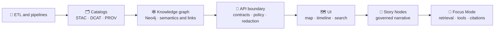
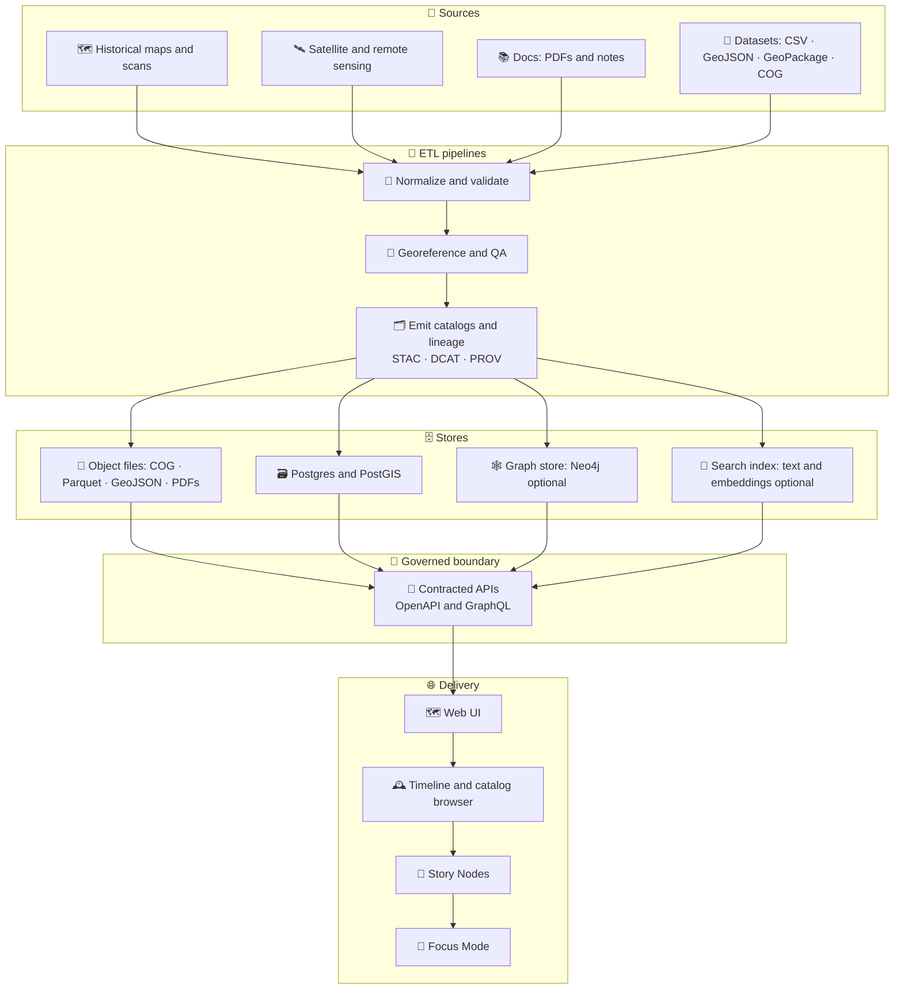

# Kansas Frontier Matrix (KFM) 🧭🌾🗺️  
**A “living atlas” + evidence pipeline for Kansas** — open-source geospatial + knowledge + modeling infrastructure that fuses **historical mapping**, **remote sensing**, **GIS**, **simulation**, and **AI-assisted research** into one cohesive, governed system.

<p align="left">
  <a href="https://github.com/bartytime4life/Kansas-Frontier-Matrix/actions/workflows/ci.yml"></a>
  <a href="https://github.com/bartytime4life/Kansas-Frontier-Matrix/actions/workflows/codeql.yml"></a>
  <a href="https://github.com/bartytime4life/Kansas-Frontier-Matrix/issues"></a>
  <a href="#contributing-"></a>
  <a href="#license-"></a>
  
  
  
  
  
  
  
  
  
  
  
</p>

> [!IMPORTANT]
> **KFM invariant (non‑negotiable ordering):**  
> **ETL → STAC/DCAT/PROV Catalogs → Graph → APIs → UI → Story Nodes → Focus Mode**  
> If a change breaks this ordering (even “temporarily”), it’s not mergeable. 🚫🧱

> [!TIP]
> 🧼 If you only remember one rule: **no story without evidence** (versioned data + provenance + citations). ✅🧾

---

## Table of contents 📌
- [Quick links](#quick-links-)
- [What KFM is](#what-kfm-is-)
- [KFM invariants](#kfm-invariants-non-negotiables-)
- [Canonical pipeline](#canonical-pipeline-the-only-allowed-order-)
- [Architecture at a glance](#architecture-at-a-glance-)
- [Repository map](#repository-map-target-shape-)
- [Quickstart](#quickstart-)
- [Quality gates & CI](#quality-gates--ci-)
- [Data standards & conventions](#data-standards--conventions-)
- [Story Nodes + Focus Mode](#story-nodes--focus-mode-)
- [Modeling, simulation & experiments](#modeling-simulation--experiments-)
- [Contributing](#contributing-)
- [Roadmap](#roadmap-)
- [Project reference library](#project-reference-library-all-project-files-)
- [License](#license-)
- [Acknowledgements](#acknowledgements-)

---

<a id="quick-links"></a>

## Quick links 🔗

| Action | Link |
|---|---|
| 🐛 Report a bug | https://github.com/bartytime4life/Kansas-Frontier-Matrix/issues/new/choose |
| ✨ Request a feature | https://github.com/bartytime4life/Kansas-Frontier-Matrix/issues/new/choose |
| 🧪 CI runs | https://github.com/bartytime4life/Kansas-Frontier-Matrix/actions |
| 🤝 Collaboration & automation hub | `./.github/README.md` |
| 🧭 Docs index (add/keep current) | `./docs/README.md` |
| 🧩 Architecture docs | `./docs/architecture/` |
| 🧾 Standards & profiles (STAC/DCAT/PROV) | `./docs/standards/` |
| 📦 Data boundary & governance | `./data/README.md` |
| 🧩 Executable boundary | `./src/README.md` |
| 🛠️ Tooling boundary (validators, catalog QA) | `./tools/README.md` |
| 🧰 Automation scripts | `./scripts/README.md` |
| 🧪 Test suite entrypoint | `./tests/README.md` |
| 🧠 Methods & experiments (MCP) | `./mcp/README.md` *(or `./mcp/MCP-README.md`)* |
| 📓 Notebooks workspace | `./notebooks/README.md` |
| 🚪 API boundary | `./api/README.md` *(if present)* |
| 🌐 Web UI boundary | `./web/README.md` *(if present)* |

> [!NOTE]
> If a link 404s, treat it as a **target shape** and add the missing README as part of repo hardening. 🧱✅

---

<a id="what-kfm-is"></a>

## What KFM is 🧭

KFM is a **Kansas-scale “spatial truth + provenance + modeling” workbench** — a living atlas where:

- 🗺️ **Maps + layers** are time-aware, queryable, and governed  
- 🧾 **Documents** become citable evidence attached to places + time  
- 🧠 **Models** are reproducible experiments (not vibes) with uncertainty surfaced  
- 🌐 **UI** is driven by contracts and evidence bundles, not ad-hoc data pulls  

It’s designed to:
- 🗺️ turn scanned maps + GIS layers into **time-aware, queryable layers**
- 🧾 connect **documents ↔ places ↔ time** with citations + traceability
- 🛰️ run remote sensing workflows and publish **derived** products with provenance
- 📈 support reproducible modeling (EDA → regression → Bayes → ML → simulation)
- 🌐 deliver everything through a **map UI + timeline + searchable catalogs + Story Nodes**
- 🧠 power a controlled assistant (“Focus Mode”) that stays **grounded in evidence**

🎯 **Goal:** Make Kansas-scale spatial truth **searchable**, **mappable**, **auditable**, and **modelable** — from archival scans to satellite-derived datasets.

---

<a id="kfm-invariants"></a>

## KFM invariants (non-negotiables) 🧱🚫

These guardrails keep KFM honest, scalable, and reviewable:

- 🧾 **Evidence-first narrative:** no unsourced claims in Story Nodes or AI outputs  
- 🧱 **Contract-first interfaces:** schemas + API contracts are first-class artifacts  
- 🔁 **Deterministic ETL:** idempotent, config-driven, logged, replay-safe  
- 🗂️ **Catalog gate:** data is registered (STAC/DCAT + PROV lineage) before graph/API/UI use  
- 🔒 **API boundary rule:** UI never queries graph/DB directly — governed access only  
- 🔐 **No privacy downgrade:** outputs cannot be less restricted than inputs without explicit redaction policy + review  
- 🛡️ **Hostile-input posture:** assume external files and metadata are adversarial; validate and sandbox where possible  
- ❤️ **Human autonomy:** AI assists, labels uncertainty, and cites evidence — it does not “assert truth” without sources  

> [!WARNING]
> If we can’t explain *where it came from* and *how it was transformed*, it doesn’t ship. ✅

---

<a id="canonical-pipeline"></a>

## Canonical pipeline (the only allowed order) 🧭➡️

KFM has **one** canonical flow. Every subsystem plugs into it — no leapfrogging:



**Why this matters:** provenance, governance, and contracts must be upstream of storytelling and AI.

---

<a id="architecture-at-a-glance"></a>

## Architecture at a glance 🧱



---

<a id="repository-map-target-shape"></a>

## Repository map (target shape) 🗂️🧭

> [!NOTE]
> Keep the repo structure you already have — this is the **target map** for clarity + onboarding.  
> Update this section whenever folders move. ✅

```text
Kansas-Frontier-Matrix/
├─ 📁 .github/                          🤝 CI/CD · labels · templates · automation
│  ├─ 📄 README.md
│  └─ 📄 SECURITY.md                     🔐 (add if missing)
├─ 📁 docs/                              📚 governed docs (policies · standards · architecture)
│  ├─ 📄 README.md                       🧭 docs index (add/keep current)
│  ├─ 📄 MASTER_GUIDE_v13.md             🧭 canonical invariants and onboarding (if present)
│  ├─ 📁 architecture/                   🧱 ADRs · diagrams · blueprints
│  ├─ 📁 standards/                      🧾 STAC/DCAT/PROV profiles · governance rules
│  ├─ 📁 templates/                      🧩 Story Node · SOP · experiment templates
│  └─ 📁 reports/
│     └─ 📁 story_nodes/
│        ├─ 📁 draft/                    ✍️ in-progress narrative nodes
│        └─ 📁 published/                ✅ reviewed, source-backed story nodes
├─ 📁 schemas/                           📐 JSON Schemas: contracts · metadata · telemetry
├─ 📁 data/                              📦 raw → work → processed + catalogs + provenance
│  ├─ 📁 raw/                            ⛏️ raw inputs (scans, downloads, snapshots)
│  ├─ 📁 work/                           🧪 intermediates (often gitignored)
│  ├─ 📁 processed/                      ✅ publishable derived assets
│  ├─ 📁 catalog/
│  │  ├─ 📁 stac/                        🗂️ STAC collections and items
│  │  └─ 📁 dcat/                        🏷️ DCAT datasets and distributions
│  └─ 📁 prov/                           🧬 PROV lineage bundles
├─ 📁 releases/                          📦 versioned snapshots (schemas + catalogs + checksums)
├─ 📁 src/                               🧩 canonical executable boundary
│  ├─ 📁 pipelines/                      🧰 ETL jobs (domain-specific)
│  ├─ 📁 graph/                          🕸️ ontology + ingest + constraints
│  └─ 📁 server/                         🚪 APIs and services (policy + contracts)
├─ 📁 api/                               🚪 standalone API package (optional repo shape)
│  ├─ 📄 README.md
│  └─ 📁 contracts/                      📜 OpenAPI + schemas (source of truth)
├─ 📁 web/                               🌐 UI boundary (MapLibre · WebGL · story layers)
│  └─ 📄 README.md
├─ 📁 tools/                             🛠️ toolbox: validators · catalog QA · id and prov helpers
│  └─ 📄 README.md
├─ 📁 scripts/                           🧰 automation toolkit: safe-by-default CLI wrappers
│  └─ 📄 README.md
├─ 📁 mcp/                               🧪 Master Coder Protocol: experiments and run receipts
│  └─ 📄 README.md                        (or MCP-README.md)
├─ 📁 notebooks/                          📓 lab bench: exploration that graduates to src
│  └─ 📄 README.md
├─ 📁 tests/                              ✅ unit · integration · contracts · e2e guidance
│  └─ 📄 README.md
├─ 🐳 docker-compose.yml
├─ 🧾 .env.example
└─ 📄 README.md
```

---

<a id="quickstart"></a>

## Quickstart 🚀

### Option A — Docker (recommended) 🐳
```bash
# 1) Clone
git clone https://github.com/bartytime4life/Kansas-Frontier-Matrix.git
cd Kansas-Frontier-Matrix

# 2) Configure environment
cp .env.example .env

# 3) Run
docker compose up --build
```

### Option B — Local dev (Python + Node) 💻
> [!TIP]
> Prefer service-level docs if present:
> - `src/server/README.md` (API boundary)
> - `web/README.md` (frontend)

```bash
# Backend (example shape)
python -m venv .venv
source .venv/bin/activate
pip install -r requirements.txt

# Start command depends on framework:
# - FastAPI: uvicorn src.server.app.main:app --reload
# - Flask:   flask --app src.server.app run --debug

# Frontend
cd web
npm install
npm run dev
```

✅ Typical local endpoints:
- `http://localhost:8000` → API  
- `http://localhost:5173` → Web UI  

---

<a id="quality-gates--ci"></a>

## Quality gates & CI ✅🧪

KFM gates are designed to stop **silent drift**: missing licenses, broken links, schema mismatches, or uncataloged artifacts.

### ✅ Fast catalog QA gate (PR-friendly)
A lightweight validator should run on PRs that touch `data/**`:

**Checks (fast):**
- `license` exists and is non-empty  
- `providers` exists and is non-empty  
- `stac_extensions` exists (warn if empty; fail if missing)  
- top-level `links[].href` respond (HEAD/GET)  

Suggested local run (example):
```bash
python3 tools/validation/catalog_qa/run_catalog_qa.py \
  --root data/ \
  --glob "**/collection.json" \
  --fail-on-warn
```

### ✅ Minimum CI gates (recommended)
- 🧹 lint and format (Python + JS/TS)
- ✅ unit tests
- 🔌 integration tests (DB, graph, API boundaries)
- 🧾 contract checks (OpenAPI + JSON Schemas)
- 🗂️ metadata checks (STAC/DCAT/PROV)
- 🔐 security scans (secrets, deps, container baseline)
- 📎 artifacts on failure (logs, diffs, screenshots)

> [!IMPORTANT]
> “Green CI” is a merge requirement. Fix the root cause — don’t ship flaky behavior. 🤖🚫

---

<a id="data-standards--conventions"></a>

## Data standards & conventions 🗺️🧾

To keep KFM interoperable and web-scale friendly:

- 🗂️ **Catalogs:** STAC (spatial assets), DCAT (dataset registry), PROV (lineage)  
- 🌍 **Vector:** GeoJSON (transport), GeoPackage accepted for ingest, GeoParquet encouraged for analytics  
- 🧊 **Raster:** Cloud-Optimized GeoTIFF (**COG**) preferred for web streaming  
- 🧭 **CRS:** store original + normalized derivatives; API default WGS84 (`EPSG:4326`)  
- 🔍 **Quality:** geometry validity, bbox sanity, temporal sanity, quicklook proofs (small + cacheable)  

### ✅ Provenance checklist (required for “publishable” outputs)
- Source reference (URL/DOI/archive id/scan box id)
- License/terms (or explicit “unknown” + mitigation)
- Spatial reference (EPSG) + units
- Time coverage (range or “undated”)
- Processing steps (georef point count, resampling, simplification, masks)
- Checksums + version stamp *(recommended)*
- Redaction notes *(if sensitive)*

> [!WARNING]
> If we can’t explain where the data came from and how it was processed, we can’t trust it — and it won’t ship. 🧱🗺️

---

<a id="story-nodes--focus-mode"></a>

## Story Nodes + Focus Mode 📖🧠

### 📖 Story Nodes = governed narrative (machine-ingestible)
Story Nodes are the curated storytelling layer of KFM:
- ✅ versioned, reviewable, citable  
- 🧭 link places ↔ time ↔ datasets ↔ documents  
- 🗺️ can drive map camera moves, layer toggles, and annotations (when enabled)

Recommended shape:
```text
📁 docs/reports/story_nodes/
├─ 📁 draft/
│  └─ 📁 <slug>/
│     ├─ 📄 story.md
│     ├─ 📄 sources.yml
│     └─ 📁 assets/
└─ 📁 published/
   └─ 📁 <slug>/
      ├─ 📄 story.md
      ├─ 📄 sources.yml
      └─ 📁 assets/
```

### 🧠 Focus Mode = evidence-grounded assistant (advisory, not autonomous)
Focus Mode:
- retrieves context from **catalogs + graph + docs**
- uses tools for calculations instead of “making numbers up”
- outputs narratives with citations and provenance pointers
- stays advisory: it does not take actions or make decisions for users

> [!IMPORTANT]
> KFM’s AI posture: **assist, don’t assert** — and always cite evidence. ✅🧾

---

<a id="modeling-simulation--experiments"></a>

## Modeling, simulation & experiments 🧠📈🧪

KFM is not just a map viewer — it’s a **modeling workbench** with discipline:

### What belongs here
- 📊 **Statistics & regression:** trends, diagnostics, uncertainty, bias checks  
- 🎲 **Bayesian workflows:** posterior summaries, credible intervals, priors recorded  
- 🤖 **ML:** baselines, evaluation artifacts, model cards, bounded claims  
- 🛰️ **Remote sensing analytics:** indices, composites, change detection  
- 🧪 **Simulation & optimization:** scenario runs, sensitivity, V&V posture  

### ✅ Modeling hygiene checklist (required)
- ✅ objective + assumptions written down
- ✅ dataset IDs + catalog pointers recorded
- ✅ splits + seeds recorded (if applicable)
- ✅ diagnostics captured (residuals, calibration, sanity plots)
- ✅ uncertainty surfaced (intervals/bounds) where relevant
- ✅ artifacts stored as evidence (and governed like datasets)

### 🧠 Where experiments live
- `mcp/` → experiment reports, run receipts, SOPs, model cards  
- `notebooks/` → exploratory work that **graduates** into pipelines and tests  
- `data/processed/` → evidence artifacts that become user-visible  

---

<a id="contributing"></a>

## Contributing 🤝

We welcome contributions that improve:
- 🧾 provenance, ingest tooling, validation
- 🗺️ mapping UX (layers, timeline, search, performance)
- 📈 modeling modules + reproducibility
- 📚 documentation + tutorials + examples

Start here → `./.github/README.md` ✅

### 🗃️ Data contribution checklist (recommended)
- [ ] Dataset has a **catalog record** + **license** + **source reference**
- [ ] Transform history documented (scripts/commands/parameters)
- [ ] CRS is explicit
- [ ] BBox/time range present (when applicable)
- [ ] Sensitive fields reviewed/redacted (if needed)
- [ ] Catalog QA passes (license/providers/stac_extensions + links)

---

<a id="roadmap"></a>

## Roadmap 🛣️

### 🧱 Phase 1 — foundations (contracts + governance)
- [ ] 🗂️ Directory alignment + repo docs index (`docs/README.md`)
- [ ] 📦 Contract-first schemas for STAC/DCAT/PROV/Story Nodes/Evidence bundles
- [ ] ✅ Catalog QA quick gate in CI (`tools/validation/catalog_qa/`)
- [ ] 🧾 Standards & templates (`docs/standards/`, `docs/templates/`)

### 🗺️ Phase 2 — UI + catalog MVP
- [ ] 🗺️ Map + timeline MVP (layer browser, search, feature inspect)
- [ ] 🧭 Catalog browser (STAC + DCAT) + provenance view (PROV)
- [ ] 🔎 Search + retrieval (docs + datasets)

### 🛰️ Phase 3 — pipelines + evidence products
- [ ] 🛰️ Remote sensing pipeline templates (job → artifacts → catalogs)
- [ ] 🌊 Example pipeline: hydrology watcher (time-series + PROV)
- [ ] 📈 Modeling modules + model cards under `mcp/`

### 📖 Phase 4 — storytelling + Focus Mode
- [ ] 📖 Story Node workflow (draft → review → publish)
- [ ] 🧠 Focus Mode: citations + tool-use + safe redaction
- [ ] 🧾 Evidence bundles as the only input to narrative claims

---

<a id="project-reference-library-all-project-files"></a>

## Project reference library (all project files) 📚🎒

> These files are treated as the repo’s **design + research shelf**: modeling rigor, statistics discipline, GIS engineering, web rendering constraints, databases, governance, and security mindset.  
> ⚠️ Reference materials may have **different licenses** than repository code. Respect upstream terms and avoid redistributing third-party works without permission.

<details>
<summary><strong>📦 Expand: Full influence map (every included project file)</strong></summary>

### 🧭 Core system vision and KFM blueprint
- 📄 **Kansas Frontier Matrix (KFM) – Comprehensive Technical Documentation.docx** — platform blueprint, governed ordering, subsystem boundaries  
- 📄 **Latest Ideas.docx** *(if present in your repo)* — prototypes and near-term experiments to graduate into contracts and pipelines  

### 🗺️ Geospatial, cartography, and mapping UX
- 📘 **python-geospatial-analysis-cookbook.pdf** — CRS hygiene, vector/raster IO, PostGIS patterns  
- 🎨 **making-maps-a-visual-guide-to-map-design-for-gis.pdf** — map truthfulness, symbology, perceptual pitfalls  
- 📱 **Mobile Mapping_ Space, Cartography and the Digital - 9789048535217.pdf** — offline/mobile constraints influencing upstream output formats  
- 🖼️ **compressed-image-file-formats-jpeg-png-gif-xbm-bmp.pdf** — correct and efficient media handling for quicklooks/thumbnails  

### 🛰️ Remote sensing workflows
- 🛰️ **Cloud-Based Remote Sensing with Google Earth Engine-Fundamentals and Applications.pdf** — EO time-series patterns, export + reproducibility expectations  

### 📊 Statistics, experiments, regression, Bayesian reasoning
- 🧪 **Understanding Statistics & Experimental Design.pdf** — experimental design, bias, confounding, inference discipline  
- 📈 **regression-analysis-with-python.pdf** — regression workflows, diagnostics, assumptions  
- 📊 **Regression analysis using Python - slides-linear-regression.pdf** — quick reference for assumptions and evaluation conventions  
- 🎲 **think-bayes-bayesian-statistics-in-python.pdf** — uncertainty as first-class output; priors and credible intervals  
- 📉 **graphical-data-analysis-with-r.pdf** — EDA instincts, “look at the data” QC culture  

### 🧪 Modeling, simulation, optimization, graph foundations
- 🚀 **Scientific Modeling and Simulation_ A Comprehensive NASA-Grade Guide.pdf** — verification/validation, sensitivity, simulation ethics  
- 🧮 **Generalized Topology Optimization for Structural Design.pdf** — optimization jobs: objectives/constraints and reproducible artifacts  
- 🕸️ **Spectral Geometry of Graphs.pdf** — graph analytics foundations and careful interpretation of metrics  

### 🗄️ Data systems, scalability, interoperability
- 🐘 **PostgreSQL Notes for Professionals - PostgreSQLNotesForProfessionals.pdf** — indexing, schema discipline, operational SQL  
- ⚙️ **Scalable Data Management for Future Hardware.pdf** — locality, partitions, concurrency, throughput thinking  
- 🔗 **Data Spaces.pdf** — federation, pointer-over-payload mindset, catalogs as interfaces  

### 🌐 Web, rendering, and 3D awareness
- 📱 **responsive-web-design-with-html5-and-css3.pdf** — responsive constraints; payload budgets; progressive delivery  
- 🧊 **webgl-programming-guide-interactive-3d-graphics-programming-with-webgl.pdf** — coordinate sanity; GPU constraints; LOD and tiling considerations  

### 🔐 Security, adversarial posture, concurrency
- 🛡️ **ethical-hacking-and-countermeasures-secure-network-infrastructures.pdf** — defensive threat modeling for ingestion and services  
- 🐍 **Gray Hat Python - Python Programming for Hackers and Reverse Engineers (2009).pdf** — hostile-input awareness; parser attack surfaces (defensive posture only)  
- 🧵 **concurrent-real-time-and-distributed-programming-in-java-threads-rtsj-and-rmi.pdf** — concurrency hazards; determinism; bounded queues  

### ❤️ Human systems, ethics, governance
- 🤝 **Introduction to Digital Humanism.pdf** — accountability, dignity, and human-centered defaults  
- 🧠 **Principles of Biological Autonomy - book_9780262381833.pdf** — systems thinking, feedback loops, stability/resilience metaphors  
- ⚖️ **On the path to AI Law’s prophecies and the conceptual foundations of the machine learning age.pdf** — labeling AI outputs, auditability, risk framing  

### 📚 Programming shelves (multi-language reference packs)
- 📚 **A programming Books.pdf**  
- 📚 **B-C programming Books.pdf**  
- 📚 **D-E programming Books.pdf**  
- 📚 **F-H programming Books.pdf**  
- 📚 **I-L programming Books.pdf**  
- 📚 **M-N programming Books.pdf**  
- 📚 **O-R programming Books.pdf**  
- 📚 **S-T programming Books.pdf**  
- 📚 **U-X programming Books.pdf**  

</details>

---

<a id="license"></a>

## License 🧾
**MIT** (code), unless otherwise noted.

> [!IMPORTANT]
> 🗃️ **Data note:** datasets, scans, and third‑party documents can have different licenses/attribution than the code. Track this in catalogs/manifests and metadata. ✅

---

<a id="acknowledgements"></a>

## Acknowledgements 🙌🌾
Built by combining **geospatial engineering**, **data science rigor**, **systems design**, and **human-centered governance** into a cohesive platform for Kansas-scale exploration and decision support.
