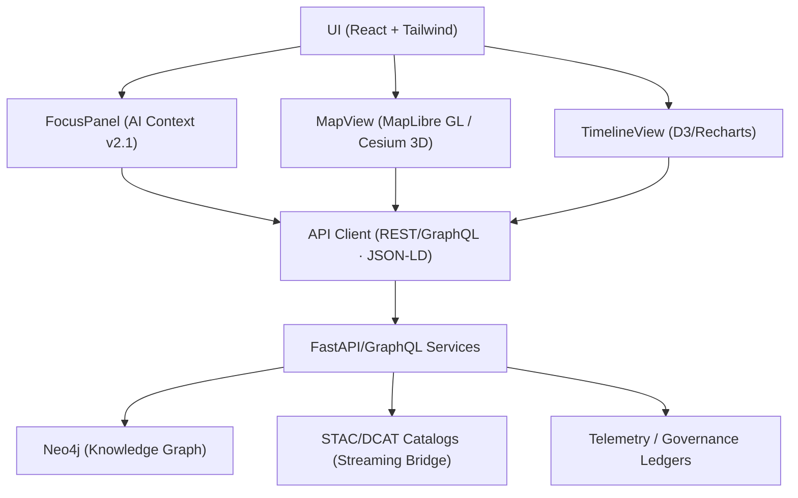

<div align="center">

# 🌐 **Kansas Frontier Matrix — Web Application & Focus Mode Platform**  
`web/README.md`

**Purpose:**  
Document the modular, accessible, and FAIR+CARE-certified **KFM Web Platform**, detailing **Focus Mode v2.1**, data explorer, governance dashboards, data/UX contracts, and CI/CD touchpoints for reproducible, ethics-aligned releases.

[](../docs/README.md)
[](../LICENSE)
[](../docs/standards/faircare.md)
[](../releases/v10.2.0/manifest.zip)

</div>

---

## 📘 Overview

The **KFM Web Platform** is the front-end interface for exploring **timeline + map narratives** and AI **Focus Mode** insights, backed by a **Neo4j knowledge graph** and **FastAPI/GraphQL** services.  
Built for **standards-first interoperability** (STAC 1.0, DCAT 3.0, JSON-LD/RDF, WCAG 2.1 AA), it is governed by **MCP v6.3** with immutable telemetry and governance ledgers on each release.

**v10.2.2 Enhancements**
- **Focus Mode v2.1:** Adaptive AI narratives with SHAP/LIME overlays and CARE filters.  
- **3D Temporal Scenes:** Cesium-based deep-time and predictive projections with timeline sync.  
- **Streaming STAC Bridge:** Real-time catalog updates visible in the layer switcher.  
- **Sustainability & A11y Metrics:** Lighthouse/axe gates; ISO 50001/14064 telemetry in CI.

---

## 🗂️ Directory Layout

```
web/
├── README.md                          # This file
├── ARCHITECTURE.md                    # Web architecture overview
│
├── public/                            # Static assets (no secrets)
│   ├── images/
│   ├── icons/
│   └── manifest.json
│
├── src/                               # React + TypeScript application
│   ├── components/                    # MapView, TimelineView, FocusPanel, StoryNode, LayerSwitcher
│   ├── pages/                         # Home, Explore, Governance, About
│   ├── hooks/                         # useFocus, useTelemetry, useGovernance, useStac
│   ├── context/                       # App providers (theme, a11y, focus, auth)
│   ├── services/                      # REST/GraphQL clients, STAC/DCAT adapters
│   ├── utils/                         # Formatters, schema guards, a11y helpers
│   └── styles/                        # Tailwind config, tokens, themes
│
├── package.json                       # Dependencies and npm scripts
└── vite.config.ts                     # Vite build configuration
```

---

## 🧩 Web Architecture



- **Focus Mode v2.1 (UI):** Narrative, “Why this?” chips (SHAP), consent/provenance badges, and entity highlights.  
- **MapView:** 2D/3D layers, basemap toggles, predictive overlays, and keyboard-accessible controls.  
- **TimelineView:** Zoomable brushing, density plots, break-year markers, and forecast ranges.  
- **API Client:** Strong typing (DTOs), pagination, caching, and JSON-LD contexts for provenance.

---

## 🧠 Focus Mode (AI Context Engine v2.1)

| Aspect | Implementation |
|---|---|
| API | `GET /api/focus/{entity_id}` → Subgraph + AI narrative + citations + ethics flags |
| Model | `focus_transformer_v2.1` — dual-encoder with cross-modal attention |
| Explainability | SHAP/LIME overlays; causal traces rendered as chips & on-map hints |
| CARE | Sensitive data gating, consent prompts, provenance links |
| Telemetry | Interaction logs, drift metrics, ethics filters → `focus-telemetry.json` |

> 💡 **Tip:** Focus summaries surface only data with consent or public licenses; all citations carry source IDs.

---

## ⚙️ Frontend Stack

| Layer | Tool | Function |
|---|---|---|
| Framework | React 18 + TypeScript | Component-based SPA |
| Build | Vite | Fast, deterministic builds |
| Styling | Tailwind CSS | Tokenized theming and responsive UI |
| Map | MapLibre GL JS / Cesium | 2D + 3D geospatial rendering |
| Charts | D3 / Recharts | Time-series and density visualizations |
| State | React Context + Local Store | Focus, theme, a11y, and map state |
| A11y | Semantic HTML + ARIA + axe CI | WCAG 2.1 AA compliance checks |
| Data | STAC/DCAT + GraphQL + JSON-LD | Interoperable linked datasets |

---

## ⚖️ FAIR+CARE & Accessibility

- **Accessibility:** keyboard navigation, skip links, focus outlines, alt text, ARIA landmarks, ≥ 4.5:1 contrast.  
- **Ethics:** CARE-informed prompts, community consent indicators, Indigenous data governance cues.  
- **Documentation:** See `../docs/standards/ui_accessibility.md` and `../docs/standards/faircare.md`.

---

## 🧾 Validation & Governance Contracts

| Contract | Purpose | Validator |
|---|---|---|
| STAC v1.0 | Geospatial layer registration & discovery | `stac-validate.yml` |
| DCAT 3.0 | Catalog interoperability | `stac-dcat-bridge.yml` |
| API DTOs | Typed response models & guards | `src/services/schemaGuards.ts` |
| A11y Budget | Lighthouse/axe thresholds | `accessibility_scan.yml` |

**Provenance:** Every `/api/*` payload includes JSON-LD context and source links.

---

## 🔁 CI/CD — Workflow → Artifact Mapping

| Workflow | Ensures | Output Artifact |
|---|---|---|
| `docs-lint.yml` | Markdown/yaml schema compliance | `reports/self-validation/docs/lint_summary.json` |
| `build-and-deploy.yml` | Build integrity & deployment | `docs/reports/telemetry/build_metrics.json` |
| `telemetry-export.yml` | Telemetry merge & export | `../releases/v10.2.0/focus-telemetry.json` |
| `codeql.yml` / `trivy.yml` | Security posture (SARIF / CVEs) | `reports/security/*.{sarif,json}` |
| `accessibility_scan.yml` | Accessibility gates (axe/Lighthouse) | `reports/self-validation/web/a11y_summary.json` |

---

## ♿ Design Tokens (Accessibility-First)

| Token Type | File Reference | Standard |
|---|---|---|
| Colors | `../docs/design/tokens/color-palette.md` | WCAG 2.1 AA |
| Typography | `../docs/design/tokens/typography-system.md` | ISO 9241-210 |
| Spacing | `../docs/design/tokens/spacing-grid.md` | MCP Layout |
| Accessibility | `../docs/design/tokens/accessibility-tokens.md` | FAIR+CARE UI |

---

## 📊 Web Sustainability & Telemetry

| Metric | Target | Verified By |
|---|---|---|
| Page Weight | ≤ 1.5 MB (core routes) | `build-and-deploy.yml` |
| Accessibility | ≥ 95 (Lighthouse) | `accessibility_scan.yml` |
| Energy / Perf | Recorded each release | `build_metrics.json` |

---

## 🚀 Local Development

```bash
# Install dependencies
npm --prefix web install

# Run development server
npm --prefix web run dev   # http://localhost:3000

# Typecheck & lint
npm --prefix web run typecheck
npm --prefix web run lint

# Build for production
npm --prefix web run build
```

> 🔐 **Secrets:** Use `.env.local` (never commit). CI parity is defined in `.github/workflows/build-and-deploy.yml`.

---

## 🕰️ Version History

| Version | Date | Author | Notes |
|---|---|---|---|
| v10.2.2 | 2025-11-12 | Web Architecture Team | Aligned to v10.2: Focus v2.1, streaming STAC in UI, a11y/energy telemetry gates, JSON-LD provenance. |
| v10.0.0 | 2025-11-09 | Web Architecture Team | Focus v2, 3D temporal scenes, streaming STAC bridge, A11y/energy telemetry v2. |
| v9.7.0 | 2025-11-05 | KFM Core Team | Contracts, ethics, telemetry schema v1. |
| v9.6.0 | 2025-11-03 | KFM Core Team | Governance synchronization, explainability updates. |
| v9.5.0 | 2025-11-02 | KFM Core Team | Introduced A11y tokens and monitoring. |

---

<div align="center">

**© 2025 Kansas Frontier Matrix — MIT / CC-BY 4.0**  
Maintained under **Master Coder Protocol v6.3** · FAIR+CARE Certified · Diamond⁹ Ω / Crown∞Ω Ultimate Certified  
[⬅ Back to Documentation Index](../docs/README.md) · [Web Architecture →](ARCHITECTURE.md)

</div>