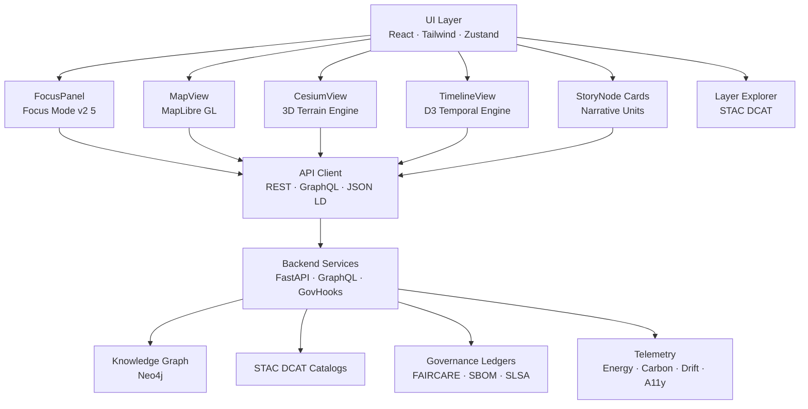
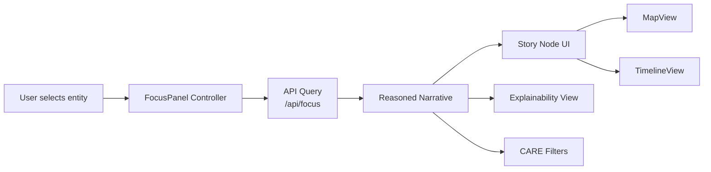
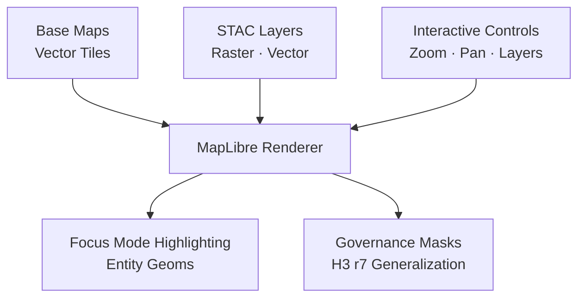
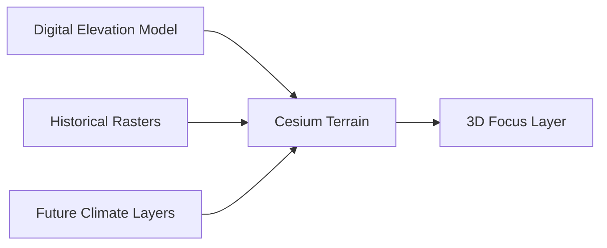
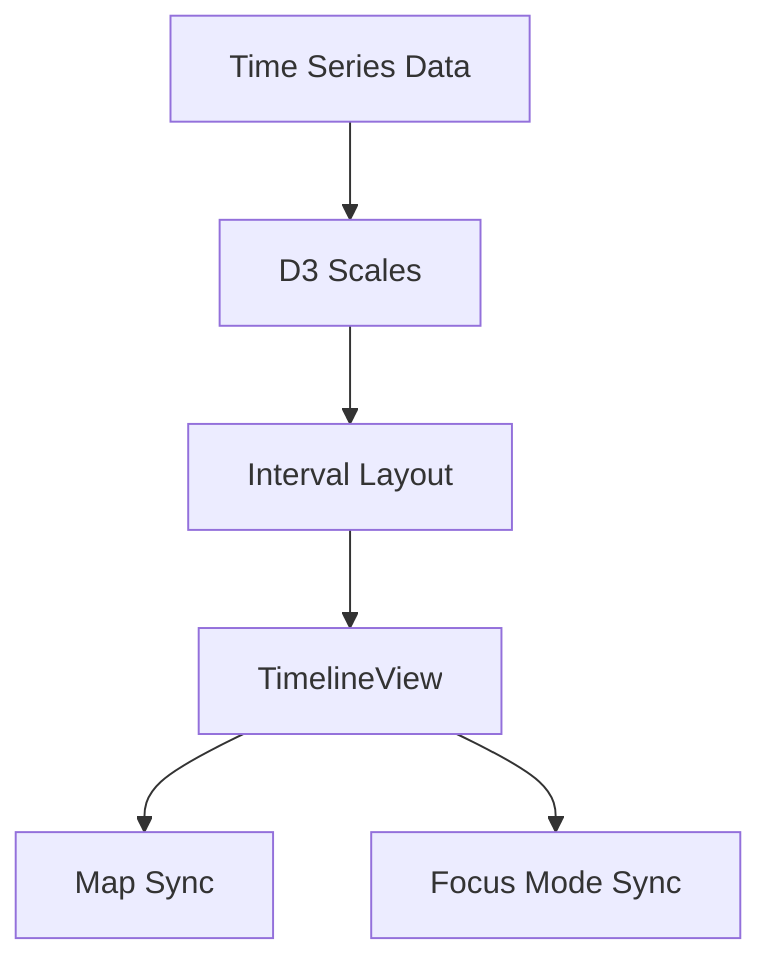
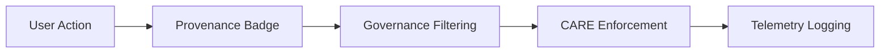
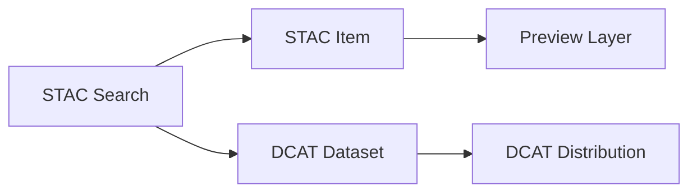

<div align="center">

# 🌐 **Kansas Frontier Matrix — Web Application & Focus Mode Platform**  
`web/README.md`

**Purpose:**  
Define the full architecture, design system, rendering models, accessibility workflows, Focus Mode v2.5 UI intelligence, STAC/DCAT data explorers, 3D geospatial rendering pipeline, provenance indicators, governance overlays, and telemetry instrumentation for the KFM v10.3.2 web platform.

[](../docs/README.md)
[](../docs/standards/faircare.md)
[](../LICENSE)
[]()
[]()

</div>

---

# 📘 Overview

The **KFM Web Platform** is a **spatial-temporal intelligence interface** that merges:

- **MapLibre GL** for 2D cartography  
- **CesiumJS** for 3D terrain and deep-time visualization  
- **Focus Mode v2.5** for narrative reasoning  
- **STAC/DCAT explorers** for dataset management  
- **Neo4j-driven dynamic queries**  
- **Timeline engine** (D3/Recharts)  
- **A11y-compliant React UI**  
- **Governance overlays** (CARE, FAIR+CARE, SLSA, SBOM)  
- **Telemetry instrumentation** (OpenTelemetry)  

It is the public-facing interface of the Kansas Frontier Matrix.

---

# 🌇 Deep Architecture Overview



---

# 🧱 Directory Layout (v10.3.2)

```
web/
├── README.md
├── ARCHITECTURE.md
│
├── public/
│   ├── images/
│   ├── icons/
│   ├── manifest.json
│   ├── robots.txt
│   └── favicon.ico
│
├── src/
│   ├── components/
│   │   ├── MapView/
│   │   ├── CesiumView/
│   │   ├── TimelineView/
│   │   ├── FocusPanel/
│   │   ├── StoryNode/
│   │   ├── Governance/
│   │   ├── StacExplorer/
│   │   ├── DcatExplorer/
│   │   ├── LayerSwitcher/
│   │   └── Shared/
│   │
│   ├── pages/
│   │   ├── Home/
│   │   ├── Explore/
│   │   ├── Governance/
│   │   ├── StoryNodes/
│   │   └── About/
│   │
│   ├── hooks/              # e.g. useFocus, useTelemetry, useStac, useA11y
│   ├── context/            # theme, auth, focus, layout, a11y provider
│   ├── services/           # STAC/DCAT fetchers, GraphQL clients, REST adapters
│   ├── utils/              # formatters, data guards, provenance tag inserters
│   └── styles/             # Tailwind tokens, theming, CSS variables
│
├── package.json
└── vite.config.ts
```

---

# 🧠 Focus Mode v2.5 — Deep UI Architecture

**Focus Mode v2.5** is the central intelligence layer of the KFM web UI.

### Capabilities
- Narrative reasoning  
- Spatial-temporal contextualization  
- Ontology-aware linking  
- SHAP-based interpretability overlays  
- CARE filtering + redaction  
- Story Node generation  
- Cross-layer correlation (raster ↔ vector ↔ text ↔ timeline)  
- Provenance indicator badges  
- “Why this?” explainability  

### Focus Mode Data Flow



---

# 🌍 Mapping Architecture — MapLibre GL Pipeline



### Rendering Guarantees  
- Tile downsampling in WebGL  
- GPU-accelerated vector rendering  
- H3-based masking for heritage sites  
- CORS-safe raster/WebP layers  
- Color-blind-safe palettes  

---

# 🌎 3D Architecture — CesiumJS Pipeline



### 3D Features  
- Paleogeography reconstruction  
- Predictive climate & hydrology layers (2030–2100)  
- Time slider binding to 3D camera path  
- Story Node extrusions  

---

# 📊 Timeline Architecture (D3 / Recharts)



Features:

- Epoch markers  
- Multi-range brushing  
- Ghost layers for forecast vs historical  
- Accessibility (keyboard, large font, high contrast)  

---

# 🔧 API Client Layer (REST + GraphQL + JSON-LD)

### Responsibilities
- Unified fetch abstraction  
- Strongly typed DTOs  
- Automatic JSON-LD context injection  
- STAC/DCAT query builder  
- Provenance header injection  
- Automatic retries w/ exponential backoff  
- Rate-limited progressive hydration  

### Primary API Routes  
- `/api/focus/{id}`  
- `/api/events`  
- `/api/stac/search`  
- `/api/graphql`  
- `/api/datasets/provenance`  

---

# ♿ Accessibility Architecture (WCAG 2.1 AA+)

### Required Features  
- Keyboard nav (all major features)  
- Reduced motion setting  
- High-contrast theme tokens  
- Accessible color ramps for maps  
- Screen reader narrative optimization  
- Focus lock for modal dialogs  
- Proper ARIA roles (map, dialog, navigation, main, complementary)  

### A11y Tokens  
Documented in:

```
docs/design/tokens/a11y-tokens.md
```

### A11y CI Enforcement  
- Axe-core thresholds (≥ 95%)  
- Lighthouse performance & a11y gates  

---

# 🧱 Governance & Ethical Layer

### UI Indicators  
- CARE labels (public, sensitive, restricted)  
- Data provenance badges  
- STAC/DCAT citations  
- Ethics flags in Focus Mode  
- Masking indicators for H3-generalized sites  

### Governance Flows



---

# 📦 STAC/DCAT Explorer (Deep Integration)

### STAC Features  
- COG previews  
- Temporal slicers  
- Raster stats sidebar  
- STAC version navigation  
- Derived Asset lineage nodes  

### DCAT Features  
- Dataset → Distribution mapping  
- Keyword, theme, coverage filters  
- JSON-LD export  



---

# 📈 Telemetry & Observability

### Captured Client Metrics  
- Frame rate  
- Map interactions  
- Layer toggles  
- AI narrative calls  
- Cesium frame budget  
- A11y usage patterns  
- Error boundary captures  

### CI Telemetry Policies  
Logged to:

```
releases/<version>/focus-telemetry.json
```

---

# 🛡️ Security & Privacy Architecture

### Features  
- RBAC with JWT  
- Rate limiting on Focus endpoints  
- GraphQL query depth limits  
- Content-security isolation for map tiles  
- H3 masking for sensitive assets  
- Local-only cache for provenance-sensitive data  

---

# 🚀 Development & Build

### Dev Server

```bash
npm --prefix web install
npm --prefix web run dev
```

### Type Checking

```bash
npm --prefix web run typecheck
```

### Production Build

```bash
npm --prefix web run build
```

Output hosted from:

```
web/dist/
```

---

# 🧮 Version History

| Version | Date | Notes |
|---------|--------|------|
| **v10.3.2** | 2025-11-14 | Ultra-deep rebuild; added multi-level architecture diagrams; upgraded to Focus Mode v2.5; added A11y tokens, STAC/DCAT explorer, provenance flow, telemetry architecture. |
| **v10.3.1** | 2025-11-13 | Standard upgrade; basic architecture and A11y sections. |
| **v10.2.2** | 2025-11-12 | Predictive overlays, governance dashboards. |
| **v10.0.0** | 2025-11-09 | Initial v10 web subsystem foundation. |

---

<div align="center">

**Kansas Frontier Matrix — Web Platform**  
Temporal Insight × Ethical AI × Spatial Storytelling  
© 2025 KFM — MIT License  
[System Architecture](../src/ARCHITECTURE.md) · [Governance](../docs/standards/governance/ROOT-GOVERNANCE.md)

</div>
