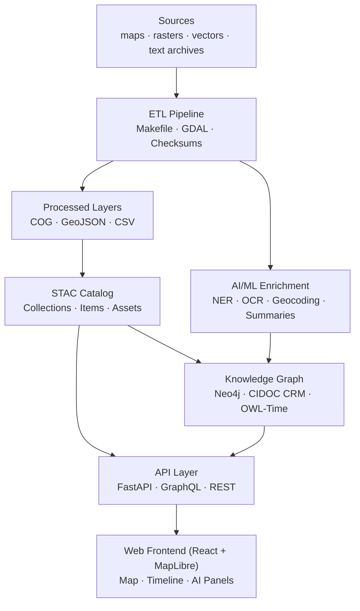

# 🧩 Kansas Frontier Matrix — **Web Frontend**

### *“Time · Terrain · History · Knowledge Graphs”*

[](../../.github/workflows/site.yml)  
[](https://bartytime4life.github.io/Kansas-Frontier-Matrix/)  
[](../../.github/workflows/stac-validate.yml)  
[](../../.github/workflows/codeql.yml)  
[](../../.github/workflows/trivy.yml)  
[](https://pre-commit.com/)  
[](../../docs/)  
[%20%7C%20CC--BY%204.0%20(docs)-blue)](../../LICENSE)

---

```yaml
---
title: "Kansas Frontier Matrix — Web Frontend"
version: "v1.7.0"
last_updated: "2025-10-14"
authors: ["KFM Web Team"]
status: "Stable"
maturity: "Production"
tags: ["web","react","vite","typescript","maplibre","timeline","stac","mcp"]
license: "MIT (code) | CC-BY 4.0 (docs)"
semantic_alignment:
  - CIDOC CRM
  - OWL-Time
  - DCAT 2.0
  - STAC 1.0
---
````

---

## 📚 Table of Contents

* [Overview](#🧭-overview)
* [Architecture at a Glance](#🏗️-architecture-at-a-glance)
* [Directory Layout](#🗂️-directory-layout)
* [Technology Stack](#⚙️-technology-stack)
* [Core Features](#🧩-core-features)
* [Quickstart](#⚡-quickstart)
* [Environment & Config](#🔧-environment--config)
* [API Integration](#🔌-api-integration)
* [Testing & CI/CD](#🧪-testing--cicd)
* [Accessibility & UX](#♿-accessibility--ux)
* [Styling & Theming](#🎨-styling--theming)
* [Versioning & Governance](#🧭-versioning--governance)
* [Change Log](#🧾-change-log)
* [References](#📚-references)

---

## 🧭 Overview

The **Web Frontend** is the interactive exploration layer of KFM — a **React + MapLibre GL** single-page application binding **time · space · story**.
It visualizes treaties, trails, hydrology, climate, and archival narratives synchronized with the **FastAPI / Neo4j** semantic backend aligned to **CIDOC CRM** and **OWL-Time**.

---

## 🏗️ Architecture at a Glance



---

## 🗂️ Directory Layout

```text
web/
├─ src/
│  ├─ components/      # Map · Timeline · LayerControls · DetailPanel · SearchBar · AIAssistant
│  ├─ hooks/           # useMap · useTimeline · useStac · useSearch
│  ├─ context/         # global state (timeline window, selection, layer toggles)
│  ├─ utils/           # API client · formatters · geometry helpers
│  ├─ styles/          # Tailwind / SCSS tokens, z-layers
│  └─ types/           # TypeScript interfaces (API/graph/config)
├─ public/             # static assets (icons, manifest)
├─ config/             # generated (layers.json, app.config.json)
├─ package.json        # Node project
├─ vite.config.ts      # build configuration
└─ README.md           # this file
```

---

## ⚙️ Technology Stack

| Layer    | Technology                    | Purpose                     |
| :------- | :---------------------------- | :-------------------------- |
| Core     | React 18 + TypeScript         | Modular SPA architecture    |
| Mapping  | MapLibre GL JS                | Vector/raster rendering     |
| Timeline | HTML5 Canvas (+ D3 utilities) | Smooth, scalable chronology |
| API      | Fetch / Axios / GraphQL       | Connects FastAPI ↔ Neo4j    |
| Tooling  | Vite · ESLint · Prettier      | Fast builds · lint · format |
| Testing  | Jest · React Testing Library  | Unit + integration coverage |
| UI       | Tailwind / shadcn-ui          | Accessible design system    |
| A11y     | WAI-ARIA · WCAG 2.1 AA        | Keyboard-first UX           |

---

## 🧩 Core Features

### 🗺️ Map + Layers

* Temporal MapLibre viewer with STAC overlays
* COG rasters + GeoJSON vectors (trails · treaties · hydrology)
* Layer visibility auto-filters by timeline range

### 🕰️ Timeline

* Canvas-based zoom/pan/playback (requestAnimationFrame)
* OWL-Time + PeriodO era labels
* Click timeline → map focus; click map → timeline highlight

### 🔎 Knowledge Graph Search

* Query People · Places · Events
* Results center the map and open dossiers
* Graph-aware facets (role · era · region)

### 🤖 AI Summaries

* spaCy NER + Transformer summaries for site dossiers
* Confidence and provenance displayed per MCP-DL

### 🛠️ Admin Console

* Role-based curation · entity validation · source linking
* Full audit trail ensures chain-of-evidence

---

## ⚡ Quickstart

```bash
npm install
npm run dev
npm run build
npm run lint && npm test
```

---

## 🔧 Environment & Config

```bash
VITE_API_URL="http://localhost:8000/api"
VITE_MAP_STYLE="/assets/styles/kfm-style.json"
```

---

## 🔌 API Integration

```ts
const API = import.meta.env.VITE_API_URL || "http://localhost:8000/api";

export async function fetchEvents(start: string, end: string) {
  const r = await fetch(`${API}/events?start=${start}&end=${end}`);
  return r.json();
}
```

---

## 🧪 Testing & CI/CD

* Jest + RTL unit/integration tests
* CI: lint · test · build · STAC validation · deploy
* Security: CodeQL + Trivy
* Pre-commit hooks: Markdown · Mermaid · YAML lint

---

## ♿ Accessibility & UX

* Full keyboard navigation + ARIA landmarks
* High-contrast map themes · reduced-motion support
* Focus rings, skip-links, and a11y labels on all interactive controls

---

## 🎨 Styling & Theming

* Tailwind tokens for spacing, type, z-layers
* Sepia/terrain basemaps for historic modes
* Dark/light themes with accessible contrast

---

## 🧭 Versioning & Governance

| Domain     | Mechanism                 | Notes                             |
| :--------- | :------------------------ | :-------------------------------- |
| Code       | SemVer                    | vMAJOR.MINOR.PATCH                |
| Docs       | `docs/CHANGELOG.md`       | MCP-DL v6.2                       |
| Data       | STAC `properties.version` | Per layer                         |
| Releases   | Git tag + DOI             | Citable                           |
| Governance | `GOVERNANCE.md`           | Roles · review flow · merge rules |

---

## 🧾 Change Log

| Version | Date       | Author   | Summary                                                                      |
| :------ | :--------- | :------- | :--------------------------------------------------------------------------- |
| v1.7.0  | 2025-10-14 | Web Team | Cleaned section hierarchy; added a11y and theming details; refined API usage |
| v1.6.0  | 2025-10-14 | Web Team | Aligned README to MCP-DL v6.2                                                |
| v1.5.0  | 2025-10-10 | Web Team | Timeline zoom · map legend                                                   |
| v1.4.0  | 2025-09-15 | Web Team | STAC autoload · layer registry                                               |
| v1.3.0  | 2025-08-20 | Web Team | AI dossiers · curator review                                                 |
| v1.2.0  | 2025-07-05 | Web Team | Stable map/timeline sync                                                     |
| v1.0.0  | 2025-06-01 | Init     | Initial release                                                              |

---

## 📚 References

* System Architecture (`../../docs/architecture.md`)
* Web UI Design (`../../docs/`)
* File & Data Architecture / STAC (`../../docs/`)
* AI/ML Developer Docs (`../../docs/`)
* Master Coder Protocol (`../../docs/`)

---

**Made with ❤️ for Kansas — bridging history, climate and technology.**
*Automation with Integrity · Every Workflow Proven · Versioned for Future Scholars.*

```
```
