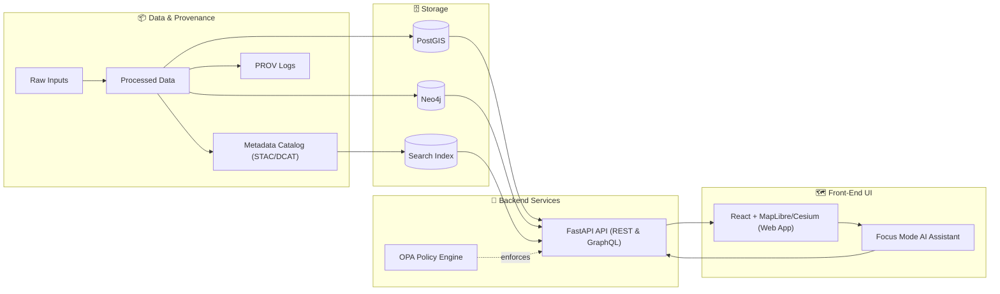

# 🌾 Kansas Frontier Matrix (KFM) — Web Frontend (`web/`) 🗺️


> [!IMPORTANT]
> `web/` is **KFM’s user-facing interface**: a **React + TypeScript** client for map-based exploration that **only talks to the backend API** (REST/GraphQL) and **never touches databases directly**.  
> This boundary is a core trust rule in KFM’s pipeline → catalog → database → API → UI design.  [oai_citation:0‡Kansas Frontier Matrix (KFM) – Comprehensive Technical Blueprint.pdf](sediment://file_000000006dbc71f89a5094ce310a452d) [oai_citation:1‡Kansas Frontier Matrix (KFM) – Comprehensive Technical Blueprint.pdf](sediment://file_000000006dbc71f89a5094ce310a452d)

---

## ✨ What this UI is (and is not)

### ✅ It *is*
- A map-centric UI for exploring Kansas-focused historical + geospatial knowledge (layers, timelines, stories, comparisons). [oai_citation:2‡Kansas Frontier Matrix (KFM) – Comprehensive Technical Blueprint.pdf](sediment://file_000000006dbc71f89a5094ce310a452d)
- A client that **renders** what the backend returns (datasets, tiles, GeoJSON, story content, citations). [oai_citation:3‡Kansas Frontier Matrix (KFM) – Comprehensive Technical Blueprint.pdf](sediment://file_000000006dbc71f89a5094ce310a452d)
- The canonical home of the UI code (JS/TS, React components, map configuration, etc.). [oai_citation:4‡MARKDOWN_GUIDE_v13.md.gdoc](file-service://file-UYVruFXfueR8veHMUKeugU) [oai_citation:5‡MARKDOWN_GUIDE_v13.md.gdoc](file-service://file-UYVruFXfueR8veHMUKeugU)

### ❌ It is *not*
- A place to stash “secret data files” or do “just this one DB query from the client.”  
  **No hidden data files. No direct database access.** Everything goes through the API.  [oai_citation:6‡MARKDOWN_GUIDE_v13.md.gdoc](file-service://file-UYVruFXfueR8veHMUKeugU) [oai_citation:7‡Kansas Frontier Matrix (KFM) – Comprehensive Technical Blueprint.pdf](sediment://file_000000006dbc71f89a5094ce310a452d)
- A bypass around governance/policy rules (including redaction and restricted access). [oai_citation:8‡MARKDOWN_GUIDE_v13.md.gdoc](file-service://file-UYVruFXfueR8veHMUKeugU)

---

## 🧱 Architecture at a glance (UI sits on top of the API)



 [oai_citation:9‡Kansas Frontier Matrix (KFM) – Comprehensive Technical Blueprint.pdf](sediment://file_000000006dbc71f89a5094ce310a452d)

---

## 🧰 Tech stack & key capabilities

### Core stack
- **React single-page application (SPA)** + **TypeScript**. [oai_citation:10‡Kansas Frontier Matrix (KFM) – Comprehensive Technical Blueprint.pdf](sediment://file_000000006dbc71f89a5094ce310a452d) [oai_citation:11‡Kansas Frontier Matrix (KFM) – Comprehensive Technical Blueprint.pdf](sediment://file_000000006dbc71f89a5094ce310a452d)
- **MapLibre GL JS** for interactive **2D** mapping. [oai_citation:12‡Kansas Frontier Matrix (KFM) – Comprehensive Technical Blueprint.pdf](sediment://file_000000006dbc71f89a5094ce310a452d) [oai_citation:13‡Kansas Frontier Matrix (KFM) – Comprehensive Technical Blueprint.pdf](sediment://file_000000006dbc71f89a5094ce310a452d)
- **CesiumJS** for **3D** globe/terrain visualizations (often as a toggle between 2D ↔ 3D). [oai_citation:14‡Kansas Frontier Matrix (KFM) – Comprehensive Technical Blueprint.pdf](sediment://file_000000006dbc71f89a5094ce310a452d) [oai_citation:15‡Kansas Frontier Matrix (KFM) – Comprehensive Technical Blueprint.pdf](sediment://file_000000006dbc71f89a5094ce310a452d)
- **Global state store** (Redux or Context) so map, timeline, story panel, and UI tools stay synchronized. [oai_citation:16‡Kansas Frontier Matrix (KFM) – Comprehensive Technical Blueprint.pdf](sediment://file_000000006dbc71f89a5094ce310a452d) [oai_citation:17‡Kansas Frontier Matrix (KFM) – Comprehensive Technical Blueprint.pdf](sediment://file_000000006dbc71f89a5094ce310a452d)

### First-class UI concepts
- **Timeline sliders + animations** for time-oriented exploration. [oai_citation:18‡Kansas Frontier Matrix (KFM) – Comprehensive Technical Blueprint.pdf](sediment://file_000000006dbc71f89a5094ce310a452d)
- **Story Nodes**: narrative content linked to map states (and evolving toward scrollytelling). [oai_citation:19‡Kansas Frontier Matrix (KFM) – Comprehensive Technical Blueprint.pdf](sediment://file_000000006dbc71f89a5094ce310a452d) [oai_citation:20‡Kansas Frontier Matrix (KFM) – Comprehensive Technical Blueprint.pdf](sediment://file_000000006dbc71f89a5094ce310a452d)
- **Layer toggles + registry** (turning data layers on/off; legends; symbology). [oai_citation:21‡Kansas Frontier Matrix (KFM) – Comprehensive Technical Blueprint.pdf](sediment://file_000000006dbc71f89a5094ce310a452d) [oai_citation:22‡Kansas Frontier Matrix (KFM) – Comprehensive Technical Blueprint.pdf](sediment://file_000000006dbc71f89a5094ce310a452d)
- **Focus Mode (AI assistant)**: asks the backend for grounded answers and displays citations.  [oai_citation:23‡Kansas Frontier Matrix (KFM) – Comprehensive Technical Blueprint.pdf](sediment://file_000000006dbc71f89a5094ce310a452d)

---

## 🚀 Quickstart (recommended): run the full stack via Docker Compose

> [!NOTE]
> The blueprint’s dev workflow assumes a compose stack with `api` + databases + `web` for hot reload.  [oai_citation:24‡Kansas Frontier Matrix (KFM) – Comprehensive Technical Blueprint.pdf](sediment://file_000000006dbc71f89a5094ce310a452d) [oai_citation:25‡Kansas Frontier Matrix (KFM) – Comprehensive Technical Blueprint.pdf](sediment://file_000000006dbc71f89a5094ce310a452d)

### 1) Start everything (from repo root)
```bash
docker-compose up --build
```
This builds images (API + web) and starts services including:
- `api` (FastAPI on **8000**)
- `web` (React dev server on **3000**)
- PostGIS + Neo4j (and optionally policy/search tooling) [oai_citation:26‡Kansas Frontier Matrix (KFM) – Comprehensive Technical Blueprint.pdf](sediment://file_000000006dbc71f89a5094ce310a452d)

### 2) Open the UI + API docs
- Web UI: `http://localhost:3000` [oai_citation:27‡Kansas Frontier Matrix (KFM) – Comprehensive Technical Blueprint.pdf](sediment://file_000000006dbc71f89a5094ce310a452d)
- API docs (Swagger): `http://localhost:8000/docs` [oai_citation:28‡Kansas Frontier Matrix (KFM) – Comprehensive Technical Blueprint.pdf](sediment://file_000000006dbc71f89a5094ce310a452d)

### 3) Hot reload expectations
- Editing `web/src/*` should trigger React hot reload. [oai_citation:29‡Kansas Frontier Matrix (KFM) – Comprehensive Technical Blueprint.pdf](sediment://file_000000006dbc71f89a5094ce310a452d)
- If you change environment variables, restart containers (common: `down` then `up`). [oai_citation:30‡Kansas Frontier Matrix (KFM) – Comprehensive Technical Blueprint.pdf](sediment://file_000000006dbc71f89a5094ce310a452d) [oai_citation:31‡Kansas Frontier Matrix (KFM) – Comprehensive Technical Blueprint.pdf](sediment://file_000000006dbc71f89a5094ce310a452d)

---

## 🔧 Configuration (environment variables)

KFM’s `.env` commonly includes:
- Ports (`FASTAPI_PORT=8000`, `WEB_PORT=3000`)
- Web → API target (example: `REACT_APP_API_URL=...`)
- AI settings (example: `OLLAMA_MODEL=...` or `OPENAI_API_KEY=...`) [oai_citation:32‡Kansas Frontier Matrix (KFM) – Comprehensive Technical Blueprint.pdf](sediment://file_000000006dbc71f89a5094ce310a452d)

> [!TIP]
> In Docker, the UI may talk to the API by service name (example: `http://api:8000`) while local dev may use `http://localhost:8000`. The project’s `.env` / compose wiring is the source of truth.  [oai_citation:33‡Kansas Frontier Matrix (KFM) – Comprehensive Technical Blueprint.pdf](sediment://file_000000006dbc71f89a5094ce310a452d)

---

## 🗂️ Folder guide (typical)

> [!NOTE]
> The blueprint describes a conventional `web/src/` organization (components, state, services/utilities, styles/assets, mapping).  [oai_citation:34‡Kansas Frontier Matrix (KFM) – Comprehensive Technical Blueprint.pdf](sediment://file_000000006dbc71f89a5094ce310a452d) [oai_citation:35‡Kansas Frontier Matrix (KFM) – Comprehensive Technical Blueprint.pdf](sediment://file_000000006dbc71f89a5094ce310a452d)

```text
web/
├─ public/                  🧷 Static assets (icons, manifest, etc.)
└─ src/
   ├─ components/           🧩 Reusable UI blocks (MapViewer, TimelineSlider, StoryPanel…)
   ├─ state/                🧠 Global store (Redux/Context) for map/timeline/layers/session
   ├─ services/             🔌 API client wrappers (REST/GraphQL), helpers, caching
   ├─ styles/               🎨 CSS/Sass/theme tokens
   ├─ pages/ (optional)     🧭 Route-level screens (if React Router is used)
   └─ App.tsx               🏁 App shell / routing (if present)
```

Examples of components called out in the blueprint:
- `MapViewer` (MapLibre + 2D/3D switching)
- `TimelineSlider`
- `StoryPanel` (story + scroll linking)
- `SearchBar`
- `LayerControl` [oai_citation:36‡Kansas Frontier Matrix (KFM) – Comprehensive Technical Blueprint.pdf](sediment://file_000000006dbc71f89a5094ce310a452d)

---

## 🗺️ Working with maps (2D/3D)

### 2D: MapLibre GL JS
MapLibre typically:
- Initializes a map with a basemap style
- Adds layers as **vector tiles / raster tiles** for large datasets, or **GeoJSON overlays** for smaller ones
- Styles layers and drives legends/layer toggles [oai_citation:37‡Kansas Frontier Matrix (KFM) – Comprehensive Technical Blueprint.pdf](sediment://file_000000006dbc71f89a5094ce310a452d)

> [!IMPORTANT]
> Don’t ship data inside the frontend. Request it from the backend (tiles, GeoJSON, metadata), and render what you receive.  
> Example in the blueprint: toggling “Historic Trails” could request a vector tile endpoint.  [oai_citation:38‡Kansas Frontier Matrix (KFM) – Comprehensive Technical Blueprint.pdf](sediment://file_000000006dbc71f89a5094ce310a452d)

### 3D: CesiumJS
Cesium is used for:
- 3D globe/terrain viewing
- 3D stories / flyovers / tours (when enabled) [oai_citation:39‡Kansas Frontier Matrix (KFM) – Comprehensive Technical Blueprint.pdf](sediment://file_000000006dbc71f89a5094ce310a452d) [oai_citation:40‡Kansas Frontier Matrix (KFM) – Comprehensive Technical Blueprint.pdf](sediment://file_000000006dbc71f89a5094ce310a452d)

---

## 📖 Story Nodes & scrollytelling

KFM links narrative content with map states:
- The Story Node viewer is a custom component that ties text progression to map updates (“scrollytelling”). [oai_citation:41‡Kansas Frontier Matrix (KFM) – Comprehensive Technical Blueprint.pdf](sediment://file_000000006dbc71f89a5094ce310a452d)

Future-facing implementation detail (already planned in the blueprint):
- Use the **Intersection Observer API** to trigger map/timeline changes as narrative sections enter the viewport. [oai_citation:42‡Kansas Frontier Matrix (KFM) – Comprehensive Technical Blueprint.pdf](sediment://file_000000006dbc71f89a5094ce310a452d)

---

## 🧠 Focus Mode (AI assistant) — UI responsibilities

Focus Mode is designed to be:
- Knowledge-grounded, policy-governed, and citation-forward
- Driven by the backend (the UI sends the question; the backend assembles context, calls the model, attaches citations, and enforces policy) [oai_citation:43‡Kansas Frontier Matrix (KFM) – Comprehensive Technical Blueprint.pdf](sediment://file_000000006dbc71f89a5094ce310a452d)

### UI checklist for Focus Mode
- Provide an input surface for user questions
- POST questions to the backend (example endpoint in blueprint: `POST /ai/query`) [oai_citation:44‡Kansas Frontier Matrix (KFM) – Comprehensive Technical Blueprint.pdf](sediment://file_000000006dbc71f89a5094ce310a452d)
- Render responses **with citations** and clickable source affordances (the backend returns the reference structure). [oai_citation:45‡Kansas Frontier Matrix (KFM) – Comprehensive Technical Blueprint.pdf](sediment://file_000000006dbc71f89a5094ce310a452d)

Optional/advanced (planned):
- Support image/map snapshot inputs for multimodal Q&A workflows. [oai_citation:46‡Kansas Frontier Matrix (KFM) – Comprehensive Technical Blueprint.pdf](sediment://file_000000006dbc71f89a5094ce310a452d)

---

## 🛡️ Security, governance, and “no leak” rules

> [!WARNING]
> UI work can accidentally undermine policy if it exposes restricted data “by accident” (deep zoom, unredacted tooltips, caching, etc.).  
> The UI must **cause no data leakage**, respect redaction rules, and maintain accessibility/audit expectations.  [oai_citation:47‡MARKDOWN_GUIDE_v13.md.gdoc](file-service://file-UYVruFXfueR8veHMUKeugU)

Non-negotiables:
- ✅ **All data access goes through the API**
- ✅ **No direct DB or filesystem reads from the client**
- ✅ **No “hidden” packaged datasets in the UI bundle** [oai_citation:48‡MARKDOWN_GUIDE_v13.md.gdoc](file-service://file-UYVruFXfueR8veHMUKeugU) [oai_citation:49‡Kansas Frontier Matrix (KFM) – Comprehensive Technical Blueprint.pdf](sediment://file_000000006dbc71f89a5094ce310a452d)
- ✅ Treat all backend results as policy-filtered outputs; don’t attempt to “reconstruct” redacted fields client-side. [oai_citation:50‡MARKDOWN_GUIDE_v13.md.gdoc](file-service://file-UYVruFXfueR8veHMUKeugU)

---

## ♿ Accessibility & cartographic design

The blueprint explicitly calls for:
- Responsive design (works in workshops + field devices)
- Strong cartographic principles: visual hierarchy, accessible color choices, and clear legends/scales. [oai_citation:51‡Kansas Frontier Matrix (KFM) – Comprehensive Technical Blueprint.pdf](sediment://file_000000006dbc71f89a5094ce310a452d)

> [!TIP]
> When adding a new layer, ship a legend entry + clear symbology defaults (the UI should make interpretation easy, not “guessy”). [oai_citation:52‡Kansas Frontier Matrix (KFM) – Comprehensive Technical Blueprint.pdf](sediment://file_000000006dbc71f89a5094ce310a452d)

---

## 🧪 Testing (project convention)

Testing details can vary by implementation (CRA, Vite, etc.), but the expectation is:
- UI changes are testable
- Contract changes coordinate with backend/API expectations (don’t silently break clients)

> [!NOTE]
> KFM treats contracts seriously: API contracts and UI integrity expectations are part of governance (“breaking any of them triggers review/versioning”).  [oai_citation:53‡MARKDOWN_GUIDE_v13.md.gdoc](file-service://file-UYVruFXfueR8veHMUKeugU) [oai_citation:54‡MARKDOWN_GUIDE_v13.md.gdoc](file-service://file-UYVruFXfueR8veHMUKeugU)

---

## 🧯 Troubleshooting

<details>
<summary><strong>Port conflicts</strong> (Postgres 5432, Neo4j 7474/7687, API 8000, Web 3000)</summary>

If something is already running on those ports, stop it or adjust the compose port mappings / `.env`. [oai_citation:55‡Kansas Frontier Matrix (KFM) – Comprehensive Technical Blueprint.pdf](sediment://file_000000006dbc71f89a5094ce310a452d) [oai_citation:56‡Kansas Frontier Matrix (KFM) – Comprehensive Technical Blueprint.pdf](sediment://file_000000006dbc71f89a5094ce310a452d)

</details>

<details>
<summary><strong>Web container not hot reloading</strong></summary>

Common cause: volume mount issues (especially on Windows/macOS). Confirm `web/src` is mounted in `docker-compose.yml`. [oai_citation:57‡Kansas Frontier Matrix (KFM) – Comprehensive Technical Blueprint.pdf](sediment://file_000000006dbc71f89a5094ce310a452d)

</details>

<details>
<summary><strong>Rebuild after dependency changes</strong></summary>

If you changed packages, rebuild the images:
```bash
docker-compose up --build
# or
docker-compose build
```
 [oai_citation:58‡Kansas Frontier Matrix (KFM) – Comprehensive Technical Blueprint.pdf](sediment://file_000000006dbc71f89a5094ce310a452d) [oai_citation:59‡Kansas Frontier Matrix (KFM) – Comprehensive Technical Blueprint.pdf](sediment://file_000000006dbc71f89a5094ce310a452d)

</details>

---

## 🤝 Contributing to the UI (the “KFM way”)

When adding features, keep the contract boundaries crisp:

1) **Add/modify UI components** in `web/src/components/` (map, story, search, layers). [oai_citation:60‡Kansas Frontier Matrix (KFM) – Comprehensive Technical Blueprint.pdf](sediment://file_000000006dbc71f89a5094ce310a452d)

2) **Route all data access through API client utilities** (a `services/api.ts` wrapper is typical). [oai_citation:61‡Kansas Frontier Matrix (KFM) – Comprehensive Technical Blueprint.pdf](sediment://file_000000006dbc71f89a5094ce310a452d)

3) **Update global state** if the feature impacts map viewport, time selection, layers, story focus, or user session info. [oai_citation:62‡Kansas Frontier Matrix (KFM) – Comprehensive Technical Blueprint.pdf](sediment://file_000000006dbc71f89a5094ce310a452d) [oai_citation:63‡Kansas Frontier Matrix (KFM) – Comprehensive Technical Blueprint.pdf](sediment://file_000000006dbc71f89a5094ce310a452d)

4) **Never weaken governance** (redaction, restricted layers, “zoom bypass” patterns). [oai_citation:64‡MARKDOWN_GUIDE_v13.md.gdoc](file-service://file-UYVruFXfueR8veHMUKeugU)

---

## 📚 Source notes (grounding)

This README is grounded in:
- KFM blueprint sections on system boundaries (API-mediated UI), frontend stack (React/TS + MapLibre/Cesium), Story Nodes, Focus Mode, and compose-based dev workflow. [oai_citation:65‡Kansas Frontier Matrix (KFM) – Comprehensive Technical Blueprint.pdf](sediment://file_000000006dbc71f89a5094ce310a452d) [oai_citation:66‡Kansas Frontier Matrix (KFM) – Comprehensive Technical Blueprint.pdf](sediment://file_000000006dbc71f89a5094ce310a452d)
- KFM Markdown Guide “contracts” describing canonical subsystem homes (`web/`) and UI no-leak rules / redaction expectations. [oai_citation:67‡MARKDOWN_GUIDE_v13.md.gdoc](file-service://file-UYVruFXfueR8veHMUKeugU) [oai_citation:68‡MARKDOWN_GUIDE_v13.md.gdoc](file-service://file-UYVruFXfueR8veHMUKeugU)