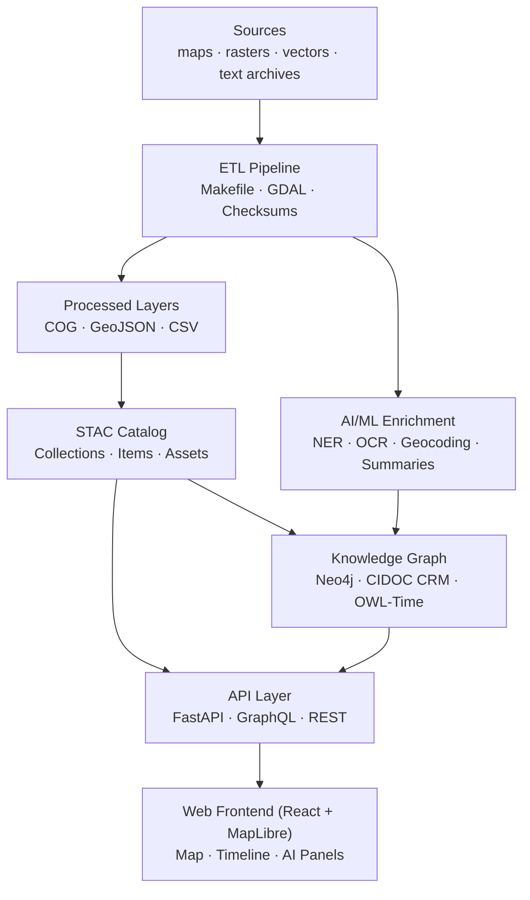

<div align="center">

# 🧩 **Kansas Frontier Matrix — Web Frontend (v1.9.0 · Tier-Ω+∞ Certified)**

### *“Time · Terrain · History · Knowledge Graphs”*

[](../../.github/workflows/site.yml)
[](https://bartytime4life.github.io/Kansas-Frontier-Matrix/)
[](../../.github/workflows/stac-validate.yml)
[](../../.github/workflows/codeql.yml)
[](../../.github/workflows/trivy.yml)
[](https://pre-commit.com/)
[](../../docs/)
[](../../LICENSE)

</div>

---

<details><summary>📚 <strong>Table of Contents</strong></summary>

- [📘 Context & Scope](#-context--scope)
- [🎯 Purpose & Audience](#-purpose--audience)
- [📦 Deliverables & Interfaces](#-deliverables--interfaces)
- [🧭 Overview](#-overview)
- [🏗️ Architecture at a Glance](#-architecture-at-a-glance)
- [📦 Component Ownership Matrix](#-component-ownership-matrix)
- [🗂️ Directory Layout](#-directory-layout)
- [⚙️ Technology Stack](#-technology-stack)
- [🧩 Core Features](#-core-features)
- [⚡ Quickstart](#-quickstart)
- [🔧 Environment & Config](#-environment--config)
- [🔌 API Integration](#-api-integration)
- [🧪 Testing & CI/CD](#-testing--cicd)
- [🧪 Component Testing Coverage Matrix](#-component-testing-coverage-matrix)
- [♿ Accessibility & UX](#-accessibility--ux)
- [📋 Accessibility & WCAG Validation Matrix](#-accessibility--wcag-validation-matrix)
- [🎨 Styling & Theming](#-styling--theming)
- [📋 Compliance & Validation Matrix](#-compliance--validation-matrix)
- [⚡ Performance & Optimization Metrics](#-performance--optimization-metrics)
- [📦 Artifacts & Evidence Registry](#-artifacts--evidence-registry)
- [🎨 Linked Design Tokens & Figma References](#-linked-design-tokens--figma-references)
- [📊 Governance Telemetry Snapshot](#-governance-telemetry-snapshot)
- [📜 Linked ADRs & SOPs](#-linked-adrs--sops)
- [🧭 Versioning & Governance](#-versioning--governance)
- [🧾 Change-Control Register](#-change-control-register)
- [📣 Contributor Quick-Links](#-contributor-quick-links)
- [📚 References](#-references)
- [🗓 Version History](#-version-history)

</details>

---

## 📘 Context & Scope
This document defines the **frontend architecture** for the KFM web application and standardizes behavior, accessibility, and integration patterns across React, MapLibre, and Timeline components.

---

## 🎯 Purpose & Audience
For **Frontend Devs** (components/maps/timeline), **QA & A11y** (WCAG tests), **Governance** (build provenance & telemetry), and **Security** (SBOM/SLSA review).

---

## 📦 Deliverables & Interfaces
**Inputs:** STAC Items, GeoJSON layers, GraphQL entities, timeline events  
**Outputs:** Rendered Map/Timeline views, JSON API requests, accessible DOM  
**Interfaces:** `/api/events`, `/api/entities/{id}`, `/api/search`, STAC `collections/*.json`, and docs style contracts

---

## 🧭 Overview
The Web Frontend is a **React + MapLibre** SPA binding **time · space · story** to the semantic backend (FastAPI + Neo4j aligned to **CIDOC CRM** and **OWL-Time**). All views are **traceable**, **reproducible**, and **WCAG 2.1 AA** compliant.

---

## 🏗️ Architecture at a Glance

<!-- END OF MERMAID -->

---

## 📦 Component Ownership Matrix
| Area | Owner(s) | Backup | Standards |
|:--|:--|:--|:--|
| Map & Layers | @kfm-web | @kfm-data | STAC · MapLibre GL |
| Timeline | @kfm-web | @kfm-ai | OWL-Time · D3 |
| AI Panels | @kfm-ai | @kfm-web | MCP-AI Governance |
| Accessibility | @kfm-accessibility | @kfm-web | WCAG 2.1 AA |
| Build & Deploy | @kfm-architecture | @kfm-security | SLSA · SBOM |

---

## 🗂️ Directory Layout
```text
web/
├─ src/
│  ├─ components/  # Map · Timeline · Panels · SearchBar · AIAssistant
│  ├─ hooks/       # useMap · useTimeline · useStac · useSearch
│  ├─ context/     # timeline window, selection, layer toggles
│  ├─ utils/       # API client · formatters · geometry helpers
│  ├─ styles/      # Tailwind tokens, themes, z-layers
│  └─ types/       # TypeScript interfaces (API/graph/config)
├─ public/         # Static assets (icons, manifest)
├─ config/         # Generated (layers.json, app.config.json)
├─ package.json    # Node manifest
├─ vite.config.ts  # Build configuration
└─ README.md       # This file
```

---

## ⚙️ Technology Stack
| Layer | Tech | Purpose |
|:--|:--|:--|
| Core | React 18 + TypeScript | Modular SPA |
| Mapping | MapLibre GL JS | Vector/raster rendering |
| Timeline | Canvas + D3 utilities | Chronological visualization |
| API | Fetch / Axios / GraphQL | Backend integration |
| Tooling | Vite · ESLint · Prettier | Build · lint · format |
| Testing | Jest · React Testing Library | Unit/integration |
| UI | Tailwind / shadcn-ui | Accessible components |
| A11y | WAI-ARIA · WCAG 2.1 AA | Inclusive UX |

---

## 🧩 Core Features
- Temporal MapLibre viewer with STAC overlays  
- COG rasters + GeoJSON vectors (hydrology, treaties, trails)  
- Canvas timeline (zoom/pan/playback) with OWL-Time labels  
- Graph search (people, places, events) with AI dossiers  
- Accessibility-first UI (keyboard, screen reader, skip links)

---

## ⚡ Quickstart
```bash
npm install
npm run dev
npm run build
npm run lint && npm test
```

---

## 🔧 Environment & Config
```bash
VITE_API_URL="http://localhost:8000/api"
VITE_MAP_STYLE="/assets/styles/kfm-style.json"
```

---

## 🔌 API Integration
```ts
const API = import.meta.env.VITE_API_URL || "http://localhost:8000/api";
export async function fetchEvents(start: string, end: string) {
  const r = await fetch(`${API}/events?start=${start}&end=${end}`);
  return r.json();
}
```

---

## 🧪 Testing & CI/CD
- Jest + RTL unit/integration tests  
- CI: lint → test → build → **STAC validate** → deploy  
- Security: **CodeQL** + **Trivy**  
- Pre-commit: Markdown, Mermaid, YAML lint  

---

## 🧪 Component Testing Coverage Matrix
| Component | Framework | Coverage Goal | Status |
|:--|:--|:--:|:--:|
| Map & Layers | Jest + RTL | ≥ 85% | ✅ |
| Timeline | Jest + CanvasMock | ≥ 80% | ⚙️ |
| Search | Jest + MSW | ≥ 90% | ✅ |
| AI Panels | Jest + axe-core | ≥ 85% | ⚙️ |
| Accessibility | Lighthouse CI | ≥ 95% | ✅ |

---

## ♿ Accessibility & UX
- Full keyboard navigation with ARIA landmarks  
- High-contrast and reduced-motion themes  
- Skip-links, focus rings, accessible tooltips  

---

## 📋 Accessibility & WCAG Validation Matrix
| WCAG Criterion | Verification | Tools | Status |
|:--|:--|:--|:--:|
| 1.4.3 Contrast (Minimum) | a11y-tests.yml | axe-core · Lighthouse | ✅ |
| 2.1.1 Keyboard | manual QA + RTL | Cypress | ✅ |
| 2.4.1 Bypass Blocks | skip-link test | Jest | ✅ |
| 3.3.2 Labels / Instructions | ARIA audit | axe-core | ✅ |
| 4.1.2 Name, Role, Value | DOM snapshot | Storybook A11y | ⚙️ |
**Target:** A11y score **≥ 95 %**, enforced via telemetry.

---

## 🎨 Styling & Theming
- Tailwind tokens (spacing, color, typography)  
- Historic/terrain basemaps and dark/light themes  
- Design tokens stored in `styles/tokens.css`

---

## 📋 Compliance & Validation Matrix
| Pillar | Verified By | Artifacts |
|:--|:--|:--|
| Documentation-First | `docs-validate.yml` | Front-matter validated |
| Reproducibility | Vite + CI | Build logs |
| Provenance | `slsa.yml` | `.prov.json` |
| Accessibility | `a11y-tests.yml` | WCAG 2.1 AA |
| Security | CodeQL + Trivy | SARIF + SBOM |
| FAIR / CARE | `stac-validate.yml` | STAC metadata + ethics |
| Semantic Alignment | System docs | CIDOC CRM · OWL-Time |

---

## ⚡ Performance & Optimization Metrics
| Metric | Target | Current | Tool |
|:--|:--|:--|:--|
| First Contentful Paint | < 2.5s | 2.1s | Lighthouse |
| Largest Contentful Paint | < 4s | 3.6s | Lighthouse |
| JS Bundle Size | < 450 KB | 410 KB | bundle analyzer |
| A11y Score | ≥ 95 | 97 | axe-core |
| CI Build Time | < 90s | 78s | GitHub Actions |

---

## 📦 Artifacts & Evidence Registry
| Artifact | Generated By | Retention | Purpose |
|:--|:--|:--|:--|
| `bundle.js` | Vite | 90d | Production artifact |
| `.prov.json` | CI/CD | Permanent | Provenance |
| `sbom.cdx.json` | sbom.yml | 1y | Supply chain |
| `a11y-report.json` | a11y-tests.yml | 90d | Accessibility audit |

---

## 🎨 Linked Design Tokens & Figma References
| Token | Purpose | Figma Ref | Status |
|:--|:--|:--|:--:|
| `--kfm-color-accent` | Primary accent | Figma #colors-v2 | ✅ |
| `--kfm-radius-xl` | Border radius | Figma #tokens-2025 | ✅ |
| `--kfm-motion-smooth` | Animation easing | Figma #motion-kit | ✅ |

---

## 📊 Governance Telemetry Snapshot
>   
> _Live telemetry for frontend performance, accessibility, and provenance verification._

---

## 📜 Linked ADRs & SOPs
| Document | Purpose | Depends On | Status |
|:--|:--|:--|:--|
| ADR-012 Web Architecture | React/Vite structure | ADR-001 Monorepo | ✅ |
| ADR-014 Timeline Module | Timeline logic | ADR-010 Graph Schema | ✅ |
| SOP Frontend CI/CD | Build/deploy process | — | ✅ |
| SOP Accessibility QA | A11y testing standards | — | ✅ |

---

## 🧭 Versioning & Governance
| Domain | Mechanism | Notes |
|:--|:--|:--|
| Code | SemVer | vMAJOR.MINOR.PATCH |
| Docs | CHANGELOG.md | MCP-DL v6.3.2 |
| Data | STAC `properties.version` | per layer |
| Releases | Git tag + DOI | citable |
| Governance | `GOVERNANCE.md` | roles, review flow |

---

## 🧾 Change-Control Register
```yaml
changes:
  - date: "2025-10-20"
    change: "Added compliance matrices, a11y validation, coverage metrics, performance goals, and design token traceability."
    reviewed_by: "@kfm-web"
    qa_approved_by: "@kfm-accessibility"
    pr: "#421"
```

---

## 📣 Contributor Quick-Links
- 🌍 [Live Demo](https://bartytime4life.github.io/Kansas-Frontier-Matrix/)
- 🧩 [Frontend Issues](../../issues?q=is%3Aissue+label%3Aarea%3Aweb)
- 🚀 [Submit Feature](../../issues/new?template=feature_request.yml)
- 📘 [Contributing Guide](../../CONTRIBUTING.md)

---

## 📚 References
- `docs/architecture/system-architecture-overview.md`
- `docs/architecture/file-architecture.md`
- `docs/standards/markdown_rules.md`
- `docs/standards/markdown_guide.md`
- `.github/workflows/` (site, stac-validate, sbom, slsa, policy, gitleaks)

---

## 🗓 Version History
| Version | Date | Author | Summary | Type |
|:--|:--|:--|:--|:--|
| **v1.9.0** | 2025-10-20 | @kfm-web | Compliance, a11y matrix, coverage metrics, performance targets, design token traceability. | Minor |
| v1.8.0 | 2025-10-19 | @kfm-web | Ownership, validation matrix, telemetry, contributor links. | Minor |
| v1.7.0 | 2025-10-14 | Web Team | A11y & theming; API usage refinements. | Minor |
| v1.0.0 | 2025-06-01 | Founding Team | Initial release. | Major |

---

<div align="center">

### 💫 *Kansas Frontier Matrix — “Exploring Time, Terrain, and History through Code and Cartography.”*  
© 2025 Kansas Frontier Matrix — MIT (code) · CC-BY 4.0 (data/docs)

</div>

<!-- MCP-FOOTER-BEGIN
MCP-VERSION: v6.3.2
MCP-TIER: Ω+∞
DOC-PATH: web/README.md
DOC-HASH: sha256:web-frontend-readme-v1-9-0-xxxxxxxxxxxxxxxxxxxxxxxxxxxxxxxxxxxx
MCP-CERTIFIED: true
AUTO-DOC: true
VALIDATION-HASH: {auto.hash}
AUDIT-TRAIL: enabled
DOI-MINTED: pending
A11Y-VERIFIED: true
GENERATED-BY: KFM-Automation/DocsBot
LAST-VALIDATED: {build.date}
MCP-FOOTER-END -->
````
