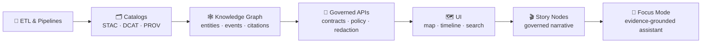
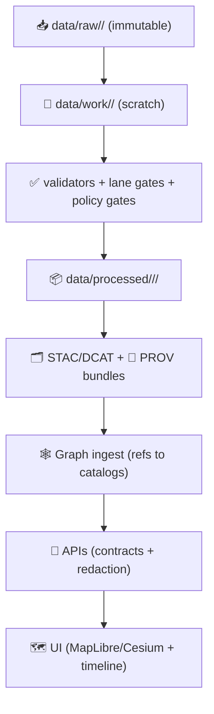
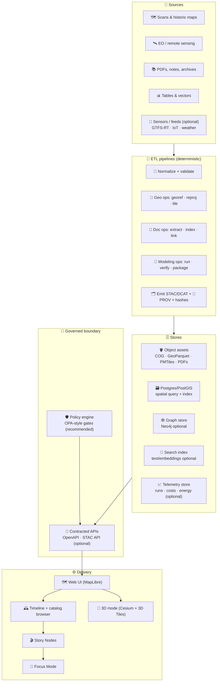
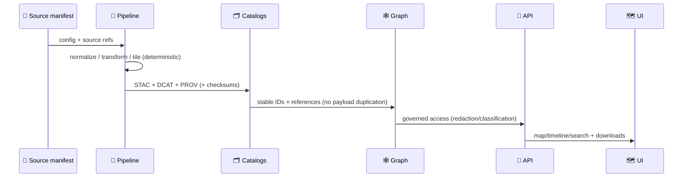
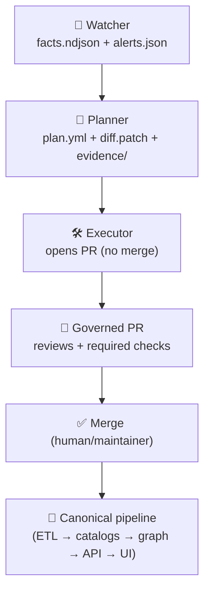

# Kansas Frontier Matrix (KFM) 🧭🌾🗺️  
**A “living atlas” + evidence pipeline for Kansas** — open-source geospatial + knowledge + modeling infrastructure that fuses **historical mapping**, **remote sensing**, **GIS**, **simulation**, and **AI‑assisted research** into one cohesive, governed system.

<p align="left">
  <a href="https://github.com/bartytime4life/Kansas-Frontier-Matrix/actions/workflows/ci.yml"></a>
  <a href="https://github.com/bartytime4life/Kansas-Frontier-Matrix/actions/workflows/codeql.yml"></a>
  <a href="https://github.com/bartytime4life/Kansas-Frontier-Matrix/issues"></a>
  <a href="#contributing-"></a>
  <a href="#license-"></a>

  
  
  
  
  
  
  
  
  
  
  
  
  
  
  
  
</p>

> [!IMPORTANT]
> **KFM invariant (non‑negotiable ordering):**  
> **ETL → STAC/DCAT/PROV Catalogs → Graph → APIs → UI → Story Nodes → Focus Mode**  
> If a change breaks this ordering (even “temporarily”), it’s not mergeable. 🚫🧱

> [!TIP]
> 🧼 If you only remember one rule: **no story without evidence** (versioned data + provenance + citations). ✅🧾

---

## Start here 📍 (canonical docs you should keep current)

> [!NOTE]
> Some docs below are **targets** (the intended “v13 shape”). If a path 404s, that’s a **todo**, not a shrug. 🧱✅

- 📘 **Master Guide (v13):** `docs/MASTER_GUIDE_v13.md` *(exported from `docs/specs/MARKDOWN_GUIDE_v13.md.gdoc`)*  
- 🧭 **Redesign blueprint (v13):** `docs/architecture/KFM_REDESIGN_BLUEPRINT_v13.md`  
- 📚 **Comprehensive technical doc (spec):** `docs/specs/Kansas Frontier Matrix (KFM) – Comprehensive Technical Documentation.docx`  
- 🌟 **Future proposals (spec):** `docs/specs/🌟 Kansas Frontier Matrix – Latest Ideas & Future Proposals.docx`  
- 🧾 **Standards profiles:**  
  - `docs/standards/KFM_STAC_PROFILE.md`  
  - `docs/standards/KFM_DCAT_PROFILE.md`  
  - `docs/standards/KFM_PROV_PROFILE.md`  
- 🤖 **Governed automation:** `docs/specs/agents/README.md` *(Watcher · Planner · Executor / “W·P·E”)*  
- 🔁 **Promotion pattern:** `docs/patterns/pipelines/CHANGE_TRIGGER_QC_PROMOTE.md`  
- 🧪 **CI blueprint:** `docs/specs/ci/CI__DETECT_VALIDATE_PROMOTE.md`  
- 📚 **Reference shelf:** `docs/library/` *(external PDFs, separate licenses)*  
- 🤝 **Collaboration hub:** `/.github/README.md`  
- 🔐 **Security policy:** `/.github/SECURITY.md` *(add if missing)*

---

## Table of contents 📌
- [Quick links](#quick-links-)
- [What KFM is](#what-kfm-is-)
- [KFM invariants](#kfm-invariants-non-negotiables-)
- [Canonical pipeline](#canonical-pipeline-the-only-allowed-order-)
- [KFM-MDP](#kfm-mdp-managed-data-promotion-no-shortcuts-)
- [Data products](#data-products-kfm-dpt-and-evidence-bundles-)
- [Domain coverage](#domain-coverage-what-we-map-and-model-)
- [Architecture at a glance](#architecture-at-a-glance-)
- [Repository map](#repository-map-target-shape-)
- [Quickstart](#quickstart-)
- [Core workflows](#core-workflows-what-you-actually-do-here-)
- [Quality gates & CI](#quality-gates--ci-)
- [Standards & versioning](#standards--versioning-stacdcatprov-and-contracts-)
- [Story Nodes + Focus Mode](#story-nodes--focus-mode-)
- [Governed automation](#governed-automation-watcher-planner-executor-)
- [Security, privacy & sovereignty](#security-privacy--sovereignty-)
- [Performance & packaging](#performance--packaging-)
- [Contributing](#contributing-)
- [Roadmap](#roadmap-)
- [Project reference library](#project-reference-library-all-project-files-)
- [Glossary](#glossary-)
- [License](#license-)
- [Acknowledgements](#acknowledgements-)

---

<a id="quick-links"></a>

## Quick links 🔗

| Action | Link |
|---|---|
| 🐛 Report a bug | <https://github.com/bartytime4life/Kansas-Frontier-Matrix/issues/new/choose> |
| ✨ Request a feature | <https://github.com/bartytime4life/Kansas-Frontier-Matrix/issues/new/choose> |
| 🧪 CI runs | <https://github.com/bartytime4life/Kansas-Frontier-Matrix/actions> |
| 🤝 Collaboration rules + labels | `./.github/README.md` |
| 🧭 Docs index | `./docs/README.md` *(add/keep current)* |
| 🧱 Architecture docs | `./docs/architecture/` |
| 🧾 Standards & profiles | `./docs/standards/` |
| 📦 Data boundary | `./data/README.md` |
| 🧩 Executable boundary | `./src/README.md` |
| 🛠️ Tooling boundary | `./tools/README.md` |
| 🧪 Methods & experiments (MCP) | `./mcp/README.md` *(or `./mcp/MCP-README.md`)* |
| 🌐 Web UI boundary | `./web/README.md` *(if present)* |
| 🚪 API boundary | `./src/server/README.md` *(or `./api/README.md`)* |

> [!NOTE]
> If a link 404s, treat it as a **repo hardening task**. 📌✅

---

<a id="what-kfm-is"></a>

## What KFM is 🧭

KFM is a **Kansas-scale “spatial truth + provenance + modeling” workbench** — a living atlas where:

- 🗺️ **Maps + layers** are time-aware, queryable, and governed  
- 🧾 **Documents** become citable evidence attached to places + time  
- 🧠 **Models** are reproducible experiments (not vibes) with uncertainty surfaced  
- 🌐 **UI** is driven by contracts and **evidence bundles**, not ad‑hoc data pulls  

It’s designed to:
- 🗺️ turn scanned maps + GIS layers into **time-aware, queryable layers** (MapLibre in 2D; optional Cesium in 3D)  
- 🧾 connect **documents ↔ places ↔ time** with citations + traceability  
- 🛰️ run remote sensing workflows and publish **derived products** with provenance  
- 📈 support reproducible modeling (EDA → regression → Bayesian → ML → simulation)  
- 🧱 enforce governance via a clean **API boundary** (no UI “direct-to-DB/graph” shortcuts)  
- 🧠 power a controlled assistant (“Focus Mode”) that stays **grounded in evidence**  

🎯 **Goal:** Make Kansas-scale spatial truth **searchable**, **mappable**, **auditable**, and **modelable** — from archival scans to satellite-derived datasets.

### What KFM is *not* 🚫
- 🕵️‍♂️ **Not** a surveillance tool (privacy rules propagate; no “privacy downgrade”).  
- 🎭 **Not** a vibes engine (claims must bind to evidence).  
- 🧺 **Not** a dumping ground (ingest requires catalogs + provenance + validation).  

---

<a id="kfm-invariants"></a>

## KFM invariants (non-negotiables) 🧱🚫

These guardrails keep KFM honest, scalable, and reviewable:

- 🧾 **Evidence-first narrative:** Story Nodes + Focus Mode do not ship unsourced claims  
- 🧱 **Contract-first interfaces:** schemas + API contracts are first-class artifacts  
- 🔁 **Deterministic ETL:** idempotent, config-driven, logged, replay-safe  
- 🗂️ **Catalog gate:** assets are registered (STAC/DCAT + PROV lineage) before graph/API/UI use  
- 🕸️ **Graph references catalogs:** graph stores **relationships**, not payload duplication  
- 🔒 **API boundary rule:** UI never queries graph/DB directly — governed access only  
- 🔐 **No privacy downgrade:** outputs can’t be less restricted than inputs without explicit redaction policy + review  
- 🛡️ **Hostile-input posture:** assume external files and metadata are adversarial; validate and sandbox where possible  
- ❤️ **Human autonomy:** AI assists, labels uncertainty, and cites evidence — it does not “assert truth” without sources  

> [!WARNING]
> If we can’t explain *where it came from* and *how it was transformed*, it doesn’t ship. ✅🧾

---

<a id="canonical-pipeline"></a>

## Canonical pipeline (the only allowed order) 🧭➡️

KFM has **one** canonical flow. Every subsystem plugs into it — no leapfrogging:



**Why this matters:** provenance, governance, and contracts must be upstream of storytelling and AI.

---

<a id="kfm-mdp-managed-data-promotion-no-shortcuts-"></a>

## KFM-MDP (Managed Data Promotion) — no shortcuts 🚦📦

**KFM‑MDP** is the rulebook that enforces a strict:

> **staging → validation → publish** sequence

You’ll see this reflected across the repo layout and the CI gates:



### What “publishable” means ✅
A dataset (or evidence artifact) is **publishable** only when it has:
- 🗂️ STAC + DCAT records (discovery + spatial/temporal indexing)  
- 🧬 PROV lineage (raw → work → processed, with tools/params)  
- 🔐 policy labels (classification/sensitivity) that **propagate**  
- ✅ validation evidence (checksums, schema validation, geo sanity)  

### Repair, rollback, and “oops” handling 🧯
KFM treats data like code: mistakes happen — but **repairs must be traceable**.
- ♻️ **Rollback** is a first-class operation (restore last-good version + keep an audit trail)  
- 🧾 **Data repairs** should produce a new version with clear PROV lineage (“why” + “how”)  
- 🪪 **Stable IDs** must never be silently reused or reassigned (stable identifiers are sacred)  

---

<a id="data-products-kfm-dpt-and-evidence-bundles-"></a>

## Data products (KFM-DPT) and evidence bundles 📦🧾

KFM ships *products*, not loose files. Each product is an **evidence bundle**:  
**asset(s) + metadata + lineage + policy labels + checksums**.

### Standard product types ✅

| Product type | Preferred format(s) | Typical use | Required bundles |
|---|---|---|---|
| 🧊 Raster layer | **COG** (GeoTIFF) | imagery, indices, gridded models | STAC item + PROV + policy + hashes |
| 🧱 Vector analytics | **GeoParquet** | analysis, joins, ML features | STAC item + DCAT distribution + PROV |
| 🗺️ Vector tiles | **PMTiles** | fast map rendering | STAC item + distribution + provenance |
| 🧾 Documents | PDF, images (PNG/JPEG) | archival evidence, reports | STAC item + citations + provenance |
| 🧪 Experiment output | plots, tables, notebooks | reproducible results | STAC item + run receipt + model card |
| 🎬 Story Node | Markdown/YAML + assets | governed narrative | sources.yml + catalog refs + policy |

> [!TIP]
> A “layer” isn’t real in KFM until it’s **cataloged** and **provable**. 🧾✅

### Evidence bundle minimums (copy/paste checklist) 🧷
- [ ] stable dataset + version slug (`<domain>.<topic>.<version>`)  
- [ ] STAC (collection + item)  
- [ ] DCAT dataset/distributions (when appropriate)  
- [ ] PROV bundle (JSON-LD recommended)  
- [ ] checksums for every asset (sha256 recommended)  
- [ ] license + attribution captured in manifests  
- [ ] policy label set + propagated  

---

<a id="domain-coverage-what-we-map-and-model-"></a>

## Domain coverage (what we map and model) 🌍

KFM is intentionally broad — but always **evidence-grounded** and **auditable**.

<details>
<summary><strong>🕰️ Historical data & archives</strong></summary>

- 🗺️ historical maps & surveys (georeferenced + time-aware)  
- 🧾 archival documents, newspapers, letters, policies (citable)  
- 📷 historic photographs + imagery (place/time linked)  
- 📅 chronologies + key events (timeline-driven navigation)  

</details>

<details>
<summary><strong>🏛️ Societal dimensions (people, land, infrastructure)</strong></summary>

- 🧑‍🤝‍🧑 population & demographic change  
- 🧾 land ownership/use + administrative boundaries  
- 🚆 infrastructure networks (rails, roads, dams, utilities)  
- 📊 social & economic indicators (context layers + analysis inputs)  

</details>

<details>
<summary><strong>🌳🌊 Environmental systems (water, air, hazards, weather)</strong></summary>

- 🌊 watersheds, streams, aquifers, water quality/availability  
- 🌬️ atmospheric/climate observations and derived products  
- 🌪️ hazards (tornado tracks, floods, drought, fire) + narratives  
- 🐾 ecological data (habitat, biodiversity proxies)  
- ⛅ observed + modeled climate layers (explicitly labeled as “model”)  

</details>

<details>
<summary><strong>🌾 Agriculture & farming models</strong></summary>

- 🌱 crop + land use history (time series, change detection)  
- 🧑‍🌾 soils/agronomy, irrigation + water use, farm economics  
- 🧪 scenario models (yield, sustainability, economics) with uncertainty  
- 🛰️ precision-ag integration (remote sensing + ground truth)  

</details>

<details>
<summary><strong>📅 Key events & timeline</strong></summary>

- 🕰️ historic events (settlement, policy, infrastructure, disasters)  
- 🗞️ contemporary events (carefully governed, evidence-backed)  
- 🔗 events link to layers + documents + citations (no orphan events)  

</details>

---

<a id="architecture-at-a-glance"></a>

## Architecture at a glance 🧱

KFM intentionally keeps a clean separation: **UI ↔ API ↔ pipelines ↔ storage**, with a knowledge graph for “documents ↔ places ↔ time” linking.



### UX notes (design intent) 🎛️
- 🗺️ **MapLibre GL JS** is the default 2D engine (offline-friendly with self-hosted tiles)  
- 🧊 **CesiumJS** is an **optional** 3D mode for stories/layers where terrain and volume matter (3D Tiles)  
- 🕰️ **Timeline** is first-class: layers can declare time ranges and respond to a time slider (filtering and/or layer swaps)  
- 🧾 **Provenance overlays** are a feature, not a footnote (users should always see “what am I looking at?”)  

---

<a id="repository-map-target-shape-"></a>

## Repository map (target shape) 🗂️🧭

> [!NOTE]
> Keep the repo structure you already have — this is the **target map** for clarity + onboarding.  
> Update this section whenever folders move. ✅

```text
Kansas-Frontier-Matrix/
├─ 📁 .github/                          🤝 CI/CD · labels · templates · automation
│  ├─ 📄 README.md
│  └─ 📄 SECURITY.md                     🔐 (add if missing)
├─ 📁 docs/                              📚 governed docs (policies · standards · architecture)
│  ├─ 📄 README.md                       🧭 docs index (add/keep current)
│  ├─ 📄 MASTER_GUIDE_v13.md             🧭 canonical invariants and onboarding
│  ├─ 📁 architecture/                   🧱 ADRs · diagrams · blueprints
│  ├─ 📁 standards/                      🧾 STAC/DCAT/PROV profiles · governance rules
│  ├─ 📁 templates/                      🧩 Story Node · SOP · experiment templates
│  ├─ 📁 reports/
│  │  └─ 📁 story_nodes/
│  │     ├─ 📁 draft/                    ✍️ in-progress narrative nodes
│  │     └─ 📁 published/                ✅ reviewed, source-backed story nodes
│  └─ 📁 library/                        📚 reference shelf (separate licenses)
├─ 📁 schemas/                           📐 JSON Schemas: contracts · metadata · telemetry
├─ 📁 data/                              📦 raw → work → processed + catalogs + provenance
│  ├─ 📁 sources/                        🧾 source manifests (license/terms + attribution)
│  ├─ 📁 raw/                            ⛏️ raw inputs (scans, downloads, snapshots)
│  ├─ 📁 work/                           🧪 intermediates (often gitignored)
│  ├─ 📁 processed/                      ✅ publishable derived assets (versioned)
│  ├─ 📁 stac/                           🗂️ STAC collections/items (or data/catalog/stac/)
│  ├─ 📁 catalog/
│  │  └─ 📁 dcat/                        🏷️ DCAT datasets/distributions
│  └─ 📁 prov/                           🧬 PROV bundles (JSON-LD recommended)
├─ 📁 src/                               🧩 canonical executable boundary
│  ├─ 📁 pipelines/                      🧰 ETL jobs (domain-specific)
│  ├─ 📁 graph/                          🕸️ ontology + ingest + constraints
│  └─ 📁 server/                         🚪 APIs and services (policy + contracts)
├─ 📁 web/                               🌐 UI boundary (MapLibre · Cesium · story layers)
│  ├─ 📁 viewers/                        🗺️ map viewers + UI controls (MapLibre)
│  └─ 📁 story_nodes/                    🎬 story node assets + configs (optional mirror)
├─ 📁 tools/                             🛠️ validators · catalog QA · prov helpers
├─ 📁 scripts/                           🧰 safe-by-default CLI wrappers
├─ 📁 mcp/                               🧪 experiments and run receipts (“evidence artifacts”)
├─ 📁 notebooks/                         📓 lab bench: exploration that graduates to src
├─ 📁 tests/                             ✅ unit · integration · contracts · e2e guidance
├─ 🐳 docker-compose.yml
├─ 🧾 .env.example
└─ 📄 README.md
```

> [!TIP]
> If you currently have a top-level `pipelines/` folder instead of `src/pipelines/`, that’s fine — **just keep the boundary explicit**.  
> v13 aims to converge on a single “executable boundary” pattern to reduce drift. 🧭✅

---

<a id="quickstart"></a>

## Quickstart 🚀

### Option A — Docker (recommended) 🐳
```bash
# 1) Clone
git clone https://github.com/bartytime4life/Kansas-Frontier-Matrix.git
cd Kansas-Frontier-Matrix

# 2) Configure environment
cp .env.example .env

# 3) Run
docker compose up --build
```

### Option B — Local dev (Python + Node) 💻
> [!TIP]
> Prefer service-level docs if present:
> - `src/server/README.md` (API boundary)
> - `web/README.md` (frontend)

```bash
# Backend (example)
python -m venv .venv
source .venv/bin/activate
pip install -r requirements.txt

# Start command depends on framework:
# - FastAPI: uvicorn src.server.app.main:app --reload
# - Flask:   flask --app src.server.app run --debug

# Frontend
cd web
npm install
npm run dev
```

✅ Typical local endpoints:
- `http://localhost:8000` → API  
- `http://localhost:5173` → Web UI  

---

<a id="core-workflows--what-you-actually-do-here-"></a>

## Core workflows 🧰 (what you actually do here)

### 1) Add a new dataset layer 🗺️
**Definition of Done (DoD):**
- [ ] 🧾 Source manifest exists (`data/sources/**`) with license + attribution
- [ ] 🧰 Deterministic pipeline produces processed asset(s)
- [ ] 🗂️ STAC + 🏷️ DCAT created/updated
- [ ] 🧬 PROV lineage emitted (raw → work → processed)
- [ ] ✅ QA passes (schema + links + geo/bounds + policy)
- [ ] 🎬 Optional: Story Node / docs updated *(recommended)*



### 2) Add a Story Node 🎬
Story Nodes are **machine-ingestible** narrative artifacts that can:
- 🧭 define view state (layers, bounds, time range)
- 🧾 attach citations + evidence pointers
- 🕸️ link to graph entities (stable IDs)
- 🧊 orchestrate 2D → 3D transitions (MapLibre ↔ Cesium)

**Hard gates**
- ✅ every claim has evidence pointers  
- ✅ fact vs interpretation is explicit  
- ✅ sensitive-location rules honored (mask/jitter/generalize)  
- ✅ references resolve to cataloged sources  

> [!TIP]
> **Authoring tools are on the roadmap:** the goal is to let domain experts write Story Nodes without needing to be coders. 🧑‍🏫🧾

### 3) Add an evidence artifact (analysis/model output) 🧪
Treat analysis output like **data with lineage**, not “screenshots in a PR”:
- store in `mcp/` (plots, metrics, notebooks, model cards, run receipts)
- register in STAC/DCAT + PROV
- link into stories only after registration

### 4) Add an API endpoint/service 🚪
- define contract (OpenAPI/GraphQL) before implementation  
- tests + versioning strategy (avoid breaking changes)  
- redaction policy if data is sensitive  
- UI uses the API (no “direct graph” shortcuts)  

### 5) Ingest documents in bulk 🧾📚 (planned workflow)
KFM is built to support **bulk document & knowledge ingestion** as a first-class pipeline:
- batch PDFs/scans → extract text (and OCR when needed)
- entity linking (places, people, dates) → graph edges + citations
- publish as evidence bundles (STAC/DCAT/PROV) so stories can cite them

---

<a id="quality-gates--ci"></a>

## Quality gates & CI ✅🧪

KFM gates are designed to stop **silent drift**: missing licenses, broken links, schema mismatches, uncataloged artifacts, or unreviewed policy downgrades.

### ✅ Fast catalog QA gate (PR-friendly)
A lightweight validator should run on PRs that touch `data/**`.

**Checks (fast):**
- `license` exists and is non-empty  
- `providers` exists and is non-empty  
- `stac_extensions` exists (warn if empty; fail if missing)  
- top-level `links[].href` respond (HEAD/GET)  
- checksums present for assets (recommended; fail once enforced)  

Suggested local run (example):
```bash
python3 tools/validation/catalog_qa/run_catalog_qa.py \
  --root data/ \
  --glob "**/collection.json" \
  --fail-on-warn
```

### ✅ Minimum CI gates (recommended)
- 🧹 lint and format (Python + JS/TS)
- ✅ unit tests
- 🔌 integration tests (DB, graph, API boundaries)
- 🧾 contract checks (OpenAPI + JSON Schemas)
- 🗂️ metadata checks (STAC/DCAT/PROV)
- 🔐 security scans (secrets, deps, container baseline)
- 📎 artifacts on failure (logs, diffs, previews)

### 🧾 Policy Pack (recommended) 🛡️
Treat policy like code:
- policy checks run on PRs (classification propagation, redaction expectations, license allow/deny rules)
- violations fail CI with actionable error messages

### 📈 Telemetry & energy/cost awareness (optional, roadmap) ⚡
KFM can optionally track:
- pipeline runtimes + resource usage
- build/system energy proxies (where feasible)
- dataset “cost receipts” alongside PROV  
…so scaling decisions stay grounded, not guessed. 🌱

> [!IMPORTANT]
> “Green CI” is a merge requirement. Fix the root cause — don’t ship flaky behavior. 🤖🚫

---

<a id="standards--versioning-stacdcatprov-and-contracts-"></a>

## Standards & versioning (STAC/DCAT/PROV and contracts) 🧾🔁

### 🌐 STAC/DCAT/PROV alignment (required)
Every dataset or evidence artifact must have:
- 🗂️ **STAC** (collection + items): spatial/temporal indexing + asset links
- 🏷️ **DCAT** dataset entry: discoverability + distributions (links to STAC and/or downloads)
- 🧬 **PROV** bundle: raw → work → processed chain, with tooling + parameters

### 🔗 Cross-layer linkage expectations
- STAC Items point to **actual assets** in `data/processed/**` (or equivalent stable storage)  
- DCAT points to STAC and/or distribution downloads  
- PROV links the **entire chain** and identifies the producing run/config  
- Graph nodes reference catalog IDs (STAC/DCAT/DOI/ARK), not full payloads  

### 🧾 Versioning expectations (project discipline)
- **Datasets:** new versions link to predecessors (revision/provenance links)  
- **Graph/ontology:** backward compatible unless a migration is shipped  
- **APIs:** breaking changes require versioning (contract is the truth)  
- **Releases:** repo follows SemVer; major versions reflect structural changes (like v13)  

---

<a id="story-nodes--focus-mode"></a>

## Story Nodes + Focus Mode 📖🧠

### 📖 Story Nodes = governed narrative (machine-ingestible)
Recommended shape:
```text
📁 docs/reports/story_nodes/
├─ 📁 draft/
│  └─ 📁 <slug>/
│     ├─ 📄 STORY_NODE.md
│     ├─ 📄 sources.yml
│     └─ 📁 assets/
└─ 📁 published/
   └─ 📁 <slug>/
      ├─ 📄 STORY_NODE.md
      ├─ 📄 sources.yml
      └─ 📁 assets/
```

### 🧊 3D Story Nodes (MapLibre → Cesium)
- Default is 2D (clarity wins)  
- Story Nodes may “switch engines” for terrain/volumes/3D Tiles  
- 3D is governed like everything else: cataloged assets + provenance  

> [!NOTE]
> A showcase Story Node (“Kansas From Above”) is a recommended milestone: it proves 2D→3D transitions, provenance overlays, and time-aware storytelling in one place. 🧊🌾

### 🧠 Focus Mode = evidence-grounded assistant (advisory, not autonomous)
Focus Mode:
- retrieves context from **catalogs + graph + docs**
- uses tools/calculations instead of “making numbers up”
- outputs answers with citations + provenance pointers
- refuses speculation: if KFM doesn’t have the evidence, it says so

> [!IMPORTANT]
> KFM’s AI posture: **assist, don’t assert** — and always cite evidence. ✅🧾

---

<a id="governed-automation-watcher-planner-executor-"></a>

## Governed automation (Watcher → Planner → Executor) 🤖🔁

KFM supports an **optional PR-first automation loop** that *cannot bypass governance*:

> **Watcher → Planner → Executor** (W·P·E)

- 👀 **Watcher:** observes repo/catalog/runtime signals → emits immutable facts/alerts (no mutations)
- 🧠 **Planner:** deterministic planning → produces `plan.yml` + `diff.patch` + `evidence/`
- 🛠️ **Executor:** opens/updates PRs with attestations (never merges)



### Provenance-first agent output 🧾
Automated PRs should include:
- a **run receipt** (inputs, hashes, parameters, versions)
- a **PROV bundle** (what changed and why)
- **artifacts** (validation report, previews, diffs)

### Detect → Validate → Promote (CI mindset) 🛣️
- detect changes (ETags/hashes/events)
- validate via lanes (schema, geo, policy, graph consistency)
- promote via PRs with evidence + provenance
- optionally emit lineage/telemetry (OpenLineage-style)

---

<a id="security-privacy--sovereignty-"></a>

## Security, privacy & sovereignty 🛡️🔒

KFM is a public-knowledge project — but **not all spatial data should be public at full resolution**.

### Sensitive location policy 🧭
If a dataset contains sensitive locations (culturally sensitive sites, protected resources, PII):
- 🧊 generalize precision (mask/jitter/grid)
- 🔐 restrict access where required
- 🧾 publish redacted derivatives (never downgrade privacy)
- 🏷️ ensure classification propagates to outputs

Practical controls KFM expects:
- 🧭 **Location generalization** defaults for sensitive categories  
- 🏷️ **Tagging** and policy labels on every dataset/story node  
- 🔑 **Access control** support as the project evolves beyond “public only”  

### Policy enforcement (recommended pattern) 🧾
KFM is designed to support **global + local policy** checks (think OPA-style rules):
- global: role/context gates
- local: dataset/entity classification gates
- logs should be audit-friendly; where possible, pseudonymize user identifiers

### Supply-chain hygiene ✅
- 🔐 secrets never committed (`.env`, CI secrets)
- ✅ CodeQL + dependency scanning
- 🧾 SBOM + build/data provenance attestations (SLSA/Sigstore style)
- 🛡️ hostile-input posture for ingest (scans, PDFs, metadata, archives)

> [!IMPORTANT]
> Security references in `docs/library/` exist to improve **defensive hardening**.  
> This repo does **not** accept contributions that add misuse-ready exploitation instructions. 🚫

---

<a id="performance--packaging-"></a>

## Performance & packaging ⚙️📦

KFM is built to scale from “a few layers” into **Kansas-scale** multi-modal spatiotemporal data.

### Practical performance patterns
- 🧊 **COG** for rasters (streamable, web-friendly)
- 📦 **Dual-format publishing** for big vectors:
  - **GeoParquet** for analytics
  - **PMTiles** for fast map rendering
- 🗺️ MapLibre for 2D, Cesium for 3D Tiles when needed
- 🕰️ Timeline-first UX (time filters instead of “duplicate layers per year” when possible)
- ♻️ immutable, versioned artifacts (processed outputs + catalogs + lineage)
- 🧠 deterministic models/sims: record seeds, params, and environments

---

<a id="contributing"></a>

## Contributing 🤝

We welcome contributions that improve:
- 🧾 provenance, ingest tooling, validation  
- 🗺️ mapping UX (layers, timeline, search, performance)  
- 📈 modeling modules + reproducibility  
- 📚 documentation + tutorials + examples  

Start here → `./.github/README.md` ✅

### 🗃️ Data contribution checklist (recommended)
- [ ] Dataset has a **catalog record** + **license** + **source reference**
- [ ] Transform history documented (scripts/commands/parameters)
- [ ] CRS is explicit
- [ ] BBox/time range present (when applicable)
- [ ] Sensitive fields reviewed/redacted (if needed)
- [ ] Catalog QA passes (license/providers/stac_extensions + links)

---

<a id="roadmap"></a>

## Roadmap 🛣️

> [!NOTE]
> This roadmap merges the **v13 target shape** with the **latest proposals** doc.  
> Everything below must still obey: **ETL → Catalogs → Graph → APIs → UI → Story → Focus** 🧱

### ✅ Near-term priorities (next milestones)
- [ ] 📐 **Dataset schema & validators** (metadata treated like code)
- [ ] ✅ **CI: Catalog QA gate** (PR-friendly + fail-fast)
- [ ] 🧾 **Document & knowledge ingestion** (bulk PDFs/scans → searchable → graph-linked)
- [ ] 🛰️ **Remote sensing pipeline templates** (repeatable job → artifacts → catalogs)
- [ ] 🗺️ **Map + timeline MVP** (layer browser, time slider, inspect, provenance overlay)
- [ ] 🎬 **Story Node authoring workflow** (draft → review → publish)
- [ ] 🧊 **3D demo: “Kansas From Above”** (2D→3D transition + governed assets)
- [ ] 📈 **Modeling examples** (notebooks + run receipts + model cards in `mcp/`)
- [ ] 🔐 **Auth + roles** (optional, for controlled collaboration and restricted datasets)
- [ ] 📦 **Versioned releases + changelog** (repeatability for research + deployments)

### 🧪 Mid-term expansions
- [ ] 👀 **Provenance-first automation agents** (W·P·E with attestations)
- [ ] 🧬 **GitHub PR → PROV graph integration** (PR metadata becomes lineage)
- [ ] 🛡️ **Policy Pack** (classification + license gates + redaction rules)
- [ ] 📡 **Live layers** (sensors/feeds with strict versioning and policy)
- [ ] 📊 **Analytical dashboards** (chart views tied to cataloged data + offline exports)

### 🌍 Longer-term ideas (big swings)
- [ ] 📱 **Mobile + offline** (packaged field-ready subsets)
- [ ] 🧊 **AR experiences** (governed overlays; evidence-first)
- [ ] 🧠 **AI-assisted data generation** (assistive drafts only; human approval required)
- [ ] ⚙️ **Scalability & performance** (tiling services, caching, compute-to-data patterns)
- [ ] 🧩 **New domains** (health, energy, education, etc — if evidence + governance fit)
- [ ] 🔗 **Federation / multi-region** (portable “Matrix System” pattern beyond Kansas)
- [ ] 🧭 **SOPs + glossary maturity** (shared vocabulary reduces drift)

---

<a id="project-reference-library-all-project-files-"></a>

## Project reference library (all project files) 📚🎒

> These files are treated as the repo’s **design + research shelf**: modeling rigor, statistics discipline, GIS engineering, web rendering constraints, databases, governance, and security mindset.  
> ⚠️ Reference materials may have **different licenses** than repository code. Respect upstream terms and avoid redistributing third‑party works without permission.

<details>
<summary><strong>🧭 Canonical KFM design/spec files</strong></summary>

- 📄 `docs/specs/Kansas Frontier Matrix (KFM) – Comprehensive Technical Documentation.docx`  
- 🌟 `docs/specs/🌟 Kansas Frontier Matrix – Latest Ideas & Future Proposals.docx`  
- 📄 `docs/specs/MARKDOWN_GUIDE_v13.md.gdoc` *(source for docs protocol + standards alignment)*  
- 📄 `docs/library/Kansas-Frontier-Matrix_ Open-Source Geospatial Historical Mapping Hub Design.pdf` *(architecture & UX design thread)*  
- 📄 `docs/library/Comprehensive Markdown Guide_ Syntax, Extensions, and Best Practices.docx` *(docs as governance + templates)*  

</details>

<details>
<summary><strong>🗺️ GIS, cartography, and mapping UX</strong></summary>

- 📘 `docs/library/python-geospatial-analysis-cookbook.pdf`  
- 🐘 `docs/library/PostgreSQL Notes for Professionals - PostgreSQLNotesForProfessionals.pdf`  
- 🎨 `docs/library/making-maps-a-visual-guide-to-map-design-for-gis.pdf`  
- 📱 `docs/library/Mobile Mapping_ Space, Cartography and the Digital - 9789048535217.pdf`  
- 🖼️ `docs/library/compressed-image-file-formats-jpeg-png-gif-xbm-bmp.pdf`  

</details>

<details>
<summary><strong>🛰️ Remote sensing + cloud workflows</strong></summary>

- 🛰️ `docs/library/Cloud-Based Remote Sensing with Google Earth Engine-Fundamentals and Applications.pdf`

</details>

<details>
<summary><strong>📈 Stats, experiments, inference, Bayesian</strong></summary>

- 🧪 `docs/library/Understanding Statistics & Experimental Design.pdf`  
- 📈 `docs/library/regression-analysis-with-python.pdf`  
- 📊 `docs/library/Regression analysis using Python - slides-linear-regression.pdf`  
- 📉 `docs/library/graphical-data-analysis-with-r.pdf`  
- 🎲 `docs/library/think-bayes-bayesian-statistics-in-python.pdf`  

</details>

<details>
<summary><strong>🧪 Modeling, simulation, optimization, graphs</strong></summary>

- 🚀 `docs/library/Scientific Modeling and Simulation_ A Comprehensive NASA-Grade Guide.pdf`  
- 🧮 `docs/library/Generalized Topology Optimization for Structural Design.pdf`  
- 🕸️ `docs/library/Spectral Geometry of Graphs.pdf`  

</details>

<details>
<summary><strong>🗄️ Systems, scalability, interoperability</strong></summary>

- ⚙️ `docs/library/Scalable Data Management for Future Hardware.pdf`  
- 🧵 `docs/library/concurrent-real-time-and-distributed-programming-in-java-threads-rtsj-and-rmi.pdf`  
- 🔗 `docs/library/Data Spaces.pdf`  

</details>

<details>
<summary><strong>❤️ Ethics, autonomy, and AI governance</strong></summary>

- 🤝 `docs/library/Introduction to Digital Humanism.pdf`  
- 🧠 `docs/library/Principles of Biological Autonomy - book_9780262381833.pdf`  
- ⚖️ `docs/library/On the path to AI Law’s prophecies and the conceptual foundations of the machine learning age.pdf`  

</details>

<details>
<summary><strong>🌐 Web & 3D rendering</strong></summary>

- 📱 `docs/library/responsive-web-design-with-html5-and-css3.pdf`  
- 🧊 `docs/library/webgl-programming-guide-interactive-3d-graphics-programming-with-webgl.pdf`  

</details>

<details>
<summary><strong>🔐 Security (defensive posture)</strong></summary>

- 🛡️ `docs/library/ethical-hacking-and-countermeasures-secure-network-infrastructures.pdf`  
- 🐍 `docs/library/Gray Hat Python - Python Programming for Hackers and Reverse Engineers (2009).pdf`  

</details>

<details>
<summary><strong>📚 General programming shelves (bundles)</strong></summary>

> These are “multi-book bundle PDFs.” Consider adding an index file later: `docs/library/programming_bundles/INDEX.md` 🧭

- 📚 `docs/library/A programming Books.pdf`  
- 📚 `docs/library/B-C programming Books.pdf`  
- 📚 `docs/library/D-E programming Books.pdf`  
- 📚 `docs/library/F-H programming Books.pdf`  
- 📚 `docs/library/I-L programming Books.pdf`  
- 📚 `docs/library/M-N programming Books.pdf`  
- 📚 `docs/library/O-R programming Books.pdf`  
- 📚 `docs/library/S-T programming Books.pdf`  
- 📚 `docs/library/U-X programming Books.pdf`  
- 📚 *(optional)* `docs/library/Deep Learning for Coders with fastai and PyTorch - Deep.Learning.for.Coders.with.fastai.and.PyTorch.pdf` *(normalize filename if present)*

</details>

---

<a id="glossary"></a>

## Glossary 📚

- **Evidence bundle:** a packaged artifact (data/doc/model) with **STAC/DCAT + PROV + checksums + policy labels**.  
- **KFM‑MDP:** Managed Data Promotion: **staging → validation → publish** (no skipping).  
- **Story Node:** a governed narrative unit that binds **claims → evidence pointers → view state**.  
- **Focus Mode:** evidence-grounded assistant UI that **cites sources** and refuses speculation.  
- **Catalog gate:** rule that nothing reaches graph/API/UI until it’s **cataloged + provable**.  
- **Lane gate:** a validation lane (license, geo sanity, policy, schema, provenance).  

---

<a id="license"></a>

## License 🧾
**MIT** (code), unless otherwise noted.

> [!IMPORTANT]
> 🗃️ **Data note:** datasets, scans, and third‑party documents can have different licenses/attribution than the code. Track this in manifests + catalogs and metadata. ✅

---

<a id="acknowledgements"></a>

## Acknowledgements 🙌🌾
Built by combining **geospatial engineering**, **data science rigor**, **systems design**, **cartographic discipline**, and **human-centered governance** into a cohesive platform for Kansas-scale exploration and decision support.
