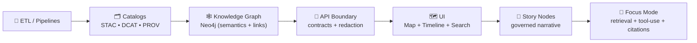
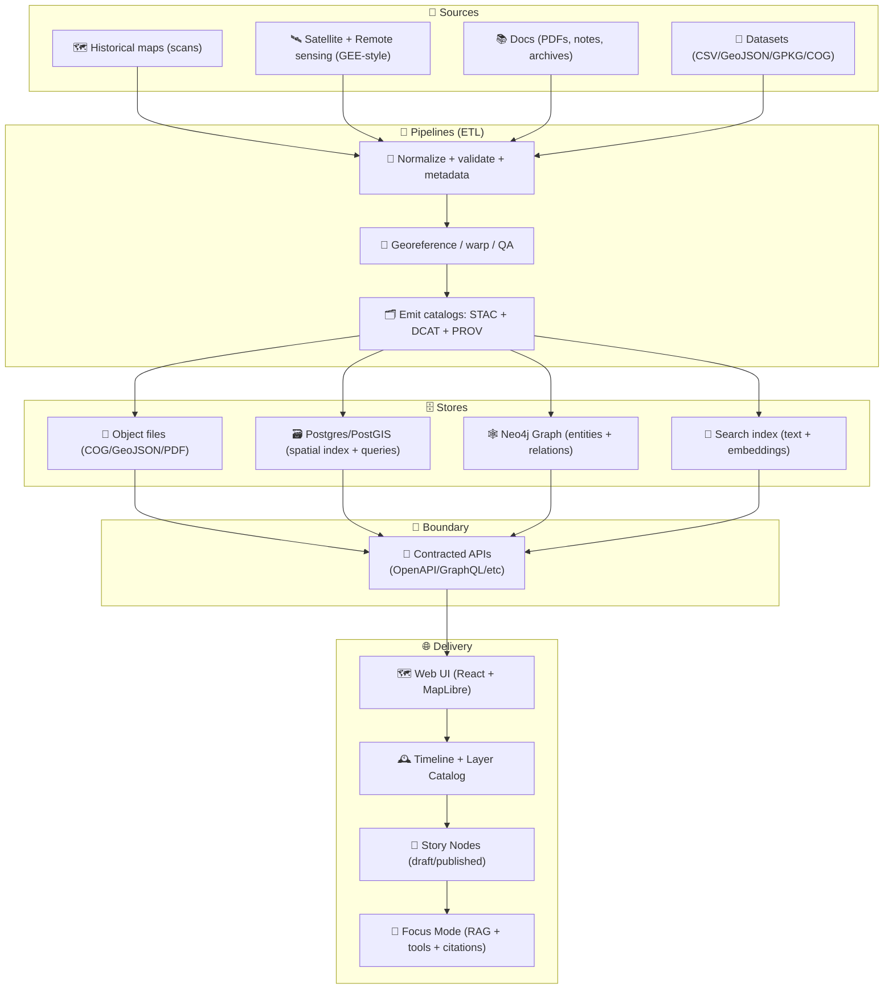

# Kansas Frontier Matrix (KFM) 🧭🌾🗺️  
**A “living atlas” + evidence pipeline for Kansas** — open-source geospatial + knowledge + modeling infrastructure built to fuse **historical mapping**, **remote sensing**, **GIS**, **simulation**, and **AI-assisted research workflows** into one cohesive system.

<p align="left">
  <a href="https://github.com/bartytime4life/Kansas-Frontier-Matrix/actions/workflows/ci.yml"></a>
  <a href="https://github.com/bartytime4life/Kansas-Frontier-Matrix/actions/workflows/codeql.yml"></a>
  <a href="https://github.com/bartytime4life/Kansas-Frontier-Matrix/issues"></a>
  <a href="#contributing-"></a>
  <a href="#license-"></a>
  
  
  
  
  
  
  
</p>

> [!NOTE]
> **New here?** Start with:
> - 🧭 **Master guide (v13):** `docs/MASTER_GUIDE_v13.md` *(canonical pipeline + repo contracts)*  
> - 🤝 **Collaboration & automation hub:** [`./.github/README.md`](./.github/README.md)  
> - 🧱 **Architecture docs:** [`./docs/architecture/`](./docs/architecture/)  
> - 🧾 **Standards & profiles (STAC/DCAT/PROV):** `docs/standards/`  
> - 🧠 **Methods & experiments:** `mcp/` *(runs, notebooks, model cards)*  

> [!TIP]
> 🧼 If you only remember one rule: **no story without evidence** (versioned data + provenance + citations).

---

<a id="toc"></a>

## Table of contents 📌
- [Quick links](#quick-links-)
- [What KFM is](#what-kfm-is-)
- [KFM invariants](#kfm-invariants-non-negotiables-)
- [Canonical pipeline](#canonical-pipeline-the-only-allowed-order-)
- [Architecture at a glance](#architecture-at-a-glance-)
- [Repository map (v13 target shape)](#repository-map-v13-target-shape-)
- [Quickstart](#quickstart-)
- [Quality gates & CI](#quality-gates--ci-)
- [Data standards & conventions](#data-standards--conventions-)
- [Story Nodes + Focus Mode](#story-nodes--focus-mode-)
- [3D Story Nodes (optional, but future-proof)](#3d-story-nodes-optional-but-future-proof-)
- [Modeling, simulation & experiments](#modeling-simulation--experiments-)
- [Contributing](#contributing-)
- [Roadmap](#roadmap-)
- [Project reference library](#project-reference-library-pdfs--influence-map-)
- [License](#license-)
- [Acknowledgements](#acknowledgements-)

---

<a id="quick-links"></a>

## Quick links 🔗

| Action | Link |
|---|---|
| 🐛 Report a bug | https://github.com/bartytime4life/Kansas-Frontier-Matrix/issues/new?template=bug_report.yml |
| ✨ Request a feature | https://github.com/bartytime4life/Kansas-Frontier-Matrix/issues/new?template=feature_request.yml |
| 🗺️ Request a data layer/source | https://github.com/bartytime4life/Kansas-Frontier-Matrix/issues/new?template=data_layer_request.yml |
| ❓ Ask a question | https://github.com/bartytime4life/Kansas-Frontier-Matrix/issues/new?template=question.yml |
| 🧪 CI runs | https://github.com/bartytime4life/Kansas-Frontier-Matrix/actions |
| 🧩 Collaboration rules (issues/PRs/labels/automation) | [`./.github/README.md`](./.github/README.md) |
| 🔐 Security policy | [`./.github/SECURITY.md`](./.github/SECURITY.md) *(add if missing)* |

> [!TIP]
> If a template link 404s, use the chooser: https://github.com/bartytime4life/Kansas-Frontier-Matrix/issues/new/choose

---

<a id="what-kfm-is"></a>

## What KFM is 🧭

KFM is a **Kansas-scale “spatial truth + provenance + modeling” workbench** — a *living atlas* that treats:
- 🗺️ **maps + layers** as time-aware, queryable, governed assets  
- 🧾 **documents** as citable evidence attached to places + time  
- 🧠 **models** as reproducible experiments (not vibes)  
- 🌐 **UI** as a map + timeline + story system driven by contracts

It’s designed to:
- 🗺️ turn scanned maps + GIS layers into **time-aware, queryable layers**
- 🧾 connect **documents ↔ places ↔ time** (with citations + traceability)
- 🛰️ run **remote sensing pipelines** (GEE-style patterns) and publish outputs
- 📈 support **reproducible modeling** (stats → Bayes → ML → simulation)
- 🌐 deliver everything through a **map UI + timeline + searchable catalog + Story Nodes**
- 🧠 power a controlled AI assistant (“Focus Mode”) that stays **grounded in evidence**

> 🎯 **Goal:** Make Kansas-scale spatial truth **searchable**, **mappable**, **auditable**, and **modelable** — from archival scans to satellite-derived datasets.

---

<a id="kfm-invariants"></a>

## KFM invariants (non-negotiables) 🧱🚫

These are the guardrails that keep KFM honest and scalable:

- 🧾 **Evidence-first narrative:** No unsourced claims in Story Nodes or AI outputs.  
- 🧱 **Contract-first everything:** schemas + API contracts are first-class artifacts.  
- 🔁 **Deterministic pipelines:** ETL is idempotent, config-driven, and fully logged.  
- 🧭 **Provenance before shipping:** data is registered (STAC/DCAT + PROV lineage) before graph/UI use.  
- 🔒 **API boundary rule:** UI never queries the graph directly — all access goes through the governed API.  
- ❤️ **Integrity over incentives:** we don’t “defend a system because it makes money” — we defend it because it’s **verifiable** and **useful**.

> [!WARNING]
> If we can’t explain *where it came from* and *how it was transformed*, it doesn’t ship. ✅

---

<a id="canonical-pipeline"></a>

## Canonical pipeline (the only allowed order) 🧭➡️

KFM has one canonical flow. Every subsystem plugs into it — no leapfrogging.



**Why this matters:** it forces provenance, governance, and contracts to be upstream of storytelling and AI.

---

<a id="architecture"></a>

## Architecture at a glance 🧱



---

<a id="repo-map-v13"></a>

## Repository map (v13 target shape) 🗂️

> [!NOTE]
> If your repo already has a structure, keep it — this is the **v13 target** for clarity + onboarding.

```text
Kansas-Frontier-Matrix/
├─ 📁 .github/                          # 🤝 Collaboration + CI/CD (see .github/README.md)
├─ 📁 docs/                             # 📚 Canonical governed docs
│  ├─ 📁 MASTER_GUIDE_v13.md            # 🧭 Pipeline + invariants + onboarding (canonical)
│  ├─ 📁 architecture/                  # 🧱 Blueprints, ADRs, diagrams
│  ├─ 📁 standards/                     # 🧾 KFM profiles: STAC/DCAT/PROV + markdown protocol
│  ├─ 📁 templates/                     # 🧩 Governed templates (universal, story node, API)
│  └─ 📁 reports/
│     └─ 📁 story_nodes/
│        ├─ 📁 draft/                   # ✍️ Work-in-progress narrative nodes
│        └─ 📁 published/               # ✅ Reviewed, source-backed story nodes
├─ 📁 schemas/                          # 📦 JSON Schemas (STAC/DCAT/PROV/story nodes/telemetry)
├─ 📁 data/                             # 🗃️ Data domains + artifacts
│  ├─ 📁 raw/                           # ⛏️ Raw inputs (scans, downloads, snapshots)
│  ├─ 📁 work/                          # 🧪 Working/intermediate artifacts (ignored by releases)
│  ├─ 📁 processed/                     # ✅ Publishable derived assets (COG/GeoJSON/Parquet)
│  ├─ 📁 catalog/
│  │  ├─ 📁 stac/                       # 🗂️ STAC catalogs/collections/items
│  │  └─ 📁 dcat/                       # 🧾 DCAT datasets/distributions
│  └─ 📁 prov/                          # 🔗 PROV lineage records (PROV-JSONLD/PROV-O)
├─ 📁 releases/                         # 📦 Versioned snapshots (catalog + schemas + checksums)
├─ 📁 src/
│  ├─ 📁 pipelines/                     # 🧰 ETL jobs (domain-specific)
│  ├─ 📁 graph/                         # 🕸️ Ontology + ingest + constraints (Neo4j build)
│  └─ 📁 server/                        # 🧩 API boundary + contracts + redaction rules
├─ 📁 web/                              # 🌐 Front-end (React + MapLibre + WebGL)
├─ 📁 tools/
│  └─ 📁 validation/
│     └─ 📁 catalog_qa/                 # ✅ Fast STAC gate (license/providers/stac_extensions + links)
├─ 📁 mcp/                              # 🧠 Methods & Computational Experiments (runs, notebooks, model cards)
├─ 🧪 tests/                            # ✅ Unit/integration tests (contracts + pipelines + API)
├─ 🐳 docker-compose.yml
├─ 🧾 .env.example
└─ 📘 README.md
```

---

<a id="quickstart"></a>

## Quickstart 🚀

### Option A — Docker (recommended) 🐳
```bash
# 1) Clone
git clone https://github.com/bartytime4life/Kansas-Frontier-Matrix.git
cd Kansas-Frontier-Matrix

# 2) Configure environment
cp .env.example .env

# 3) Run
docker compose up --build
```

### Option B — Local dev (Python + Node) 💻
> [!TIP]
> Prefer service-level docs if present:
> - `src/server/README.md` (API boundary)
> - `web/README.md` (frontend)

```bash
# Backend (example shape)
python -m venv .venv
source .venv/bin/activate
pip install -r requirements.txt

# Start command depends on the framework used:
# - FastAPI: uvicorn src.server.app.main:app --reload
# - Flask:   flask --app src.server.app run --debug

# Frontend
cd web
npm install
npm run dev
```

✅ Typical local endpoints:
- `http://localhost:8000` → API  
- `http://localhost:5173` → Web UI  

---

<a id="quality-gates"></a>

## Quality gates & CI ✅🧪

KFM quality gates are designed to stop “silent drift” — missing licenses, broken links, schema mismatches, untraceable artifacts.

### ✅ Fast catalog gate (STAC/DCAT quick QA)
A lightweight validator should run on PRs that touch `data/**` to catch the biggest failure modes early:

**Checks (fast):**
- `license` exists and is non-empty  
- `providers` exists and is non-empty  
- `stac_extensions` exists (warn if empty; fail if missing)  
- top-level `links[].href` respond (HEAD/GET)  

Suggested path:
- `tools/validation/catalog_qa/run_catalog_qa.py`
- Workflow: `.github/workflows/catalog-qa.yml`

Example local run:
```bash
python3 tools/validation/catalog_qa/run_catalog_qa.py \
  --root data/ \
  --glob "**/collection.json" \
  --fail-on-warn
```

> [!TIP]
> This doesn’t replace full schema validation — it’s a fast gate that keeps PRs clean and catalogs federation-ready.

### 🧾 “Stable extensions only” rule (recommended)
If you use STAC extensions (Projection, EO, Processing, Classification…), treat them like dependencies:
- require `stac_extensions` to list their schema URIs  
- gate **production catalogs** to stable extensions only (warn on proposal/pilot)  
- map critical `proj:*` fields into KFM front-matter and schema validation

---

<a id="data-standards"></a>

## Data standards & conventions 🗺️🧾

To keep KFM interoperable and scalable:

- 🗂️ **Catalogs:** STAC (spatial assets), DCAT (dataset registry), PROV (lineage)  
- 🌍 **Vector:** GeoJSON (transport), GeoPackage accepted for ingest  
- 🧊 **Raster:** Cloud-Optimized GeoTIFF (**COG**) preferred for web streaming  
- 🧭 **CRS:** store original + normalized derivatives (web map CRS when needed)  
- 🔍 **Quality:** geometry validity + bbox sanity + quick visual QA snapshot  

### ✅ Provenance checklist (required for any data PR)
- Source name + reference (URL, DOI, archive id, or scan box id)
- License/terms (or “unknown” with rationale + mitigation)
- Spatial reference (EPSG) and units
- Time coverage (single year, range, or “undated”)
- Processing steps (georef point count, simplification, resampling, etc.)
- Checksums + version stamp *(recommended)*
- Redaction notes *(if sensitive)*

> [!WARNING]
> If we can’t explain where the data came from and how it was processed, we can’t trust it — and it won’t ship. 🧱🗺️

### 🧾 STAC-like manifest (minimal example)
```json
{
  "id": "kfm.ks.railroads.1870_1910.v1",
  "title": "Kansas Railroads (1870–1910)",
  "type": "vector",
  "format": "geojson",
  "bbox": [-102.05, 36.99, -94.59, 40.00],
  "time_range": {"start": "1870-01-01", "end": "1910-12-31"},
  "crs": "EPSG:4326",
  "provenance": {
    "sources": [
      {"label": "Kansas Historical Society", "ref": "KHS:<id-or-url>", "accessed": "<YYYY-MM-DD>"}
    ],
    "license": "TBD",
    "attribution": "TBD"
  },
  "transforms": [
    {"step": "georeference", "tool": "gdalwarp", "date": "<YYYY-MM-DD>", "by": "<github-handle>"}
  ],
  "assets": {
    "data": {"href": "data/processed/railroads_1870_1910.geojson", "sha256": "<checksum>"}
  }
}
```

---

<a id="story-nodes-focus-mode"></a>

## Story Nodes + Focus Mode 📖🧠

### 📖 Story Nodes = governed narrative (machine-ingestible)
Story Nodes are the curated storytelling layer of KFM:
- ✅ versioned, reviewable, citable  
- 🧭 link places ↔ time ↔ datasets ↔ documents  
- 🗺️ drive map camera moves, layer toggles, and annotations (when enabled)

Recommended structure:
```text
docs/reports/story_nodes/
├─ draft/
│  └─ <slug>/
│     ├─ story.md
│     ├─ sources.yml
│     └─ assets/
└─ published/
   └─ <slug>/
      ├─ story.md
      ├─ sources.yml
      └─ assets/
```

### 🧠 Focus Mode = evidence-grounded assistant (advisory, not autonomous)
Focus Mode is an interactive assistant that:
- retrieves context from the **knowledge graph** + **catalogs** + **documents**
- uses tools for calculations instead of “making numbers up”
- returns narratives with citations/traceability
- stays **advisory**: it does not take actions or make decisions for users

> [!IMPORTANT]
> **Trustworthy AI posture:** human autonomy, harm prevention, fairness, and explicability are first-class constraints.

---

<a id="3d-story-nodes"></a>

## 3D Story Nodes (optional, but future-proof) 🧊🛰️

A small, high-impact demo pattern is a **2D → 3D → 2D** Story Node that:
- starts on the standard MapLibre map
- transitions to a Cesium/3D Tiles scene for one “wow moment”
- returns back to the timeline map view

📌 Suggested first demo: **“Kansas From Above”**
- reveal subtle elevation + river corridors
- highlight a basin/ridge/historical corridor
- use minimal tiles (proof-of-concept)

Non-disruptive repo shape:
```text
web/
├─ story_nodes/
│  └─ kansas_from_above/
│     ├─ config.json
│     ├─ cesium_scene.js
│     └─ narrative.md
├─ viewers/
│  ├─ maplibre/
│  └─ cesium/
│     └─ bootstrap.js
└─ assets/
   └─ tiles/
```

> [!TIP]
> Treat “3D readiness” like any other deliverable: **small tiles**, clear licensing, and explicit provenance.

---

<a id="modeling"></a>

## Modeling, simulation & experiments 🧠📈🧪

KFM isn’t just a map viewer — it’s a **modeling workbench**.

### What belongs in KFM modeling
- 📈 **Statistics & regression:** trends, uncertainty, bias checks, reproducible inference  
- 🎲 **Bayesian workflows:** posterior reasoning, uncertainty propagation, decision support  
- 🧠 **ML / Deep learning:** classification, change detection, feature extraction (when appropriate)  
- 🛰️ **Remote sensing analytics:** indices, time-series, land cover transitions  
- 🧪 **Simulation:** scenario testing, sensitivity analysis, V&V discipline  

### ✅ Modeling hygiene checklist (required)
- ✅ Define objective + assumptions
- ✅ Version the dataset + catalog ids
- ✅ Track splits + seeds
- ✅ Report uncertainty + sensitivity
- ✅ Store artifacts (plots, metrics, model cards)
- ✅ Tie outputs back to sources/citations

### 🧠 Experiments live in `mcp/`
Use `mcp/` to store:
- notebooks + scripts
- run logs + configs
- model cards
- validation/verification notes

> [!NOTE]
> Simulation outputs are treated like datasets: they get scenario metadata, versioning, and provenance — then can be visualized like any other layer.

---

<a id="contributing"></a>

## Contributing 🤝

We welcome contributions that improve:
- 🧾 provenance, ingest tooling, validation
- 🗺️ mapping UX (layers, timeline, search, performance)
- 📈 modeling modules + reproducibility
- 📚 documentation + tutorials + examples

**Start here →** [`./.github/README.md`](./.github/README.md) ✅

Suggested workflow:
1. 🍴 Fork / branch  
2. ✅ Add tests where applicable  
3. 🧹 Format + lint  
4. 📣 Open a PR with a short “why” + screenshots (for UI changes)

### 🗃️ Data contribution checklist (recommended)
- [ ] Dataset has a **catalog record** + **license** + **source reference**
- [ ] Transform history documented (scripts/commands/parameters)
- [ ] CRS is explicit
- [ ] BBox/time range present (when applicable)
- [ ] Sensitive fields reviewed/redacted (if needed)
- [ ] Catalog QA passes (license/providers/stac_extensions + links)

---

<a id="roadmap"></a>

## Roadmap 🛣️

### 🧱 Phase 1 — v13 foundations (repo + contracts)
- [ ] 🗂️ v13 directory alignment (schemas/, releases/, data/catalog/dcat/, data/prov/)  
- [ ] 📦 Contract-first schemas for STAC/DCAT/PROV/story nodes  
- [ ] ✅ “Catalog QA” quick gate in CI (`tools/validation/catalog_qa/`)  
- [ ] 🧾 Standards & templates (docs/standards/, docs/templates/)  

### 🗺️ Phase 2 — UI + catalog MVP
- [ ] 🗺️ Map + timeline MVP (layer browser, search, feature inspect)  
- [ ] 🧭 Catalog browser (STAC + DCAT) + provenance view (PROV)  
- [ ] 🔎 Search + retrieval (docs + datasets)  

### 🛰️ Phase 3 — pipelines + evidence products
- [ ] 🛰️ Remote sensing pipeline templates (GEE-like jobs → catalog)  
- [ ] 🌊 Example pipeline: hydrology watcher (time-series STAC + PROV)  
- [ ] 📈 Modeling notebooks + model cards under `mcp/`  

### 🧊 Phase 4 — storytelling + 3D (optional but powerful)
- [ ] 📖 Story Node authoring workflow (draft → review → publish)  
- [ ] 🧊 “Kansas From Above” 3D Story Node demo (MapLibre ↔ Cesium)  
- [ ] 🧠 Focus Mode: citations + tool-use + safe redaction rules  

---

<a id="reference-library"></a>

## Project reference library (PDFs + influence map) 📚🎒

> This repo is backed by a **curated multidisciplinary reading pack** that shapes architecture, modeling rigor, GIS workflows, and UI/infra decisions.  
> ⚠️ Reference materials may have **different licenses** than the repository code. Keep them in `docs/library/` (or similar) and respect upstream terms.

<details>
<summary><strong>📦 Expand: Reference PDFs (by domain)</strong></summary>

### 🧭 Core KFM docs (repo-specific)
- `docs/specs/Kansas Frontier Matrix (KFM) – Comprehensive Engineering Design.docx`
- `docs/MASTER_GUIDE_v13.md` *(canonical pipeline + repo contracts)*

### 🗺️ GIS, geoprocessing, cartography
- `docs/library/python-geospatial-analysis-cookbook.pdf`
- `docs/library/making-maps-a-visual-guide-to-map-design-for-gis.pdf`
- `docs/library/PostgreSQL Notes for Professionals - PostgreSQLNotesForProfessionals.pdf`

### 🛰️ Remote sensing & Earth Engine
- `docs/library/Cloud-Based Remote Sensing with Google Earth Engine-Fundamentals and Applications.pdf`

### 🌐 Web + graphics + 3D
- `docs/library/responsive-web-design-with-html5-and-css3.pdf`
- `docs/library/webgl-programming-guide-interactive-3d-graphics-programming-with-webgl.pdf`

### 📈 Statistics, experiments, modeling discipline
- `docs/library/Understanding Statistics & Experimental Design.pdf`
- `docs/library/regression-analysis-with-python.pdf`
- `docs/library/graphical-data-analysis-with-r.pdf`

### 🧪 Simulation, optimization, advanced math
- `docs/library/Scientific Modeling and Simulation_ A Comprehensive NASA-Grade Guide.pdf`
- `docs/library/Generalized Topology Optimization for Structural Design.pdf`
- `docs/library/Spectral Geometry of Graphs.pdf`

### 🧰 Engineering foundations (systems, DBs, tooling)
- `docs/library/Scalable Data Management for Future Hardware.pdf`
- `docs/library/Data Spaces.pdf`

### ❤️ Ethics & philosophy (how we treat data + people)
- `docs/library/Introduction to Digital Humanism.pdf`
- `docs/library/Principles of Biological Autonomy - book_9780262381833.pdf`

</details>

---

<a id="license"></a>

## License 🧾
**MIT** (code), unless otherwise noted.

> [!IMPORTANT]
> 🗃️ **Data note:** datasets, scans, and third‑party documents can have different licenses/attribution than the code. Track this in catalogs/manifests and metadata. ✅

---

<a id="acknowledgements"></a>

## Acknowledgements 🙌🌾
Built by combining **geospatial engineering**, **data science rigor**, **systems design**, and **human-centered governance** into a cohesive platform for Kansas-scale exploration and decision support.