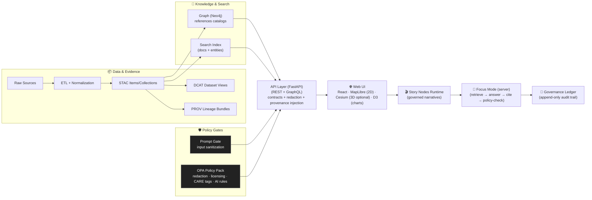

%20%2B%20Cesium%20(3D)-informational)


# 🌾 Kansas Frontier Matrix — Web UI (`web/`)

> **KFM Web** is the user-facing interface for exploring Kansas (and later other regions) as a **living atlas**:  
> **maps (2D/3D) + timeline + evidence + narratives**, with optional **Focus Mode (AI)** that is **opt‑in**, **citation‑backed**, and **policy‑gated**.

> 🏷️ *Provenance-first promise:* **“Provenance enforced — every insight has a footnote.”**  [oai_citation:0‡Kansas Frontier Matrix (KFM) – AI System Overview 🧭🤖.pdf](file-service://file-P4zHoJicw1HG6bXmqFygG8)

> [!IMPORTANT]
> **This README is a contract** ✅  
> It states what the Web UI **must do**, what it **must never do**, and how it stays aligned with the **v13 canonical pipeline**:  
> **ETL → STAC/DCAT/PROV → Graph → API → UI → Story Nodes → Focus Mode**.

---

## 🧭 Quick Links (v13 canonical map)

- 📘 **Master Guide (v13):** `../docs/MASTER_GUIDE_v13.md`
- 🧱 **Redesign Blueprint (v13):** `../docs/architecture/KFM_REDESIGN_BLUEPRINT_v13.md`
- 🧾 **Markdown + Repo Structure Standard (v13):** `../docs/standards/` (see `KFM_*` profiles)
- 🧬 **Architecture & ADRs:** `../docs/architecture/`
- ⚖️ **Governance (FAIR+CARE):** `../docs/governance/`
- 🧾 **Story Nodes (canonical):** `../docs/reports/story_nodes/` (`draft/` → `published/`)
- 🧰 **Schemas:** `../schemas/` (including `schemas/storynodes/`, `schemas/ui/`, `schemas/telemetry/`)
- 🧱 **API boundary:** `../src/server/` *(v13 canonical home; UI never bypasses it)*
- 🧩 **Graph build tooling:** `../src/graph/`
- 🧪 **Pipelines/ETL:** `../src/pipelines/`
- 📦 **Catalogs:** `../data/stac/`, `../data/catalog/dcat/`, `../data/prov/`

> [!NOTE]
> If your branch still has legacy paths (e.g., `api/` or `api/scripts/policy/`), treat them as **migration candidates** toward v13’s **one canonical home per subsystem** principle.

---

## 🧾 Table of Contents

- [✨ What KFM Web is](#-what-kfm-web-is)
- [🧰 Tech stack snapshot](#-tech-stack-snapshot)
- [🧱 v13 UI Pillars](#-v13-ui-pillars)
- [🚫 Non‑Negotiables](#-nonnegotiables)
- [🏗️ System Flow](#️-system-flow)
- [🧭 Information Architecture](#-information-architecture)
- [🔁 One shared state model](#-one-shared-state-model)
- [🔌 UI ↔ API contracts](#-ui--api-contracts)
- [🗺️ Map + 3D viewer stack](#️-map--3d-viewer-stack)
- [🔎 Search](#-search)
- [⏳ Timeline](#-timeline)
- [🧾 Provenance UX](#-provenance-ux)
- [🎬 Story Nodes](#-story-nodes)
- [🧠 Focus Mode (AI) — Hard Gate](#-focus-mode-ai--hard-gate)
- [📦 Offline & Field Mode](#-offline--field-mode)
- [🔴 Realtime & dashboards](#-realtime--dashboards)
- [🛡️ Security & privacy](#️-security--privacy)
- [♿ Accessibility](#-accessibility)
- [📈 Observability & telemetry](#-observability--telemetry)
- [🧪 Testing & release](#-testing--release)
- [🚀 Local development](#-local-development)
- [✅ CI / Quality gates](#-ci--quality-gates)
- [🧩 Contribution recipes](#-contribution-recipes)
- [🧭 Roadmap — high impact](#-roadmap--high-impact)
- [📚 Project library](#-project-library)
- [📜 License & attribution](#-license--attribution)

---

## ✨ What KFM Web is

KFM Web is a **map‑centric evidence browser** that can also run guided narratives (Story Nodes) and optionally provide **governed AI synthesis** (Focus Mode). The UI is intentionally **not** a data silo, and it is **not** a backdoor to raw sources.  [oai_citation:1‡Kansas Frontier Matrix (KFM) – Comprehensive Technical Documentation.pdf](file-service://file-VgLA7nv34M5muqZ5MQxBLG)

**If it renders in the browser, it must have:**
- ✅ an **API contract** (UI is read-only; no direct DB access)  [oai_citation:2‡Kansas Frontier Matrix (KFM) – AI System Overview 🧭🤖.pdf](file-service://file-P4zHoJicw1HG6bXmqFygG8)
- ✅ a **catalog identity** (STAC/DCAT)
- ✅ **lineage** (PROV)
- ✅ a **license + attribution path**
- ✅ **sensitivity/classification behavior** (CARE-aware)

**Also non‑optional in v13:** application state must be **shareable + reloadable** through **bookmarkable URLs** representing the view/story state.  [oai_citation:3‡Kansas Frontier Matrix (KFM) – Comprehensive UI System Overview (Technical Architecture Guide).pdf](file-service://file-MbEYbsLWBmpXVYXVF79c38)

---

## 🧰 Tech stack snapshot

### ✅ Required (v13 baseline)
- **React + TypeScript** (strict typing encouraged)  [oai_citation:4‡Kansas Frontier Matrix (KFM) – Comprehensive UI System Overview (Technical Architecture Guide).pdf](file-service://file-MbEYbsLWBmpXVYXVF79c38)
- **MapLibre GL JS** for 2D maps (primary, always-on)  [oai_citation:5‡Kansas Frontier Matrix (KFM) – AI System Overview 🧭🤖.pdf](file-service://file-P4zHoJicw1HG6bXmqFygG8)
- **CesiumJS** for optional 3D globe/terrain (when value-add)  [oai_citation:6‡Kansas Frontier Matrix (KFM) – AI System Overview 🧭🤖.pdf](file-service://file-P4zHoJicw1HG6bXmqFygG8)
- **D3.js** for timeline + charts/indicators (when needed)  [oai_citation:7‡Kansas Frontier Matrix (KFM) – Comprehensive Architecture, Features, and Design.pdf](file-service://file-Qj23Z329hf1Q1WD86hXYfL)
- **Global state** (Redux *or* Context) to keep map/timeline/story/search synchronized  [oai_citation:8‡Kansas Frontier Matrix (KFM) – Comprehensive UI System Overview (Technical Architecture Guide).pdf](file-service://file-MbEYbsLWBmpXVYXVF79c38)
- **Governed API** (FastAPI + REST + GraphQL) as the *only* data entry point into the UI  [oai_citation:9‡Kansas Frontier Matrix (KFM) – Comprehensive Technical Documentation.pdf](file-service://file-VgLA7nv34M5muqZ5MQxBLG)
- **OPA policy gate** (server-enforced; UI must surface decisions safely)  [oai_citation:10‡Kansas Frontier Matrix (KFM) – AI System Overview 🧭🤖.pdf](file-service://file-P4zHoJicw1HG6bXmqFygG8)

### 🧩 Strongly recommended (quality + velocity)
- **Component library** (reusable UI blocks) + optional **Storybook**-style docs  [oai_citation:11‡Kansas Frontier Matrix (KFM) – Comprehensive UI System Overview (Technical Architecture Guide).pdf](file-service://file-MbEYbsLWBmpXVYXVF79c38)
- **E2E tests** (Cypress/Playwright) for critical flows  [oai_citation:12‡Kansas Frontier Matrix (KFM) – Comprehensive UI System Overview (Technical Architecture Guide).pdf](file-service://file-MbEYbsLWBmpXVYXVF79c38)
- **Dockerized local stack** (Compose brings up API + DB + UI dev server)  [oai_citation:13‡Kansas Frontier Matrix (KFM) – Comprehensive UI System Overview (Technical Architecture Guide).pdf](file-service://file-MbEYbsLWBmpXVYXVF79c38)
- **PWA** affordances for offline/low-connectivity deployments (Field Mode path)  [oai_citation:14‡Kansas Frontier Matrix (KFM) – Comprehensive Platform Overview and Roadmap.pdf](file-service://file-J9i6fUc35zPWB2U62zUnEN)

---

## 🧱 v13 UI Pillars

### 1) 🗺️ Map‑first exploration
- 2D map view **always available**
- Optional 3D view (terrain / 3D Tiles) when it adds value
- Layer catalog (toggle / style / opacity / attribution)
- Timeline slider for temporal navigation (range + playhead)
- Feature inspection + metadata + provenance drill‑down

### 2) 🔎 Evidence‑first trust
- Every visualization traces back to cataloged evidence (**STAC/DCAT/PROV**)
- Users can open **“the map behind the map”** at any time  [oai_citation:15‡Kansas Frontier Matrix (KFM) – Comprehensive Technical Documentation.pdf](file-service://file-VgLA7nv34M5muqZ5MQxBLG)
- Shares/exports preserve attribution + provenance links (and AI bibliographies where applicable)  [oai_citation:16‡Kansas Frontier Matrix (KFM) – AI System Overview 🧭🤖.pdf](file-service://file-P4zHoJicw1HG6bXmqFygG8)

### 3) 🎬 Narrative‑first learning (Story Nodes)
- Step‑based narratives synced with map state + time
- Stories are **governed content**, versioned and reviewable (PR workflow)  [oai_citation:17‡Kansas Frontier Matrix (KFM) – Comprehensive UI System Overview (Technical Architecture Guide).pdf](file-service://file-MbEYbsLWBmpXVYXVF79c38)
- Citations are visible and clickable inside stories

### 4) 🧠 Safe AI assistance (Focus Mode)
- **Opt‑in only**
- Always labeled **AI-generated**
- **Citations required** (“no citation, no answer”)  [oai_citation:18‡Kansas Frontier Matrix (KFM) – AI System Overview 🧭🤖.pdf](file-service://file-P4zHoJicw1HG6bXmqFygG8)
- **Policy‑gated** (Prompt Gate + OPA output checks)  [oai_citation:19‡Kansas Frontier Matrix (KFM) – AI System Overview 🧭🤖.pdf](file-service://file-P4zHoJicw1HG6bXmqFygG8)
- “Why am I seeing this?” disclosure (datasets used + redactions applied + audit context)  [oai_citation:20‡Kansas Frontier Matrix (KFM) – AI System Overview 🧭🤖.pdf](file-service://file-P4zHoJicw1HG6bXmqFygG8)

### 5) 🔗 Reproducible sharing (URL as state)
- **Bookmarkable URLs** represent map + time + filters + story step for reloadable views  [oai_citation:21‡Kansas Frontier Matrix (KFM) – Comprehensive UI System Overview (Technical Architecture Guide).pdf](file-service://file-MbEYbsLWBmpXVYXVF79c38)
- Same story id + version + step → same behavior (deterministic playback)

---

## 🚫 Non‑Negotiables

### 1) 🔁 Pipeline ordering is absolute (v13 invariant)
No stage may “skip ahead” of prior boundary artifacts:

**ETL → STAC/DCAT/PROV → Graph → API → UI → Story Nodes → Focus Mode**

### 2) 🚪 The UI is a client — never a data backdoor
The UI **never**:
- queries Neo4j directly
- reads PostGIS directly
- reads raw datasets directly
- bundles “mystery data” in the client to bypass governance  [oai_citation:22‡Kansas Frontier Matrix (KFM) – Comprehensive Technical Documentation.pdf](file-service://file-VgLA7nv34M5muqZ5MQxBLG)

### 3) 🧾 Provenance‑first rendering
If it shows up in the UI, it must be:
- discoverable via **API** (contracted)
- traceable to **STAC/DCAT/PROV** (provable)
- licensed/attributed (reusable)
- classification-aware (safe at this zoom/detail level)

### 4) 🎬 Story state must be reproducible
- Same story id + story version → same map/time behavior
- Any shared view carries enough metadata to reproduce later (not just a screenshot)
- Storyboards are declarative JSON steps executed by the UI (no custom code required for authors)  [oai_citation:23‡Kansas Frontier Matrix (KFM) – Comprehensive UI System Overview (Technical Architecture Guide).pdf](file-service://file-MbEYbsLWBmpXVYXVF79c38)

### 5) 🧠 Focus Mode is advisory, transparent, governed
- AI output is **not** official truth  
- It is **cited synthesis** (and may refuse when data is missing or sensitive)  [oai_citation:24‡Kansas Frontier Matrix (KFM) – AI System Overview 🧭🤖.pdf](file-service://file-P4zHoJicw1HG6bXmqFygG8)
- AI is sandboxed with **no unapproved tools** (allow‑list empty by default)  [oai_citation:25‡KFM AI Infrastructure – Ollama Integration Overview.pdf](file-service://file-HCn72HddNvaaXqpJL4svTv)
- Where governance requires: AI output is **auditable** (policy version hash + append‑only ledger)  [oai_citation:26‡Kansas Frontier Matrix (KFM) – AI System Overview 🧭🤖.pdf](file-service://file-P4zHoJicw1HG6bXmqFygG8)

---

## 🏗️ System Flow



**Notes:**
- Focus Mode is implemented server-side; the UI is a thin client that passes context (location, active layers, timeline) and renders structured, cited results.  [oai_citation:27‡Kansas Frontier Matrix (KFM) – Comprehensive UI System Overview (Technical Architecture Guide).pdf](file-service://file-MbEYbsLWBmpXVYXVF79c38)
- API is the single gateway/guardrail; it can merge PostGIS geometry + Neo4j semantics + search index results in one response.  [oai_citation:28‡Kansas Frontier Matrix (KFM) – Comprehensive Architecture, Features, and Design.pdf](file-service://file-Qj23Z329hf1Q1WD86hXYfL)

---

## 🧭 Information Architecture

### 🗺️ Core screens (minimum)
- **Map Explorer** (default): map + layers + timeline + inspector
- **Catalog**: dataset discovery (facets + filters + licensing + sensitivity)
- **Story**: Story Nodes runtime (step-based narrative)
- **Evidence**: provenance + lineage views (per layer / per feature / per claim)
- **Search**: places, datasets, stories, entities/documents (as contracts exist)
- **Settings**: accessibility, performance, privacy, AI opt-in/out, offline mode controls

### 🔐 Admin / moderation surfaces (when enabled)
- Story review queue (draft → published)
- Dataset review & governance gates
- Telemetry dashboards (privacy-respecting)

### 🧭 Search UX (grouped results)
Search should return results **grouped by type** (place, dataset/layer, story node, knowledge-graph concept/entity) to reduce confusion and speed discovery.  [oai_citation:29‡Kansas Frontier Matrix (KFM) – Comprehensive Platform Overview and Roadmap.pdf](file-service://file-J9i6fUc35zPWB2U62zUnEN)

---

## 🔁 One shared state model

Everything the UI can show must be representable as a serializable **View State** (URL-safe), so views can be shared and reloaded reproducibly.  [oai_citation:30‡Kansas Frontier Matrix (KFM) – Comprehensive UI System Overview (Technical Architecture Guide).pdf](file-service://file-MbEYbsLWBmpXVYXVF79c38)

### ✅ View State must include
- map camera (2D or 3D) + viewport bounds
- active layers + styles + opacity
- timeline range + playhead
- filters (space/time/category/sensitivity)
- selected feature(s)
- story id + version + step index (when in story mode)
- focus context scope (when Focus Mode is enabled)

### 🔎 Example (illustrative)
```json
{
  "viewer": "2d",
  "camera": { "lng": -98.0, "lat": 38.5, "zoom": 6.2, "bearing": 0, "pitch": 0 },
  "time": { "start": "1930-01-01", "end": "1940-12-31", "playhead": "1936-06-01" },
  "layers": [
    { "id": "drought_index", "opacity": 0.85, "style": "default" },
    { "id": "towns_1935", "opacity": 1.0 }
  ],
  "filters": { "sensitivity": "public", "bbox": [-103, 36, -94, 41] },
  "selection": { "type": "feature", "layerId": "towns_1935", "id": "town:12345" },
  "story": { "id": "dust-bowl-black-sunday", "version": "1.0.0", "step": 3 },
  "focusMode": { "enabled": false }
}
```

> [!TIP]
> Treat View State as an explicit schema (see `schemas/ui/`) and validate it on load. Bad state should fail safely.

---

## 🔌 UI ↔ API contracts

> If a UI feature can’t be expressed as an API contract, it’s not ready to ship.

### Required contract categories
- **Catalog discovery:** DCAT view + KFM extensions (facets, license, sensitivity)
- **STAC:** items/collections + asset links
- **Tiles & distributions:** vector tiles, rasters, 3D Tiles, downloads
- **Feature query:** by bbox, id, and time range
- **Graph views:** related entities/events/documents (via API, never direct Neo4j)  [oai_citation:31‡Kansas Frontier Matrix (KFM) – Comprehensive Technical Documentation.pdf](file-service://file-VgLA7nv34M5muqZ5MQxBLG)
- **Search:** place/dataset/story/entity/document search  [oai_citation:32‡Kansas Frontier Matrix (KFM) – Comprehensive Platform Overview and Roadmap.pdf](file-service://file-J9i6fUc35zPWB2U62zUnEN)
- **Story Nodes:** list/get story content by `draft|published` + version
- **Focus Mode:** request/response shape includes:
  - answer (markdown/text)
  - citations list (resolvable to evidence)
  - datasets used + redactions applied
  - uncertainty/confidence signal (even coarse)
  - audit id / policy hash (when required)  [oai_citation:33‡Kansas Frontier Matrix (KFM) – AI System Overview 🧭🤖.pdf](file-service://file-P4zHoJicw1HG6bXmqFygG8)
- **Realtime:** polling and/or WebSockets (optional)

### Example REST surface (illustrative)
These are example patterns mentioned in the technical guide; confirm exact routes in your API repo/docs:

- `GET /layers`
- `GET /layers/{layer_id}/tile/{z}/{x}/{y}.pbf` (vector tiles)
- `GET /datasets`
- `GET /datasets/{id}/download`
- `GET /search?q=...`  [oai_citation:34‡📚 Kansas Frontier Matrix (KFM) – Expanded Technical & Design Guide.pdf](file-service://file-Tjmzn5F3sT5VNvVFhqj1Vo)

### API invariants the UI must assume
- **Single entry point**: UI talks to the API only (no direct DB connections)  [oai_citation:35‡Kansas Frontier Matrix (KFM) – Comprehensive Technical Documentation.pdf](file-service://file-VgLA7nv34M5muqZ5MQxBLG)
- API may **merge multiple stores** (PostGIS + Neo4j + search index) into one response  [oai_citation:36‡Kansas Frontier Matrix (KFM) – Comprehensive Architecture, Features, and Design.pdf](file-service://file-Qj23Z329hf1Q1WD86hXYfL)
- API injects **provenance/context** (license, source, lineage references) for UI display  [oai_citation:37‡Kansas Frontier Matrix (KFM) – Comprehensive Architecture, Features, and Design.pdf](file-service://file-Qj23Z329hf1Q1WD86hXYfL)

### UI-side validation (strongly recommended ✅)
- Validate API responses against JSON Schema (`schemas/*`)
- Fail “loudly” with a safe UX message (no silent junk rendering)
- Contract breaks should be visible in dev + captured in telemetry

---

## 🗺️ Map + 3D viewer stack

### 🗺️ 2D: MapLibre GL JS (always-on)
- Primary 2D renderer for vector tiles + overlays
- Can support offline scenarios with self-hosted tiles (Field Mode path)  [oai_citation:38‡Kansas Frontier Matrix (KFM) – Comprehensive Architecture, Features, and Design.pdf](file-service://file-Qj23Z329hf1Q1WD86hXYfL)
- Must work with “low power” devices (performance mode)

### 🌍 3D: CesiumJS (optional)
- Used for terrain, 3D Tiles, volumetric/time-aware visualization
- 3D is not the default “because it’s cool” — it’s a tool for terrain/structure context

### 📊 Charts/Indicators: D3.js (as-needed)
- Timeline graphs, uncertainty bands, model indicators, dashboards  [oai_citation:39‡Kansas Frontier Matrix (KFM) – Comprehensive Architecture, Features, and Design.pdf](file-service://file-Qj23Z329hf1Q1WD86hXYfL)

### 🔁 2D ↔ 3D state preservation
Switching viewers should preserve:
- camera intent (center/zoom/heading)
- active layers (where equivalent exists)
- timeline state + playhead

### 🧠 Performance rules (non-negotiable)
- 2D must remain usable even if 3D fails or is disabled
- No blocking work on the main thread for heavy parsing → use Web Workers
- Prefer tiles + paging over large GeoJSON payloads

---

## 🔎 Search

Search is not “just a box” — it’s a discovery engine across:
- **places** (geocoding or gazetteer)
- **datasets/layers** (catalog)
- **stories** (Story Nodes library)
- **entities / concepts** (knowledge graph)
- **documents** (full-text index)  [oai_citation:40‡Kansas Frontier Matrix (KFM) – AI System Overview 🧭🤖.pdf](file-service://file-P4zHoJicw1HG6bXmqFygG8)

> [!NOTE]
> Focus Mode retrieval may use full-text search + (optionally) vector similarity for semantic passage retrieval; the UI should treat this as server-side behavior and only render the structured output/citations.  [oai_citation:41‡Kansas Frontier Matrix (KFM) – AI System Overview 🧭🤖.pdf](file-service://file-P4zHoJicw1HG6bXmqFygG8)

---

## ⏳ Timeline

Timeline supports:
- **range** (start/end)
- **playhead** (animation)
- **event markers** from graph (where contracts exist)

KFM’s UI goal: make time **as easy to navigate as space**.  [oai_citation:42‡Kansas Frontier Matrix (KFM) – Comprehensive UI System Overview (Technical Architecture Guide).pdf](file-service://file-MbEYbsLWBmpXVYXVF79c38)

Layer temporal behavior:
- Layers declare temporal validity
- UI signals when a layer is out-of-range (and handles gracefully)
- Story steps can set timeline deterministically

---

## 🧾 Provenance UX

### 🧾 “Map behind the map” (baseline)
For any active layer, the UI must provide:
- source org
- license & attribution text
- STAC/DCAT links (dataset identity)
- PROV link (lineage)
- sensitivity/classification tags
- “prepared by / processed on” (when present)  [oai_citation:43‡Kansas Frontier Matrix (KFM) – AI System Overview 🧭🤖.pdf](file-service://file-P4zHoJicw1HG6bXmqFygG8)

### 🔎 Feature inspection (click → evidence)
When a user clicks a feature:
- show properties + units
- show provenance links
- show related graph entities/events/documents (via API)
- show quality indicators when available (uncertainty, completeness)

### 🧠 AI provenance (when Focus Mode is used)
AI outputs are treated like derived products:
- visible citations (click → evidence)
- provenance behind the scenes (PROV activity referencing sources + model version)
- append-only ledger for auditability  [oai_citation:44‡Kansas Frontier Matrix (KFM) – AI System Overview 🧭🤖.pdf](file-service://file-P4zHoJicw1HG6bXmqFygG8)

### 🔐 Sensitivity-aware affordances
The UI must make restrictions visible and understandable:
- 🔒 padlock / ⚠️ warning for restricted layers
- coarse representations where needed (generalized polygons / hex bins)
- explicit disclaimer: **“Generalized for sovereignty / safety”**
- “Why can’t I see this?” → policy-guided explanation (no leaking details)

---

## 🎬 Story Nodes

Story Nodes are **machine-ingestible storytelling**:
- authored in **Markdown** (narrative, media, citations)
- paired with **JSON storyboard** (camera/layers/timeline/highlights)

### ✅ Canonical location (v13)
- Draft: `../docs/reports/story_nodes/draft/<story_slug>/`
- Published: `../docs/reports/story_nodes/published/<story_slug>/`

### 🎛 Storyboard execution (declarative)
The front-end reads a JSON “storyboard” and executes interface transitions at each step, so authors can define steps without writing UI code.  [oai_citation:45‡Kansas Frontier Matrix (KFM) – Comprehensive UI System Overview (Technical Architecture Guide).pdf](file-service://file-MbEYbsLWBmpXVYXVF79c38)

### Story runtime expectations
- Step-based (next/prev; optional scroll-driven)
- Each step can:
  - activate/deactivate layers
  - set camera (2D/3D compatible when possible)
  - set timeline range/playhead
  - highlight features/regions safely
  - attach citations + source cards
- Story text + citations are reviewed and version-controlled (PR-based publishing)  [oai_citation:46‡Kansas Frontier Matrix (KFM) – Comprehensive UI System Overview (Technical Architecture Guide).pdf](file-service://file-MbEYbsLWBmpXVYXVF79c38)

### Story Builder GUI (planned 🧰)
A future Story Builder should:
- let authors “record” steps by using the map/timeline
- generate JSON + Markdown
- enforce schema + citations + review gates  [oai_citation:47‡Kansas Frontier Matrix (KFM) – Comprehensive Platform Overview and Roadmap.pdf](file-service://file-J9i6fUc35zPWB2U62zUnEN)

> [!NOTE]
> Until Story Builder exists: use templates + examples + strict publish review.

---

## 🧠 Focus Mode (AI) — Hard Gate

Focus Mode is a **policy-gated assistant**, not a truth oracle.

### 🔁 UI workflow (thin client)
- User activates Focus Mode panel (AI Assistant button / input)
- UI sends user question to server-side AI service **with context**: map location, active layers, timeline, etc.
- UI renders a structured response: answer text + citations as clickable links/footnotes  [oai_citation:48‡Kansas Frontier Matrix (KFM) – Comprehensive UI System Overview (Technical Architecture Guide).pdf](file-service://file-MbEYbsLWBmpXVYXVF79c38)

### ✅ Core rules (must not regress)
- **Opt-in**: never appears by default
- **Clearly labeled**: always marked “AI-generated”
- **Citations required**: enforce “no citation, no answer”  [oai_citation:49‡Kansas Frontier Matrix (KFM) – AI System Overview 🧭🤖.pdf](file-service://file-P4zHoJicw1HG6bXmqFygG8)
- **Grounded retrieval**: answers use KFM data (graph, docs, datasets), not generic model memory  [oai_citation:50‡Kansas Frontier Matrix (KFM) – AI System Overview 🧭🤖.pdf](file-service://file-P4zHoJicw1HG6bXmqFygG8)
- **Prompt injection defense**: Prompt Gate sanitizes input before model sees it  [oai_citation:51‡Kansas Frontier Matrix (KFM) – AI System Overview 🧭🤖.pdf](file-service://file-P4zHoJicw1HG6bXmqFygG8)
- **Sandboxed**: no internet/filesystem/tool use unless explicitly allow-listed (default allow-list is empty)  [oai_citation:52‡KFM AI Infrastructure – Ollama Integration Overview.pdf](file-service://file-HCn72HddNvaaXqpJL4svTv)
- **OPA output checks**: redact/block unsafe content before the UI receives it  [oai_citation:53‡Kansas Frontier Matrix (KFM) – AI System Overview 🧭🤖.pdf](file-service://file-P4zHoJicw1HG6bXmqFygG8)
- **Auditability**: policy versioning + audit logs for decisions (policy hash recorded)  [oai_citation:54‡Kansas Frontier Matrix (KFM) – AI System Overview 🧭🤖.pdf](file-service://file-P4zHoJicw1HG6bXmqFygG8)

### Required UI behaviors
- Dedicated **Citations** area (click → open evidence record)
- Visible **uncertainty indicator** (even coarse)
- “Why am I seeing this?” disclosure:
  - datasets used
  - time range used
  - redactions applied
  - policy decision summary (safe)
  - model/version info (when appropriate)  [oai_citation:55‡Kansas Frontier Matrix (KFM) – AI System Overview 🧭🤖.pdf](file-service://file-P4zHoJicw1HG6bXmqFygG8)
- Clear “report an issue” affordance for governance learning

### Ollama (optional local LLM backend)
KFM can integrate a local Ollama runtime for Focus Mode — **server-side only** — while preserving Prompt Gate + OPA governance controls.  [oai_citation:56‡KFM AI Infrastructure – Ollama Integration Overview.pdf](file-service://file-HCn72HddNvaaXqpJL4svTv)

---

## 📦 Offline & Field Mode (PWA + Offline Packs)

### Use cases
- museums/exhibits with weak connectivity 🏛️
- field researchers & rural classrooms 🧑‍🏫
- “KFM in a box” travel installs 🧳

### Offline pack concept (planned)
User selects region + layers + stories → download a **bundle** containing:
- cached story content + citations
- offline tiles (e.g., PMTiles/MBTiles) + metadata
- minimal offline feature query (bounded + safe)  [oai_citation:57‡Kansas Frontier Matrix (KFM) – Comprehensive Platform Overview and Roadmap.pdf](file-service://file-J9i6fUc35zPWB2U62zUnEN)

> [!IMPORTANT]
> Offline packs must still respect governance: no bundle may include restricted detail beyond its approved audience.

### Emerging interface roadmap (experimental)
- **AR mode** is explicitly on the roadmap for field/education overlays and immersive exploration.  [oai_citation:58‡Kansas Frontier Matrix (KFM) – Comprehensive Platform Overview and Roadmap.pdf](file-service://file-J9i6fUc35zPWB2U62zUnEN)

---

## 🔴 Realtime & dashboards

KFM Web is designed to extend into:
- realtime sensor dashboards (river gauges, air quality, transit)
- live map layers (points/alerts updating on cadence)
- simulation viewers (“model projection” labels required)
- remote sensing time-series workflows (NDVI trends tied to timeline)

> Rule: model outputs are labeled as **models**, not facts, and remain evidence-linked.

---

## 🛡️ Security & privacy

### Baseline expectations
- Enforce least privilege in the browser (no secrets, no raw access)
- Strong CSP + safe iframe/embed policies
- Rate-limiting and abuse protections (especially around Focus Mode)
- Protect against inference attacks: repeated-query auditing + aggregation where needed
- Do not permit the UI to become a “sensitive location detector”

### Focus Mode specific hardening (UI + platform aligned)
- UI treats prompts as untrusted input (sanitized by Prompt Gate server-side)  [oai_citation:59‡Kansas Frontier Matrix (KFM) – AI System Overview 🧭🤖.pdf](file-service://file-P4zHoJicw1HG6bXmqFygG8)
- Output must pass OPA checks (redact/block) before it reaches the UI  [oai_citation:60‡Kansas Frontier Matrix (KFM) – AI System Overview 🧭🤖.pdf](file-service://file-P4zHoJicw1HG6bXmqFygG8)
- AI tool allow-list remains empty unless explicitly approved (no agents-by-default)  [oai_citation:61‡KFM AI Infrastructure – Ollama Integration Overview.pdf](file-service://file-HCn72HddNvaaXqpJL4svTv)

### Privacy-preserving patterns (align with policy gates)
- generalization (coarse geometry)
- suppression/removal (omit attributes entirely)
- aggregation (hex bins / county rollups)
- explicit disclaimers and “why” explanations
- audit trails for sensitive access and redactions

> [!NOTE]
> The broader data-mining + inference-risk mindset reinforces why KFM’s UI must not leak fine-grained details and must treat repeated queries as a security surface.  [oai_citation:62‡Data Mining Concepts & applictions.pdf](file-service://file-2uwEbQAFVKpXaTtWgUirAH)

---

## ♿ Accessibility

Non‑negotiable: KFM targets WCAG-aligned UX with sovereignty-aware design.  [oai_citation:63‡Kansas Frontier Matrix (KFM) – Comprehensive UI System Overview (Technical Architecture Guide).pdf](file-service://file-MbEYbsLWBmpXVYXVF79c38)

### Must-haves
- keyboard navigation for all controls (including timeline + layer toggles)  [oai_citation:64‡Kansas Frontier Matrix (KFM) – Comprehensive UI System Overview (Technical Architecture Guide).pdf](file-service://file-MbEYbsLWBmpXVYXVF79c38)
- visible focus states
- ARIA labels for map controls + panels  [oai_citation:65‡Kansas Frontier Matrix (KFM) – Comprehensive UI System Overview (Technical Architecture Guide).pdf](file-service://file-MbEYbsLWBmpXVYXVF79c38)
- screen reader affordances (text summaries for complex visuals when needed)  [oai_citation:66‡Kansas Frontier Matrix (KFM) – Comprehensive UI System Overview (Technical Architecture Guide).pdf](file-service://file-MbEYbsLWBmpXVYXVF79c38)
- high-contrast option  [oai_citation:67‡Kansas Frontier Matrix (KFM) – Comprehensive UI System Overview (Technical Architecture Guide).pdf](file-service://file-MbEYbsLWBmpXVYXVF79c38)
- avoid color-only encoding (legends must carry meaning)
- respect reduced motion preferences (timeline autoplay + camera pans should be pausable)  [oai_citation:68‡Kansas Frontier Matrix (KFM) – Comprehensive UI System Overview (Technical Architecture Guide).pdf](file-service://file-MbEYbsLWBmpXVYXVF79c38)

---

## 📈 Observability & telemetry

Telemetry is **privacy-respecting** and supports governance:
- performance metrics (p95/p99 for key actions)
- contract failure counters
- redaction notices shown (e.g., `focus_mode_redaction_notice_shown`)
- story publish workflow events
- offline pack usage signals (bounded + anonymized)

### AI quality + safety monitoring
- bias checks and drift monitoring should be part of ongoing evaluation (server side), while the UI surfaces safe indicators and user feedback affordances.  [oai_citation:69‡Kansas Frontier Matrix (KFM) – AI System Overview 🧭🤖.pdf](file-service://file-P4zHoJicw1HG6bXmqFygG8)

> [!NOTE]
> Telemetry schemas should be versioned and validated (`schemas/telemetry/`), just like data and story schemas.

---

## 🧪 Testing & release

### Testing pyramid (minimum)
- ✅ **Unit tests**: view-state serializer, layer registry, citation rendering
- ✅ **Integration tests**: story step execution updates map/timeline correctly
- ✅ **E2E tests**: Cypress/Playwright flows (“load → search → open story → step through → verify layers”)  [oai_citation:70‡Kansas Frontier Matrix (KFM) – Comprehensive UI System Overview (Technical Architecture Guide).pdf](file-service://file-MbEYbsLWBmpXVYXVF79c38)

### Release & deployment patterns (typical)
- UI ships as a static SPA bundle or a Docker image (NGINX serving static files), matching the containerized stack.  [oai_citation:71‡Kansas Frontier Matrix (KFM) – Comprehensive UI System Overview (Technical Architecture Guide).pdf](file-service://file-MbEYbsLWBmpXVYXVF79c38)
- Builds should be **versioned artifacts** (hash/version) to enable safe rollback.  [oai_citation:72‡Kansas Frontier Matrix (KFM) – Comprehensive UI System Overview (Technical Architecture Guide).pdf](file-service://file-MbEYbsLWBmpXVYXVF79c38)

> [!TIP]
> If you introduce a new UI feature, include an E2E “happy path” and at least one “policy gate path” (e.g., restricted layer redacted) before merge.

---

## 🗂️ What Lives in `web/`

Recommended v13-friendly structure (aligns with modular UI guidance):

```text
web/
├─ 📄 README.md
├─ 📄 package.json
├─ 📁 public/                      # static assets (favicons, manifest, etc.)
└─ 📁 src/
   ├─ 🧭 app/                       # routes + layout shell
   ├─ 🧩 components/                # reusable UI components (library)
   ├─ 🧰 services/                  # API clients, caching, schema validation, auth helpers
   ├─ 🧠 state/                     # global state + view-state serializer (URL)
   ├─ 🗺️ viewers/                   # MapLibre + Cesium adapters + shared map state
   ├─ ⏳ timeline/                  # timeline components + helpers (D3 as needed)
   ├─ 🔎 search/                    # search UI + result grouping
   ├─ 🎬 story_nodes/               # runtime only (viewer); content loads via API
   ├─ 🧠 focus_mode/                # citations renderer + disclosure + audit UX
   ├─ 🧵 workers/                   # Web Workers (heavy parsing / compute)
   ├─ 🎨 styles/                    # tokens + themes + a11y helpers
   └─ 🧪 __tests__/                 # unit/integration tests
```

> [!NOTE]
> Story Node **content** does not live in `web/` in v13 — it lives under `docs/reports/story_nodes/` and is loaded via governed endpoints.

---

## 🚀 Local development

> Toolchain-agnostic. Confirm exact scripts in `web/package.json`.

### Prereqs
- Node.js (LTS recommended)
- Running KFM API (REST + optional GraphQL)
- Optional: tile/asset service
- Optional: auth provider (for roles/moderation)

### Typical commands
```bash
cd web
npm install
npm run dev
```

### Full-stack local (recommended)
The UI guide anticipates a Docker Compose setup that brings up API, databases, and UI dev server together.  [oai_citation:73‡Kansas Frontier Matrix (KFM) – Comprehensive UI System Overview (Technical Architecture Guide).pdf](file-service://file-MbEYbsLWBmpXVYXVF79c38)

### Recommended `.env` interface
Create `web/.env.local`:

```dotenv
# Core APIs
KFM_API_BASE_URL=http://localhost:8000
KFM_GRAPHQL_URL=http://localhost:8000/graphql

# Optional: tiles & assets
KFM_TILE_BASE_URL=http://localhost:8000/tiles
KFM_ASSET_BASE_URL=http://localhost:8000/assets

# Feature flags (UI-only; server may enforce too)
KFM_ENABLE_3D=true
KFM_ENABLE_FOCUS_MODE=true
KFM_ENABLE_REALTIME=false
KFM_ENABLE_OFFLINE_PACKS=false
KFM_ENABLE_STORY_BUILDER=false
```

---

## ✅ CI / Quality gates

Minimum gates for UI-related changes:
- ✅ Markdown + front-matter validation
- ✅ link/reference validation
- ✅ JSON Schema validation (Story Nodes, UI view-state, telemetry where applicable)
- ✅ unit/integration tests (map render, layer toggle, inspect, story step)
- ✅ E2E tests (Cypress/Playwright) for critical flows  [oai_citation:74‡Kansas Frontier Matrix (KFM) – Comprehensive UI System Overview (Technical Architecture Guide).pdf](file-service://file-MbEYbsLWBmpXVYXVF79c38)
- ✅ a11y checks (keyboard + ARIA + contrast)
- ✅ security scans (deps, secrets, supply chain hygiene)
- ✅ dependency hygiene (audit, updates)
- ✅ provenance attestations & SBOMs (where pipeline is configured)

### Automation note (optional, platform-aligned)
KFM’s broader AI governance describes watcher/planner/executor automation patterns with a kill-switch and policy constraints; treat this as an optional extension to CI workflows, not a UI feature.  [oai_citation:75‡Kansas Frontier Matrix (KFM) – AI System Overview 🧭🤖.pdf](file-service://file-P4zHoJicw1HG6bXmqFygG8)

> [!IMPORTANT]
> If you add a UI feature that references new data, you’re responsible for ensuring upstream contracts and metadata exist and validate.

---

## 🧩 Contribution recipes

### ✅ Definition of Done (DoD) checklist for UI PRs
- [ ] API contract exists (OpenAPI/GraphQL schema updated as needed)
- [ ] Provenance UX: source + license + lineage is visible somewhere appropriate
- [ ] Sensitivity behavior verified (restricted → redacted/generalized) 
- [ ] View State supports share/reload (URL)
- [ ] Tests: unit/integration + at least one E2E for critical flow
- [ ] A11y: keyboard path + ARIA labels updated
- [ ] Telemetry events added/updated with schema if needed

### 🗺️ Add a new layer
1) Upstream verification  
   - STAC entry exists  
   - DCAT entry exists  
   - PROV lineage exists  
   - API exposes it with redaction rules

2) UI wiring  
   - register layer (id/type/styles/source)
   - implement legend + attribution rendering
   - honor sensitivity tags (blur/generalize/hide)

3) Story + Focus integration  
   - citations resolve to evidence records
   - sensitive datasets cannot leak restricted details via Focus Mode

4) Tests  
   - layer registry test
   - feature click → evidence panel provenance links
   - story step safe usage test (if applicable)

### 🎬 Add a Story Node
- create: `docs/reports/story_nodes/draft/<story_slug>/`
- include:
  - `story.md` (narrative + citations)
  - `story.json` (steps + map state + timeline)
  - `assets/` if needed
- validate schema
- submit PR → review → publish to `published/`  [oai_citation:76‡Kansas Frontier Matrix (KFM) – Comprehensive UI System Overview (Technical Architecture Guide).pdf](file-service://file-MbEYbsLWBmpXVYXVF79c38)

### 🧠 Change Focus Mode UI
Must keep:
- opt‑in gate
- AI labeling
- citations + evidence rendering
- disclosure panel (datasets used + redactions)
- safe fallback for refusals / missing data
- audit/policy context rendering where provided  [oai_citation:77‡Kansas Frontier Matrix (KFM) – AI System Overview 🧭🤖.pdf](file-service://file-P4zHoJicw1HG6bXmqFygG8)

Add tests:
- “no citations → blocked render”
- “sensitive dataset → generalized output + warning”
- “audit id/policy hash present → link renders”

---

## 🧭 Roadmap — high impact

High-trust, high-leverage next builds:
- 🧾 Evidence Panel v1 (citations + provenance summaries + “open lineage”)  [oai_citation:78‡Kansas Frontier Matrix (KFM) – AI System Overview 🧭🤖.pdf](file-service://file-P4zHoJicw1HG6bXmqFygG8)
- 🧭 Layer Provenance Panel v1 (active layers list + licenses + sensitivity)  [oai_citation:79‡Kansas Frontier Matrix (KFM) – AI System Overview 🧭🤖.pdf](file-service://file-P4zHoJicw1HG6bXmqFygG8)
- 🧠 Focus Mode “Why” panel v1 (datasets used + redactions + policy summary)  [oai_citation:80‡Kansas Frontier Matrix (KFM) – AI System Overview 🧭🤖.pdf](file-service://file-P4zHoJicw1HG6bXmqFygG8)
- 🎬 Story Builder GUI (reduce JSON friction; preserve governance)  [oai_citation:81‡Kansas Frontier Matrix (KFM) – Comprehensive Platform Overview and Roadmap.pdf](file-service://file-J9i6fUc35zPWB2U62zUnEN)
- 📦 Offline Pack Builder (region + layers + stories → export bundle)  [oai_citation:82‡Kansas Frontier Matrix (KFM) – Comprehensive Platform Overview and Roadmap.pdf](file-service://file-J9i6fUc35zPWB2U62zUnEN)
- 🔴 Realtime layer demo (e.g., river gauge or air quality) with provenance stamps
- 🧪 Scenario viewer (render sandbox simulation outputs clearly labeled “simulated”)  [oai_citation:83‡Kansas Frontier Matrix (KFM) – Comprehensive Platform Overview and Roadmap.pdf](file-service://file-J9i6fUc35zPWB2U62zUnEN)
- 🧠 Uncertainty UX patterns (display confidence/coverage bands; show when data is incomplete) — highlighted as a gap/opportunity  [oai_citation:84‡Kansas-Frontier-Matrix Design Audit – Gaps and Enhancement Opportunities.pdf](file-service://file-TkRzAfTnxCYDUHauCf1NcH)
- 🧬 Ontology/semantic layer improvements to strengthen graph + discovery UX (longer-horizon)  [oai_citation:85‡Kansas-Frontier-Matrix Design Audit – Gaps and Enhancement Opportunities.pdf](file-service://file-TkRzAfTnxCYDUHauCf1NcH)
- 🧪 AI regression tests in CI (when running local Ollama with small models)  [oai_citation:86‡KFM AI Infrastructure – Ollama Integration Overview.pdf](file-service://file-HCn72HddNvaaXqpJL4svTv)

---

## 📚 Project library

<details>
<summary><strong>🏛️ KFM Core (architecture + UI + governance)</strong></summary>

- 📘 **Expanded Technical & Design Guide** — onboarding, pipeline, governance, UI/AI overview  [oai_citation:87‡📚 Kansas Frontier Matrix (KFM) – Expanded Technical & Design Guide.pdf](file-service://file-Tjmzn5F3sT5VNvVFhqj1Vo)  
- 🧱 **Comprehensive Technical Documentation** — architecture, FAIR/CARE, provenance-first contract  [oai_citation:88‡Kansas Frontier Matrix (KFM) – Comprehensive Technical Documentation.pdf](file-service://file-VgLA7nv34M5muqZ5MQxBLG)  
- 🧬 **Comprehensive Architecture, Features, and Design** — backend/API patterns, provenance/context injection  [oai_citation:89‡Kansas Frontier Matrix (KFM) – Comprehensive Architecture, Features, and Design.pdf](file-service://file-Qj23Z329hf1Q1WD86hXYfL)  
- 🗺️ **Comprehensive Platform Overview and Roadmap** — roadmap, offline packs, AR, story workflow  [oai_citation:90‡Kansas Frontier Matrix (KFM) – Comprehensive Platform Overview and Roadmap.pdf](file-service://file-J9i6fUc35zPWB2U62zUnEN)  
- 🧭 **Comprehensive UI System Overview (Technical Architecture Guide)** — modular UI, bookmarkable URLs, WCAG, story + focus integration  [oai_citation:91‡Kansas Frontier Matrix (KFM) – Comprehensive UI System Overview (Technical Architecture Guide).pdf](file-service://file-MbEYbsLWBmpXVYXVF79c38)  
- 🤖 **AI System Overview 🧭🤖** — Focus Mode safeguards: citations, Prompt Gate, OPA checks, audit logs  [oai_citation:92‡Kansas Frontier Matrix (KFM) – AI System Overview 🧭🤖.pdf](file-service://file-P4zHoJicw1HG6bXmqFygG8)  
- 🧠 **AI Infrastructure – Ollama Integration** — local LLM integration under Prompt Gate + OPA, sandboxing/allow-list  [oai_citation:93‡KFM AI Infrastructure – Ollama Integration Overview.pdf](file-service://file-HCn72HddNvaaXqpJL4svTv)  

</details>

<details>
<summary><strong>🔍 Design audits & concept docs</strong></summary>

- 🔍 **Design Audit – Gaps and Enhancement Opportunities** — uncertainty UX, semantic layer, extensibility  [oai_citation:94‡Kansas-Frontier-Matrix Design Audit – Gaps and Enhancement Opportunities.pdf](file-service://file-TkRzAfTnxCYDUHauCf1NcH)  
- 🧠 **Open-Source Geospatial Historical Mapping Hub Design** — open standards patterns & mapping hub ideas  [oai_citation:95‡Kansas-Frontier-Matrix_ Open-Source Geospatial Historical Mapping Hub Design.pdf](file-service://file-64djFYQUCmxN1h6L6X7KUw)  

</details>

<details>
<summary><strong>🧪 Protocol, research, and data safety references</strong></summary>

- 🧪 **Scientific Method / Master Coder Protocol** — documentation rigor, repeatability mindset  [oai_citation:96‡Scientific Method _ Research _ Master Coder Protocol Documentation.pdf](file-service://file-HTpax4QbDgguDwxwwyiS32)  
- 🛡️ **Data Mining Concepts & applications** — inference risk, privacy-aware analytics concepts  [oai_citation:97‡Data Mining Concepts & applictions.pdf](file-service://file-2uwEbQAFVKpXaTtWgUirAH)  
- 🧰 **Python Geospatial Analysis Cookbook (routing/web analysis)** — analysis patterns informing future UI extensions  [oai_citation:98‡KFM- python-geospatial-analysis-cookbook-over-60-recipes-to-work-with-topology-overlays-indoor-routing-and-web-application-analysis-with-python.pdf](file-service://file-2gpiGDZS8iw6EdxGswEdHp)  
- 🗄️ **Data Management / Data Science / Bayesian methods portfolio** — modeling & data theory references (PDF portfolio)  [oai_citation:99‡Data Managment-Theories-Architures-Data Science-Baysian Methods-Some Programming Ideas.pdf](file-service://file-RrXMFY7cP925exsQYermf2)  

</details>

<details>
<summary><strong>📦 Reference packs (PDF portfolios with embedded books/resources)</strong></summary>

> These are **PDF portfolios** (embedded resources). GitHub previews may not show embedded docs — open with a portfolio-capable PDF reader.  [oai_citation:100‡Geographic Information-Security-Git-R coding-SciPy-MATLAB-ArcGIS-Apache Spark-Type Script-Web Applications.pdf](file-service://file-TH7HttQXn8Bh1hVhcj858V)

- 🤖 **AI Concepts & more** — AI/LLM resources (portfolio)  [oai_citation:101‡Geographic Information-Security-Git-R coding-SciPy-MATLAB-ArcGIS-Apache Spark-Type Script-Web Applications.pdf](file-service://file-TH7HttQXn8Bh1hVhcj858V)  
- 🗺️🎮 **Maps / Google Maps / Virtual Worlds / Archaeological CG / Geospatial WebGL** — 3D/WebGL references (portfolio)  [oai_citation:102‡Data Mining Concepts & applictions.pdf](file-service://file-2uwEbQAFVKpXaTtWgUirAH)  
- 🧑‍💻🔧 **Mapping + Modeling + Git + HTTP + CSS + Docker + GraphQL + Security** — web/dev ops field manual (portfolio)  [oai_citation:103‡Various programming langurages & resources 1.pdf](file-service://file-4wp3wSSZs7gk5qHWaJVudi)  
- 🌐🛡️ **Geographic Information + Security + Git + R/SciPy/MATLAB + ArcGIS + Spark + TypeScript + Web Apps** — geospatial + web app references (portfolio)  [oai_citation:104‡Maps-GoogleMaps-VirtualWorlds-Archaeological-Computer Graphics-Geospatial-webgl.pdf](file-service://file-RshcX5sNY2wpiNjRfoP6z6)  
- 📚 **Various programming languages & resources** — polyglot reference pack (portfolio)  [oai_citation:105‡Kansas-Frontier-Matrix Design Audit – Gaps and Enhancement Opportunities.pdf](file-service://file-TkRzAfTnxCYDUHauCf1NcH)  

</details>

---

## 📜 License & attribution

KFM’s trust model depends on:
- showing license + attribution wherever data is displayed
- preserving provenance links (STAC/DCAT/PROV)
- making citations clickable in Story Nodes and Focus Mode
- ensuring exports/shares carry proper credit

If you change UI behavior that affects *what is shown*, verify it doesn’t weaken:
- 🔗 traceability
- 🫥 sensitivity protections
- 📜 attribution

---

<!--
Governance alignment cross-check:
- docs/governance/ROOT_GOVERNANCE.md
- docs/governance/ETHICS.md
- docs/governance/SOVEREIGNTY.md
- docs/governance/REVIEW_GATES.md
-->