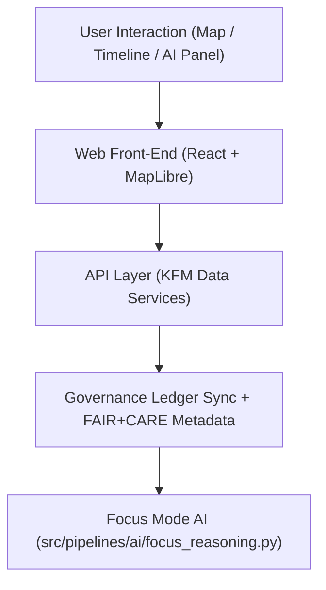

<div align="center">

# 🌐 Kansas Frontier Matrix — **Web Application & Focus Mode Platform**
`web/README.md`

**Purpose:**  
Defines the architecture, accessibility standards, and ethical interaction design principles for the **Kansas Frontier Matrix (KFM) Web Platform** — including Focus Mode, Data Explorer, and Governance Dashboard interfaces.  
This layer integrates geospatial storytelling, historical archives, and AI explainability through a **FAIR+CARE-certified, ISO-aligned** open web experience.

[](../docs/standards/faircare-validation.md)
[]()
[]()
[](../LICENSE)

</div>

---

## 📚 Overview

The `web/` directory contains the complete **front-end application and interaction framework** for the Kansas Frontier Matrix — built using **React, MapLibre, and D3**.  
It visualizes multi-temporal, spatial, and narrative data from FAIR+CARE-certified repositories and presents AI-explainable insights through Focus Mode.

This platform ensures:
- Ethical and accessible user interfaces.
- Transparent integration of AI and provenance metadata.
- FAIR+CARE-aligned storytelling and participatory engagement.
- Reproducible, versioned builds aligned with MCP-DL documentation standards.

---

## 🗂️ Directory Layout

```plaintext
web/
├── README.md                                 # This file — overview of KFM web platform
│
├── public/                                   # Static web assets
│   ├── images/                               # Icons, UI backgrounds, map textures
│   ├── data/                                 # Example STAC metadata and JSON test feeds
│   ├── manifest.json                         # Web application manifest
│   └── index.html                            # Root HTML entry point
│
├── src/                                      # React application source code
│   ├── components/                           # Core UI components (Map, Timeline, Panels)
│   ├── hooks/                                # Shared logic (state, data fetching, telemetry)
│   ├── pages/                                # Application routes and Focus Mode interface
│   ├── styles/                               # Design tokens, themes, and global styles
│   ├── utils/                                # Data formatting, API access, schema parsers
│   └── index.jsx                             # Root React entry file
│
└── package.json                              # Build metadata and dependency manifest
```

---

## 🧭 Web Architecture



### Components
- **Front-End:** React + Vite build system with modular components.  
- **Map Engine:** MapLibre GL JS for open-source spatial rendering.  
- **Charts & Analytics:** D3 and Recharts for FAIR+CARE telemetry visualization.  
- **Governance Sync:** Pulls ledger, provenance, and ethics metadata into Focus Mode.  
- **Accessibility Layer:** WCAG 2.2 AA-compliant color and typography systems.  

---

## 🧠 Focus Mode (AI Narrative Interface)

**Focus Mode** is KFM’s flagship web experience, combining AI, provenance data, and spatial visualization to narrate the history and evolution of Kansas.  
It integrates:
- FAIR+CARE-certified datasets across climate, hydrology, and hazards.  
- AI explainability panels with SHAP-based reasoning displays.  
- Interactive timeline slider for spatiotemporal exploration.  
- “Provenance Lens” overlay for metadata and ledger viewing.  

All data shown in Focus Mode is:
- Verified against `data/reports/audit/data_provenance_ledger.json`
- Governed under FAIR+CARE ethical review
- Rendered via accessible, sustainable open-source design principles

---

## ⚙️ Key Technologies

| Component | Framework / Tool | Purpose |
|------------|------------------|----------|
| **Front-End Framework** | React 18 / Vite | High-performance modular app. |
| **Map Engine** | MapLibre GL JS | Open geospatial rendering engine. |
| **Data Visualization** | D3 / Recharts | Telemetry and FAIR+CARE dashboards. |
| **Accessibility Validation** | Axe-core / Lighthouse CI | Continuous accessibility testing. |
| **Ethical AI Integration** | TensorFlow.js / Explainable JSON outputs | Real-time explainability visualizations. |
| **Provenance Sync** | REST + GraphQL Governance API | Live ledger integration for Focus Mode. |

---

## ⚖️ FAIR+CARE Web Governance

| Principle | Implementation | Verification |
|------------|----------------|--------------|
| **Findable** | Indexed components, datasets, and provenance metadata accessible via UI. | @kfm-data |
| **Accessible** | WCAG 2.2 AA compliance and text-alternative UX design. | @kfm-accessibility |
| **Interoperable** | RESTful APIs follow DCAT/STAC schema conventions. | @kfm-architecture |
| **Reusable** | Open-source under MIT with component-level documentation. | @kfm-architecture |
| **Collective Benefit** | Built to support education, civic research, and inclusivity. | @faircare-council |
| **Authority to Control** | FAIR+CARE Council manages user data and AI explainability governance. | @kfm-governance |
| **Responsibility** | Accessibility and environmental audits logged in telemetry. | @kfm-sustainability |
| **Ethics** | Interface content reviewed under cultural and environmental ethics. | @kfm-ethics |

Audit trail available in:  
`releases/v9.6.0/governance/ledger_snapshot_2025Q4.json`

---

## ♿ Accessibility & Design Tokens

The KFM web platform adopts the **Platinum UI Token System**, ensuring accessibility, visual balance, and cognitive equity:

| Token Type | Source | Standard |
|-------------|---------|----------|
| **Color Tokens** | `docs/design/tokens/color-palette.md` | WCAG 2.2 AA |
| **Typography Tokens** | `docs/design/tokens/typography-system.md` | ISO 9241-210 |
| **Spacing Tokens** | `docs/design/tokens/spacing-grid.md` | MCP-DL Layout Spec |
| **Accessibility Tokens** | `docs/design/tokens/accessibility-tokens.md` | FAIR+CARE Inclusivity Review |

---

## 🌱 Web Sustainability Metrics

| Metric | Target | Verified By |
|---------|---------|--------------|
| Page Weight | ≤ 1.5 MB | @kfm-accessibility |
| Lighthouse Accessibility Score | ≥ 95% | CI/CD (web-accessibility.yml) |
| Renewable CDN Usage | 100% | @kfm-sustainability |
| Governance Sync Latency | < 2s | @kfm-telemetry |

Metrics tracked in:  
`releases/v9.6.0/focus-telemetry.json`

---

## 🧾 Internal Use Citation

```text
Kansas Frontier Matrix (2025). Web Application & Focus Mode Platform (v9.6.0).
Open-source, FAIR+CARE-certified web interface integrating geospatial, temporal, and AI-explainable data storytelling for the Kansas Frontier Matrix.
Built with accessibility, sustainability, and provenance transparency at its core.
```

---

## 🧾 Version Notes

| Version | Date | Notes |
|----------|------|--------|
| v9.6.0 | 2025-11-03 | Introduced real-time governance sync and Focus Mode AI explainability integration. |
| v9.5.0 | 2025-11-02 | Enhanced accessibility tokens and telemetry monitoring. |
| v9.3.2 | 2025-10-28 | Established web UI, Focus Mode interface, and governance-linked map system. |

---

<div align="center">

**Kansas Frontier Matrix** · *Web Transparency × FAIR+CARE Ethics × Accessible AI Storytelling*  
[🔗 Repository](https://github.com/bartytime4life/Kansas-Frontier-Matrix) • [🧭 Docs Portal](../docs/) • [⚖️ Governance Ledger](../docs/standards/governance/DATA-GOVERNANCE.md)

</div>
