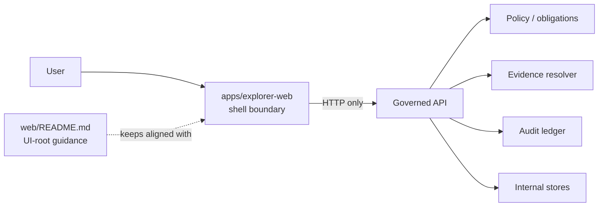

<!-- [KFM_META_BLOCK_V2]
doc_id: kfm://doc/NEEDS_VERIFICATION
title: Kansas Frontier Matrix Web UI
type: standard
version: v1
status: draft
owners: NEEDS VERIFICATION
created: NEEDS VERIFICATION
updated: 2026-04-12
policy_label: NEEDS VERIFICATION
related: [web/README.md, ../README.md, ../apps/README.md, ../apps/explorer-web/README.md, ../apps/governed-api/README.md, ../contracts/README.md, ../policy/README.md, ../tests/README.md, ../data/README.md, ../.github/README.md]
tags: [kfm]
notes: [Metadata placeholders remain where the current session exposed the README draft and attached doctrine PDFs but not the mounted repo metadata registry, CODEOWNERS, or verified runtime-root authority.]
[/KFM_META_BLOCK_V2] -->

# Kansas Frontier Matrix Web UI

Map-first, time-aware, evidence-first UI guidance for KFM-Web and its governed browser boundary.

> **Status:** experimental  
> **Owners:** `NEEDS VERIFICATION` — confirm against [`../.github/CODEOWNERS`](../.github/CODEOWNERS) before merge  
>         
> **Quick jumps:** [Scope](#scope) · [Repo fit](#repo-fit) · [Accepted inputs](#accepted-inputs) · [Exclusions](#exclusions) · [Directory tree](#directory-tree) · [Quickstart](#quickstart) · [Usage](#usage) · [Diagram](#diagram) · [Tables](#tables) · [Task list](#task-list--definition-of-done) · [FAQ](#faq) · [Appendix](#appendix)  
> **Repo fit:** `web/README.md` · root [`../README.md`](../README.md) · runtime family [`../apps/README.md`](../apps/README.md) · parallel shell boundary [`../apps/explorer-web/README.md`](../apps/explorer-web/README.md) · governed API [`../apps/governed-api/README.md`](../apps/governed-api/README.md) · shared law [`../contracts/README.md`](../contracts/README.md), [`../policy/README.md`](../policy/README.md), [`../tests/README.md`](../tests/README.md), [`../data/README.md`](../data/README.md), [`../.github/README.md`](../.github/README.md)  
> **Doctrine anchors:** map-first shell, timeline coequality, mandatory Evidence Drawer, bounded Focus, trust-visible states, governed API only, and 2D-first rules.

> [!IMPORTANT]
> Treat this file as the **UI-root guidance surface** and `apps/explorer-web` as the **shell-boundary sibling** until the active branch intentionally consolidates or supersedes one of them.

> [!CAUTION]
> Current-session evidence for this revision remained PDF-rich. Shell doctrine is strong; mounted repo topology, CODEOWNERS ownership, startup authority, and deeper `web/` subtree contents still need active-branch verification.

> [!NOTE]
> This revision preserves the strongest substance already carried in the supplied `web/README.md` text—trust membrane, cite-or-abstain Focus, `audit_ref`, Evidence Drawer, and local-dev guidance—while making doctrine, proposed structure, and still-unknown runtime depth visibly separate.

## Scope

`web/` is KFM’s UI-root guidance surface for the browser-facing shell.

In KFM terms, this is not “just frontend notes.” It is the place where browser-side rules for map-first exploration, timeline coequality, Story playback, Evidence Drawer drill-through, and bounded Focus consumption stay explicit and reviewable without pretending the browser is allowed to decide truth on its own.

Use this README to answer four questions quickly:

1. What is the browser allowed to do?
2. What must it never do?
3. How does `web/` relate to `apps/explorer-web/` and the governed API?
4. Which subtree claims are current facts in this revision, and which are only recommended structure?

### Evidence labels used here

| Label | Meaning in this README |
|---|---|
| **CONFIRMED** | Directly supported by the attached KFM corpus or by the supplied README text in hand |
| **INFERRED** | Conservative interpretation of repeated doctrine or adjacent documentation patterns |
| **PROPOSED** | Repo-native guidance that fits KFM law but is not yet proven as current mounted implementation |
| **UNKNOWN** | Not supported strongly enough to present as current runtime or active-branch reality |
| **NEEDS VERIFICATION** | Explicit placeholder to check on the active branch before merge |

[Back to top](#kansas-frontier-matrix-web-ui)

## Repo fit

**Path:** `web/README.md`  
**Role:** UI-root README for KFM-Web and its browser-boundary invariants.

### Current documentation signals that matter now

| Signal | Why it matters | Status |
|---|---|---|
| The supplied `web/README.md` text is already specific, doctrine-heavy, and not a generic placeholder | Strong substance should be preserved, not replaced with bland rewrite | **CONFIRMED** |
| A sibling `apps/explorer-web/README.md` is treated as the shell-boundary companion | Cross-links should be deliberate rather than drifting by accident | **NEEDS VERIFICATION** |
| `apps/README.md` and `apps/governed-api/README.md` are treated as adjacent runtime surfaces | `web/` should read as UI-root guidance, not as if it is the only runtime boundary | **NEEDS VERIFICATION** |
| Deeper `web/` subtree contents and live runtime-root authority were not directly re-opened in this session | Layout and startup guidance must stay split into “current snapshot” vs “proposed working subtree” | **NEEDS VERIFICATION** |

### Boundary rule

`web/` should own:

- UI-root guidance
- browser-boundary rules
- client-side contract carry-forward
- map/runtime integration expectations
- local verification and startup notes

`web/` should not silently become the owner of:

- canonical truth
- policy adjudication
- evidence-resolution law
- release authority
- source onboarding
- direct data access

### Upstream and downstream links

| Relation | Path | Why it matters |
|---|---|---|
| Repo root | [`../README.md`](../README.md) | Repo-wide identity, truth path, and verification posture |
| Runtime family | [`../apps/README.md`](../apps/README.md) | Places `web/` in the broader runtime/app landscape |
| Parallel shell boundary | [`../apps/explorer-web/README.md`](../apps/explorer-web/README.md) | Closest sibling doc for shell law and runtime-boundary framing |
| Governed API | [`../apps/governed-api/README.md`](../apps/governed-api/README.md) | Browser traffic should cross this boundary, not stores directly |
| Shared contracts | [`../contracts/README.md`](../contracts/README.md) | Browser DTOs should stay aligned with shared contract law |
| Shared policy | [`../policy/README.md`](../policy/README.md) | Default-deny and obligation logic stay outside UI components |
| Shared data/catalog | [`../data/README.md`](../data/README.md) | Truth-path zones, release artifacts, and catalog closure remain upstream of rendering |
| Shared verification | [`../tests/README.md`](../tests/README.md) | Negative paths, accessibility, trust cues, and release proof belong here |
| Repo gatehouse | [`../.github/README.md`](../.github/README.md) | Review routing, CI posture, and merge-boundary expectations |

[Back to top](#kansas-frontier-matrix-web-ui)

## Accepted inputs

Only the following classes of work belong in `web/README.md`:

| Input class | Belongs here? | Notes |
|---|---:|---|
| UI-root shell invariants | Yes | Map-first, time-aware, evidence-first browser rules |
| Map runtime guidance | Yes | MapLibre-centered 2D portrayal, optional burden-bearing 3D notes |
| Evidence Drawer consumer guidance | Yes | How governed evidence is rendered, not how it is adjudicated |
| Focus / Story / Dossier presentation rules | Yes | Shell composition and trust-visible behavior |
| Browser-side contract carry-forward | Yes | `ViewState`, `Citation`, `Focus`-response, and drawer-payload expectations |
| Local verification and startup notes | Yes | Branch-first inspection, then optional dev commands |
| Accessibility and trust-cue expectations | Yes | Keyboard, reduced motion, visible negative states |
| Client-side service-boundary guidance | Yes | Explicit network boundary, no hidden fetches |
| Canonical evidence resolver rules | No | Belong to governed API or evidence resolver surfaces |
| Policy bundle authoring | No | Belongs in `../policy/` |
| Source onboarding / ingest / promotion | No | Belongs in pipelines, workers, and governed data surfaces |
| Browser-side access to raw, work, or unpublished data | No | Explicitly excluded by KFM truth-path law |
| Direct model-runtime access from browser code | No | Focus stays a governed API flow |

## Exclusions

These shortcuts do **not** belong here, and this README should not make them sound acceptable:

| Exclusion | Why it stays out | Put it here instead |
|---|---|---|
| Direct database, graph, or object-store calls from browser code | Breaks the trust membrane | Governed API / evidence resolver / signed delivery |
| Browser access to `RAW`, `WORK`, `QUARANTINE`, or unpublished data | Violates the truth path | Governed data and review paths |
| Policy decisions embedded in components | Creates drift between UI and enforcement | `../policy/` plus backend enforcement |
| App-local copies of canonical schemas/contracts | Creates shadow truth | `../contracts/` and shared schema surfaces |
| Hidden `fetch()` / `axios` calls scattered through components and hooks | Hides trust-boundary violations in presentation code | Explicit service layer only |
| Restricted payload caching in browser storage | Risks leakage and stale truth | Server-mediated, scoped hydration only |
| Free-form uncited assistant behavior | Violates cite-or-abstain | Governed Focus flow |
| Browser-owned ingest, diff, or promotion logic | Reverses the proof burden | Workers, pipelines, and governed release surfaces |

> [!WARNING]
> The browser is the easiest place to make unsafe shortcuts feel convenient. KFM-Web has to resist that pressure on purpose.

[Back to top](#kansas-frontier-matrix-web-ui)

## Directory tree

### Current confirmed revision snapshot

```text
web/
└── README.md
```

That is the only subtree fact this revision treats as directly settled from the supplied doc in hand.

### Proposed working subtree

The following shape is still useful, but it should remain visibly **PROPOSED / NEEDS VERIFICATION** until the active branch proves it:

```text
web/
├── README.md
├── package.json              # NEEDS VERIFICATION
├── tsconfig.json             # NEEDS VERIFICATION
├── .env.example              # PROPOSED / NEEDS VERIFICATION
├── public/                   # PROPOSED
│   └── ...
└── src/                      # PROPOSED
    ├── main.tsx
    ├── app/
    │   ├── App.tsx
    │   ├── router.tsx
    │   └── layout/
    ├── contracts/
    │   ├── viewstate.ts
    │   ├── citations.ts
    │   ├── evidence.ts
    │   └── api.ts
    ├── services/
    │   ├── apiClient.ts
    │   ├── focusClient.ts
    │   ├── evidenceResolver.ts
    │   ├── bundleResolver.ts
    │   └── auditClient.ts
    ├── components/
    │   ├── map/
    │   ├── story/
    │   ├── focus/
    │   ├── evidence/
    │   └── audit/
    ├── features/
    ├── hooks/
    ├── styles/
    ├── assets/
    ├── test/
    └── __tests__/
```

### Interpretation rule

- If the active branch proves `web/` is the live runtime root, document that directly here.
- If the active branch instead treats `apps/explorer-web/` as the real runtime root, keep `web/README.md` focused on UI-root guidance and reduce duplication.
- Do not silently blur those two states together.

[Back to top](#kansas-frontier-matrix-web-ui)

## Quickstart

### 1) Verify the active branch first

```bash
find web -maxdepth 4 -print | sort
find apps/explorer-web -maxdepth 4 -print | sort

sed -n '1,240p' web/README.md
sed -n '1,240p' apps/explorer-web/README.md
sed -n '1,220p' apps/governed-api/README.md

sed -n '1,220p' contracts/README.md
sed -n '1,220p' policy/README.md
sed -n '1,220p' tests/README.md
sed -n '1,220p' data/README.md
```

### 2) If `web/` is the live runtime root on your branch

```bash
cd web
cp .env.example .env 2>/dev/null || true
npm install
npm run dev
```

### 3) If `apps/explorer-web/` is the live runtime root

Use [`../apps/explorer-web/README.md`](../apps/explorer-web/README.md) as the startup authority and keep this file limited to UI-root guidance.

### Example local URLs

Treat these as **illustrative defaults**, not verified branch facts:

- Web UI: `http://localhost:3000`
- API docs: `http://localhost:8000/docs`

> [!IMPORTANT]
> Browser-visible environment values are public by default. Never place secrets in `.env`, `.env.example`, or shipped bundles.

[Back to top](#kansas-frontier-matrix-web-ui)

## Usage

### The prove-it loop

KFM-Web should keep the user inside a repeatable loop where every consequential claim can be traced:

1. **Choose layers** → show dataset identity, license, attribution, and sensitivity
2. **Set time + place** → scope the current view explicitly
3. **Inspect features** → expose provenance hooks and evidence routes
4. **Play Story** → change view state deterministically
5. **Ask Focus** → return cited synthesis plus `audit_ref`, or abstain / deny / error
6. **Open evidence** → resolve citations into human-readable evidence views
7. **Verify integrity** → show digests, manifests, or attestations when present

If any step cannot be supported safely, the UI should degrade gracefully, preserve the audit trail, and avoid manufacturing a smoother answer than the evidence supports.

### Carry-forward rules that should not drift

- **Governed API only.** Browser traffic crosses a governed API boundary.
- **Evidence first.** Dataset ID, license, attribution, and sensitivity are not optional metadata.
- **Cite or abstain.** Focus returns citations and `audit_ref`, or a governed negative outcome.
- **No client-side bypass.** No direct store access, no stitched-together restricted truth, no “just this once” cache.
- **Thin client.** The browser consumes prepared descriptors, assets, and trust-bearing payloads; it does not manufacture canonical meaning.
- **2D first.** MapLibre-centered 2D is the default shell. 3D is conditional and burden-bearing.
- **Negative states stay visible.** Deny, abstain, stale, partial, restricted, generalized, and unavailable states must render plainly.

### Browser-side implementation rules

- Keep network I/O in an explicit service boundary.
- Keep client DTO adapters small and serializable.
- Treat `ViewState` as public metadata, not as a place to hide secrets or sensitive payloads.
- Keep Story playback deterministic enough that “replay” means something.
- Treat evidence-resolution fan-out as a performance and trust problem, not just a convenience problem.
- Preserve the separation between shell continuity state and trust-bearing state.
- Keep rendering logic in the renderer, not business meaning in style expressions or component glue.

[Back to top](#kansas-frontier-matrix-web-ui)

## Diagram


```mermaid
flowchart LR
    USER["User"]
    WEBDOC["web/README.md<br/>UI-root guidance"]
    SHELL["apps/explorer-web<br/>shell boundary"]
    API["Governed API"]
    PDP["Policy / obligations"]
    EV["Evidence resolver"]
    AUD["Audit ledger"]
    STORES["Internal stores"]

    USER --> SHELL
    WEBDOC -.keeps aligned with.-> SHELL
    SHELL -->|"HTTP only"| API
    API --> PDP
    API --> EV
    API --> AUD
    API --> STORES
```

[Back to top](#kansas-frontier-matrix-web-ui)

## Tables

### Surface matrix

| Surface | What it must do | What it must never do |
|---|---|---|
| **Map + Timeline** | Show what the user is looking at, with place and time as coequal controls | Hide dataset identity, license, or sensitivity behind “advanced” UI |
| **Story** | Choreograph shell state deterministically and keep citations inline | Turn narrative into an uncited slide deck |
| **Evidence Drawer** | Resolve claims into human-readable evidence, provenance, and integrity cues | Become a dead-end metadata panel or a policy bypass |
| **Focus** | Return bounded synthesis with citations and `audit_ref`, or abstain / deny / error | Behave like a detached free-form assistant |
| **Review / Compare / Export** | Preserve the same trust cues and role-gating as exploration | Create a second truth regime outside the shell |
| **Controlled 3D** | Answer a real explanatory burden while preserving the same trust objects | Turn KFM into a spectacle-first 3D shell |

### Load-bearing UI contracts

| Contract | Minimum rule | Why it stays small |
|---|---|---|
| **`ViewStateV1`** | Time range, bbox, active layers, optional story/view anchor; no secrets | Drives replay, Focus grounding, and audit context |
| **`Citation`** | Stable `ref` plus optional human label / locator | Powers cite-or-abstain and evidence resolution |
| **`EvidenceDrawerPayloadV1`** | Support summary, identity, scope, rights/sensitivity, freshness/review, transform/provenance, and audit linkage | Keeps the drawer trust-bearing rather than decorative |
| **`FocusAnswerV1`** | `answer_markdown`, `citations[]`, `audit_ref`, optional status | Keeps bounded synthesis inspectable |
| **Evidence reference schemes** | Keep resolver schemes stable and documented | Avoid drift in evidence plumbing |

### Focus runtime outcomes

| Outcome | Meaning | User next step |
|---|---|---|
| **ANSWER** | Structured synthesis with inline citations, scope echo, AI badge, and `audit_ref` | Open cited evidence, refine scope, or export with trust cues |
| **ABSTAIN** | Insufficient support inside the active scope | Narrow or widen scope explicitly, or inspect the evidence pool preview |
| **DENY** | Policy-safe refusal without leaking restricted detail | Inspect allowed actions or steward path if authorized |
| **ERROR** | Runtime or validation failure with shell context preserved | Retry, refine, or inspect audit linkage without losing place or time state |

### State ownership guardrail

| State class | Owner | Rule |
|---|---|---|
| **Shell continuity state** | Client shell store | Extent, selected object, active layers, compare anchors, open panels, mode, and local accessibility preferences may live in the shell |
| **Trust-bearing state** | Governed APIs and backend registries | Evidence state, policy state, review state, freshness, correction lineage, and release truth stay server-owned |
| **Persisted user products** | Governed services | Saved views, export manifests, review tasks, and compare snapshots may persist, but they rehydrate through current policy and release mediation |
| **Forbidden client truth** | No browser ownership allowed | Canonical data, unpublished artifacts, policy decisions, precise restricted geometry, and model-runtime internals must never become browser truth by convenience |

### Evidence reference schemes

| Scheme | Points to | Typical use |
|---|---|---|
| `dcat://` | dataset / distribution / license | catalog identity and rights |
| `stac://` | collection / item / asset | spatiotemporal assets |
| `prov://` | entity / activity / agent | lineage and transforms |
| `doc://` | document locator + span | PDFs, OCR, narrative extracts |
| `graph://` | node / edge | graph-backed context |
| `oci://` | digest-addressed bundle | immutable evidence packs |

### MapLibre delivery and performance guidance

| Concern | Guidance |
|---|---|
| Heavy vector layers | Prefer server tiling or PMTiles over huge inline GeoJSON |
| Dense point sets | Cluster or generalize by zoom |
| Large styles | Keep style JSON modular; avoid unnecessary layer proliferation |
| Provenance discoverability | Every rendered layer should link back to dataset metadata |
| 3D features | Keep them opt-in and burden-bearing, not default spectacle |
| Browser performance | Avoid whole-app rerenders on simple map-state changes |

[Back to top](#kansas-frontier-matrix-web-ui)

## Task list / definition of done

- [ ] The active branch clearly declares whether `web/` or `apps/explorer-web/` is the authoritative runtime root.
- [ ] Cross-links between this file and [`../apps/explorer-web/README.md`](../apps/explorer-web/README.md) are synchronized.
- [ ] Browser network I/O stays inside an explicit service layer.
- [ ] `citation.ref` resolves to a human-readable evidence view in **≤ 2 API calls**.
- [ ] Focus renders citations and `audit_ref` prominently and treats abstention as first-class.
- [ ] Dataset identity, license, attribution, and sensitivity are visible at the point of use.
- [ ] No secrets or restricted payload caches are introduced in browser storage.
- [ ] Accessibility, keyboard flow, and reduced-motion behavior are covered by tests.
- [ ] Trust-visible negative states are rendered for stale, restricted, partial, denied, and unavailable outcomes.
- [ ] Any 3D path remains explicitly conditional and does not weaken the 2D-first slice.

> [!TIP]
> A strong `web/README.md` is not the one with the most UI optimism. It is the one that makes the browser boundary hardest to misunderstand.

[Back to top](#kansas-frontier-matrix-web-ui)

## FAQ

### Is `web/` the live runtime root?

`NEEDS VERIFICATION`.

The current session confirms strong shell doctrine and the presence of a substantive `web/README.md` draft, but it did not directly surface the mounted repo tree needed to settle runtime-root authority.

### Can browser code call PostGIS, object storage, or graph/search services directly?

No.

The shell crosses the governed API boundary only.

### Can Focus return an uncited answer if the UI looks cleaner that way?

No.

If citations cannot be resolved safely for the current scope and permissions, abstention is the correct outcome.

### Where should canonical contracts and policy logic live?

Outside this directory.

Use shared contract, schema, policy, data, and test surfaces. `web/` may carry UI-facing adapters and guidance, but it must not become a shadow authority layer.

### When is 3D acceptable?

Only when it carries a real burden and does not weaken the 2D-first trust slice.

[Back to top](#kansas-frontier-matrix-web-ui)

## Appendix

<details>
<summary><strong>Appendix A — Carry-forward contract sketches</strong></summary>

```ts
export type ViewStateV1 = {
  v: 1;
  timeRange: [string, string];
  bbox: [number, number, number, number];
  activeLayers: string[];
  story?: {
    nodeId: string;
    stepId?: string;
  };
  viewId?: string;
};
```

```ts
export type Citation = {
  label?: string;
  ref: string;
  span?: {
    start?: number;
    end?: number;
    page?: number;
  };
};
```

```ts
export type FocusAnswerV1 = {
  answer_markdown: string;
  citations: Citation[];
  audit_ref: string;
  status?: "ok" | "abstain" | "deny" | "error";
};
```

</details>

<details>
<summary><strong>Appendix B — Example browser-visible environment block</strong></summary>

```bash
VITE_KFM_API_BASE_URL=http://localhost:8000
VITE_KFM_API_ALLOWLIST=http://localhost:8000,https://dev.api.kfm.example
```

Rule: treat browser-visible configuration as public metadata, never as a secret channel.

</details>

<details>
<summary><strong>Appendix C — Suggested UI trust-membrane lint gate</strong></summary>

```bash
# Example: fail if ad hoc network calls appear outside the explicit service layer.
git grep -nE 'fetch\(|axios\.|XMLHttpRequest' web ':!web/src/services/**'
```

Adapt the path if the active runtime root is `apps/explorer-web/` instead of `web/`.

</details>

<details>
<summary><strong>Appendix D — Example Evidence Drawer payload sketch</strong></summary>

```ts
export type EvidenceDrawerPayloadV1 = {
  claim: {
    title: string;
    state:
      | "supported"
      | "restricted"
      | "generalized"
      | "partial"
      | "stale"
      | "conflicted";
  };
  support_summary: string;
  identity: {
    evidence_ref: string;
    object_id?: string;
    dataset_version?: string;
  };
  scope: {
    place?: string;
    time_basis?: string;
    opened_from?: "explore" | "dossier" | "story" | "focus" | "export" | "review";
  };
  rights: {
    rights_class: string;
    sensitivity: string;
    transform?: string;
  };
  freshness_review: {
    freshness: string;
    review_state: string;
    correction_state?: string;
  };
  provenance: {
    transform_summary?: string;
    lineage_note?: string;
    resolver_version?: string;
  };
  audit: {
    audit_ref: string;
    receipt_ref?: string;
  };
};
```

This is illustrative and should stay subordinate to shared contracts if the active branch already defines a richer canonical payload.

</details>
