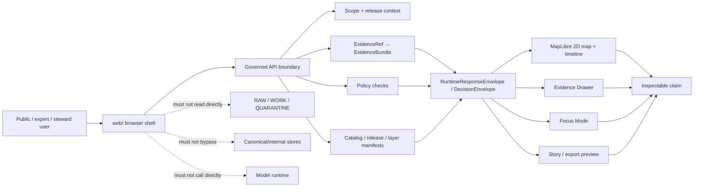

<!-- [KFM_META_BLOCK_V2]
doc_id: kfm://doc/NEEDS-VERIFICATION-web-readme-uuid
title: Kansas Frontier Matrix Web UI
type: standard
version: v1
status: draft
owners: TODO-VERIFY-web-owner
created: TODO-YYYY-MM-DD
updated: 2026-04-23
policy_label: TODO-confirm-public
related: [../README.md, ../apps/README.md, ../apps/explorer-web/README.md, ../apps/governed-api/README.md, ../contracts/README.md, ../schemas/README.md, ../policy/README.md, ../tests/README.md, ../data/README.md, ../.github/README.md]
tags: [kfm, web, ui, maplibre, evidence-drawer, focus-mode, governed-api]
notes: [Repo-ready replacement for web/README.md; owners, created date, policy label, and runtime depth require active-checkout verification.]
[/KFM_META_BLOCK_V2] -->

# Kansas Frontier Matrix Web UI

Map-first, time-aware, evidence-first UI guidance for KFM’s governed browser boundary.

> [!IMPORTANT]
> **Status:** `experimental`  
> **Owners:** `TODO-VERIFY-web-owner`  
> **Path:** `web/README.md`  
> **Surface:** browser UI root guidance for KFM-Web  
> **Evidence posture:** `CONFIRMED doctrine` / `PROPOSED web boundary contract` / `UNKNOWN runtime implementation depth`  
>         
> **Quick jumps:** [Scope](#scope) · [Repo fit](#repo-fit) · [Accepted inputs](#accepted-inputs) · [Exclusions](#exclusions) · [Directory tree](#directory-tree) · [Quickstart](#quickstart) · [Usage](#usage) · [Diagram](#diagram) · [Operating tables](#operating-tables) · [Task list](#task-list--definition-of-done) · [FAQ](#faq) · [Appendix](#appendix)

> [!NOTE]
> This README is intentionally conservative. It documents what `web/` should own in KFM and what must be verified before stronger claims are made about checked-in runtime code, package manager, app entrypoints, routes, components, workflow enforcement, or deployed behavior.

---

## Scope

`web/` is KFM’s browser-facing UI root guidance surface.

In KFM terms, this is not “frontend notes.” It is the place where browser-side expectations for map-first exploration, timeline coequality, Evidence Drawer drill-through, bounded Focus consumption, local development, accessibility, and trust-visible rendering stay explicit without pretending that the browser decides truth on its own.

Use this README to answer four questions quickly:

1. What is the browser allowed to render, request, and preserve?
2. What must it never decide or fetch directly?
3. How does `web/` relate to `apps/explorer-web/` and `apps/governed-api/`?
4. Which claims are doctrine, and which still need active-checkout verification?

### Evidence labels used here

| Label | Meaning in this README |
|---|---|
| `CONFIRMED` | Directly supported by attached KFM doctrine, current public repo evidence, or current-session workspace inspection. |
| `INFERRED` | Conservative interpretation of repeated doctrine or adjacent README patterns. |
| `PROPOSED` | Repo-native guidance that fits KFM law but is not yet proven as active runtime implementation. |
| `UNKNOWN` | Not supported strongly enough to present as current runtime, branch, package, route, or deployment reality. |
| `NEEDS VERIFICATION` | Explicit placeholder to check in the active checkout before merge. |

<p align="right"><a href="#kansas-frontier-matrix-web-ui">Back to top ↑</a></p>

---

## Repo fit

| Field | Value |
|---|---|
| Path | `web/README.md` |
| Role | UI-root README for KFM-Web and its governed browser-boundary invariants. |
| Upstream root | [`../README.md`](../README.md) |
| Runtime family | [`../apps/README.md`](../apps/README.md) |
| Closest shell sibling | [`../apps/explorer-web/README.md`](../apps/explorer-web/README.md) |
| Governed API boundary | [`../apps/governed-api/README.md`](../apps/governed-api/README.md) |
| Shared contract meaning | [`../contracts/README.md`](../contracts/README.md) |
| Machine shape boundary | [`../schemas/README.md`](../schemas/README.md) |
| Policy and admissibility | [`../policy/README.md`](../policy/README.md) |
| Verification and fixtures | [`../tests/README.md`](../tests/README.md) |
| Lifecycle and released artifacts | [`../data/README.md`](../data/README.md) |
| GitHub control surface | [`../.github/README.md`](../.github/README.md) |

### Boundary rule

`web/` should own browser-facing guidance, shell expectations, renderer integration constraints, local UI verification notes, and client-side contract carry-forward.

`web/` should not silently become the owner of canonical truth, source authority, policy adjudication, evidence-resolution law, release authority, raw data access, direct model access, or proof-object storage.

### Relationship to `apps/explorer-web/`

`web/` is the UI-root guidance surface. `apps/explorer-web/` is the closest documented shell-boundary sibling for the runnable map-first product surface. Keep both linked until the active branch intentionally consolidates, renames, or supersedes one of them through a documented path decision.

<p align="right"><a href="#kansas-frontier-matrix-web-ui">Back to top ↑</a></p>

---

## Accepted inputs

Only work with a clear browser-boundary role belongs here.

| Input class | Belongs here? | Notes |
|---|---:|---|
| UI-root shell invariants | Yes | Map-first, time-aware, evidence-first browser rules. |
| Browser-boundary guidance | Yes | What the browser may request, render, cache, deep-link, or preserve. |
| MapLibre runtime expectations | Yes | Renderer behavior, hit-testing, view state, layer display, and trust-cue display rules. |
| Evidence Drawer carry-forward | Yes | Payload routing expectations and visible trust-state requirements. |
| Focus Mode client behavior | Yes | Display and interaction rules for `ANSWER`, `ABSTAIN`, `DENY`, and `ERROR`. |
| Accessibility and trust-cue guidance | Yes | Keyboard access, focus order, readable state chips, and negative-state visibility. |
| Local UI verification commands | Yes, after verification | Package-manager-specific commands remain `NEEDS VERIFICATION` until package files are inspected. |
| Browser fixtures or snapshots | Maybe | Belong here only if the active repo convention places UI fixtures under `web/`; otherwise use `../tests/`. |
| Styling tokens and presentation assets | Maybe | Keep them here only when they are UI presentation assets, not policy, schema, or proof objects. |

> [!TIP]
> A browser feature belongs here when it makes governed evidence easier to see, compare, question, or review without moving truth assembly into the browser.

<p align="right"><a href="#kansas-frontier-matrix-web-ui">Back to top ↑</a></p>

---

## Exclusions

The fastest way to weaken KFM is to let UI convenience become an ungoverned shortcut.

| Do not place or decide here | Use instead | Reason |
|---|---|---|
| RAW, WORK, or QUARANTINE material | `../data/` lifecycle homes | The browser should not read unpublished, unresolved, or rights-unclear material as a normal path. |
| Canonical/internal truth stores | Governed service and data layers | Public UI must not bypass evidence, policy, audit, release, or correction controls. |
| Machine schemas | `../schemas/` | Shape validation must remain distinct from UI behavior. |
| Human semantic contracts | `../contracts/` | Object meaning should not be buried in components or styles. |
| Policy rules, rights logic, sensitivity rules | `../policy/` | The UI displays policy state; it does not decide policy. |
| Source onboarding rules | Source registry and pipeline lanes | Source role, rights, cadence, and activation state are upstream governance concerns. |
| Receipts, proofs, release manifests | `../data/receipts/`, `../data/proofs/`, `../release/` as repo conventions confirm | Process memory and release evidence remain separate from UI source. |
| Secrets, tokens, credentials, private endpoints | Secret manager or deployment configuration | No secret belongs in committed browser code or docs. |
| Direct model clients | Governed API adapter boundary | Focus Mode must not call model runtimes directly from browser code. |
| Emergency/life-safety instructions | Official emergency, health, or public-safety authorities | KFM contextualizes evidence; it is not an emergency alert system. |

> [!WARNING]
> A smooth map that hides evidence, freshness, review state, correction state, sensitivity posture, or policy denial is not a KFM success condition.

<p align="right"><a href="#kansas-frontier-matrix-web-ui">Back to top ↑</a></p>

---

## Directory tree

`NEEDS VERIFICATION`: replace this map with a generated inventory from the active checkout before claiming runtime depth.

```text
web/
└── README.md                         # this UI-root guidance surface

# Verify before documenting as current implementation:
web/<runtime-root>/                    # NEEDS VERIFICATION
web/<components-or-shell>/             # NEEDS VERIFICATION
web/<styles-or-assets>/                # NEEDS VERIFICATION
web/<fixtures-or-snapshots>/           # NEEDS VERIFICATION
web/<tests-or-e2e>/                    # NEEDS VERIFICATION
```

### Nearby surfaces already linked from this README

```text
apps/
├── README.md
├── explorer-web/
│   └── README.md
└── governed-api/
    └── README.md

contracts/
└── README.md

schemas/
└── README.md

policy/
└── README.md

tests/
└── README.md

data/
└── README.md
```

> [!CAUTION]
> Do not create a second browser-shell authority by accident. If the active branch uses both `web/` and `apps/explorer-web/`, keep one as UI-root guidance and one as shell/runtime boundary, or record a consolidation decision.

<p align="right"><a href="#kansas-frontier-matrix-web-ui">Back to top ↑</a></p>

---

## Quickstart

Start with evidence inventory, not package assumptions.

```bash
# Confirm the active checkout and branch.
git status --short
git branch --show-current
git rev-parse --show-toplevel

# Inspect this UI surface and adjacent runtime/doc surfaces.
find web -maxdepth 4 -type f | sort
find apps -maxdepth 4 -type f | sort
find contracts schemas policy tests data -maxdepth 4 -type f 2>/dev/null | sort
find .github/workflows -maxdepth 2 -type f 2>/dev/null | sort

# Search for trust-boundary vocabulary in browser-facing code and docs.
grep -RInE \
  'EvidenceBundle|EvidenceRef|DecisionEnvelope|RuntimeResponseEnvelope|LayerManifest|Focus Mode|Evidence Drawer|ANSWER|ABSTAIN|DENY|ERROR|RAW|WORK|QUARANTINE|PUBLISHED|Ollama|api/generate|api/chat' \
  web apps contracts schemas policy tests 2>/dev/null || true
```

> [!IMPORTANT]
> These commands prove only the files they inspect in the current checkout. They do not prove branch protection, required checks, runtime behavior, deployed routes, secret configuration, or production exposure posture.

### Package-manager commands

Package-manager-specific commands are `NEEDS VERIFICATION` until `package.json`, lockfiles, workspace config, or CI workflows are inspected.

```bash
# Use the repo-native command only after verification.
# Examples to adapt, not claims:
npm run dev
npm test
npm run lint
```

<p align="right"><a href="#kansas-frontier-matrix-web-ui">Back to top ↑</a></p>

---

## Usage

Use `web/` changes to make governed evidence easier to inspect, not to move governance into the browser.

### Change routing

| Change type | Before merge, verify… | Review emphasis |
|---|---|---|
| Map shell change | Layer data arrives through released artifacts, layer manifests, or governed API responses. | Renderer boundary, no raw/public bypass, trust cue visibility. |
| Timeline change | Time semantics are explicit: valid time, observed time, publication time, or review time. | Time is coequal with place, not a hidden filter. |
| Evidence Drawer change | Drawer payloads resolve `EvidenceRef` to support-bearing objects. | Source role, rights, sensitivity, review, release, correction. |
| Focus Mode change | The browser displays governed envelopes and finite outcomes. | No direct model client, no memory-only answers, cite-or-abstain behavior. |
| Style or visual cue change | Visual changes do not hide negative states or policy obligations. | Accessibility, readability, reviewability. |
| Export or story change | Trust cues, provenance, and correction state survive the output. | No polish that strips evidence context. |
| Local-dev change | Commands are backed by package files and CI or test evidence. | Avoid stale quickstarts and invented package-manager assumptions. |

### Client-side state ownership

The browser may own view state, selected feature identity, open drawer state, timeline position, comparison layout, UI preferences, and deep-link hydration.

The browser must not own final truth state, policy decisions, source authority, release state, rights/sensitivity adjudication, canonical identifiers, or publication decisions.

<p align="right"><a href="#kansas-frontier-matrix-web-ui">Back to top ↑</a></p>

---

## Diagram


```mermaid
flowchart LR
    User["Public / expert / steward user"] --> Web["web/ browser shell"]

    Web --> GAPI["Governed API boundary"]
    GAPI --> Scope["Scope + release context"]
    GAPI --> Policy["Policy checks"]
    GAPI --> Resolver["EvidenceRef → EvidenceBundle"]
    GAPI --> Catalog["Catalog / release / layer manifests"]

    Resolver --> Envelope["RuntimeResponseEnvelope / DecisionEnvelope"]
    Policy --> Envelope
    Catalog --> Envelope

    Envelope --> Map["MapLibre 2D map + timeline"]
    Envelope --> Drawer["Evidence Drawer"]
    Envelope --> Focus["Focus Mode"]
    Envelope --> Story["Story / export preview"]

    Map --> Claim["Inspectable claim"]
    Drawer --> Claim
    Focus --> Claim
    Story --> Claim

    Web -. "must not read directly" .-> Raw["RAW / WORK / QUARANTINE"]
    Web -. "must not bypass" .-> Canon["Canonical/internal stores"]
    Web -. "must not call directly" .-> Model["Model runtime"]
```

The core boundary is simple: the browser can make KFM legible and useful, but consequential claims must remain downstream of governed evidence, policy, review, release, and correction state.

<p align="right"><a href="#kansas-frontier-matrix-web-ui">Back to top ↑</a></p>

---

## Operating tables

### Browser boundary rules

| Rule | Required behavior |
|---|---|
| Governed API first | Public and ordinary steward browser surfaces call governed interfaces or released artifacts, not internal stores. |
| Evidence first | Consequential claims route to an `EvidenceBundle` before display, export, or synthesis. |
| Policy visible | Sensitivity, rights, review state, freshness, release state, and correction state remain visible where material. |
| Finite outcomes | UI represents `ANSWER`, `ABSTAIN`, `DENY`, and `ERROR` intentionally. |
| Renderer boundary | MapLibre draws and interacts; it does not own truth, policy, source authority, or review state. |
| AI subordinate | Focus Mode receives policy-safe evidence only and must cite, abstain, deny, or error. |
| Derived layers stay derived | Tiles, scenes, summaries, search indexes, and graph projections never replace canonical truth. |
| Fail closed | Missing rights, unresolved sensitivity, stale release state, or unavailable policy checks block publication-facing behavior. |

### Surface contract

| Surface | What belongs | What does not belong | Required posture |
|---|---|---|---|
| Map shell | Released layers, timeline controls, trust chips, drawer entry points | Raw records, hidden policy state, unreviewed joins | Evidence-visible and public-safe |
| Timeline | Valid-time, observed-time, publication-time, review-time controls | Silent temporal filtering that changes claim meaning | Time-aware and explicit |
| Evidence Drawer | Source role, evidence, rights, sensitivity, review, release, correction | Optional tooltip treatment | Mandatory for consequential claims |
| Focus Mode | Evidence-bounded synthesis and navigation | Free-form model answer detached from release objects | `ANSWER`, `ABSTAIN`, `DENY`, or `ERROR` |
| Review affordances | Diffs, obligations, denials, correction state | Hidden alternate truth system | Auditable and reversible |
| Export / story | Trust-preserving output | Evidence-stripped polish | Provenance and correction cues preserved |
| Controlled 3D | Burden-bearing terrain or structure explanation | Spectacle-first second product | Same trust objects as 2D |

<p align="right"><a href="#kansas-frontier-matrix-web-ui">Back to top ↑</a></p>

---

## Task list / Definition of done

A `web/` change is not ready merely because it renders.

- [ ] Path, owner, and adjacent READMEs are verified in the active checkout.
- [ ] This README’s KFM Meta Block v2 fields are reviewed and placeholders are resolved or explicitly accepted.
- [ ] Browser-visible claims can open or resolve an Evidence Drawer payload.
- [ ] Focus-like behavior displays finite outcomes and does not call model runtimes directly.
- [ ] No browser path reads `RAW`, `WORK`, or `QUARANTINE` as a normal public path.
- [ ] No UI route exposes canonical/internal stores directly.
- [ ] Layer styling does not carry policy, source authority, or release meaning by itself.
- [ ] Rights, sensitivity, freshness, review, release, and correction states are visible where material.
- [ ] Accessibility checks cover keyboard navigation, focus order, drawer opening, state chips, and negative outcomes.
- [ ] Tests or fixtures prove at least one success path and one denial, abstention, or error path.
- [ ] Package-manager and startup commands are backed by checked-in files.
- [ ] Rollback, disable, or feature-flag path is documented for public-facing changes.
- [ ] Any behavior-significant change updates adjacent contracts, schemas, policy notes, tests, or docs.

<p align="right"><a href="#kansas-frontier-matrix-web-ui">Back to top ↑</a></p>

---

## FAQ

### Is `web/` the source of truth for KFM?

No. `web/` is a browser-facing guidance surface. It may render maps, timelines, stories, drawers, and governed responses, but it does not own canonical truth, policy, source authority, or publication decisions.

### Can a map popup make a claim without evidence?

No. A consequential popup should route to an `EvidenceBundle` or clearly show that support is unavailable, restricted, stale, generalized, under review, denied, or unresolved.

### Can MapLibre style JSON carry business meaning?

Only as presentation. Business meaning, source role, knowledge character, policy posture, freshness, review state, and evidence routes belong in contracts, layer metadata, and governed payloads. A style expression is not a policy engine.

### Can Focus Mode call a local model directly?

No. Focus Mode must sit behind a governed API boundary. Model runtime access is an adapter concern after scope, policy, evidence resolution, and citation validation.

### Can review tools live under browser surfaces?

Yes, when they stay auditable, role-gated, policy-aware, and reversible. Review schemas, policy rules, fixtures, receipts, proofs, and promotion decisions still belong in their own homes.

### Why so many `UNKNOWN` and `NEEDS VERIFICATION` labels?

Because implementation evidence matters. KFM doctrine can define the intended trust posture; it cannot prove current routes, package manager, workflows, tests, branch settings, runtime logs, or deployment behavior without direct inspection.

<p align="right"><a href="#kansas-frontier-matrix-web-ui">Back to top ↑</a></p>

---

## Appendix

<details>
<summary>Glossary</summary>

| Term | Working meaning |
|---|---|
| Inspectable claim | A public-facing statement reconstructable to evidence, scope, source role, policy, review, release, and correction lineage. |
| Trust membrane | Boundary preventing internal/canonical/raw paths from becoming normal public truth paths. |
| EvidenceRef | Stable reference to evidence that must resolve into an `EvidenceBundle`. |
| EvidenceBundle | Human- and machine-inspectable support package. |
| DecisionEnvelope | Finite decision object carrying outcome, evidence refs, policy, reason codes, and obligations. |
| RuntimeResponseEnvelope | Outward runtime result shape for browser, Focus, API, and export surfaces. |
| SourceDescriptor | Source identity and governance record. |
| LayerManifest | Map-layer governance record binding renderer inputs to source, evidence, policy, and release state. |
| ReleaseManifest | Integrity and publication manifest for released artifacts. |
| CatalogMatrix | Catalog closure surface for datasets, distributions, evidence, and release objects. |
| Promotion | Governed state transition into public-safe release, not a file move. |
| Evidence Drawer | Trust-visible UI object that explains what backs a claim. |
| Focus Mode | Evidence-bounded synthesis surface with finite outcomes. |

</details>

<details>
<summary>Open verification backlog</summary>

- [ ] Confirm `web/` subtree contents in the active checkout.
- [ ] Confirm owner and CODEOWNERS coverage for `web/`.
- [ ] Confirm whether `web/`, `apps/explorer-web/`, or another path is the runtime browser root.
- [ ] Confirm package manager and local startup commands.
- [ ] Confirm actual MapLibre integration path, if present.
- [ ] Confirm Evidence Drawer and Focus Mode implementation paths, if present.
- [ ] Confirm layer registry, layer manifest, or UI registry locations.
- [ ] Confirm accessibility and browser test runner.
- [ ] Confirm workflow names and whether checks are merge-blocking.
- [ ] Confirm whether all README-like docs use KFM Meta Block v2 in the active branch.
- [ ] Resolve `created`, `owners`, `doc_id`, and `policy_label` placeholders in this README.

</details>
