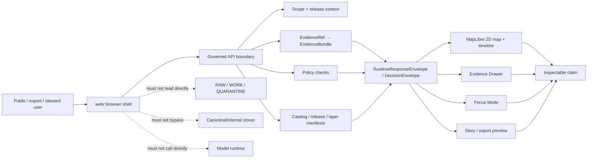

<!-- [KFM_META_BLOCK_V2]
doc_id: kfm://doc/NEEDS-VERIFICATION-web-readme-uuid
title: Kansas Frontier Matrix Web UI
type: standard
version: v1
status: draft
owners: TODO-VERIFY-web-owner
created: TODO-YYYY-MM-DD
updated: 2026-04-27
policy_label: TODO-confirm-public
related: ["TODO: verify ../README.md", "TODO: verify ../apps/README.md", "TODO: verify ../apps/explorer-web/README.md", "TODO: verify ../apps/governed-api/README.md", "TODO: verify ../contracts/README.md", "TODO: verify ../schemas/README.md", "TODO: verify ../policy/README.md", "TODO: verify ../tests/README.md", "TODO: verify ../data/README.md", "TODO: verify ../.github/README.md"]
tags: [kfm, web, ui, maplibre, evidence-drawer, focus-mode, governed-api]
notes: [Repo-ready replacement for web/README.md; owners, created date, policy label, related paths, and runtime depth require active-checkout verification.]
[/KFM_META_BLOCK_V2] -->

# Kansas Frontier Matrix Web UI

<p align="center">
  <strong>Map-first • time-aware • evidence-first • governed browser boundary</strong>
</p>

<p align="center">
  
  
  
  
  
  
  
</p>

<p align="center">
  <a href="#scope">Scope</a> ·
  <a href="#repo-fit">Repo fit</a> ·
  <a href="#accepted-inputs">Inputs</a> ·
  <a href="#exclusions">Exclusions</a> ·
  <a href="#quickstart">Quickstart</a> ·
  <a href="#diagram">Diagram</a> ·
  <a href="#validation">Validation</a> ·
  <a href="#rollback-and-correction">Rollback</a>
</p>

> [!IMPORTANT]
> This README is evidence-bounded UI-root guidance. It does not prove checked-in browser code, package manager, routes, workflows, tests, deployment, branch protection, or runtime behavior. Treat implementation-specific claims as `UNKNOWN` until verified from the active KFM checkout.

| Field | Value |
|---|---|
| Document status | `draft` |
| Lane posture | `experimental guidance` |
| Requested path | `web/README.md` |
| Owners | `TODO-VERIFY-web-owner` |
| Authoring evidence mode | `CORPUS_ONLY / NO_LOCAL_REPO_EVIDENCE` |
| Runtime implementation depth | `UNKNOWN` |
| Policy label | `TODO-confirm-public` |
| Public posture | Cite-or-abstain; fail closed on unresolved evidence, rights, sensitivity, review, or release state |
| Repo fit | UI-root guidance for the governed browser boundary; adjacent paths require active-checkout verification |

| What this document does | What it does not do |
|---|---|
| Defines the browser-side trust boundary for KFM-Web. | Does not make the browser the source of truth. |
| Describes how maps, timelines, Evidence Drawer, and Focus Mode should behave. | Does not prove MapLibre, Evidence Drawer, Focus Mode, or app routes are implemented. |
| Lists accepted inputs, exclusions, validation gates, and rollback expectations. | Does not authorize public release or source activation. |
| Preserves `UNKNOWN` and `NEEDS VERIFICATION` where repo evidence is absent. | Does not replace schemas, contracts, policy, receipts, release manifests, or EvidenceBundle resolution. |

---

## Scope

`web/` is the requested browser-facing UI root guidance surface for Kansas Frontier Matrix.

In KFM terms, this is not generic frontend documentation. It is the place where browser-side expectations for map-first exploration, time-aware interaction, Evidence Drawer drill-through, bounded Focus consumption, accessibility, trust-visible rendering, local verification, and rollback-safe UI change remain explicit.

Use this README to answer four questions quickly:

1. What may the browser render, request, preserve, and deep-link?
2. What must it never decide, fetch, expose, or treat as truth?
3. How should `web/` relate to app shells, governed API surfaces, contracts, schemas, policy, data lifecycle, and tests?
4. Which statements are doctrine-backed guidance, and which require active-checkout verification?

### Evidence labels used here

| Label | Meaning in this README |
|---|---|
| `CONFIRMED` | Supported by attached KFM doctrine, direct authoring-session workspace evidence, or current user-provided target intent. |
| `INFERRED` | Conservative interpretation of repeated KFM doctrine or adjacent documentation patterns. |
| `PROPOSED` | Repo-native guidance that fits KFM operating law but is not verified as active implementation. |
| `UNKNOWN` | Not supported strongly enough to present as current runtime, branch, package, route, test, workflow, or deployment fact. |
| `NEEDS VERIFICATION` | Check in the active checkout before merge or before treating the value as current fact. |

<p align="right"><a href="#kansas-frontier-matrix-web-ui">Back to top ↑</a></p>

---

## Repo fit

| Surface | Status | Relationship |
|---|---|---|
| `web/README.md` | `REQUESTED TARGET` | UI-root browser-boundary guidance. |
| `[Root README — NEEDS VERIFICATION](../README.md)` | `NEEDS VERIFICATION` | Project-level orientation and doctrine entry point. |
| `[Apps README — NEEDS VERIFICATION](../apps/README.md)` | `NEEDS VERIFICATION` | Runtime-family navigation, if present. |
| `[Explorer Web README — NEEDS VERIFICATION](../apps/explorer-web/README.md)` | `NEEDS VERIFICATION` | Likely map-first shell sibling, if present. |
| `[Governed API README — NEEDS VERIFICATION](../apps/governed-api/README.md)` | `NEEDS VERIFICATION` | Browser-facing trust boundary should resolve through governed APIs. |
| `[Contracts README — NEEDS VERIFICATION](../contracts/README.md)` | `NEEDS VERIFICATION` | Human-readable semantic contracts. |
| `[Schemas README — NEEDS VERIFICATION](../schemas/README.md)` | `NEEDS VERIFICATION` | Machine-readable shapes and fixtures. |
| `[Policy README — NEEDS VERIFICATION](../policy/README.md)` | `NEEDS VERIFICATION` | Rights, sensitivity, release, and exposure rules. |
| `[Tests README — NEEDS VERIFICATION](../tests/README.md)` | `NEEDS VERIFICATION` | Validation, fixture, smoke, accessibility, and negative-path coverage. |
| `[Data README — NEEDS VERIFICATION](../data/README.md)` | `NEEDS VERIFICATION` | Lifecycle, receipts, proofs, catalog, release, and published artifacts. |
| `[GitHub README — NEEDS VERIFICATION](../.github/README.md)` | `NEEDS VERIFICATION` | Repository controls, templates, and workflow documentation, if present. |

### Boundary rule

`web/` should own browser-facing guidance, shell expectations, renderer integration constraints, local UI verification notes, accessibility obligations, and client-side trust-state carry-forward.

`web/` should not silently become the owner of canonical truth, source authority, policy adjudication, evidence-resolution law, release authority, raw data access, direct model access, proof-object storage, or publication decisions.

### Relationship to app shell paths

`web/` is the requested UI-root guidance surface. `apps/explorer-web/` may be the runtime shell path if the active repository confirms it. Keep both paths linked as `NEEDS VERIFICATION` until the active checkout proves whether they are separate, consolidated, renamed, or superseded.

> [!CAUTION]
> Do not create a second browser-shell authority by accident. If both `web/` and `apps/explorer-web/` exist, record which one is guidance, which one is runtime implementation, and how they stay synchronized.

<p align="right"><a href="#kansas-frontier-matrix-web-ui">Back to top ↑</a></p>

---

## Accepted inputs

Only work with a clear browser-boundary role belongs here.

| Input class | Belongs here? | Notes |
|---|---:|---|
| UI-root shell invariants | Yes | Map-first, time-aware, evidence-first browser rules. |
| Browser-boundary guidance | Yes | What the browser may request, render, cache, deep-link, compare, or preserve. |
| MapLibre runtime expectations | Yes | Renderer behavior, feature selection, view state, layer display, and trust-cue display rules. |
| Evidence Drawer carry-forward | Yes | Payload routing expectations and visible trust-state requirements. |
| Focus Mode client behavior | Yes | Display and interaction rules for `ANSWER`, `ABSTAIN`, `DENY`, and `ERROR`. |
| Accessibility and trust-cue guidance | Yes | Keyboard access, focus order, readable state chips, non-map alternatives, and negative-state visibility. |
| Local UI verification commands | Yes, after verification | Package-manager-specific commands remain `NEEDS VERIFICATION` until package files are inspected. |
| Browser fixtures or snapshots | Maybe | Belong here only if the active repo convention places UI fixtures under `web/`; otherwise use the repo-native tests home. |
| Styling tokens and presentation assets | Maybe | Keep them here only when they are UI presentation assets, not policy, schema, or proof objects. |

> [!TIP]
> A browser feature belongs here when it makes governed evidence easier to see, compare, question, or review without moving truth assembly into the browser.

<p align="right"><a href="#kansas-frontier-matrix-web-ui">Back to top ↑</a></p>

---

## Exclusions

The fastest way to weaken KFM is to let UI convenience become an ungoverned shortcut.

| Do not place or decide here | Use instead | Reason |
|---|---|---|
| RAW, WORK, or QUARANTINE material | Lifecycle homes under the repo-native `data/` layout | The browser should not read unpublished, unresolved, or rights-unclear material as a normal path. |
| Canonical/internal truth stores | Governed service and data layers | Public UI must not bypass evidence, policy, audit, release, correction, or rollback controls. |
| Machine schemas | Repo-native `schemas/` or accepted schema home | Shape validation must remain distinct from UI behavior. |
| Human semantic contracts | Repo-native `contracts/` or accepted contract home | Object meaning should not be buried in components or styles. |
| Policy rules, rights logic, sensitivity rules | Repo-native `policy/` home | The UI displays policy state; it does not decide policy. |
| Source onboarding rules | Source registry and pipeline lanes | Source role, rights, cadence, and activation state are upstream governance concerns. |
| Receipts, proofs, release manifests | Repo-native receipts/proofs/release homes | Process memory and release evidence remain separate from UI source. |
| Secrets, tokens, credentials, private endpoints | Secret manager or deployment configuration | No secret belongs in committed browser code, screenshots, fixtures, examples, or docs. |
| Direct model clients | Governed API adapter boundary | Focus Mode must not call model runtimes directly from browser code. |
| Emergency or life-safety instructions | Official emergency, health, or public-safety authorities | KFM contextualizes evidence; it is not an emergency alert system. |

> [!WARNING]
> A smooth map that hides evidence, freshness, review state, correction state, sensitivity posture, or policy denial is not a KFM success condition.

<p align="right"><a href="#kansas-frontier-matrix-web-ui">Back to top ↑</a></p>

---

## Directory tree

`NEEDS VERIFICATION`: replace this map with a generated inventory from the active checkout before claiming runtime depth.

```text
web/
└── README.md                         # requested UI-root guidance surface

# Verify before documenting as current implementation:
web/<runtime-root>/                    # NEEDS VERIFICATION
web/<components-or-shell>/             # NEEDS VERIFICATION
web/<styles-or-assets>/                # NEEDS VERIFICATION
web/<fixtures-or-snapshots>/           # NEEDS VERIFICATION
web/<tests-or-e2e>/                    # NEEDS VERIFICATION
```

Nearby surfaces to verify before linking as current repo fact:

```text
apps/
├── README.md                         # NEEDS VERIFICATION
├── explorer-web/
│   └── README.md                     # NEEDS VERIFICATION
└── governed-api/
    └── README.md                     # NEEDS VERIFICATION

contracts/
└── README.md                         # NEEDS VERIFICATION

schemas/
└── README.md                         # NEEDS VERIFICATION

policy/
└── README.md                         # NEEDS VERIFICATION

tests/
└── README.md                         # NEEDS VERIFICATION

data/
└── README.md                         # NEEDS VERIFICATION
```

<p align="right"><a href="#kansas-frontier-matrix-web-ui">Back to top ↑</a></p>

---

## Quickstart

Start with evidence inventory, not package assumptions.

```bash
# Read-only active-checkout confirmation.
git status --short
git branch --show-current
git rev-parse --show-toplevel

# Inspect this UI surface and adjacent runtime/doc surfaces.
find web -maxdepth 4 -type f | sort
find apps -maxdepth 4 -type f 2>/dev/null | sort
find contracts schemas policy tests data -maxdepth 4 -type f 2>/dev/null | sort
find .github/workflows -maxdepth 2 -type f 2>/dev/null | sort

# Search for trust-boundary vocabulary in browser-facing code and docs.
grep -RInE \
  'EvidenceBundle|EvidenceRef|DecisionEnvelope|RuntimeResponseEnvelope|LayerManifest|Focus Mode|Evidence Drawer|ANSWER|ABSTAIN|DENY|ERROR|RAW|WORK|QUARANTINE|PUBLISHED|Ollama|api/generate|api/chat' \
  web apps contracts schemas policy tests 2>/dev/null || true
```

> [!IMPORTANT]
> These commands prove only the files they inspect in the current checkout. They do not prove branch protection, required checks, runtime behavior, deployed routes, secret configuration, or production exposure posture.

### Package-manager commands

Package-manager-specific commands are `NEEDS VERIFICATION` until `package.json`, lockfiles, workspace config, or CI workflows are inspected.

```bash
# Illustrative only — replace with repo-native commands after verification.
npm run dev
npm test
npm run lint
```

<p align="right"><a href="#kansas-frontier-matrix-web-ui">Back to top ↑</a></p>

---

## Usage

Use `web/` changes to make governed evidence easier to inspect, not to move governance into the browser.

### Change routing

| Change type | Before merge, verify… | Review emphasis |
|---|---|---|
| Map shell change | Layer data arrives through released artifacts, layer manifests, or governed API responses. | Renderer boundary, no raw/public bypass, trust cue visibility. |
| Timeline change | Time semantics are explicit: valid time, observed time, publication time, review time, or freshness time. | Time is coequal with place, not a hidden filter. |
| Evidence Drawer change | Drawer payloads resolve `EvidenceRef` to support-bearing objects. | Source role, rights, sensitivity, review, release, correction. |
| Focus Mode change | The browser displays governed envelopes and finite outcomes. | No direct model client, no memory-only answers, cite-or-abstain behavior. |
| Style or visual cue change | Visual changes do not hide negative states or policy obligations. | Accessibility, readability, reviewability. |
| Export or story change | Trust cues, provenance, release state, and correction state survive the output. | No polish that strips evidence context. |
| Local-dev change | Commands are backed by package files and CI or test evidence. | Avoid stale quickstarts and invented package-manager assumptions. |

### Client-side state ownership

The browser may own view state, selected feature identity, open drawer state, timeline position, comparison layout, UI preferences, and deep-link hydration.

The browser must not own final truth state, policy decisions, source authority, release state, rights/sensitivity adjudication, canonical identifiers, or publication decisions.

<p align="right"><a href="#kansas-frontier-matrix-web-ui">Back to top ↑</a></p>

---

## Diagram


```mermaid
flowchart LR
    User["Public / expert / steward user"] --> Web["web/ browser shell"]

    Web --> GAPI["Governed API boundary"]
    GAPI --> Scope["Scope + release context"]
    GAPI --> Policy["Policy checks"]
    GAPI --> Resolver["EvidenceRef → EvidenceBundle"]
    GAPI --> Catalog["Catalog / release / layer manifests"]

    Resolver --> Envelope["RuntimeResponseEnvelope / DecisionEnvelope"]
    Policy --> Envelope
    Catalog --> Envelope

    Envelope --> Map["MapLibre 2D map + timeline"]
    Envelope --> Drawer["Evidence Drawer"]
    Envelope --> Focus["Focus Mode"]
    Envelope --> Story["Story / export preview"]

    Map --> Claim["Inspectable claim"]
    Drawer --> Claim
    Focus --> Claim
    Story --> Claim

    Web -. "must not read directly" .-> Raw["RAW / WORK / QUARANTINE"]
    Web -. "must not bypass" .-> Canon["Canonical/internal stores"]
    Web -. "must not call directly" .-> Model["Model runtime"]
```

The core boundary is simple: the browser can make KFM legible and useful, but consequential claims remain downstream of governed evidence, policy, review, release, and correction state.

<p align="right"><a href="#kansas-frontier-matrix-web-ui">Back to top ↑</a></p>

---

## Operating tables

### Browser boundary rules

| Rule | Required behavior |
|---|---|
| Governed API first | Public and ordinary steward browser surfaces call governed interfaces or released artifacts, not internal stores. |
| Evidence first | Consequential claims route to an `EvidenceBundle` before display, export, or synthesis. |
| Policy visible | Sensitivity, rights, review state, freshness, release state, and correction state remain visible where material. |
| Finite outcomes | UI represents `ANSWER`, `ABSTAIN`, `DENY`, and `ERROR` intentionally. |
| Renderer boundary | MapLibre draws and interacts; it does not own truth, policy, source authority, or review state. |
| AI subordinate | Focus Mode receives policy-safe evidence only and must cite, abstain, deny, or error. |
| Derived layers stay derived | Tiles, scenes, summaries, search indexes, and graph projections never replace canonical truth. |
| Fail closed | Missing rights, unresolved sensitivity, stale release state, unavailable policy checks, or unresolved EvidenceRefs block publication-facing behavior. |

### Surface contract

| Surface | What belongs | What does not belong | Required posture |
|---|---|---|---|
| Map shell | Released layers, timeline controls, trust chips, drawer entry points | Raw records, hidden policy state, unreviewed joins | Evidence-visible and public-safe |
| Timeline | Valid-time, observed-time, publication-time, review-time, and freshness controls | Silent temporal filtering that changes claim meaning | Time-aware and explicit |
| Evidence Drawer | Source role, evidence, rights, sensitivity, review, release, correction | Optional tooltip treatment | Mandatory for consequential claims |
| Focus Mode | Evidence-bounded synthesis and navigation | Free-form model answer detached from release objects | `ANSWER`, `ABSTAIN`, `DENY`, or `ERROR` |
| Review affordances | Diffs, obligations, denials, correction state | Hidden alternate truth system | Auditable and reversible |
| Export / story | Trust-preserving output | Evidence-stripped polish | Provenance and correction cues preserved |
| Controlled 3D | Burden-bearing terrain or structure explanation | Spectacle-first second product | Same trust objects as 2D |

### Accessibility and trust visibility

| Area | Minimum expectation |
|---|---|
| Keyboard navigation | Map actions have keyboard-reachable equivalents where practical. |
| Evidence Drawer opening | Drawer can be opened without pointer-only interaction. |
| Focus result states | `ANSWER`, `ABSTAIN`, `DENY`, and `ERROR` are text-visible, not color-only. |
| Trust chips | Rights, sensitivity, freshness, review, release, and correction cues are readable and screen-reader friendly where material. |
| Negative states | Denials, abstentions, stale evidence, missing evidence, and policy blocks remain visible. |
| Export previews | Public-facing export or story previews preserve trust and correction cues. |

<p align="right"><a href="#kansas-frontier-matrix-web-ui">Back to top ↑</a></p>

---

## Security and exposure posture

KFM may be local-first and exposed to trusted third parties through a firewall, reverse proxy, or VPN. Browser documentation should therefore assume security relevance.

| Boundary | Default posture |
|---|---|
| Public browser access | Deny by default until release, policy, and access state are verified. |
| Admin paths | Private by default; never become the normal public path. |
| RAW / WORK / QUARANTINE | Not public browser-readable. |
| Direct model runtime | Not public browser-callable. |
| Secrets and endpoints | Never committed in docs, examples, screenshots, fixtures, or browser bundles. |
| Logs and diagnostics | Useful for review without exposing restricted evidence, prompts, tokens, private endpoints, or exact sensitive geometry. |
| Feature flags / disable paths | Required for public-facing changes that affect evidence, policy, or release display. |

> [!CAUTION]
> A browser route that can bypass governed evidence, policy, or release state is a trust-membrane failure, even if the UI looks polished.

<p align="right"><a href="#kansas-frontier-matrix-web-ui">Back to top ↑</a></p>

---

## Validation

A `web/` change is not ready merely because it renders.

| Validation target | Minimum check |
|---|---|
| Path and ownership | `web/`, adjacent app paths, owners, and CODEOWNERS coverage are verified. |
| Schema/contract alignment | Drawer, Focus, layer, and runtime envelope fields match repo-native contracts. |
| No raw public path | Tests or review prove browser routes do not read RAW, WORK, or QUARANTINE as ordinary public paths. |
| No direct model client | Tests or review prove browser code does not call model runtimes directly. |
| Evidence resolution | At least one browser-visible claim can open or resolve an Evidence Drawer payload. |
| Negative outcomes | At least one `ABSTAIN`, `DENY`, or `ERROR` path is fixture-tested. |
| Accessibility smoke | Keyboard, focus order, state chips, drawer opening, and negative outcomes are checked. |
| Rollback readiness | Public-facing UI changes have a documented disable, revert, or manifest rollback path. |

### Definition of Done

- [ ] Path, owner, and adjacent README links are verified in the active checkout.
- [ ] This README’s KFM Meta Block v2 fields are reviewed and placeholders are resolved or explicitly accepted.
- [ ] Browser-visible claims can open or resolve an Evidence Drawer payload.
- [ ] Focus-like behavior displays finite outcomes and does not call model runtimes directly.
- [ ] No browser path reads `RAW`, `WORK`, or `QUARANTINE` as a normal public path.
- [ ] No UI route exposes canonical/internal stores directly.
- [ ] Layer styling does not carry policy, source authority, or release meaning by itself.
- [ ] Rights, sensitivity, freshness, review, release, and correction states are visible where material.
- [ ] Accessibility checks cover keyboard navigation, focus order, drawer opening, state chips, and negative outcomes.
- [ ] Tests or fixtures prove at least one success path and one denial, abstention, or error path.
- [ ] Package-manager and startup commands are backed by checked-in files.
- [ ] Rollback, disable, or feature-flag path is documented for public-facing changes.
- [ ] Any behavior-significant change updates adjacent contracts, schemas, policy notes, tests, or docs.

<p align="right"><a href="#kansas-frontier-matrix-web-ui">Back to top ↑</a></p>

---

## Rollback and correction

Browser rollback must preserve trust, not merely hide a component.

| Situation | Safe response |
|---|---|
| Drawer payload contract breaks | Disable affected drawer entry point or revert to prior release manifest; preserve error state. |
| Focus citation validation fails | Show `ABSTAIN` or `ERROR`; do not display uncited synthesis as answer. |
| Sensitive geometry appears too precisely | Remove or generalize layer, record redaction/correction path, invalidate affected cache or release artifact. |
| Layer release is withdrawn | Repoint to prior valid release manifest or hide layer with visible withdrawal/correction note. |
| Browser code calls a model directly | Block merge or revert; add no-direct-model-client test. |
| Browser path reaches RAW / WORK / QUARANTINE | Block merge or revert; add no-public-raw-path test. |
| Accessibility regression hides trust state | Revert visual change or ship a constrained fix before public release. |

<p align="right"><a href="#kansas-frontier-matrix-web-ui">Back to top ↑</a></p>

---

## FAQ

### Is `web/` the source of truth for KFM?

No. `web/` is a browser-facing guidance surface. It may render maps, timelines, stories, drawers, and governed responses, but it does not own canonical truth, policy, source authority, or publication decisions.

### Can a map popup make a claim without evidence?

No. A consequential popup should route to an `EvidenceBundle` or clearly show that support is unavailable, restricted, stale, generalized, under review, denied, or unresolved.

### Can MapLibre style JSON carry business meaning?

Only as presentation. Business meaning, source role, knowledge character, policy posture, freshness, review state, and evidence routes belong in contracts, layer metadata, and governed payloads. A style expression is not a policy engine.

### Can Focus Mode call a local model directly?

No. Focus Mode must sit behind a governed API boundary. Model runtime access is an adapter concern after scope, policy, evidence resolution, and citation validation.

### Can review tools live under browser surfaces?

Yes, when they stay auditable, role-gated, policy-aware, and reversible. Review schemas, policy rules, fixtures, receipts, proofs, and promotion decisions still belong in their own homes.

### Why so many `UNKNOWN` and `NEEDS VERIFICATION` labels?

Because implementation evidence matters. KFM doctrine can define the intended trust posture; it cannot prove current routes, package manager, workflows, tests, branch settings, runtime logs, or deployment behavior without direct inspection.

<p align="right"><a href="#kansas-frontier-matrix-web-ui">Back to top ↑</a></p>

---

## Appendix

<details>
<summary>Glossary</summary>

| Term | Working meaning |
|---|---|
| Inspectable claim | A public-facing statement reconstructable to evidence, spatial scope, temporal scope, source role, policy posture, review state, release state, and correction lineage. |
| Trust membrane | Boundary preventing internal, canonical, raw, unpublished, or model-runtime paths from becoming normal public truth paths. |
| EvidenceRef | Stable reference to evidence that must resolve into an `EvidenceBundle`. |
| EvidenceBundle | Human- and machine-inspectable support package. |
| DecisionEnvelope | Finite decision object carrying outcome, evidence refs, policy, reason codes, obligations, and audit references. |
| RuntimeResponseEnvelope | Outward runtime result shape for browser, Focus, API, and export surfaces. |
| SourceDescriptor | Source identity and governance record. |
| LayerManifest | Map-layer governance record binding renderer inputs to source, evidence, policy, artifact, and release state. |
| ReleaseManifest | Integrity and publication manifest for released artifacts. |
| CatalogMatrix | Catalog closure surface for datasets, distributions, evidence, and release objects. |
| Promotion | Governed state transition into public-safe release, not a file move. |
| Evidence Drawer | Trust-visible UI object that explains what backs a claim. |
| Focus Mode | Evidence-bounded synthesis surface with finite outcomes. |

</details>

<details>
<summary>Open verification backlog</summary>

- [ ] Confirm `web/` subtree contents in the active checkout.
- [ ] Confirm owner and CODEOWNERS coverage for `web/`.
- [ ] Confirm whether `web/`, `apps/explorer-web/`, or another path is the runtime browser root.
- [ ] Confirm package manager and local startup commands.
- [ ] Confirm actual MapLibre integration path, if present.
- [ ] Confirm Evidence Drawer and Focus Mode implementation paths, if present.
- [ ] Confirm layer registry, layer manifest, or UI registry locations.
- [ ] Confirm accessibility and browser test runner.
- [ ] Confirm workflow names and whether checks are merge-blocking.
- [ ] Confirm whether all README-like docs use KFM Meta Block v2 in the active branch.
- [ ] Resolve `created`, `owners`, `doc_id`, `policy_label`, and `related` placeholders in this README.
- [ ] Replace placeholder directory tree with generated active-checkout inventory.
- [ ] Update links from `NEEDS VERIFICATION` to ordinary relative links after targets are confirmed.

</details>