# 🌾 Kansas Frontier Matrix — Web UI (`web/`)

> **KFM Web** is the user-facing interface for exploring Kansas data as **maps + timelines + evidence + narratives**, with optional **Focus Mode** (AI) that is **opt-in** and **citation-backed**.

---

## 🧭 Quick Links

- 📘 **Master Guide (v13 draft):** `../docs/MASTER_GUIDE_v13.md`  
- 🧬 **Architecture & Vision:** `../docs/architecture/`  
- ⚖️ **Governance:** `../docs/governance/`  
- 🎬 **Story Nodes (canonical home):** `../docs/reports/story_nodes/`  
- 🗺️ **Data catalogs:** `../data/stac/`, `../data/catalog/dcat/`, `../data/prov/`

---

## 🧠 What This UI Must Do

✅ **Map-first exploration**  
- 2D map view + optional 3D view  
- Layer catalog (toggle / style / opacity)  
- Timeline slider for temporal navigation  
- Feature inspection + metadata panel

✅ **Evidence-first storytelling**  
- Story Nodes: guided, step-based narratives synced with map state  
- Every claim traces to **cataloged data + provenance**

✅ **Focus Mode (AI) with guardrails**  
- **User-triggered only** (never auto-appears)  
- Clearly labeled **AI-generated**  
- **Citations required** and clickable  
- **No sensitive location leaks** (generalize/omit where required)

---

## 🚫 Non‑Negotiables (Read This First)

### 1) Contract-first + provenance-first
If it shows up in the UI, it must be:
- discoverable through the API (contracted),
- traceable to **STAC/DCAT/PROV** (provable),
- licensed/attributed (reusable).

> No “mystery layers”. No hidden local data files bundled into the client.

### 2) UI is a **client** — not a data backdoor
The UI **never**:
- queries Neo4j directly,
- reads raw datasets directly,
- embeds hidden datasets to “shortcut” the pipeline.

### 3) Focus Mode is advisory, transparent, and governed
- AI output is **not** “official truth” 
- it is a **cited synthesis**, always labeled, never autonomous

---

## 🏗️ System Flow (UI in the pipeline)

```mermaid
flowchart LR
  subgraph Data["📦 Data"]
    A["Raw Sources"] --> B["ETL + Normalization"]
    B --> C["STAC Items + Collections"]
    C --> D["DCAT Dataset Views"]
    C --> E["PROV Lineage Bundles"]
  end

  C --> G["Neo4j Graph<br/>(references back to catalogs)"]
  G --> H["API Layer<br/>(contracts + redaction)"]
  H --> I["🌐 Map UI<br/>React · MapLibre · (optional) Cesium"]
  I --> J["🎬 Story Nodes<br/>(governed narratives)"]
  J --> K["🧠 Focus Mode<br/>(provenance-linked context bundle)"]
```



---

## 🗂️ What Lives in `web/`

This folder is the **single source of truth** for the user-facing web app (excluding narrative content, which is governed content). Expected structure:

```text
web/
  README.md
  components/          # ♻️ reusable UI pieces (buttons, panels, legends, charts)
  views/               # 🧭 page-level screens (MapPage, CatalogPage, StoryPage)
  viewers/             # 🗺️ map viewers (MapLibre 2D, Cesium 3D) + shared map state
  assets/              # 🖼️ icons, images, fonts
  styles/              # 🎨 global styles, tokens, accessibility helpers
  story_nodes/         # ⚠️ legacy/local story assets (see v13 canonical home below)
```

> **v13 canonical home for Story Nodes:** `../docs/reports/story_nodes/{draft|published}/...`  
> The UI should *load* Story Nodes via API or build-time ingestion, but the governed content should not drift into multiple homes.

---

## 🚀 Local Development

> This section is intentionally toolchain-agnostic. Confirm exact scripts in `web/package.json` (or your monorepo runner).

### Prereqs
- Node.js (LTS recommended)
- A running KFM API (REST + optional GraphQL)
- Optional: a tile/asset service (vector/raster/3D Tiles)

### Typical commands
```bash
cd web
npm install
npm run dev
```

### Build
```bash
npm run build
npm run preview
```

### Recommended `.env` interface
Create `web/.env.local` (or equivalent) using this shape:

```dotenv
# Core APIs
KFM_API_BASE_URL=http://localhost:8000
KFM_GRAPHQL_URL=http://localhost:8000/graphql

# Optional: tiles & assets
KFM_TILE_BASE_URL=http://localhost:8000/tiles
KFM_ASSET_BASE_URL=http://localhost:8000/assets

# Focus Mode (if enabled server-side)
KFM_FOCUS_MODE_ENABLED=true
```

---

## 🗺️ Map UI Design Notes

### 2D + 3D viewers
- **MapLibre GL JS** for 2D interactive mapping 🗺️  
- **CesiumJS** for optional 3D globe/terrain 🌍 
- 3D streaming should prefer **open 3D Tiles** when distributing large 3D geospatial content.

### Required baseline UI elements
- Layer list / dataset catalog
- Search (locations, datasets, entities)
- Legends + symbology controls
- Timeline slider (temporal navigation)
- Feature popups / side panels for detailed inspection

### Cartography + accessibility
- Prefer intuitive color conventions (water = blues, vegetation = greens, heat = reds)
- Support high-contrast modes
- Use semantic HTML + ARIA roles (keyboard + screen reader usability)

---

## 🎬 Story Nodes

Story Nodes are “machine-ingestible storytelling”:
- authored in **Markdown** (narrative)
- paired with **JSON config** (map steps: camera, layers, timeline)

### Story runtime expectations
- Steps advance via next/prev controls (or scroll-driven)
- Each step can:
  - activate/deactivate layers
  - set camera position/zoom
  - jump timeline to a specific time range
  - highlight features or regions

### Authoring workflow (v13)
- Drafts live at: `../docs/reports/story_nodes/draft/`
- Published stories live at: `../docs/reports/story_nodes/published/`
- Stories should be versioned, reviewed, and required to include citations/provenance.

---

## 🧠 Focus Mode UX Contract (Hard Gate)

### The rules
- **Opt-in:** never displayed by default
- **Clearly labeled:** always marked “AI-generated”
- **Citations + traceability:** every claim must link back to KFM evidence
- **No speculation:** if KFM doesn’t have the data, the assistant must say so
- **No sensitive leaks:** automatically generalize/omit sensitive locations (so the AI cannot become a side-channel)
- **Context-aware:** can be scoped to selected features/layers, and citations should be clickable to open underlying records

### UI behaviors we require
- A dedicated “Evidence” area for citations (click → open)
- A visible confidence/uncertainty indicator (even if coarse)
- A “Why am I seeing this?” disclosure panel (which datasets were used)

---

## 🔎 Provenance & Evidence UX Patterns

### Dataset card minimum fields (UI)
- Title + short description
- Spatial extent + temporal range
- License + attribution (source org)
- Sensitivity/classification tags
- Links:
  - STAC item/collection
  - DCAT entry
  - PROV lineage bundle
  - distributions (download endpoints)

### Feature inspection panel
When a user clicks a map feature:
- show properties + units
- show provenance links
- show related graph entities (via API)
- show “data quality” indicators if available (uncertainty, completeness)

> 🔁 Goal: *everything is traceable, everything is reviewable.*

---

## 🔐 Security & Governance (UI responsibilities)

- Respect API redaction and classification
- Never render restricted coordinates when a dataset is flagged sensitive
- Display license restrictions (e.g., non-commercial) before download/export
- Avoid logging sensitive payloads client-side
- Treat Focus Mode prompts + context as governed inputs (audit where required)

> Security here includes preventing misuse/harm, not just technical intrusion.

---

## ✅ CI / Quality Gates (What your PR must pass)

KFM treats docs + data + UI as governed artifacts. Minimum gates typically include:

- ✅ Markdown protocol & YAML front-matter validation
- ✅ Link/reference validation (no broken internal refs)
- ✅ JSON Schema validation (STAC/DCAT/PROV, Story Node schemas, UI config schemas)
- ✅ Graph integrity tests (ontology constraints on fixtures)
- ✅ Security scans (secrets, sensitive info leaks)

> If you add a UI feature that references new data, you’re responsible for ensuring the upstream contracts exist and validate.

---

## ⚡ Performance Checklist (Front-end)

- Prefer **server paging** and “load more” over massive responses
- Cache responsibly (avoid stale evidence; respect versioning)
- Progressive loading for:
  - vector tiles
  - rasters
  - 3D tilesets
- Avoid expensive re-renders (memoize heavy layers; consider Web Workers for parsing)
- Measure p95/p99 UI latency for:
  - layer toggle
  - map move + tile fetch
  - feature click + metadata fetch
  - Story step transitions

---

## ♿ Accessibility Checklist

- Keyboard navigation for all controls
- Visible focus states
- ARIA labels for map controls + side panels
- High-contrast option
- Avoid color-only encoding (patterns/labels/legends must carry meaning)

---

## 🧱 “Add a New Layer” — Contribution Recipe

> If a layer isn’t in STAC/DCAT/PROV and exposed via the API, it doesn’t exist (for UI purposes).

1) **Upstream verification**
- STAC item/collection exists  
- DCAT entry exists  
- PROV lineage exists  
- API exposes it with redaction rules

2) **UI wiring**
- Add entry to layer registry (id, type, sources, style)
- Add legend + attribution UI mapping
- Ensure sensitivity tags are honored (blur/generalize/hide)

3) **Focus Mode integration**
- Ensure citations can resolve to evidence records
- If dataset is sensitive, confirm Focus Mode can’t reveal restricted details

4) **Tests**
- Layer registry unit test
- “click feature → evidence panel renders provenance links” test
- Story Node step uses layer safely (if story references it)

---

## 📚 Project Library (Used to inform this UI)

<details>
<summary><strong>🌐 Web, UI, and Rendering</strong></summary>

- `responsive-web-design-with-html5-and-css3.pdf` 📱 — responsive layouts, accessibility patterns  
- `webgl-programming-guide-interactive-3d-graphics-programming-with-webgl.pdf` 🎮 — GPU rendering fundamentals, WebGL mental model  
- `compressed-image-file-formats-jpeg-png-gif-xbm-bmp.pdf` 🗜️ — asset formats & optimization tradeoffs  
- `Mobile Mapping_ Space, Cartography and the Digital - 9789048535217.pdf` 🧭 — mobile geospatial UX, situational cartography  

</details>

<details>
<summary><strong>🗺️ GIS, Cartography, Remote Sensing</strong></summary>

- `making-maps-a-visual-guide-to-map-design-for-gis.pdf` 🎨 — map design heuristics for clarity + trust  
- `python-geospatial-analysis-cookbook.pdf` 🐍 — geospatial operations, topology, overlays, routing concepts  
- `Archaeological 3D GIS_26_01_12_17_53_09.pdf` 🏺 — 3D GIS presentation & interpretation concerns  
- `Cloud-Based Remote Sensing with Google Earth Engine-Fundamentals and Applications.pdf` 🛰️ — raster/time-series patterns & remote sensing UX  

</details>

<details>
<summary><strong>🧠 Modeling, Statistics, and AI Evidence</strong></summary>

- `Scientific Modeling and Simulation_ A Comprehensive NASA-Grade Guide.pdf` 🧪 — simulation outputs as evidence artifacts  
- `Understanding Statistics & Experimental Design.pdf` 📊 — interpreting uncertainty and experimental validity  
- `regression-analysis-with-python.pdf` 📈 — regression outputs + diagnostics patterns  
- `Regression analysis using Python - slides-linear-regression.pdf` 🧾 — teachable regression explainers for UI panels  
- `think-bayes-bayesian-statistics-in-python.pdf` 🎲 — posterior/uncertainty framing for “confidence” UI  
- `graphical-data-analysis-with-r.pdf` 📉 — exploratory visualization patterns for charts  

</details>

<details>
<summary><strong>🗄️ Data Management, Graphs, and Scale</strong></summary>

- `Database Performance at Scale.pdf` ⚡ — performance framing, caching/paging pitfalls, observability mindset  
- `PostgreSQL Notes for Professionals - PostgreSQLNotesForProfessionals.pdf` 🐘 — SQL patterns and practical query constraints  
- `Scalable Data Management for Future Hardware.pdf` 🧱 — spatiotemporal data, pipeline + web frontend considerations  
- `Data Spaces.pdf` 🧩 — PROV-driven logs, evidence interlinking, access restriction patterns  
- `Spectral Geometry of Graphs.pdf` 🕸️ — graph structure intuition (future: graph analytics UI panels)  

</details>

<details>
<summary><strong>⚖️ Ethics, Digital Humanism, and AI Governance</strong></summary>

- `Introduction to Digital Humanism.pdf` 🤝 — human-centered design & responsibility framing  
- `On the path to AI Law’s prophecies and the conceptual foundations of the machine learning age.pdf` 🏛️ — governance pressures and accountability expectations  
- `Principles of Biological Autonomy - book_9780262381833.pdf` 🧬 — autonomy/agency framing (useful for AI interaction boundaries)  

</details>

<details>
<summary><strong>🔐 Security References (Defensive Use)</strong></summary>

- `ethical-hacking-and-countermeasures-secure-network-infrastructures.pdf` 🛡️ — defensive controls, threat awareness  
- `Gray Hat Python - Python Programming for Hackers and Reverse Engineers (2009).pdf` 🧯 — security mindset; use for defense and review, not for misuse  
- `S-T programming Books.pdf` 🔍 — broad security + web development reference compendium  

</details>

<details>
<summary><strong>🧰 Engineering Compendia (General)</strong></summary>

- `A programming Books.pdf`  
- `B-C programming Books.pdf`  
- `D-E programming Books.pdf`  
- `F-H programming Books.pdf`  
- `I-L programming Books.pdf`  
- `M-N programming Books.pdf`  
- `O-R programming Books.pdf`  
- `U-X programming Books.pdf`  

</details>

---

## 🧾 License & Attribution

KFM’s trust model depends on:
- showing license + attribution wherever data is displayed,
- preserving provenance links (STAC/DCAT/PROV),
- making citations clickable in Story Nodes and Focus Mode.

If you add or modify UI that changes *what is shown*, verify it doesn’t weaken:
- traceability 🔗
- sensitivity protections 🫥
- attribution 📜

---

## ✅ Definition of Done (UI PR)

- [ ] UI reads new data only via API contracts  
- [ ] All new layers link back to STAC/DCAT/PROV evidence  
- [ ] Sensitive datasets enforce generalization/omission rules  
- [ ] Story Nodes (if touched) keep citations complete  
- [ ] Focus Mode remains opt-in + labeled + cited  
- [ ] A11y: keyboard + ARIA + contrast checks pass  
- [ ] CI gates pass (schemas, links, security scans)

---

### 🧩 Next: What to build (high-impact)
- 🧾 Evidence Panel v1 (citations + provenance summaries)
- 🧭 Map “Inspector” improvements (quality flags + provenance drill-down)
- 🧠 Focus Mode “Why” disclosure (datasets used + redactions applied)
- 🎬 Story Builder GUI (reduce JSON friction; preserve governance)

---

<!--
NOTE: If you're reviewing this README for governance alignment, cross-check with:
- docs/governance/ETHICS.md
- docs/governance/SOVEREIGNTY.md
- docs/governance/ROOT_GOVERNANCE.md
-->