<!--
GOVERNED ARTIFACT NOTICE
Artifact: web/README.md
Plane: UI / Product Surface (trust boundary)
Risk level: CRITICAL

This README is part of the KFM trust membrane because it defines UI invariants that protect:
- evidence-first behavior (cite or abstain)
- fail-closed policy posture (default deny)
- provenance/audit UX requirements
- the “no bypass” rule (frontend never touches databases directly)

Change control:
- If you change meaning (not just phrasing), route through the governance review path.
- If you rename/move contracts, update any cross-references and CI checks that enforce them.
-->

# Kansas Frontier Matrix Web UI 🗺️🧭


KFM-Web is the **React + TypeScript** interface for exploring **governed spatiotemporal knowledge**.

It is not a “frontend for a backend.” It is a **product trust surface**: the UI is responsible for making
evidence, provenance, licensing, and policy outcomes *inspectable* without leaking restricted data.

> [!IMPORTANT]
> KFM-Web must never become an “answer machine.”
> If the system cannot prove a claim with resolvable evidence for the user’s current view and permissions,
> **abstention is the correct outcome**.

---

## Table of contents

- [What this UI is responsible for](#what-this-ui-is-responsible-for)
- [Core mental model](#core-mental-model)
- [Non-negotiables](#non-negotiables)
- [How the UI fits into the trust membrane](#how-the-ui-fits-into-the-trust-membrane)
- [Key product surfaces](#key-product-surfaces)
- [Contracts](#contracts)
- [Directory layout](#directory-layout)
- [Local development](#local-development)
- [Testing and quality gates](#testing-and-quality-gates)
- [Security and privacy baseline](#security-and-privacy-baseline)
- [Performance and mapping guidelines](#performance-and-mapping-guidelines)
- [Troubleshooting](#troubleshooting)
- [Contributing](#contributing)
- [Where to look next](#where-to-look-next)
- [Appendix](#appendix)

---

## What this UI is responsible for

KFM-Web exists to make **governed exploration** usable:

- **Map + time exploration**
  - Layer selection, filtering, inspection, comparison across time
- **Story Nodes**
  - Guided narratives that deterministically synchronize map/time state
- **Focus Mode**
  - Grounded Q&A that must **cite or abstain**, always emitting an `audit_ref`
- **Evidence + audit UX**
  - “Show your work” tooling: provenance, licensing, digests, policy decisions (non-leaky)

### What this UI is explicitly not responsible for
- Enforcing authorization *by itself* (that lives at the API + policy boundary).
- “Reconstructing” restricted data from derived endpoints, caches, or heuristics.
- Storing sensitive payloads client-side “just in case” a user needs them later.

> [!NOTE]
> The UI’s job is to **render** governed truth, not to **manufacture** it.

---

## Core mental model

### The prove-it loop

KFM-Web is built around a repeatable user loop where every claim can be traced:

1. **Choose layers** → see license + sensitivity label + dataset identity
2. **Set time + place** → the system scopes everything to your current view
3. **Inspect features** → see provenance hooks and citations (when available)
4. **Play a Story Node** → deterministic steps update the current view state
5. **Ask Focus Mode** → receive *cited answer + audit reference* (or abstain)
6. **Open evidence** → resolve citations to human-readable sources
7. **Verify integrity** → prefer digest-addressed bundles and verification badges

If any step cannot be supported safely, the UI should:
- degrade gracefully (inform + abstain + suggest narrowing), and
- preserve the audit trail.

### Why this matters
- **Reproducibility:** A claim is about a specific view (time + layers + bbox), not “the world.”
- **Governance:** Evidence and licenses are visible and reviewable.
- **Safety:** Sensitive information is redacted or generalized by design, not by accident.

---

## Non-negotiables

> [!WARNING]
> These are invariants. Breaking them creates governance risk and future refactors.

### Trust membrane
- The UI must **only** access data through the **governed API**.
- The UI must **never** call databases, object stores, search clusters, or graph stores directly.
- If policy inputs are missing/invalid, requests must **fail closed** (default deny).

### Evidence-first UX
- Every dataset/layer displayed must expose:
  - license + attribution
  - dataset identity (stable IDs)
  - provenance hooks where applicable (PROV/STAC/DCAT references)
- Story Nodes must not present factual claims without citations.
- Focus Mode must return:
  - **citations + `audit_ref`**, or
  - an explicit **abstention** with (optional) safe refinement hints.

### Processed-only truth
- The UI must treat `processed/` artifacts as the only publishable truth.
- Raw/work artifacts are **never** user-facing sources of truth.

### No client-side bypass
The UI must not “work around” denied access by:
- caching restricted responses for later,
- storing restricted payloads in `localStorage`/`IndexedDB`,
- reconstructing restricted fields by joining multiple endpoints,
- probing alternate endpoints until something leaks.

---

## How the UI fits into the trust membrane

```mermaid
flowchart LR
  UI["KFM-Web<br/>React + TS + MapLibre"] -->|"HTTP (only)"| API["Governed API Gateway"]
  API -->|"authorize + obligations"| PDP["Policy Decision Point (OPA/Rego)"]
  PDP -->|"allow / deny"| API

  API --> STORES["Internal stores<br/>(PostGIS, graph, search, object store)"]
  API --> EV["Evidence Resolver<br/>ref → view"]
  API --> AUD["Audit Ledger<br/>(append-only)"]

  API --> UI
```



### The UI must assume
- **The API response is policy-scoped.**
- **Evidence resolution is policy-scoped.**
- **Denials are normal.** Treat them as correct outcomes, not bugs.

---

## Key product surfaces

### Map exploration
Primary responsibilities:
- render map layers efficiently (vector tiles / raster tiles / 3D assets)
- expose dataset metadata *without friction*
- support inspection and selection
- communicate “what am I looking at” (layer → dataset → license → provenance)

Minimum evidence affordances (required):
- dataset ID
- license + attribution
- sensitivity label (public/restricted/generalized)
- a one-click route into evidence/provenance views when supported

### Story Nodes
A Story Node is a narrative artifact that:
- controls view state deterministically (time/layers/bbox/camera), and
- embeds citations for factual claims.

Required UI behaviors:
- inline citations are clickable
- steps update view state without ambiguity
- “replay” restores the same view (as much as possible)

### Focus Mode
Focus Mode is grounded Q&A constrained by:
- the current view (time/layers/bbox),
- the user’s permissions, and
- the cite-or-abstain rule.

Required UI behaviors:
- render citations and `audit_ref` prominently
- make abstention a first-class result state
- provide safe refinement suggestions (e.g., “select fewer layers”)

### Evidence and audit
Evidence UX must make it easy to answer:
- *Where did this claim come from?*
- *What exactly is being cited?*
- *What license governs it?*
- *What did policy allow/deny and why (safely)?*

Audit UX must:
- show request context (safe fields only)
- show policy decision outcomes (safe fields only)
- expose `audit_ref` as a stable review hook

---

## Contracts

KFM-Web relies on **explicit, versioned contracts** to keep UI behavior reproducible.

> [!IMPORTANT]
> Contracts are governed artifacts. If you change them, expect downstream impacts:
> - API inputs/outputs
> - policy inputs
> - Story Node playback
> - audit replay

### View state contract

The UI and the system synchronize through a small view-state object used for:
- Story Node playback
- Focus Mode grounding
- audit replay

```ts
/**
 * ViewState (v1)
 * - Keep it small.
 * - Keep it serializable.
 * - Keep it stable.
 */
export type ViewStateV1 = {
  v: 1;

  // Time scope (inclusive start, inclusive end by convention unless API states otherwise)
  timeRange: [string, string]; // ISO 8601

  // Spatial scope
  bbox: [number, number, number, number]; // [minLon, minLat, maxLon, maxLat] (EPSG:4326)

  // Active visual context
  activeLayers: string[]; // stable layer IDs

  // Optional: story anchoring (replay)
  story?: {
    nodeId: string;
    stepId?: string;
  };

  // Optional: server-provided replay hook (preferred)
  viewId?: string;
};
```

#### ViewState rules
- Treat the view state as **public metadata** (no secrets).
- Do not embed user identity, tokens, or sensitive payloads.
- If a field becomes policy-relevant, it belongs in a **server-validated** contract.

---

### Citation contract

A citation must be resolvable to a human-readable evidence view, or the system must abstain.

```ts
export type Citation = {
  label?: string;              // human-friendly label (optional)
  ref: string;                 // resolvable reference (scheme://...)
  span?: {                     // optional locator for text/image spans
    start?: number;
    end?: number;
    page?: number;
  };
};
```

### Evidence reference schemes

The UI should support (at minimum) these resolvable schemes:

| Scheme | Points to | Notes |
|---|---|---|
| `dcat://` | dataset/distribution/license | dataset catalog identity |
| `stac://` | collection/item/asset | spatiotemporal assets (rasters/tiles/media) |
| `prov://` | entity/activity/agent | lineage links and pipeline traces |
| `doc://` | document locator + span | narratives, OCR, PDFs, extracts |
| `graph://` | node/edge | entity graph references |
| `oci://` | digest-addressed bundle | immutable evidence packs (when used) |

> [!NOTE]
> Your repo may use different schemes. If so, document the mapping here and keep it stable.

---

### Evidence resolver UX requirement

> [!IMPORTANT]
> **Acceptance criterion (non-negotiable):**
> The UI must be able to resolve a `citation.ref` into a human-readable evidence view in **≤ 2 API calls**.

This keeps evidence inspection fast and prevents “citation click = waterfall of calls” failure modes.

---

## Directory layout

> [!NOTE]
> This structure is the recommended organization for KFM-Web.
> If your repo differs, keep the boundaries and contracts identical, and document the mapping.

```text
web/                                                        # KFM-Web UI (governed product surface)
├─ README.md                                                # This file (UI invariants + quickstart)
├─ package.json                                             # Scripts + deps
├─ package-lock.json                                        # Or pnpm-lock.yaml / yarn.lock (choose ONE)
├─ tsconfig.json                                            # TypeScript configuration
├─ .env.example                                             # UI-only env defaults (never commit secrets)
│
├─ public/                                                  # Static assets shipped as-is
│  ├─ index.html
│  └─ ...
│
└─ src/
   ├─ main.tsx                                              # Bootstrap: router + providers
   │
   ├─ app/                                                  # App wiring: routes, layout, providers
   │  ├─ App.tsx
   │  ├─ router.tsx
   │  ├─ providers.tsx                                      # Query client, theme, feature flags
   │  └─ layout/
   │
   ├─ contracts/                                            # GOVERNED: client-side DTOs and validation
   │  ├─ viewstate.ts                                       # ViewState definitions + helpers
   │  ├─ citations.ts                                       # Citation + EvidenceRef types
   │  ├─ evidence.ts                                        # Evidence view DTOs
   │  └─ api.ts                                             # Typed API DTOs (manual or generated)
   │
   ├─ services/                                             # ✅ ONLY network boundary (trust membrane)
   │  ├─ apiClient.ts                                       # base URL allowlist, headers, timeouts
   │  ├─ focusClient.ts                                     # Focus Mode calls
   │  ├─ evidenceResolver.ts                                # citation.ref → evidence view
   │  ├─ bundleResolver.ts                                  # digest → evidence pack (optional)
   │  └─ auditClient.ts                                     # audit_ref → safe audit view
   │
   ├─ components/                                           # UI building blocks (NO network calls here)
   │  ├─ map/
   │  │  ├─ MapCanvas.tsx                                   # Map surface wrapper (MapLibre / optional 3D)
   │  │  ├─ LayerPanel.tsx                                  # Layer selection + metadata linkouts
   │  │  ├─ Timeline.tsx                                    # Time control surface
   │  │  └─ InspectPanel.tsx                                # Feature inspect panel
   │  ├─ story/
   │  │  └─ StoryViewer.tsx                                 # Story playback + citations
   │  ├─ focus/
   │  │  └─ FocusPanel.tsx                                  # Cite-or-abstain Q&A surface
   │  ├─ evidence/
   │  │  ├─ EvidenceDrawer.tsx                              # Evidence UI (resolver results)
   │  │  ├─ BundleViewer.tsx                                # Evidence bundle viewer (digest)
   │  │  └─ CitationList.tsx                                # Citation list component
   │  └─ audit/
   │     └─ AuditDrawer.tsx                                 # Audit UI (safe fields only)
   │
   ├─ features/                                             # Feature modules (optional)
   ├─ hooks/                                                # React hooks (UI-only; no hidden IO)
   ├─ styles/                                               # Design tokens / theming
   ├─ assets/                                               # Local icons/images (imported)
   ├─ test/                                                 # Test utilities + fixtures (NO sensitive data)
   └─ __tests__/                                            # Unit/integration tests
```

### Layout rules
- **Network IO lives only in `src/services/**`.**
- **Contracts in `src/contracts/**` are governed.**
- Fixtures must never include sensitive locations or restricted fields.

---

## Local development

> [!NOTE]
> KFM’s default local workflow is containerized. Your repo may use Docker Compose or another orchestrator.

### Prerequisites
- Node.js (LTS recommended)
- A running KFM API gateway (local or remote dev)
- Access to policy-scoped endpoints

### Quickstart (UI only)
```bash
cd web
cp .env.example .env
npm install
npm run dev
```

### Quickstart (stack, if Compose is used)
```bash
cp .env.example .env
docker compose up --build
```

### Expected local URLs (example)
- Web UI: `http://localhost:3000`
- API docs: `http://localhost:8000/docs`

> [!IMPORTANT]
> **Never** hardcode tokens into `.env.example` or into frontend source.
> Treat all browser-accessible configuration as public.

---

## Testing and quality gates

KFM treats UI behavior as governance. If evidence UX or trust membrane rules regress, the UI is unsafe.

### Required test coverage
- **Unit tests**
  - ViewState helpers (serialization, defaults, constraints)
  - Citation parsing + formatting helpers
  - UI reducers/state logic for story playback
- **Integration tests**
  - layer toggle → dataset metadata surfaced
  - timeline change → ViewState updates and is applied to requests
  - Story step → deterministic ViewState update
  - Focus Mode → citations render + `audit_ref` present
  - abstention → safe UX (no “fill in blanks” behavior)
- **Accessibility tests**
  - keyboard navigation across map controls + panels
  - citation links accessible and readable
  - focus indicators and ARIA where appropriate
- **Network invariants**
  - allowlist API gateway domains/paths
  - block accidental access to database/object-store endpoints

### Definition of Done for a UI feature
- [ ] Uses `ViewState` where relevant
- [ ] Surfaces dataset metadata (ID + license + attribution)
- [ ] Adds evidence affordances (citations resolve; no dead links)
- [ ] Handles abstentions safely
- [ ] Adds/updates tests
- [ ] Does not introduce new network paths outside `src/services/**`

---

## Security and privacy baseline

> [!WARNING]
> UI code runs in an adversarial environment (the user’s browser).
> Assume anything shipped to the client is observable and modifiable.

### Non-negotiable rules
- **No secrets** in:
  - source code
  - shipped bundles
  - `.env.example`
  - logs
- Do not store restricted payloads in:
  - `localStorage`
  - `sessionStorage`
  - `IndexedDB` (unless explicitly policy-approved for offline caching)
- Do not log:
  - full Focus Mode prompts/responses
  - raw evidence payloads
  - user-identifying details beyond what is required for debugging (and only if policy allows)

### Recommended hardening
- Use a strict Content Security Policy (CSP) aligned to your deployment.
- Pin critical dependencies and keep lockfiles consistent (choose one package manager).
- Avoid loading third-party scripts that can exfiltrate data.

---

## Performance and mapping guidelines

### Map performance (practical priorities)
- Prefer tiled delivery for heavy layers (vector tiles, raster tiles, PMTiles when used)
- Reduce feature counts at low zooms (generalize/simplify by zoom)
- Avoid expensive style expressions applied to huge feature sets
- Profile React re-renders: map state changes should not re-render the whole app

### UX rules that protect trust
- Always show the user “what changed” when a Story step applies:
  - layer toggles
  - time jumps
  - camera moves
- Never hide provenance behind “advanced” menus by default:
  - evidence and license are core, not optional

---

## Troubleshooting

### Ports already in use
If services are bound to common ports (3000/8000/etc.), change host ports in `.env` or stop conflicts.

### Hot reload not reflecting changes
- confirm `web/` is mounted correctly if running in containers
- set `CHOKIDAR_USEPOLLING=true` (common in containerized dev)
- rebuild after dependency changes: `docker compose up --build`

### Evidence clicks fail to resolve
- confirm citations include valid schemes
- confirm evidence resolver endpoint is reachable and policy allows access
- confirm the UI is not attempting fallback “backdoor” resolution

---

## Contributing

### Governance-first contribution workflow
1. Identify the **evidence obligation** your change introduces:
   - What must now be inspectable?
   - Where will license/provenance appear?
   - How do citations resolve?
2. Preserve the **trust membrane**:
   - new network IO must live in `src/services/**`
   - no direct calls to internal stores or third-party data endpoints
3. Add tests + keep PRs reviewable:
   - small, reversible changes
   - explicit acceptance criteria
   - update docs when behavior changes

### PR checklist
- [ ] No meaning changes to governed docs without governance review
- [ ] No new network calls outside `src/services/**`
- [ ] No secrets introduced
- [ ] Evidence UX remains usable (citations + audit)
- [ ] Denials and abstentions are handled safely

**KFM principle:** if it can’t be traced, it can’t be trusted. 🔎

---

## Where to look next

- `.github/README.md` — repo governance + required CI gates (SSoT)
- `policy/` — policy-as-code (default deny; cite-or-abstain; sensitivity enforcement)
- `data/catalog/` — DCAT/STAC/PROV catalogs (what can be served + cited)
- `contracts/` or `schemas/` — Promotion Contract, receipts, API contracts
- `docs/` — Story Nodes + runbooks + architecture notes
- `src/` — API gateway, evidence resolver, audit ledger, clean layers

---

## Appendix

<details>
<summary><strong>MapLibre integration notes</strong></summary>

KFM-Web uses MapLibre for 2D rendering (and may optionally integrate 3D via a dedicated wrapper).

Good MapLibre hygiene:
- keep style JSON small and modular
- prefer tiles for heavy layers
- use zoom-based generalization
- ensure every layer links back to dataset metadata (license + provenance)

</details>

<details>
<summary><strong>Evidence UX patterns</strong></summary>

Recommended evidence drawer structure:
1) **What is cited?** (title + ID + type)
2) **License & attribution** (always visible)
3) **Provenance summary** (PROV links where available)
4) **Integrity** (digests/attestations if present)
5) **Policy** (deny/redaction signals, non-leaky)

If policy denies access:
- show denial status plainly
- do not attempt alternate endpoints
- allow the user to open the audit view (safe fields only)

</details>
