# 🌾🗺️ `web/` — Kansas Frontier Matrix Web Viewer

<p align="left">
  
  
  
  
  
  
  
</p>

A browser-based **interactive map + timeline** experience for the Kansas Frontier Matrix (KFM).  
This is where users **explore spatiotemporal layers**, **toggle eras**, and **open linked documents / evidence bundles** in a human-centered way. 🧭✨

> [!IMPORTANT]
> The viewer is **data-driven**: it renders from **catalog/manifest files** (STAC-like), optionally hydrated by the API.
>  
> **Invariant:** **ETL → Catalogs → Graph → API → UI** (the UI does *not* bypass catalogs/contracted services).

---

## ⚡ Quick links

| Action | Where |
|---|---|
| 🏠 Back to repo root | `../README.md` |
| 📦 Data & catalogs conventions | `../data/README.md` |
| 🧪 Tests playbook | `../tests/README.md` *(if present)* |
| 🛡️ API contract (optional) | `../api/README.md` *(if present)* |
| 🧾 Report an issue | `https://github.com/bartytime4life/Kansas-Frontier-Matrix/issues/new/choose` |

---

<details>
<summary><strong>🧭 Table of contents</strong></summary>

- [🎯 Goals](#-goals)
- [🧩 What lives in <code>web/</code>](#-what-lives-in-web)
- [🧠 How the UI fits KFM](#-how-the-ui-fits-kfm)
- [🧰 Viewer modes](#-viewer-modes)
- [🚀 Quickstart](#-quickstart)
- [⚙️ Configuration](#️-configuration)
- [🗂️ Recommended structure](#️-recommended-structure)
- [🗺️ Data contracts](#️-data-contracts)
  - [1) Layer manifest](#1-layer-manifest-stac-like)
  - [2) Timeline config](#2-timeline-config)
  - [3) Document index](#3-document-index)
  - [4) Evidence bundle](#4-evidence-bundle-focus-mode-friendly)
  - [Validation](#validation)
- [⏳ Timeline semantics](#-timeline-semantics)
- [🌐 Optional API integration](#-optional-api-integration)
- [♿ Accessibility](#-accessibility-non-negotiable)
- [⚡ Performance](#-performance)
- [🛡️ Security](#️-security--privacy)
- [🧪 Dev quality](#-dev-quality)
- [🚢 Deployment](#-deployment)
- [✅ Roadmap](#-roadmap)
- [📚 Project reading room](#-project-reading-room)
- [🔙 Back to root](#-back-to-root)

</details>

---

## 🎯 Goals

What this viewer should feel like:

- 🗺️ **Exploration-first:** map is primary; narrative/evidence is always one click away
- ⏳ **Time-aware:** slider, stepping, and playback drive what’s visible
- 🔎 **Findable:** search places / themes / eras, jump-to results
- 🧾 **Traceable:** every layer has provenance, license, and “how derived” notes
- ♿ **Accessible:** keyboard, labels, contrast, and mobile layouts are non-negotiable
- 🧊 **Static-first deployable:** should work on GitHub Pages with **no server required** (optional API makes it richer)

**Non-goals (for now):**
- 🧠 Doing heavy analytics in the browser (keep big compute server-side / precomputed)
- 🛰️ Storing giant raw imagery in `web/` (serve tiles/COGs from stable storage)

---

## 🧩 What lives in `web/`

This folder is the **front-end viewer** and (optionally) a **GitHub Pages-ready site**:

- 🧾 Static entrypoints (`index.html`, `app.js`, `style.css`) for lightweight deploy 🚀  
- ⚛️ Optional React app source (`src/`) for richer UX patterns  
- 🗃️ Precomputed JSON the UI consumes (`data/catalog/`, `timeline.json`, `doc_index.json`)  
- 🗺️ Interactive map UI (MapLibre/Leaflet) rendering tiled raster + vectors  
- 📚 Evidence/doc linking UX (feature → citations/excerpts → source jump-outs)

> [!TIP]
> If you can render it from static assets + manifests, do that first.  
> Then add API features as “progressive enhancement” (search, streaming updates, protected layers).

---

## 🧠 How the UI fits KFM

KFM enforces a trust pipeline. The UI is *downstream* — it should never invent truth.

```mermaid
flowchart LR
  ETL["🧪 ETL Pipelines"] --> CAT["🗂️ Catalogs<br/>(STAC/DCAT/PROV or STAC-like)"]
  CAT --> GRAPH["🕸️ Graph (derived)"]
  CAT --> API["🛡️ API (governed access)"]
  API --> UI["🌐 Web Viewer"]
  CAT --> UI
```



### What the UI must do ✅
- Render layers based on **catalog manifests**
- Show **provenance/notes** alongside layers (and expose license/attribution)
- Respect **sensitivity flags** (hide/lock layers, redact details, require auth)
- Keep time semantics consistent across map + charts + docs

### What the UI must NOT do 🚫
- Bypass the API to query the graph directly
- Treat “uncited text” as evidence (Focus Mode stays strict)
- Ship secrets (any `VITE_*` token is public by definition)

---

## 🧰 Viewer modes

KFM supports two approaches (they can coexist):

### ✅ Static viewer
- MapLibre/Leaflet + vanilla JS
- Fast iteration, minimal toolchain
- Easy to publish via Pages

### ⚛️ App viewer
- React components (MapView / Sidebar / Timeline / Panels)
- Better state management + deep linking + complex UI
- Typically Vite-based

### 🌍 Optional 3D mode
- CesiumJS globe mode for terrain + draped overlays
- Shares the same **timeline state** + **catalog semantics**

---

## 🚀 Quickstart

> [!CAUTION]
> Do not open `index.html` by double-clicking (CORS/file issues). Always run a local server.

### Option A — Static viewer, no build step ✅

```bash
cd web

# Python
python -m http.server 8000

# Or Node
npx serve -l 8000
```

Open:
- `http://localhost:8000`

### Option B — React dev server ⚛️

If you have `web/package.json`:

```bash
cd web
npm install
npm run dev   # or: npm start
```

### Option C — Docker preview 🐳

```bash
docker run --rm -p 8000:80 \
  -v "$(pwd)/web:/usr/share/nginx/html:ro" nginx:alpine
```

Open:
- `http://localhost:8000`

---

## ⚙️ Configuration

Frontends need **public** configuration (tile endpoints, style URL, API base URL).  
Create a local env file **without committing secrets**:

```bash
# (repo root)
cp .env.example .env

# or (web-scoped)
cd web
cp .env.example .env
```

### Recommended keys (Vite-style) ⚙️

```bash
# Backend API (optional)
VITE_API_BASE_URL=http://localhost:8000

# Map styles/tiles (static-first)
VITE_MAP_STYLE_URL=./data/styles/kfm-style.json
VITE_TILE_BASE_URL=./tiles

# Optional public provider key (domain-restricted + rate-limited)
VITE_MAPTILER_KEY=YOUR_PUBLIC_KEY
```

> [!IMPORTANT]
> Frontend tokens are **public enough** by definition.  
> If it’s a secret, it must **not** ship in the bundle.

### Static viewer config (recommended)
If running without Vite, prefer a single JSON config:

- `web/data/ui_config.json` ✅ committed defaults  
- `web/data/ui_config.local.json` 🚫 gitignored overrides  

This keeps deployments stable and avoids “build-time only” configuration traps.

---

## 🗂️ Recommended structure

This layout keeps static deploy clean while allowing an app build:

```text
web/
├─ 🧾 README.md
├─ 🧾 index.html
├─ 🎨 style.css
├─ 🧠 app.js                         # static entry (or built entry)
├─ 📦 package.json                   # optional (React/tooling)
├─ ⚙️ vite.config.js                 # optional (if Vite app)
├─ 🧩 src/                           # optional (React source)
│  ├─ 🗺️ components/
│  │  ├─ MapView/
│  │  ├─ Sidebar/
│  │  ├─ TimelineSlider/
│  │  ├─ DocPanel/
│  │  ├─ ChartPanel/
│  │  └─ DataTable/
│  ├─ 🧠 state/                      # timeline + layer selection + deep links
│  ├─ 🔌 api/                        # API clients (optional)
│  ├─ 🧰 lib/                        # pure helpers (testable)
│  └─ 🧪 tests/
├─ 📚 data/
│  ├─ 🗃️ catalog/                    # layer manifests (JSON)
│  ├─ ⏳ timeline.json                # eras, ticks, snapping rules
│  ├─ 🧾 doc_index.json               # document KB index (precomputed)
│  ├─ 🗺️ styles/                     # MapLibre style JSON + sprites/fonts
│  ├─ 🧭 ui_config.json               # default UI config (committed)
│  └─ 🧪 schemas/                     # optional JSON schemas for validation
└─ 🖼️ assets/
   ├─ logos/
   ├─ icons/
   └─ screenshots/                   # optional (docs + marketing)
```

---

## 🗺️ Data contracts

KFM is built around **traceable, reproducible, time-aware layers**.

### 1) Layer manifest (STAC-like)

**Goal:** one file per layer, describing how to render it and how it behaves over time.

✅ Minimum recommended fields:
- `id`, `title`, `description`
- `bbox` (WGS84 lon/lat), `crs`
- `time` coverage: `static`, `range`, or `steps`
- `assets`:
  - `raster_tiles` (XYZ/WMTS) **or**
  - `vector_tiles` (PBF/PMTiles) **or**
  - `vector` (GeoJSON) for small layers
  - optional: `cog`, `pmtiles`, `kml`, `kmz`
- `render` defaults (opacity/minzoom/maxzoom)
- `provenance`:
  - source name + reference
  - license + attribution text
  - processing steps
  - uncertainty/caveats
- `governance` (recommended):
  - `sensitivity`: `public|internal|restricted`
  - `redactions`: notes or rules

Example manifest:

```json
{
  "id": "ks_hillshade",
  "title": "Kansas LiDAR Hillshade",
  "description": "Precomputed hillshade tiles for terrain context.",
  "bbox": [-102.05, 36.99, -94.59, 40.00],
  "crs": "EPSG:3857",
  "time": { "type": "static" },
  "assets": {
    "raster_tiles": {
      "type": "xyz",
      "url": "./tiles/ks_hillshade/{z}/{x}/{y}.png",
      "attribution": "Source: <provider>; see manifest provenance."
    }
  },
  "render": { "opacity": 0.75, "minzoom": 5, "maxzoom": 14 },
  "provenance": {
    "source_name": "<source org>",
    "source_ref": "<url or archive id>",
    "license": "<license id or link>",
    "processing": ["download", "reproject", "COG", "tile"],
    "notes": "Check for seam artifacts at z=12+"
  },
  "governance": {
    "sensitivity": "public",
    "redactions": []
  }
}
```

> [!TIP]
> Keep manifests **small and stable**. If the UI needs derived data, generate it upstream (ETL) and reference it here.

---

### 2) Timeline config

**Goal:** define eras + ticks + snapping rules so time is predictable for users.

Recommended fields:
- `eras`: human-readable “Frontier / Railroad / Modern …”
- `ticks`: major marks (yearly, decade, etc.)
- `defaults`: starting time + playback speed (optional)
- `rules`: time snapping by layer or by cadence (optional)

Example:

```json
{
  "default_date": "1870-01-01",
  "eras": [
    { "id": "frontier", "label": "Frontier", "start": "1820-01-01", "end": "1870-12-31" },
    { "id": "rail", "label": "Rail & Settlement", "start": "1871-01-01", "end": "1915-12-31" }
  ],
  "ticks": { "major": "10y", "minor": "1y" },
  "playback": { "enabled": true, "step": "1y" }
}
```

---

### 3) Document index

**Goal:** allow the UI to find linked documents by place, time, theme, and geometry.

Recommended capabilities:
- Search by `place_name`, `tags`, `era`, `date_range`
- Link to geometry (point/line/polygon) or nearest-feature association
- Provide citations/excerpts for “feature → doc panel” experiences

Example:

```json
{
  "id": "doc_1847_fort_leavenworth_letter",
  "title": "Letter from Fort Leavenworth",
  "date": "1847-05-12",
  "era": "frontier",
  "tags": ["trade", "military", "transport"],
  "places": ["Fort Leavenworth", "Kansas River"],
  "geometry": { "type": "Point", "coordinates": [-94.922, 39.368] },
  "excerpt": "…",
  "citation": "Archive Ref XYZ",
  "assets": { "pdf": "./docs/letters/1847_fort_leavenworth.pdf" }
}
```

> [!CAUTION]
> Treat excerpts like untrusted content. If you ever render HTML, sanitize it. ✅

---

### 4) Evidence bundle (Focus Mode friendly)

**Goal:** a single payload the UI can show as “evidence-only” for a place/layer/time.

Typical fields:
- `claim` (what the user is seeing)
- `supports` (citations + assets + provenance)
- `lineage` (PROV refs if available)
- `confidence/uncertainty` (where relevant)

Example:

```json
{
  "id": "bundle_ks_railroads_1880__bbox_-98_38",
  "time": "1880-01-01",
  "layer_id": "ks_railroads",
  "bbox": [-98.5, 37.8, -98.1, 38.2],
  "supports": [
    {
      "type": "citation",
      "label": "Kansas Historical Society map sheet (1880)",
      "ref": "KHS:<id>",
      "asset": "./data/processed/railroads_1880_sheet_12.tif"
    }
  ],
  "uncertainty": { "notes": "Georeferencing RMS ~ 18m; linework generalized." }
}
```

---

### Validation

**Target:** a validator that runs in CI and locally.

Suggested commands (pick one stack and standardize):
```bash
npm run validate:data
python ../scripts/qa/validate_web_catalogs.py
```

Minimum checks:
- manifest JSON parses ✅
- required fields present ✅
- referenced assets exist (or return 200 in deployment) ✅
- time schemas are consistent ✅

---

## ⏳ Timeline semantics

Time changes should synchronize:

- 🗺️ visible layers (swap sources or filter features)
- 📈 chart indicators (vertical marker at current time)
- 📚 doc relevance (mentions near viewport at time)
- 🔗 bookmarks / share links (deep-linking)

Recommended patterns:
- **Discrete steps** for episodic datasets (historic map sheets by year)
- **Continuous slider with snapping** for dense time series (remote sensing)

Implementation expectations:
- Use ISO 8601 (`YYYY-MM-DD`) for dates
- Make “era” a first-class concept (human navigation), not just dates
- Decide snapping rules per layer (daily vs monthly vs yearly)

---

## 🌐 Optional API integration

If backend services are running, the viewer can:
- fetch catalog manifests via REST
- query docs by bbox/time
- stream progress via SSE/WebSockets for job status

Suggested endpoints (contract-first; keep `/api/v1` stable):
- `GET /api/v1/catalog`
- `GET /api/v1/layers/{id}?time=YYYY-MM-DD`
- `GET /api/v1/docs?bbox=...&time=...`
- `GET /api/v1/search?q=...&time=...`
- `WS /ws` or `GET /sse`

> [!TIP]
> The UI should still work if the API is down by falling back to static manifests (where possible).

---

## ♿ Accessibility non-negotiable

- ⌨️ Keyboard navigation:
  - sidebar focus order
  - timeline control (←/→ step, space play/pause)
  - escape closes dialogs/panels
- 🏷️ ARIA labels:
  - timeline slider
  - layer toggles
  - dialogs / popovers
- 🎨 Color is not the only signal:
  - patterns + labels + tooltips
- 📱 Mobile-first:
  - map + panels stack cleanly
  - “map is always reachable” (no trapped scroll)

✅ Quick checks:
- Lighthouse Accessibility
- Tab through the app without a mouse
- Contrast check for legend + timeline ticks

---

## ⚡ Performance

Geospatial web apps can melt laptops 🔥💻 — keep it smooth:

- 🧊 Prefer **tiled raster** and **vector tiles** for large layers
- 🧬 Simplify geometry at small zooms (server-side or build-time)
- 🧰 Lazy-load heavy layers (load on toggle, not on boot)
- 🧠 Cache aggressively:
  - long-lived caching for tiles/manifests
  - hashed assets for builds
- 🧵 Offload parsing to Web Workers for big GeoJSON
- 🗜️ Compress JSON (gzip/brotli) and consider NDJSON for large streams
- 🧭 Avoid “N=everything” feature queries at high zoom; throttle + debounce

---

## 🛡️ Security & privacy

- ✅ Treat all frontend keys as public
- 🔒 Avoid embedding secrets in `VITE_*`
- 🧼 Sanitize any document excerpts that might contain HTML
- 🧾 Always show provenance where decisions are made
- 🧯 Add a strict Content Security Policy when possible (especially on Pages)
- 🧊 Public repo reminder: anything in `web/` is downloadable by default

---

## 🧪 Dev quality

- 📏 Follow repo-wide `.editorconfig` and formatting rules
- 🧷 Prefer pure functions (testable) for:
  - time filtering
  - layer resolution
  - doc linking and ranking
- 🧪 Tests (recommended):
  - unit: layer resolver + timeline logic
  - component: sidebar + legend + timeline
  - e2e: “load layer → scrub time → inspect feature → open evidence”

Suggested scripts (adapt to your stack):
```bash
npm run lint
npm run test
npm run test:e2e
```

> [!TIP]
> Make map styling reviewable: keep MapLibre style JSON diffs small and human-friendly (split sprites/fonts cleanly).

---

## 🚢 Deployment

### GitHub Pages (static-first)

This folder is designed to be the **publish root**:

- Keep paths relative (`./data/...`, `./assets/...`)
- Avoid absolute `/` paths unless you control the domain root
- Ensure fonts/sprites referenced by your MapLibre style are reachable from the same base

### Vite base path (if React/Vite)

```js
// vite.config.js
export default {
  base: "/Kansas-Frontier-Matrix/"
}
```

> [!NOTE]
> If you deploy to a custom domain, you can set `base: "/"` instead.

---

## ✅ Roadmap

### P0 — Make the viewer real ✅
- [ ] Finalize `web/data/catalog/*.json` schema + validator
- [ ] Implement TimelineSlider (ticks + play/pause) tied to layer visibility
- [ ] Implement Layer Resolver:
  - [ ] supports `static`, `range`, `steps`
  - [ ] supports raster XYZ + vector GeoJSON
- [ ] Ship a “demo dataset” bundle for instant onboarding 📦

### P1 — Make it useful 🧰
- [ ] “Document mentions near view” panel (bbox + time query)
- [ ] Search:
  - [ ] place name
  - [ ] tags/themes
  - [ ] date range
- [ ] Robust error UI:
  - [ ] missing tiles
  - [ ] slow network
  - [ ] stale manifests

### P2 — Make it delightful ✨
- [ ] Deep links:
  - [ ] `?t=YYYY-MM-DD`
  - [ ] `?layers=a,b,c`
  - [ ] `?feature=<id>`
- [ ] Bookmarks panel + share button
- [ ] Optional 3D mode alignment with timeline state 🌍

---

## 📚 Project reading room

> Multidisciplinary by design: mapping, visualization, data engineering, simulation, AI, statistics, and ethics.

<details>
<summary><b>📖 Expand library</b></summary>

### 🌐 Web + UI + graphics
- `../docs/library/responsive-web-design-with-html5-and-css3.pdf`
- `../docs/library/webgl-programming-guide-interactive-3d-graphics-programming-with-webgl.pdf`
- `../docs/library/Computer Graphics using JAVA 2D & 3D.pdf`

### 🗺️ GIS + mapping + remote sensing
- `../docs/library/Geographic Information System Basics - geographic-information-system-basics.pdf`
- `../docs/library/making-maps-a-visual-guide-to-map-design-for-gis.pdf`
- `../docs/library/python-geospatial-analysis-cookbook.pdf`
- `../docs/library/google-maps-javascript-api-cookbook.pdf`
- `../docs/library/Cloud-Based Remote Sensing with Google Earth Engine-Fundamentals and Applications.pdf`
- `../docs/library/Google Earth Engine Applications.pdf`

### 🧱 Architecture + systems + DevOps
- `../docs/library/clean-architectures-in-python.pdf`
- `../docs/library/Introduction-to-Docker.pdf`
- `../docs/library/Node.js Notes for Professionals - NodeJSNotesForProfessionals.pdf`
- `../docs/library/PostgreSQL Notes for Professionals - PostgreSQLNotesForProfessionals.pdf`
- `../docs/library/MySQL Notes for Professionals - MySQLNotesForProfessionals.pdf`

### 🤝 Human-centered foundations
- `../docs/library/Introduction to Digital Humanism.pdf`
- `../docs/library/Principles of Biological Autonomy - book_9780262381833.pdf`

</details>

---

## 🔙 Back to root

- Back to project root: `../README.md`
