# 🌐 **Kansas Frontier Matrix — Web Application & Focus Mode Platform (v11)**  
`web/README.md`  

Defines the complete **architecture and behavioral contract** for the Kansas Frontier Matrix (KFM) v11 Web Platform, including:  
UI/UX design system, 2D/3D rendering pipelines, **Focus Mode v3** intelligence, **Story Node v3** integration, STAC/DCAT explorers, provenance overlays, A11y-first patterns, FAIR+CARE governance hooks, and full-stack telemetry instrumentation.

 ·  · 

---

## 📘 1. Overview

The **KFM Web Application** is a spatial–temporal intelligence interface integrating:

- **MapLibre GL** for 2D vector/raster cartography  
- **CesiumJS** for high-fidelity 3D terrain and deep-time exploration  
- **Focus Mode v3** for entity-centric reasoning, narratives, and explainability  
- **Story Node v3** narrative units synchronized with map and timeline  
- **STAC/DCAT Explorer** for dataset discovery, lineage, and temporal slicing  
- **Neo4j-backed reasoning** via REST/GraphQL/JSON-LD APIs  
- **Timeline Engine** (e.g., D3/Recharts) with multi-range brushing  
- **A11y-first React/TypeScript** design compliant with WCAG 2.1 AA+  
- **Governance overlays** (CARE labels, provenance chips, SBOM/SLSA identity)  
- **OpenTelemetry v11** for performance, energy, carbon, and ethics metrics  

The Web Platform is the **primary public entrypoint** into KFM and must consistently reflect FAIR+CARE governance, sovereignty rules, and sustainability commitments.

---

## 🎯 2. Purpose of this Document

This specification:

- Establishes the **v11 Web Platform architecture** for `web/**`  
- Aligns frontend implementation with:
  - System architecture (`ARCHITECTURE.md`)  
  - GitHub infrastructure (`.github/ARCHITECTURE.md`)  
  - Data & validation contracts (`docs/data/contracts/**`, `schemas/**`)  
- Sets expectations for:
  - Focus Mode v3 behavior  
  - Story Node v3 presentation  
  - STAC/DCAT exploration  
  - Governance overlays and telemetry hooks  
- Serves as the **review reference** for:
  - Frontend engineers  
  - FAIR+CARE Council  
  - Governance and A11y reviewers  
  - Observability and sustainability analysts  

---

## 📍 3. Scope

### 3.1 In Scope

All code and assets under `web/**`, including:

- React components, pages, and layouts  
- Hooks, context providers, and state management  
- MapLibre/Cesium integration and UI layers  
- Focus Mode and Story Node presentation logic  
- STAC/DCAT explorer components  
- Governance overlays and badges  
- Telemetry emission from the web layer  
- Theming and adaptive UI elements  

### 3.2 Out of Scope

- Backend ETL/AI pipelines  
- Infrastructure (Kubernetes, Terraform, etc.)  
- Low-level storage concerns (DB schemas, disks, buckets)  

**Related Documents:**

- `ARCHITECTURE.md`  
- `.github/ARCHITECTURE.md`  
- `../docs/architecture/system_overview.md`  
- `../docs/standards/governance/ROOT-GOVERNANCE.md`  

---

## 📚 4. Key Concepts & Definitions

- **Focus Mode v3** – AI-assisted, entity-centric exploration interface using graph context, Story Nodes, and datasets to produce governance-safe explanations.  
- **Story Node v3** – Structured narrative objects (text, time, space, relations) rendered as cards, overlays, and timeline entries.  
- **STAC Explorer** – UI to browse, filter, and preview STAC Collections/Items with map-based previews, filtering, and lineage traces.  
- **Governance Overlay** – Visual layer for CARE labels, provenance, SBOM/SLSA, consent, and risk indicators.  
- **Deep-Time Mode** – Combined 3D and timeline modes for paleogeography plus future projections (e.g., climate scenarios).  

All concepts must align with backend ontologies and governance rules.

---

## 🏗 5. High-Level Web Architecture

```mermaid
flowchart TD
    UI["UI Layer · React + State Mgmt"] --> MV["MapView · MapLibre GL"]
    UI --> CV["CesiumView · 3D Terrain"]
    UI --> FP["FocusPanel · Focus Mode v3"]
    UI --> SN["StoryNode Cards · Story Node v3"]
    UI --> TL["TimelineView"]
    UI --> LX["Layer Explorer · STAC/DCAT"]

    FP --> API["API Client · REST/GraphQL/JSON-LD"]
    MV --> API
    CV --> API
    TL --> API
    SN --> API
    LX --> API

    API --> BE["Backend Services · FastAPI/GraphQL"]
    BE --> KG["Knowledge Graph · Neo4j"]
    BE --> STAC["STAC/DCAT Catalogs"]
    BE --> GOV["Governance Ledgers · FAIR+CARE / SBOM / SLSA"]
    BE --> TEL["Telemetry Backend · OTel v11, Energy, Carbon, Ethics"]
```

The Web Platform is **read-only** for core data (aside from user preferences and ephemeral state) and must never bypass backend governance or CARE enforcement.

---

## 🗂 6. Web Directory Layout (v11)

~~~text
web/
├── 📄 README.md                   # This web platform overview
├── 🧱 ARCHITECTURE.md             # Detailed web architecture specification
│
├── 📦 public/                     # Static assets
│   ├── 🖼️ images/
│   ├── 🧿 icons/
│   ├── 📜 manifest.json
│   ├── 🤖 robots.txt
│   └── 🪪 favicon.ico
│
├── 🧩 src/                        # React/TypeScript SPA
│   ├── 🧱 components/             # Map, panels, story cards, overlays
│   ├── 📄 pages/                  # Route-level containers (Landing, Explore, Focus, About)
│   ├── 🧵 hooks/                  # useFocusMode, useTimeline, useMap, useStacExplorer, etc.
│   ├── 🧠 context/                # Theme, Focus, Time, A11y, Governance state
│   ├── 🌐 services/               # API clients: REST, GraphQL, STAC/DCAT, telemetry
│   ├── 🛠 utils/                  # Formatting, parsing, schema helpers, JSON-LD builders
│   └── 🎨 styles/                 # CSS/Tailwind, theme tokens, map styles
│
├── 📦 package.json                # Dependencies & npm scripts
└── ⚙️ vite.config.ts              # Build configuration
~~~

Changes to this layout require architecture review.

---

## 🎛 7. Major UI Modules & Responsibilities

### 7.1 MapView (MapLibre GL)

- Render basemaps, vector/raster overlays, and STAC assets  
- React to timeline range and Focus Mode context  
- Show generalized vs precise locations (with visual distinction)  
- Support Story Node spatial footprints and H3 masking where needed  

### 7.2 CesiumView (3D)

- Display 3D terrain and extruded Story Node/dataset layers  
- Support “deep-time” visualizations (e.g., paleogeography, future scenarios)  
- Provide guided camera paths tied to narrative sequences  

### 7.3 FocusPanel (Focus Mode v3)

- Present AI-generated but governance-filtered narratives  
- Surface provenance, CARE labels, and dataset links  
- Provide “Why am I seeing this?” and link back to factual graph sources  
- Respect prohibited transforms (no speculative or unverified content)  

### 7.4 StoryNode Cards (Story Node v3)

- Render narratives with explicit time and place  
- Connect to map and timeline  
- Respect sovereignty and sensitivity flags (mask or generalize as required)  

### 7.5 TimelineView

- Provide multi-range brushing and zoom  
- Coordinate time filtering for map, Focus Mode, Story Nodes, and datasets  
- Visualize both historical intervals and future scenarios with clear labeling  

### 7.6 Layer Explorer (STAC/DCAT)

- Browse STAC Collections/Items and DCAT datasets  
- Filter by time, space, license, FAIR+CARE attributes  
- Preview layers directly on MapView and CesiumView  

---

## ⚖️ 8. Ethics, FAIR+CARE & Sovereignty

The web tier must:

- Show CARE badges and labels on relevant content  
- Indicate generalization, masking, or redaction when applied  
- Mark predictive or AI-generated content distinctly from archival sources  
- Avoid manipulative UX around sensitive historical or cultural data  
- Align fully with policies in `../docs/standards/`  

All enforcement logic must be traceable to governance rules and logged where applicable.

---

## ♿ 9. Accessibility (WCAG 2.1 AA+)

KFM’s web UI:

- Must be fully usable via keyboard  
- Must support screen readers (semantic HTML, ARIA roles)  
- Must provide high-contrast and reduced-motion options  
- Must not rely solely on color to convey meaning  
- Should avoid rapid flashing or motion-heavy patterns by default  

A11y is validated via automated testing and manual review in CI.

---

## 📈 10. Telemetry & Observability

The Web Platform emits telemetry for:

- Performance (LCP, TTI, route changes, map render cost)  
- Usage patterns (high-level, aggregated, non-PII)  
- A11y usage (high contrast, keyboard navigation, reduced motion)  
- Errors and Focus Mode failures  

All telemetry:

- Uses the schemas in `../schemas/telemetry/**`  
- Excludes PII and prohibited sensitive attributes  
- Is aggregated into `../releases/<version>/focus-telemetry.json`  

---

## 🧪 11. Testing & QA

Required testing:

- Unit tests (components, hooks, reducers)  
- Integration tests (map + timeline + focus flows)  
- E2E tests for critical journeys (Explore → Focus → Story Node → STAC)  
- Visual/snapshot tests for key panels  
- A11y tests (Axe, Lighthouse)  
- Telemetry schema validation  

No core changes are merged without passing the above in CI.

---

## 🕰 12. Version History

| Version | Date       | Summary                                                                                               |
|--------:|------------|-------------------------------------------------------------------------------------------------------|
| v11.2.2 | 2025-11-27 | Upgraded to v11.2.2 metadata profile, directory layout standardized, footer style aligned.           |
| v11.0.1 | 2025-11-27 | Web platform refinement; clarified Focus Mode v3 + Story Node v3 contracts.                          |
| v11.0.0 | 2025-11-24 | v11 upgrade; integrated Focus Mode v3, Story Node v3, STAC/DCAT explorer, and telemetry v11.         |
| v10.4.0 | 2025-11-15 | v10.4 architecture; Focus v2.5, Story Node v3, telemetry v3, FAIR+CARE overlays.                     |
| v10.3.2 | 2025-11-14 | Deep rebuild; 3D integration and initial STAC/DCAT explorer flows.                                    |
| v10.3.1 | 2025-11-13 | Early v10.3 web architecture and A11y improvements.                                                  |

---

© 2025 Kansas Frontier Matrix  
[⬅️ Back](../README.md) · [🧭 System Architecture](../ARCHITECTURE.md) · [🛡️ Governance](../docs/standards/governance/ROOT-GOVERNANCE.md)

