<!--
GOVERNED ARTIFACT NOTICE
This README is part of the KFM trust boundary (UI surface).
If you change meaning (not just phrasing), route through the governance review path.
-->

# Kansas Frontier Matrix — Web UI (`web/`) 🗺️🧭


KFM-Web is the **React/TypeScript + MapLibre** interface for exploring **governed geospatial + historical knowledge**:

- **Map + time exploration** (layers, inspection, filtering)
- **Story Nodes** (narratives synchronized to map/time state)
- **Focus Mode** (grounded Q&A that must **cite or abstain**)
- **Evidence + audit UX** (inspect provenance, licensing, digests, policy outcomes)

> [!IMPORTANT]
> KFM-Web is not “just a map UI.” It is an **evidence-first product surface**.
> The UI must make it easy to **inspect** what the system claims, and must never bypass the **API + policy boundary**.

---

## Table of contents

- [What lives in `web/`](#what-lives-in-web)
- [Directory layout](#directory-layout)
- [Product mental model](#product-mental-model)
- [Non-negotiables](#non-negotiables)
- [Architecture at a glance](#architecture-at-a-glance)
- [Core UI components](#core-ui-components)
- [State contract: `ViewState`](#state-contract-viewstate)
- [Evidence UX: citations, provenance, bundles, audit](#evidence-ux-citations-provenance-bundles-audit)
- [Local development quickstart](#local-development-quickstart)
- [Testing & quality gates](#testing--quality-gates)
- [Troubleshooting](#troubleshooting)
- [Where to look next](#where-to-look-next)

---

## What lives in `web/`

This directory contains the **client application**.

KFM’s canonical layout separates concerns to preserve governance boundaries:

- `web/` — **React UI** (tests + a11y + “no direct DB” invariants)
- `src/` — backend (clean layers: domain/usecases/contracts/infrastructure)
- `policy/` — OPA/Rego policies (default deny; cite-or-abstain)
- `data/` — raw/work/processed zones + catalogs (DCAT/STAC/PROV) + checksums
- `contracts/` or `schemas/` — Promotion Contract, receipt schemas, API contracts
- `docs/` — governed documentation + Story Nodes
- `.github/` — CI workflows enforcing gates (**SSoT: `.github/README.md`**)

> [!NOTE]
> If you’re new: start with the UI mental model, then follow the “truth path” into receipts, catalogs, policy, and the API.

---

## Directory layout

> [!NOTE]
> This is the **recommended / expected** structure for KFM-Web. If your repo differs, keep the *boundaries* and *contracts*
> identical and document the mapping in this README.

```text
web/
├─ README.md
├─ package.json
├─ package-lock.json            # or pnpm-lock.yaml / yarn.lock (use one)
├─ tsconfig.json
├─ .env.example                 # optional: UI-only env defaults (never commit secrets)
├─ public/                      # static assets (icons, manifest, robots)
│  ├─ index.html
│  └─ ...
└─ src/
   ├─ main.tsx                  # app bootstrap (router, providers)
   ├─ app/                       # app wiring (routes, providers, layout)
   │  ├─ App.tsx
   │  ├─ router.tsx
   │  ├─ providers.tsx          # query client, theme, feature flags (no secrets)
   │  └─ layout/
   ├─ contracts/                 # GOVERNED client-side contracts (keep in sync with API)
   │  ├─ viewstate.ts           # ViewState type + validation helpers
   │  ├─ citations.ts           # citation/ref types + schemes
   │  ├─ evidence.ts            # evidence view DTOs
   │  └─ api.ts                 # typed endpoint DTOs (manual or codegen)
   ├─ services/                  # THE ONLY NETWORK LAYER (trust membrane in code)
   │  ├─ apiClient.ts           # base URL allowlist, headers, timeouts
   │  ├─ evidenceResolver.ts    # resolve citation refs → evidence views (≤ 2 calls)
   │  ├─ bundleResolver.ts      # resolve digest → evidence pack (optional)
   │  └─ auditClient.ts         # fetch audit context by audit_ref (non-leaky)
   ├─ components/
   │  ├─ map/
   │  │  ├─ MapCanvas.tsx
   │  │  ├─ LayerPanel.tsx
   │  │  ├─ Timeline.tsx
   │  │  └─ InspectPanel.tsx
   │  ├─ story/
   │  │  └─ StoryViewer.tsx
   │  ├─ focus/
   │  │  └─ FocusPanel.tsx
   │  ├─ evidence/
   │  │  ├─ EvidenceDrawer.tsx
   │  │  ├─ BundleViewer.tsx
   │  │  └─ CitationList.tsx
   │  └─ audit/
   │     └─ AuditDrawer.tsx
   ├─ features/                  # optional: feature modules (layer browser, story engine, etc.)
   ├─ hooks/                     # React hooks (pure UI; avoid hidden side effects)
   ├─ styles/                    # CSS/Tailwind tokens/themes
   ├─ assets/                    # local images/icons used by components
   ├─ test/                      # test utils + fixtures (NO sensitive data)
   └─ __tests__/                 # unit/integration tests (tooling-dependent)
```

### Layout rules (KFM-Web invariants)
- `src/services/**` is the **only** place allowed to perform network IO.
- `src/contracts/**` is treated as **governed** (changing it often implies API/contract review).
- Test fixtures must never contain sensitive locations or restricted fields.

---

## Product mental model

KFM-Web is built around a “prove it” loop:

1. **Pick a layer** → read what it is (dataset metadata + license + sensitivity label)
2. **Inspect features** → see provenance/evidence hooks (where available)
3. **Adjust time range** → affects map rendering, story context, and query scoping
4. **Open a Story Node** → step updates map/time state deterministically
5. **Ask Focus Mode** → get a cited answer + `audit_ref` (or abstain)
6. **Open evidence** → resolve citations to human-readable evidence views
7. **Verify integrity** → prefer digest-addressed bundles; show verification/trust badges where available

**If a claim can’t be backed by resolvable evidence for the current view, the system abstains.**  
The UI must treat abstention as a correct, safe outcome.

---

## Non-negotiables

> [!WARNING]
> These are architectural invariants. Breaking them creates governance risk and future refactors.

### ✅ Trust membrane (must hold)
- The **frontend never talks to databases directly** (PostGIS/Neo4j/search/object store).
- The UI only calls the **governed API**.
- Policy is evaluated on every governed request; missing/invalid policy inputs must **fail closed**.

### ✅ Evidence-first UX (must ship)
- Every layer must expose **license + attribution + provenance hooks** (where applicable).
- Story Nodes require citations for factual claims.
- Focus Mode answers must include **citations + `audit_ref`**, or **abstain**.
- Evidence must be resolvable in the UI (see [Evidence UX](#evidence-ux-citations-provenance-bundles-audit)).

### ✅ Served truth comes from processed artifacts
- `processed/` is the only publishable source of truth.
- `raw/` and `work/` are never served directly to end users.

### ✅ No “client-side bypass”
- The UI must not “work around” denied access by:
  - caching restricted responses,
  - storing sensitive payloads in localStorage,
  - reconstructing restricted fields from derived endpoints.

---

## Architecture at a glance

```mermaid
flowchart LR
  UI["Web UI (React/TS + MapLibre)"] -->|"HTTP"| API["Governed API Gateway"]
  API -->|"authorize"| OPA["Policy PDP (OPA/Rego)"]
  OPA -->|"allow/deny + obligations"| API

  API --> PG["PostGIS (geo + tiles)"]
  API --> N4J["Neo4j (graph)"]
  API --> VEC["Vector index (optional)"]
  API --> SRCH["Search index (optional)"]
  API --> OBJ["Object store (COGs/media/checkpoints)"]

  API --> EV["Evidence Resolver<br/>ref → human view"]
  API --> BND["Bundle Resolver<br/>digest → evidence pack"]
  API --> AUD["Audit Ledger (append-only)"]

  API --> UI
```



### Key runtime sequence (conceptual)


---

## Core UI components

Canonical UI building blocks and their evidence responsibilities:

| Component | Responsibility | Evidence behavior (required) |
|---|---|---|
| `MapCanvas` | Render map + layers + inspect | Shows dataset ID + license + provenance hooks; never calls DB endpoints |
| `LayerPanel` | Toggle/filter layers | Links each layer to DCAT/STAC metadata + sensitivity label |
| `Timeline` | Control time range / playback | Emits time range into `ViewState` for all governed requests |
| `StoryViewer` | Render story steps | Displays citations inline; step actions update `ViewState` deterministically |
| `FocusPanel` | Grounded Q&A | Renders citations + audit reference; supports abstention UX |
| `EvidenceDrawer` | Evidence viewer | Resolves `citation.ref` to human-readable views; shows license + provenance chain |
| `BundleViewer` | Evidence bundle view | Accepts digest and renders attached catalogs/receipts/attestations (if used) |
| `AuditDrawer` | Audit viewer | Fetches audit events and shows request context + evidence refs (non-leaky) |

> [!TIP]
> When adding a UI feature, explicitly state:
> 1) what evidence obligation it introduces, and  
> 2) which component owns the obligation.

---

## State contract: `ViewState`

The UI and system synchronize via a small, explicit state object. This makes stories reproducible, Q&A grounded, and audits replayable.

```ts
export type ViewState = {
  timeRange: [string, string];                 // ISO 8601
  bbox: [number, number, number, number];      // [minLon, minLat, maxLon, maxLat]
  activeLayers: string[];                      // stable layer IDs
  storyNodeId?: string;
  storyStepId?: string;

  // Optional: role or policy-relevant context (never store secrets client-side)
  userRole?: string;

  // Optional: include a stable view id for audit replay (server may also generate this)
  viewId?: string;
};
```

### Why this matters
- Stories become reproducible: “this claim is about **this view** at **this time**”
- Focus Mode becomes grounded: the model receives the user’s current view context
- Audit becomes meaningful: reviewers can replay the same context that produced an answer

---

## Evidence UX: citations, provenance, bundles, audit

### Acceptance criterion (non-negotiable)
The UI must be able to resolve a `citation.ref` to a **human-readable evidence view** in **≤ 2 API calls**.

### Citation reference schemes (expected)
The UI should support resolvable evidence references:

| Scheme | Points to |
|---|---|
| `prov://` | PROV activity/entity/agent records |
| `stac://` | STAC collection/item/asset |
| `dcat://` | DCAT dataset/distribution/license |
| `doc://` | document locator + span |
| `graph://` | graph node/edge |
| `oci://` | digest-addressed evidence bundle (when used) |

### UI behaviors (required)
- Citations are clickable and open `EvidenceDrawer`.
- Evidence view shows:
  - source object identity (IDs + digests where available)
  - license/attribution
  - provenance summary (PROV links)
  - redaction/sensitivity flags (non-leaky)
- If Focus Mode abstains:
  - show abstention clearly
  - offer a “narrow time range / select layers” hint when present
  - allow opening audit context for “why denied/abstained” (non-leaky)

### Digest pinning and trust badges (recommended)
If the API returns digest-addressed artifacts (e.g., bundle digest), the UI should:
- show the digest (copy-friendly)
- label whether it is verified (signatures/attestations present) when the API provides that verdict
- avoid presenting mutable tags as provenance roots

> [!IMPORTANT]
> Evidence resolution must never leak restricted data. If the user lacks access, the evidence resolver should return a policy denial,
> and the UI must render it as denial without trying alternate backdoors.

---

## Local development quickstart

KFM’s default local dev workflow is Docker Compose.

```bash
cp .env.example .env
docker compose up --build
```

Optional profiles (if defined in your Compose):
```bash
docker compose --profile policy --profile storage --profile vector --profile search up --build
```

Default URLs:
- Web UI: `http://localhost:3000`
- API docs: `http://localhost:8000/docs`
- Neo4j UI: `http://localhost:7474`
- OPA (optional): `http://localhost:8181`

> [!NOTE]
> If you run the UI host-native (not in Compose), set `REACT_APP_API_URL=http://localhost:8000`.

---

## Testing & quality gates

KFM treats UI behavior as part of governance: evidence UX and trust membrane invariants must not regress.

### Minimum expectations for `web/`
- ✅ Unit tests for state shaping (`ViewState`), formatters, and evidence helpers
- ✅ Integration tests for:
  - layer toggling → metadata surfaced
  - timeline changes → `ViewState` updates
  - story step → deterministic `ViewState` updates
  - focus answers → citations render + audit_ref present
  - abstention → safe UX (no “fill in blanks”)
- ✅ Accessibility checks for critical flows (keyboard navigation, readable citations)
- ✅ Network invariants:
  - UI only calls API gateway domains/paths
  - no direct calls to DB/graph/search/object-store endpoints

### Definition of Done (UI feature)
- [ ] Uses `ViewState` where relevant
- [ ] Adds evidence affordances (metadata/license/provenance)
- [ ] Handles abstentions safely
- [ ] Adds/updates tests
- [ ] Does not introduce new network paths that bypass API + policy boundary

> [!TIP]
> If CI is configured, treat `.github/README.md` as the canonical list of required gates and checks.

---

## Troubleshooting

### Ports already in use
If you already have services bound to common ports (5432/7474/8000/3000), update `.env` host ports or stop the conflicting service.

### Hot reload not reflecting changes
If hot reload isn’t working:
- confirm the `web/` directory is mounted correctly in Compose
- set `CHOKIDAR_USEPOLLING=true` (common for Docker desktop)
- rebuild after dependency changes: `docker compose up --build`

### Map performance
Map rendering performance is style/data dependent:
- reduce feature counts at low zooms (filter or tile)
- prefer vector tiles/PMTiles for heavy layers
- profile MapLibre sources/layers and React re-renders

---

## Where to look next

- `.github/README.md` — repo governance + required CI gates (SSoT)
- `policy/` — OPA/Rego (default deny; cite-or-abstain; sensitivity enforcement)
- `data/catalog/` — DCAT/STAC/PROV catalogs (what can be served + cited)
- `contracts/` / `schemas/` — Promotion Contract + receipt schemas + API contracts
- `docs/` — Story Nodes + runbooks + architecture notes
- `src/` — API gateway + evidence resolver + audit ledger + clean layers

---

<details>
<summary><strong>Appendix: MapLibre integration notes</strong></summary>

KFM-Web uses MapLibre for rendering.

Common approaches in the React ecosystem include:
- `@vis.gl/react-maplibre`
- MapLibre-capable wrappers (`react-map-gl` with MapLibre config)

When designing layers, keep an eye on:
- style JSON complexity
- feature counts by zoom
- tile strategy (vector tiles, PMTiles/MBTiles where applicable)
- provenance surfacing: layer → dataset metadata must be one click away

</details>

---

## Contributing (web)

If you’re adding UI capabilities:

1) Start with the **evidence obligation**:
   - What must the user be able to inspect?
   - Where do license/provenance appear?
   - How do citations resolve?

2) Preserve the **trust membrane**:
   - Only call the API gateway
   - Never add direct DB endpoints

3) Add tests and keep changes reviewable:
   - small PRs
   - clear acceptance criteria
   - update docs if UI behavior changes

**KFM principle:** if it can’t be traced, it can’t be trusted. 🔎
