<div align="center">

# 🌐 **Kansas Frontier Matrix — Web Application & Focus Mode Platform (v11)**  
`web/README.md`

**Purpose**  
Define the complete **architecture and behavioral contract** for the Kansas Frontier Matrix (KFM) v11 Web Platform,  
including: UI/UX design system, 2D/3D rendering pipelines, **Focus Mode v3** intelligence, **Story Node v3** integration,  
STAC/DCAT explorers, provenance overlays, A11y-first patterns, FAIR+CARE governance hooks, and full-stack telemetry instrumentation.

</div>

---

# 📘 1. Overview

The **KFM Web Application** is a spatial–temporal intelligence interface integrating:

- **MapLibre GL** for 2D vector/raster cartography  
- **CesiumJS** for high-fidelity 3D terrain + deep-time exploration  
- **Focus Mode v3** for entity-centric reasoning, narratives, and explainability  
- **Story Node v3** narrative units synchronized with map + timeline  
- **STAC/DCAT Explorer** for dataset discovery, lineage, and temporal slicing  
- **Neo4j-backed reasoning** via REST/GraphQL/JSON-LD APIs  
- **Timeline Engine** (e.g., D3/Recharts) with multi-range brushing  
- **A11y-first React/TypeScript** design compliant with WCAG 2.1 AA+  
- **Governance overlays** (CARE labels, provenance chips, SBOM/SLSA identity)  
- **OpenTelemetry v11** for performance, energy, carbon, and ethics metrics  

The Web Platform is the **primary public entrypoint** into the Kansas Frontier Matrix and must consistently reflect  
FAIR+CARE governance, sovereignty rules, and sustainability commitments.

---

# 🎯 2. Purpose of this Document

This specification:

- Establishes the **v11 Web Platform architecture** for `web/**`  
- Aligns frontend implementation with:
  - System architecture (`src/ARCHITECTURE.md`)  
  - Tools Platform (`tools/ARCHITECTURE.md`)  
  - Data & validation contracts (`docs/contracts/*`, `tools/validation/**`)  
- Sets expectations for:
  - Focus Mode v3 behavior  
  - Story Node v3 presentation  
  - STAC/DCAT exploration  
  - Governance overlays and telemetry hooks  
- Serves as the **review reference** for:
  - Frontend engineers  
  - FAIR+CARE Council  
  - Governance and A11y reviewers  
  - Observability and sustainability analysts  

---

# 📍 3. Scope

## 3.1 In Scope

- All code and assets under `web/**`, including:

  - React components, pages, and layouts  
  - Hooks, context providers, and state management  
  - MapLibre/Cesium integration and UI layers  
  - Focus Mode & Story Node presentation logic  
  - STAC/DCAT explorer components  
  - Governance overlays and badges  
  - Telemetry emission from the web layer  
  - Theming & adaptive UI elements  

## 3.2 Out of Scope

- Backend ETL/AI pipelines  
- Infrastructure (Kubernetes, Terraform, etc.)  
- Low-level storage concerns (DB schemas, disks, buckets)  

**Related Documents:**

- `src/ARCHITECTURE.md`  
- `tools/ci/README.md`  
- `tools/validation/README.md`  
- `tools/governance/README.md`  
- `web/ARCHITECTURE.md`  

---

# 📚 4. Key Concepts & Definitions

- **Focus Mode v3** — AI-assisted, entity-centric exploration interface, using graph context, Story Nodes, and datasets to produce governance-safe explanations.  
- **Story Node v3** — Structured narrative objects (text + time + space + relations) rendered as cards, overlays, and timeline entries.  
- **STAC Explorer** — UI to browse, filter, and preview STAC Collections/Items with map-based previews, filtering, and lineage traces.  
- **Governance Overlay** — Visual layer for CARE labels, provenance, SBOM/SLSA, consent, and risk indicators.  
- **Deep-Time Mode** — Combined 3D and timeline modes for paleogeography + future projections (e.g., climate scenarios).  

---

# 🏗 5. High-Level Web Architecture

```mermaid
flowchart TD
    UI[UI Layer<br/>React · Tailwind · State Mgmt] --> MV[MapView<br/>MapLibre GL]
    UI --> CV[CesiumView<br/>3D Terrain Engine]
    UI --> FP[FocusPanel<br/>Focus Mode v3]
    UI --> SN[StoryNode Cards<br/>Story Node v3]
    UI --> TL[TimelineView<br/>Temporal Engine]
    UI --> LX[Layer Explorer<br/>STAC/DCAT Explorer]

    FP --> API[API Client<br/>REST · GraphQL · JSON-LD]
    MV --> API
    CV --> API
    TL --> API
    SN --> API
    LX --> API

    API --> BE[Backend Services<br/>FastAPI · GraphQL · Governed Endpoints]
    BE --> KG[Knowledge Graph<br/>Neo4j]
    BE --> STAC[STAC/DCAT Catalogs]
    BE --> GOV[Governance Ledgers<br/>FAIR+CARE · SBOM · SLSA]
    BE --> TEL[Telemetry Backend<br/>OTel v11 · Energy · Carbon · Drift · A11y]
```



The Web Platform is **read-only** with respect to core datasets (except for user-level preferences and session state) and  
must **never bypass backend governance or CARE enforcement**.

---

# 🗂 6. Web Directory Layout (v11)

```text
web/
├── README.md                      # This web platform overview
├── ARCHITECTURE.md                # Detailed web architecture specification
│
├── public/                        # Static assets
│   ├── images/
│   ├── icons/
│   ├── manifest.json
│   ├── robots.txt
│   └── favicon.ico
│
├── src/                           # React/TypeScript SPA
│   ├── components/                # Map, panels, story cards, overlays
│   ├── pages/                     # Route-level containers (Landing, Explore, Focus, About)
│   ├── hooks/                     # useFocusMode, useTimeline, useMap, useStacExplorer, etc.
│   ├── context/                   # Theme, Focus, Time, A11y, Governance state
│   ├── services/                  # API clients: REST, GraphQL, STAC/DCAT, telemetry
│   ├── utils/                     # Formatting, parsing, schema helpers, JSON-LD builders
│   └── styles/                    # CSS/Tailwind, theme tokens, map styles
│
├── package.json                   # Dependencies & npm scripts
└── vite.config.ts                 # Build configuration
```

---

# 🎛 7. Major UI Modules & Responsibilities

## 7.1 MapView (MapLibre GL)

- Render basemaps, vector/raster overlays, STAC assets  
- Respond to timeline filters and Focus Mode context  
- Visualize Story Nodes’ spatial extents  
- Display visual cues for generalized/masked geometries  

## 7.2 CesiumView (3D)

- 3D terrain and extruded layers for Story Nodes and datasets  
- Deep-time scenes and predictive futures (climate/hydrology) with clear labeling  
- Narrative camera tours coordinated with Focus Mode  

## 7.3 FocusPanel (Focus Mode v3)

- Displays AI-generated but **governance-filtered** narratives  
- Surfaces provenance chips, CARE labels, and dataset links  
- Shows “Why am I seeing this?” and explanation overlays  
- Applies content filters to avoid speculative or harmful claims  

## 7.4 StoryNode Cards (Story Node v3)

- Show narrative, time, and place in a consistent design system  
- Link to map/timeline context  
- Respect sovereignty and CARE masking rules  

## 7.5 TimelineView

- Multi-range selection for comparative contexts  
- Synchronizes map + Focus + Story Nodes  
- Annotates periods of interest and scenario intervals  

## 7.6 Layer Explorer (STAC/DCAT)

- UI for searching/browsing datasets  
- Exposes licensing, provenance, CARE labels, and usage notes  
- Supports minimal STAC/DCAT field editing in future (read-only for now)

---

# ⚖️ 8. Ethics, FAIR+CARE & Sovereignty

The Web Platform enforces:

- Visible CARE labels and warnings on sensitive content  
- Redaction icons and tooltips where coordinates or details are generalized  
- Disclaimer banners for predictive/future layers  
- Distinguishing AI narratives from curated/archival text  
- Per-page and per-component ethics considerations (e.g., Story Node disclaimers)  

The UI is where many users **first encounter** governance cues; it must be clear, honest, and non-manipulative.

---

# ♿ 9. Accessibility (WCAG 2.1 AA+)

A11y requirements:

- Full keyboard control (tab order, escape to close modals, etc.)  
- Visible focus states  
- Proper `aria-*` attributes for interactive controls  
- Landmark roles and heading hierarchy for screen readers  
- High-contrast and reduced-motion modes  
- Localized strings where applicable  

Accessibility is continuously validated via automated tests and manual audits.

---

# 📈 10. Telemetry & Observability

The Web Platform emits:

- Performance metrics: page load, route changes, map redraw frequency  
- Interaction metrics: high-level usage patterns (without PII)  
- A11y metrics: usage of keyboard nav, high-contrast mode, reduced motion  
- Error metrics: handled/unhandled errors, API failures, Focus Mode failures  

All telemetry must:

- Avoid logging PII or sensitive information  
- Be aggregated and sampled appropriately  
- Feed into `focus-telemetry.json` and observability dashboards  

---

# 🧪 11. Testing & QA

Web testing includes:

- Unit tests for React components & hooks  
- Integration tests for map/timeline/Focus/Story Node flows  
- E2E tests for user journeys (Explore → Focus → Story Node → STAC)  
- Snapshot tests for key visual panels  
- A11y tests (Axe, Lighthouse)  
- Telemetry schema tests  

CI gating ensures:

- No regression in A11y  
- No regression in Focus Mode invariants  
- No regression in STAC/DCAT explorer correctness  

---

# 🕰 12. Version History

| Version  | Date       | Author            | Summary                                                                                                              |
|----------|------------|-------------------|----------------------------------------------------------------------------------------------------------------------|
| v11.0.0  | 2025-11-24 | Web Platform Team | Upgraded to KFM-MDP v11; integrated Focus Mode v3 & Story Node v3; unified telemetry v11; strengthened FAIR+CARE UI. |
| v10.4.0  | 2025-11-15 | Web Platform Team | v10.4 architecture; Focus v2.5, Story Node v3, telemetry v3, FAIR+CARE overlays.                                    |
| v10.3.2  | 2025-11-14 | Web Platform Team | Deep rebuild; 3D integration and initial STAC/DCAT explorer flows.                                                  |
| v10.3.1  | 2025-11-13 | Web Platform Team | Early v10.3 web architecture and A11y improvements.                                                                  |

---

<div align="center">

© 2025 Kansas Frontier Matrix — MIT License  
**KFM Web Platform v11** · FAIR+CARE Certified · Diamond⁹ Ω / Crown∞Ω  
[Back to Docs Index](../docs/README.md) · [System Architecture](../src/ARCHITECTURE.md) · [Governance Charter](../docs/standards/governance/ROOT-GOVERNANCE.md)

</div>