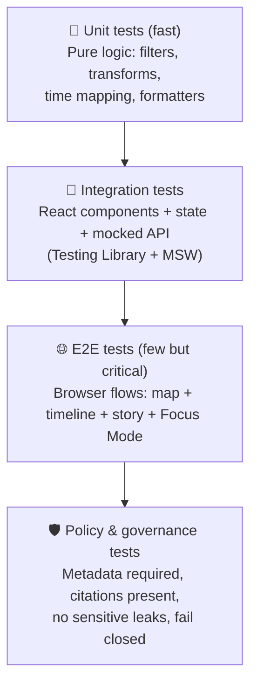

# 🧪 `web/__tests__` — KFM Web Test Suite

<kbd>🧪 Unit</kbd> <kbd>🧩 Integration</kbd> <kbd>🗺️ Map UI</kbd> <kbd>🧭 Provenance</kbd> <kbd>🛡️ Policy Gates</kbd> <kbd>♿ a11y</kbd> <kbd>🧊 Deterministic</kbd>

> **Mission:** Keep the KFM Web UI *trustworthy*, *repeatable*, and *governed* — so every user-facing view (maps, stories, AI answers) is auditable, policy-compliant, and stable across time.

---

## 📌 Contents

- 🧭 [What makes KFM testing “different”](#-what-makes-kfm-testing-different)
- ⚡ [Quickstart](#-quickstart)
- 🧱 [Test pyramid](#-test-pyramid)
- 🗂️ [Recommended folder layout](#️-recommended-folder-layout)
- 🧪 [Test types & what to cover](#-test-types--what-to-cover)
- 🧰 [Fixtures, mocks, and utilities](#-fixtures-mocks-and-utilities)
- 🗺️ [Testing maps without WebGL pain](#️-testing-maps-without-webgl-pain)
- 🤖 [Testing Focus Mode & AI UX](#-testing-focus-mode--ai-ux)
- 🛡️ [Policy tests (treat governance like tests)](#️-policy-tests-treat-governance-like-tests)
- ♿ [Accessibility](#-accessibility)
- 🧯 [Flake control & debugging](#-flake-control--debugging)
- ✅ [Definition of Done checklist](#-definition-of-done-checklist)
- 📚 [Project reference shelf](#-project-reference-shelf)

---

## 🧭 What makes KFM testing “different”?

KFM is not “just a React map app.” The UI is the *last* stage of a governed pipeline (data → catalogs → graph → API → UI → Story Nodes → Focus Mode). That implies these non-negotiables for tests:

1. **API boundary is sacred**  
   The Web UI must never reach around the API layer (no “direct graph/db queries”). If a component needs data, it comes from contracted endpoints.

2. **Evidence-first UX**  
   Story Nodes and Focus Mode must never display unsourced narrative. The UX must visibly surface provenance (citations, dataset IDs, evidence panels, etc.) — and tests should fail if it regresses.

3. **Fail-closed for sensitive data**  
   If a dataset/layer/answer is classified as sensitive, the UI must **generalize**, **blur**, **omit**, or **block** it (depending on rules). No “side-channel leaks” via tooltips, URL params, debug panels, or cached responses.

4. **Determinism is a feature**  
   Tests must be reproducible: freeze time, seed randomness, mock network, and avoid “live data” dependencies.

---

## ⚡ Quickstart

> Commands vary slightly by repo scripts — **check `web/package.json`** for exact names. These are the common patterns.

```bash
# from repo root
cd web

# unit/integration
npm test
# or: pnpm test / yarn test

# watch mode (if available)
npm run test:watch

# coverage (if available)
npm run test:coverage
```

### 🧭 E2E (if configured)

```bash
cd web

# headless
npm run test:e2e

# interactive runner
npm run test:e2e:open
```

---

## 🧱 Test pyramid



**Rule of thumb:**  
- Most coverage comes from **unit + integration**.  
- **E2E** is for *critical user journeys only* (avoid a flaky wall of tests).  
- **Policy tests** are first-class — they protect trust like any other test suite.

---

## 🗂️ Recommended folder layout

This folder can serve as a shared “test harness” (fixtures + utilities), while feature tests may still live closer to the code they cover.

```text
web/
  __tests__/
    📄 README.md                        # you are here ✅
    🧰 setupTests.(ts|js)               # jest/vitest global setup
    🧪 unit/
      *.test.(ts|tsx)
    🧩 integration/
      *.test.(ts|tsx)
    🌐 e2e/
      *.spec.(ts|js)                   # cypress/playwright specs (if stored here)
    🧪 fixtures/
      📦 dcat/                          # dataset discovery metadata
      🛰 stac/                          # spatial assets + items
      🧬 prov/                          # lineage bundles
      📚 story_nodes/                   # story node samples w/ citations
      🧵 pulse_threads/                 # “pulse” feed items (if used)
      🧠 focus_mode/                    # AI responses w/ citations + flags
    🧱 mocks/
      🗺 maplibre.ts                     # map stub
      🌎 cesium.ts                       # 3D stub (optional)
      🌐 msw/
        handlers.ts
        server.ts
    🧷 utils/
      renderWithProviders.tsx           # wraps app providers (router/store/theme)
      testIds.ts                        # centralized testid conventions
      freezeTime.ts                     # deterministic clocks
      buildFixture.ts                   # typed builders for fixtures
```

> If the repo already has a different structure, **don’t fight it** — adapt these ideas into the existing layout.

---

## 🧪 Test types & what to cover

### 1) Unit tests 🧪 (fast, pure logic)
Best targets:
- timeline/date window mapping (including boundary conditions)
- layer filtering / query-building (bbox, time range, domain filters)
- formatting of provenance chips (license, source, dataset IDs)
- story node parsing / citation extraction helpers
- “classification propagation” helpers (e.g., max(input classifications))

✅ Characteristics:
- no DOM (or minimal)
- no network
- deterministic inputs/outputs

---

### 2) Integration tests 🧩 (UI behavior with mocked APIs)
Best targets:
- layer browser → enabling a layer triggers the expected API request(s)
- timeline movement triggers re-fetch / re-style / re-render behavior
- story node opens → citations panel renders → “View Evidence” behaves
- Focus Mode panel shows: AI label, citations, uncertainty/confidence, governance flags
- sensitive layer behavior: blur/generalize/blocked UI states

Recommended tools/patterns:
- React Testing Library (`screen`, `userEvent`)
- Network mocking via MSW (or your repo’s equivalent)

---

### 3) E2E tests 🌐 (few, critical user journeys)
Pick only the flows that must never break:

- **Map load → enable layer → visible change**
- **Timeline drag → layer updates**
- **Open Story Node → citations visible → evidence panel opens**
- **Open Focus Mode → ask question → citations shown**
- **Sensitive content**: attempt access → UI blocks/redacts with explanation
- **Offline mode**: simulate offline → app degrades gracefully

> Keep E2E stable by selecting elements via semantic roles + stable labels (avoid brittle CSS selectors).

---

### 4) Contract / schema tests 📜 (UI ↔ API alignment)
Because KFM is contract-first, add tests that ensure the UI matches API contracts:

- expected response shape for dataset search
- STAC items & assets fields used by UI
- provenance links (DCAT ↔ STAC ↔ PROV) are present before UI renders certain modules

This can be done in web tests by validating mocked fixtures against JSON Schema (if schemas are exposed to the web workspace) or by type-level assertions in TypeScript.

---

## 🧰 Fixtures, mocks, and utilities

### Fixtures philosophy 📦
KFM is evidence-first, so your fixtures should look like “mini KFM”:

- **DCAT** fixture includes: `title`, `description`, `license`, `publisher`, distributions
- **STAC** fixture includes: `bbox`, `geometry`, `datetime`, `assets`, links to provenance
- **PROV** fixture includes: inputs, activities, agents, and parameters (where applicable)
- **Story Node** fixture includes: citations block + evidence manifest pointer
- **Focus Mode** fixture includes: citations per claim + governance flags (and maybe an audit panel payload)

✅ Pro-tip: Use “builder” functions to generate fixtures consistently, e.g.:
- `makeDcatDataset({ license: "CC-BY", classification: "public" })`
- `makeStoryNode({ citations: [...], evidenceManifest: ... })`

---

## 🗺️ Testing maps without WebGL pain

Map rendering in CI/headless environments is famously flaky. KFM uses WebGL-heavy mapping (2D and optional 3D), so the strategy is:

### ✅ For unit/integration tests
- **Stub the map implementation** (MapLibre/Cesium) to:
  - accept layer additions
  - emit events (move, click, hover)
  - store “current viewport/time” in a fake state
- Assert your app calls the right map APIs **and** renders the correct UI chrome (legend, layer list, provenance badges), instead of snapshotting pixels.

### ✅ For E2E tests
- Run in a real browser where WebGL works.
- Still avoid fragile pixel assertions unless you have visual regression infrastructure.

---

## 🤖 Testing Focus Mode & AI UX

Focus Mode is a *trust boundary*, not just another widget.

### Must-test behaviors ✅
- **Citations required:** answers must show citations (not “trust me” text).
- **Advisory-only:** UI must not imply the AI performed actions (publishing, deleting, auto-hiding, etc.).
- **Opt-in AI:** AI-generated text is explicitly labeled (and ideally visually distinct).
- **Uncertainty:** where applicable, show confidence/uncertainty metadata.
- **Governance flags:** sensitive-topic requests or restricted datasets trigger a clear block/redaction UX.
- **Audit panel (if present):** “why this answer” surfaces supporting entities and governance notices.

### Suggested test cases 🧪
- When API returns `citations: []` → UI should render a **refusal / “cannot answer without sources”** state.
- When response includes `governance.flags = ["sensitive_location"]` → UI must redact or generalize details.
- When user clicks a citation → UI opens the linked dataset/doc view (or evidence drawer).

---

## 🛡️ Policy tests (treat governance like tests)

KFM treats policy enforcement like CI tests — the web suite should mirror that mindset at the UI layer.

### Examples of “policy tests” you can run in `web/__tests__`
- **Layer Registry Lint:** every layer config must include:
  - `datasetId` (or stable evidence ID)
  - license + attribution
  - classification/sensitivity tag
  - legend/provenance rendering hooks
- **Story Node Readiness:** any Story Node referenced by the UI must include:
  - citations block
  - evidence manifest pointer (if the project uses it)
  - graph entity references (stable IDs)
- **No Sensitive Leaks:** if a dataset is restricted:
  - UI must not show exact coordinates
  - UI must not allow raw download links
  - UI must not cache restricted payloads in localStorage without encryption/controls

> Treat these as **non-negotiable**. They protect moral debt and technical debt at the same time.

---

## ♿ Accessibility

Accessibility is not optional — it’s part of KFM’s “public atlas” duty.

Minimum expectations:
- keyboard navigation works for:
  - layer lists
  - timeline controls
  - story navigation
  - Focus Mode panel
- visible labels and accessible names for interactive controls
- contrast modes (if supported) don’t break layout/meaning

Recommended automation:
- `axe` checks in integration tests (or `cypress-axe` in E2E)
- RTL queries by role (`getByRole`) before test IDs

---

## 🧯 Flake control & debugging

### Flake killers ✅
- Freeze time (`Date.now`, `new Date()`) for timeline-sensitive tests
- Seed randomness (`Math.random`) if used in styling/IDs
- Use MSW to mock network and **avoid live endpoints**
- Avoid snapshot tests for large DOM trees (prefer behavioral assertions)
- In E2E: wait for **UI state**, not timeouts (e.g., “layer loaded” indicator)

### Debugging tips 🛠
- Add a `debug` flag to log:
  - outbound API calls
  - current bbox/time window
  - layer registry state
  - governance classification state
- Prefer “screen.debug()” (RTL) or interactive runner (Cypress/Playwright) over sprinkling sleeps.

---

## ✅ Definition of Done checklist

When you ship a new UI feature, you’re done when:

- [ ] Unit tests cover any non-trivial logic (filters, transforms, parsing)
- [ ] Integration tests cover the main UI states:
  - [ ] loading / empty / error
  - [ ] happy path
  - [ ] restricted/sensitive path (if applicable)
- [ ] Provenance is visible somewhere the user can reach (tooltips, info panel, citations)
- [ ] AI output (if any) is labeled + cited + opt-in
- [ ] Accessibility checks pass (manual keyboard + automated a11y where reasonable)
- [ ] No new network calls bypass the API boundary
- [ ] CI is stable (no flaky tests introduced)

---

## 📚 Project reference shelf

These project docs/resources inform how tests should be written (governance, UI/AI expectations, geospatial constraints, privacy principles, and future roadmap). Keep them in mind when authoring tests:

### 🧭 Core governance & invariants
- **Master Guide v13 / Markdown Guide v13** — pipeline ordering, evidence-first narrative, Focus Mode hard gates, contract-first philosophy  
- **Data Intake Guide** — STAC/DCAT/PROV “evidence triplet”, deterministic ETL assumptions, policy packs mindset  
- **Technical Documentation** — QA strategy, CI expectations, E2E philosophy

### 🖥 UI & user experience
- **Comprehensive UI System Overview** — modular UI patterns, map + story integration expectations  
- **Architecture, Features, and Design** — front-end components, accessibility expectations, MapLibre/Cesium usage patterns

### 🤖 AI / Focus Mode
- **AI System Overview** — citations, explainability/audit panels, prompt security layers, policy checks

### 🌱 Future-facing UX & governance evolution
- **Latest Ideas & Future Proposals** — new governance patterns, maintenance agents, supply-chain thinking  
- **Innovative Concepts** — AR, cultural protocols, sensitive location handling concepts  
- **Additional Project Ideas** — “policies as tests”, evidence manifests, Pulse Threads, narrative auditability

### 🧠 Background resource packs (for deeper implementation work)
- **AI Concepts & more** — AI patterns and concepts (reference pack)  
- **Data management / Bayesian / architecture notes** — data quality and systems thinking (reference pack)  
- **Maps / WebGL / virtual worlds** — WebGL + 3D mapping context (reference pack)  
- **Programming languages & resources** — general engineering reference pack  
- **Data Mining Concepts & applications** — privacy/anonymization/inference control concepts  
- **Python geospatial analysis cookbook** — spatial processing patterns you may mirror in fixtures

---

🧭 **Reminder:** The UI is where trust is won or lost. If a test feels “too strict,” it probably protects a KFM invariant. ✅

