# 🗿 Archaeology Artifacts — 3D Web Assets


> **What this folder is:** web-optimized 3D artifact models (plus tiny previews + metadata) that the frontend can render quickly and safely.  
> **What this folder is not:** the canonical archive of raw scans, photogrammetry projects, or “source-of-truth” dataset records.

---

## 🎯 Goals

- **Fast**: artifacts load smoothly in browsers (desktop + mobile).
- **Trustworthy**: every asset is **licensed**, **attributed**, and **traceable** to its sources + processing steps.
- **Governed**: only **public-release** artifacts (or properly redacted derivatives) belong here.
- **Composable**: assets can be used in 2D/3D map context (optional 3D) *and* in artifact detail pages.

---

## 🧭 Where this fits in KFM

This directory is the **presentation edge** of the pipeline: a place for **UI-consumable distributions**.

```mermaid
flowchart LR
  A["📷 Raw capture<br/>photos · scans · notes"] --> B["🛠️ Processing<br/>mesh · bake · decimate"]
  B --> C["🧾 Catalog boundary artifacts<br/>STAC · DCAT · PROV"]
  C --> D["🔐 Governed API<br/>redaction · access"]
  D --> E["🌐 Web distributions<br/>(this folder)"]
  E --> F["🗺️ UI viewer<br/>WebGL · (optional) Cesium"]
```



✅ **Rule of thumb:** if an artifact can’t be defended with *license + provenance + governance*, it can’t ship to the UI.

---

## 📦 Directory layout

```text
web/assets/3d/archaeology/artifacts/
├─ 📄 README.md
├─ 🧾🗂️ index.json                    # optional (generated registry for UI discovery)
└─ 🏷️ kfm-arch-artifact-000123/
   ├─ 🧊 model.glb                    # required (web-ready)
   ├─ 🧊⚡ model_lod1.glb              # optional (faster / fallback)
   ├─ 🖼️ preview.webp                 # required (tiny thumbnail)
   ├─ 🧾📜 meta.json                   # required (contract + links + provenance)
   ├─ 📝 attribution.md               # recommended (human-readable credits)
   └─ 🔐🧾 checksums.sha256            # recommended (integrity / reproducibility)
```

<details>
<summary>🧠 Naming conventions (click to expand)</summary>

- **Folder name** should be the **stable artifact identifier** (plus optional slug if you want readability):
  - ✅ `kfm-arch-artifact-000123`
  - ✅ `kfm-arch-artifact-000123__smoky-hill-sherd`
  - ❌ `cool-pottery-v2-final-final`
- Filenames are stable:
  - `model.glb` is always the **primary** model
  - LODs are explicit: `model_lod1.glb`, `model_lod2.glb`
  - Preview is always `preview.webp` (or `preview.png` if needed)

</details>

---

## ✅ What must be included (artifact package standard)

### Required ✅
- `model.glb`  
  - glTF 2.0 **binary** (`.glb`) preferred for web simplicity.
- `preview.webp`  
  - small (~256–512px), optimized, **no EXIF** if possible.
- `meta.json`  
  - machine-readable contract + provenance + catalog links.

### Recommended ⭐
- `attribution.md` (human-friendly credits + citation)
- `checksums.sha256` (integrity)
- `model_lod1.glb` (fallback for low-power devices)

### Not allowed 🚫
- Raw scan dumps (multi-GB), photogrammetry project folders, or uncompressed textures.
- Anything with **unknown license**, missing attribution, or unclear provenance.
- Anything **restricted/sensitive** that hasn’t been reviewed + redacted for public release.

---

## 🧾 `meta.json` (the contract)

`meta.json` is the **bridge** between:
- the UI renderer (what to load, how to frame it),
- the catalogs (what dataset this is, where it came from),
- and governance (what can be shown, and at what precision).

### Minimal required keys

| Field | Why it exists |
|---|---|
| `id`, `slug`, `title` | stable identity + UI routes |
| `license` | legal clarity |
| `visibility` | prevents accidental leakage |
| `provenance` | traceability (sources + processing steps) |
| `links` | cross-layer sync (STAC/DCAT/PROV/graph) |
| `model` | render assumptions (units, up-axis, files, LODs) |

### Suggested `meta.json` example

```json
{
  "schema_version": "1.0.0",

  "id": "kfm-arch-artifact-000123",
  "slug": "smoky-hill-rim-sherd-000123",
  "title": "Ceramic sherd (rim fragment)",
  "description": "Web-ready 3D model derived from image-based 3D capture. Use for public UI viewing and educational context.",

  "license": "CC BY 4.0",
  "attribution": {
    "creator": "KFM / Contributing Lab",
    "contributors": ["Field Team A", "Digitization Team B"],
    "citation": "Kansas Frontier Matrix (KFM), Artifact kfm-arch-artifact-000123."
  },

  "visibility": "public",
  "cultural_sensitivity": {
    "level": "public",
    "notes": "Location precision generalized. No restricted attributes included.",
    "reviewed_by": "governance@kfm",
    "reviewed_on": "2026-01-15"
  },

  "model": {
    "primary": "model.glb",
    "lods": [
      { "name": "lod0", "file": "model.glb", "triangles": 180000 },
      { "name": "lod1", "file": "model_lod1.glb", "triangles": 60000 }
    ],
    "format": "gltf2-glb",
    "units": "m",
    "up_axis": "Y"
  },

  "render": {
    "preview": "preview.webp",
    "default_camera": {
      "position": [0.35, 0.25, 0.45],
      "target": [0.0, 0.0, 0.0]
    },
    "background": "neutral"
  },

  "spatial": {
    "findspot": {
      "crs": "EPSG:4326",
      "lat": 38.12,
      "lon": -98.46,
      "precision_m": 500
    },
    "redaction": "rounded_and_generalized"
  },

  "provenance": {
    "sources": [
      {
        "type": "field_photos",
        "uri": "catalog://kfm/raw/archaeology/field-photos/session-2024-07-18",
        "notes": "Photo set used for reconstruction."
      },
      {
        "type": "field_record",
        "uri": "catalog://kfm/raw/archaeology/field-notes/notebook-17",
        "notes": "Context + catalog number confirmation."
      }
    ],
    "processing": [
      {
        "step": "photogrammetry_reconstruction",
        "tool": "metashape",
        "version": "1.x",
        "params_ref": "catalog://kfm/prov/run-2024-07-21"
      },
      {
        "step": "retopo_and_bake",
        "tool": "blender",
        "version": "4.x"
      },
      {
        "step": "web_optimization",
        "tool": "gltf-transform",
        "version": "x.y",
        "notes": "Mesh compression + texture optimization."
      }
    ],
    "generated_at": "2026-01-15T00:00:00Z",
    "build": {
      "pipeline_run_id": "kfm-pipeline-arch-artifacts-2026-01-15",
      "commit": "GIT_SHA_HERE"
    }
  },

  "links": {
    "stac_item": "catalog://kfm/stac/items/archaeology/artifacts/kfm-arch-artifact-000123",
    "dcat_dataset": "catalog://kfm/dcat/datasets/archaeology/artifacts/kfm-arch-artifact-000123",
    "prov_bundle": "catalog://kfm/prov/archaeology/artifacts/kfm-arch-artifact-000123",
    "graph_node": "kfm:Artifact:kfm-arch-artifact-000123"
  }
}
```

> 💡 **Tip:** if you’re not ready to publish STAC/DCAT/PROV entries yet, keep the asset out of this folder until the metadata boundary is complete.

---

## ⚖️ Governance, sensitivity, and “don’t leak data” rules

This folder is **public-facing by default** (it ships with the frontend), so:

- **Classification must propagate**: derivatives **cannot** be less restricted than inputs.
- **Locations can be sensitive**: findspots may need rounding, masking, or omission.
- **Sacred/restricted objects**: do *not* publish here without explicit approval.
- **Attribution is mandatory**: every artifact must have a clear license + credit trail.
- **No bypassing the API**: if an artifact requires access controls, it must be served through a governed API path (not bundled here).

---

## ⚡ Performance & quality guidelines (web-first)

These are guidelines (not dogma) — but the UI will thank you 😅

### Geometry
- Prefer **LOD** where it matters:
  - `lod0`: hero view (detail)
  - `lod1`: fallback / list view
- Avoid micro-triangles; optimize topology for real-time.

### Textures
- Keep textures reasonable:
  - `lod0`: 2K–4K (only when justified)
  - `lod1`: 1K–2K
- Prefer modern web formats where possible (and ensure viewer support):
  - preview: **WebP**
  - runtime textures: consider **KTX2/Basis** if pipeline supports it

### Packaging
- Prefer **single-file `.glb`** for fewer requests.
- Keep file sizes practical (targets, not absolute rules):
  - `model.glb` ≤ ~25MB
  - `model_lod1.glb` ≤ ~8MB
  - `preview.webp` ≤ ~200KB

---

## 🧪 Validation checklist (before PR)

### Model sanity ✅
- [ ] Opens in a glTF viewer (no missing textures/materials)
- [ ] Correct orientation (**Y-up**) and scale (**meters**)
- [ ] Pivot/centering makes sense for orbit controls
- [ ] No weird shading (normals ok), no NaN transforms

### Metadata & governance ✅
- [ ] `meta.json` present and complete (id, license, visibility, provenance, links)
- [ ] Visibility is correct (`public` only for this folder)
- [ ] Findspot precision is acceptable (redacted if needed)
- [ ] Attribution is present (in `meta.json` and/or `attribution.md`)

### Reproducibility ✅
- [ ] `checksums.sha256` updated (recommended)
- [ ] `provenance.build.commit` set (or documented)

---

## ➕ Adding a new artifact (step-by-step)

1. **Create the folder**
   - `web/assets/3d/archaeology/artifacts/<artifact-id>/`

2. **Drop in web-ready files**
   - `model.glb`
   - `preview.webp`

3. **Write `meta.json`**
   - include license, provenance, and links back to catalogs

4. **(Optional) Add LOD**
   - `model_lod1.glb`

5. **(Optional) Add `index.json` entry**
   - only if the UI uses a static registry

6. **Open a PR**
   - include screenshots / viewer link / notes about redaction decisions

---

## 🧩 Optional: `index.json` registry

If the frontend uses a simple registry for discovery, keep it boring and stable:

```json
{
  "version": "1.0.0",
  "artifacts": [
    {
      "id": "kfm-arch-artifact-000123",
      "path": "kfm-arch-artifact-000123/meta.json",
      "tags": ["ceramic", "sherd", "public"]
    }
  ]
}
```

---

## 🧯 Troubleshooting

- **Model looks black / too dark**
  - Missing environment lighting or incorrect PBR maps; verify material channels and ensure baseColor isn’t near-black.
- **Model is sideways**
  - Fix export axis; standard is **Y-up** for glTF.
- **Loads slowly**
  - Add an LOD, reduce texture size, compress meshes/textures, simplify materials.
- **“We can’t publish this”**
  - If there’s sensitivity risk, keep the model in `data/processed/...` and serve via governed API (or not at all) until approved.

---

## 🔗 Related docs (repo paths)

If these exist in your repo, they’re the “why” behind the rules:

- `../../../../../docs/MASTER_GUIDE_v13.md`
- `../../../../../docs/standards/KFM_STAC_PROFILE.md`
- `../../../../../docs/standards/KFM_DCAT_PROFILE.md`
- `../../../../../docs/standards/KFM_PROV_PROFILE.md`
- `../../../../../docs/governance/ETHICS.md`
- `../../../../../docs/governance/SOVEREIGNTY.md`

---

## 🧾 Quick glossary

- **Artifact (here):** a discrete object model (not a terrain/site mesh).
- **Distribution:** a UI-ready copy of a dataset (optimized for delivery).
- **Boundary artifacts:** the required metadata + provenance records that let data safely move downstream.
- **LOD:** Level of Detail (multiple models at different complexity for performance).
