# 🏺 KFM Archaeology 3D Artifact — `kfm-arch-artifact-000123`

> 📍 **Repo path:** `web/assets/3d/archaeology/artifacts/kfm-arch-artifact-000123/`  
> 🎯 **Purpose:** A web-friendly 3D artifact “pack” for KFM’s 3D/AR-ready experiences — with **provenance-first** metadata, sensitivity controls, and a clean upgrade path from *prototype asset* → *fully cataloged artifact*.

---

## ✅ Quick facts

| Field | Value |
|---|---|
| **KFM ID** | `kfm-arch-artifact-000123` |
| **Domain** | `archaeology` 🏺 |
| **Asset type** | 3D model (`.glb` preferred) 🧊 |
| **Primary viewer** | KFM 3D globe/terrain (CesiumJS) 🌍 |
| **Secondary use** | Story Nodes / “Kansas From Above” style narrative + future AR 📖📱 |
| **Sensitivity** | `TBD` *(default: `restricted` until reviewed)* 🔐 |
| **License** | `TBD` ⚖️ |
| **Last updated** | `TBD` 🗓️ |

> 🖼️ **Preview image:** put a `preview.png` here (16:9 recommended).  
> If you don’t have one yet, still keep the filename reserved so UI cards don’t break.

```text
🖼️ Recommended: ./preview.png
```

---

## 📦 Folder layout

> This is the **expected** structure for a KFM archaeology artifact 3D pack.  
> You can start minimal (README + GLB + preview), then “level up” by adding metadata + checksums.

```text
📁 web/assets/3d/archaeology/artifacts/kfm-arch-artifact-000123/
├── 📄 README.md
├── 🖼️ preview.png                     # UI card + docs preview (placeholder ok)
├── 🧾 manifest.kfm.json               # KFM asset contract (UI + pipeline-friendly)
├── 📁 model/
│   └── 🧊 kfm-arch-artifact-000123.glb
├── 📁 textures/                       # optional (only if textures not embedded)
│   ├── 🟫 albedo.webp
│   ├── 🟦 normal.webp
│   └── 🟩 orm.webp                    # occlusion-roughness-metallic packed
├── 📁 metadata/
│   ├── 🌐 stac-item.json              # STAC Item (assets + bbox/geometry)
│   ├── 🏷️ dcat-dataset.jsonld         # DCAT Dataset (catalog entry)
│   └── 🧬 prov.jsonld                 # PROV-O lineage (what produced this)
└── 📁 checksums/
    └── 🔐 sha256.txt                  # sha256 sums for distributable files
```

> 💡 **Production note:** For heavyweight binaries, prefer *OCI artifact distribution* (ORAS + Cosign) and keep this folder as a thin pointer + preview + metadata. (See “Publish modes” below.)

---

## 🧭 What this artifact represents

Fill these in once the physical/catalog record is known. (Keep “findspot” details privacy-safe.)

- **Object name:** `TBD`
- **Type / classification:** `TBD` *(e.g., projectile point, ceramic sherd, tool, bead…)*  
- **Material:** `TBD`
- **Cultural affiliation / period:** `TBD`
- **Condition:** `TBD`
- **Catalog / accession reference:** `TBD`
- **Curating org / repository:** `TBD`
- **Notes:** `TBD`

---

## 🚀 How this is used in KFM (web)

### 1) Local preview (3D demo)

KFM includes a `3d_demo` page intended for “Kansas From Above” style experiences and showcasing 3D content. This artifact should be loadable via:

- `./model/kfm-arch-artifact-000123.glb`
- `./preview.png`

> ✅ Keep filenames stable — Story Nodes, tours, and AR experiments should be able to reference the same `kfm_id` consistently.

### 2) Story Nodes integration (optional but powerful) 📖

Story Nodes are KFM’s narrative building blocks: **Markdown narrative** + **JSON configuration** that defines a map/view state.

To feature this artifact in a story:

- Reference this artifact by **`kfm_id`** (`kfm-arch-artifact-000123`)
- Include **attributions + citations** in the story’s markdown
- If used in a sensitive context, ensure the story node uses **generalized location** display rules

### 3) AR / Field mode reuse (future-facing) 📱✨

KFM’s AR direction emphasizes “reuse the same data endpoints, just a different client.” This artifact pack should therefore stay:

- **UI-ready** (preview, tags, safe description)
- **Catalog-ready** (STAC/DCAT/PROV)
- **Privacy-aware** (no accidental exact findspot disclosure)

---

## 🧾 Metadata & provenance

KFM’s “contract-first + provenance-first” rule means: **if it shows up in UI, it should be traceable** (no black boxes, no mystery layers).

This folder supports that with:

1. **KFM asset manifest** → `manifest.kfm.json`  
2. **STAC Item** → `metadata/stac-item.json`  
3. **DCAT + PROV-O** → `metadata/dcat-dataset.jsonld`, `metadata/prov.jsonld`

### ✍️ `manifest.kfm.json` (template)

> Keep this file small and UI-friendly. Treat it as the “asset card + contract pointer.”

```json
{
  "kfm_id": "kfm-arch-artifact-000123",
  "domain": "archaeology",
  "asset_kind": "artifact_3d",
  "title": "TBD",
  "description": "TBD",
  "version": "0.1.0",
  "ui": {
    "preview_image": "./preview.png",
    "tags": ["archaeology", "artifact", "3d"],
    "featured": false
  },
  "assets": {
    "model_glb": "./model/kfm-arch-artifact-000123.glb",
    "textures_dir": "./textures/"
  },
  "spatial": {
    "crs": "EPSG:4326",
    "bbox": null,
    "location_privacy": {
      "is_generalized": true,
      "method": "TBD (hex/county/centroid)",
      "notes": "Do not publish exact findspot unless explicitly approved."
    }
  },
  "temporal": {
    "start": null,
    "end": null
  },
  "sensitivity": {
    "classification": "restricted",
    "reason": "potential_site_location",
    "review_required": true
  },
  "rights": {
    "license": "TBD",
    "attribution": "TBD",
    "usage_constraints": []
  },
  "provenance": {
    "stac_item": "./metadata/stac-item.json",
    "dcat_dataset": "./metadata/dcat-dataset.jsonld",
    "prov": "./metadata/prov.jsonld",
    "sources": [
      {
        "label": "TBD (catalog entry / accession record / scan log / field notes)",
        "ref": "TBD"
      }
    ]
  },
  "integrity": {
    "sha256_manifest": "./checksums/sha256.txt"
  }
}
```

---

## 🧊 3D model standards

### ✅ Format

- **Preferred:** `.glb` (glTF binary) with PBR materials  
- **Optional:** `.gltf` + external textures if required for workflow

### 🧭 Scale & orientation

- Use **meters** as the logical unit.
- Keep the **model origin** near the artifact (centered; no huge offsets).
- Don’t bake sensitive real-world coordinates into the mesh.
  - If you need placement anchors for AR or globe scenes, store them in metadata files (and apply privacy rules).

### ⚡ Performance guidance (web-friendly)

Recommended budgets (tune as needed):

- **GLB size:** aim `< 20 MB` (desktop-friendly), keep `< 50 MB` if unavoidable
- **Textures:** prefer WebP/KTX2; avoid excessive 4K textures unless needed
- **Mesh:** reduce unnecessary poly density; consider LODs if used on a globe scene

---

## 🛡️ Sensitivity, safety, and ethics

Archaeology often has **real-world harm risk** (e.g., looting, disturbance, sacred sites). Operate “fail-closed”:

- Default classification to **`restricted`** until reviewed
- Use **location generalization** for public views (hex/county/region)
- Never publish precise coordinates for sensitive sites without explicit permission
- Encode FAIR+CARE principles directly into metadata decisions:
  - **Collective Benefit**
  - **Authority to Control**
  - **Responsibility**
  - **Ethics**

---

## 🔐 Security & integrity

- 🚫 **No secrets** in this folder (no API keys, credentials, private access tokens, etc.)
- ✅ Keep a `checksums/sha256.txt` and update it whenever binaries change
- ✅ If publishing via OCI, use **immutable digests** and consider signing (Cosign)

---

## 📦 Publish modes

### Mode A: Prototype / local web assets (this folder)

Use when:

- you want fast iteration
- you’re testing viewers, story nodes, and UI cards

### Mode B: Governed binary publishing (recommended for “real” releases)

Use when:

- the model is part of a formal release
- you need auditability, versioning, signing, controlled access

Pattern:

- Store GLB/tiles/textures as OCI artifacts (ORAS)
- Sign them (Cosign)
- Keep this folder as:
  - preview + pointers + metadata (STAC/DCAT/PROV)  
  - not the heavy binary itself

---

## 🧪 Validation checklist

Before marking this artifact “ready” ✅:

- [ ] `manifest.kfm.json` complete (title, description, license, sensitivity, provenance pointers)
- [ ] `preview.png` renders nicely on light + dark backgrounds
- [ ] Model loads without errors (no missing textures/materials)
- [ ] `metadata/stac-item.json` exists and references the model asset
- [ ] `metadata/dcat-dataset.jsonld` + `metadata/prov.jsonld` exist
- [ ] Location privacy verified (no accidental exact findspot exposure)
- [ ] `checksums/sha256.txt` updated

---

## 🗺️ Pipeline snapshot (how this *should* be produced)

```mermaid
flowchart LR
  A[📸 Capture scan] --> B[🧩 Photogrammetry reconstruction]
  B --> C[🧼 Cleanup retopo PBR]
  C --> D[📦 Export GLB]
  D --> E[🗜️ Optimize compress]
  E --> F[🧾 Generate manifest + STAC DCAT PROV]
  F --> G[🛡️ Policy gates + QA]
  G --> H[🚀 Publish - web assets or OCI]
  H --> I[🧭 UI story AR reuse]
```



---

## 📝 Changelog

- `0.1.0` — Initial placeholder structure + manifest template (fill `TBD` fields)

---

<details>
<summary><strong>📚 KFM design alignment (doc anchors)</strong></summary>

- **UI principles:** React-based UI, modular + accessibility focused, surfaces provenance and “the map behind the map.” :contentReference[oaicite:0]{index=0}
- **2D/3D foundations:** MapLibre GL JS for 2D maps + CesiumJS for 3D globe/terrain + Story Nodes support. :contentReference[oaicite:1]{index=1}
- **Data intake philosophy:** provenance-first, immutable raw evidence, deterministic/config-driven pipelines. :contentReference[oaicite:2]{index=2}
- **Governance “day zero”:** FAIR+CARE + classification/oversight baked into intake and promotion. :contentReference[oaicite:3]{index=3}
- **Sensitive data handling:** location generalization/coarsening, restricted access, sensitivity tagging. :contentReference[oaicite:4]{index=4}
- **Contract-first rule:** anything shown must be traceable; no “mystery layers.” :contentReference[oaicite:5]{index=5}
- **Policy gates:** schema + STAC/DCAT/PROV completeness + license + sensitivity + provenance; AI outputs must cite sources. :contentReference[oaicite:6]{index=6}
- **OCI + signing path:** data artifacts can be stored in OCI registries; Cosign can attach signatures/provenance. :contentReference[oaicite:7]{index=7}
- **Future-facing governance + automation:** FAIR/CARE rules codified; W-P-E agents refuse unsafe exposure (e.g., sacred site precision). :contentReference[oaicite:8]{index=8}
- **Mobile/offline + AR direction:** offline packs + AR experiences are explicitly envisioned for KFM. :contentReference[oaicite:9]{index=9}
- **Immersive storytelling / AR museum concepts:** AR overlays and 4D-style experiences are part of KFM’s innovation track. 

**PDF portfolio reference libraries (open in Acrobat to access embedded docs):**
- AI Concepts & more: 
- Maps / WebGL / Virtual worlds bundle: 
- Various programming languages & resources: :contentReference[oaicite:13]{index=13}
- Data management theories bundle: :contentReference[oaicite:14]{index=14}

</details>

