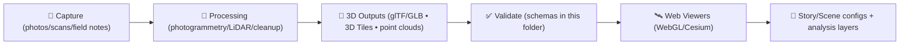

# 🧱 Archaeology 3D Schemas (Web Assets)


> 🎯 **Purpose:** This folder contains **JSON Schemas** (`*.schema.json`) used to validate **archaeology-focused 3D assets + metadata** consumed by the KFM web stack (e.g., WebGL viewers, Cesium/3D Tiles pipelines, and story/scene configs).

---

## 🧭 What lives here?

Schemas in this directory define **contracts** for structured JSON used in archaeology 3D workflows, including:

- 🧱 **3D asset manifests**: a model/tileset + essential metadata (IDs, CRS, time range, provenance, licensing)
- 🧩 **annotations**: features/contexts/finds linked to 3D assets (points/lines/polygons/volumes + attributes)
- 🧬 **stratigraphy + sequencing (4D)**: contexts, phases, and relationships across time
- 🎥 **scene/view state configs**: reproducible camera + layer state for analysis & storytelling
- 🚦 **governance metadata**: classification / redaction controls for sensitive material

**Why schemas?** ✅  
Schemas are the bridge between *pipelines → API → UI*, helping us keep data **queryable**, **repeatable**, and **auditable** (not “just pretty 3D”).

---

## 🗂️ Where it sits in the repo

```text
🗂️ web/
  🗂️ assets/
    🗂️ 3d/
      🗂️ archaeology/
        🗂️ schemas/
          📄 README.md          👈 you are here
          📄 *.schema.json      ✅ schema contracts
          📄 examples/          🧪 (recommended) passing/failing fixtures
```

> 💡 If you don’t see an `examples/` folder yet, adding it is a quick win for CI + onboarding.

---

## 🎯 Design goals (KFM-aligned)

These schemas should encourage the same “trust primitives” used elsewhere in KFM:

- 🔎 **Provenance-first**: every 3D asset must be traceable to sources + processing steps
- 🌍 **Spatial correctness**: CRS, units, transforms must be explicit and consistent
- 🕰️ **4D-ready**: time isn’t optional in archaeology—phases/events matter
- 🧩 **Multi-representation support**: boundary/surface/volume/voxel models are valid peers
- 🚦 **Safe disclosure**: sensitive locations & restricted excavation data can be classified/redacted
- ✅ **CI-friendly**: schemas are strict, versioned, and predictable

---

## 🧠 Mental model



---

## 🧬 Schema families (recommended grouping)

<details>
<summary>📚 Common schema families (click to expand)</summary>

| Family | What it validates | Suggested filename pattern |
|---|---|---|
| 🧱 Asset Manifest | a single 3D model/tileset + metadata | `asset-*.schema.json` |
| 🧩 Annotation | spatial labels + attributes tied to assets | `annotation-*.schema.json` |
| 🧬 Stratigraphy | contexts, phases, relationships | `stratigraphy-*.schema.json` |
| ⏱️ Events/Phases | excavation actions + time windows | `event-*.schema.json` |
| 🎥 Scene/View State | camera, layers, clipping, UI state | `scene-*.schema.json` |
| 🧰 Shared `$defs` | reusable building blocks | `_defs.schema.json` |

> ✅ Use what already exists. If you’re adding new ones, follow the patterns above for consistency.

</details>

---

## 🧩 Shared building blocks (strongly recommended)

### 🆔 Stable IDs
Every top-level object should have:
- `id` ✅ (stable, globally unique; UUID/ULID or minted KFM URI)
- `label` ✅ (human-readable)
- `description` (optional but helpful)
- `aliases[]` (optional)

**Rule of thumb:** if the UI can select it, filter it, or cite it, it needs a stable `id`.

---

### 🌐 Spatial fields
At minimum, provide:
- `crs` (string; e.g., `"EPSG:4326"`)
- `bbox` (array; used for map focus + quick filtering)
- `geometry` (GeoJSON geometry **or** a clear alternative if using 3D volumes)

Also consider:
- `units` (meters/feet; degrees are not elevation 😄)
- `transform` (position/rotation/scale **or** a 4×4 matrix, but document which)

> 🌍 **KFM convention:** track original CRS in metadata, but standardize for web display (typically WGS84 / EPSG:4326).

---

### 🧱 Asset references
Prefer explicit, typed references (works for local *and* hosted assets):

- `assets.model` → `.glb` / `.gltf`
- `assets.tileset` → `tileset.json` for 3D Tiles
- `assets.preview` → thumbnail/hero image
- `assets.derived[]` → decimated meshes, LODs, orthos, etc.

Each asset should include:
- `href`
- `type` (MIME)
- `bytes` (optional)
- `checksum` (optional but ideal)
- `roles[]` (e.g., `["model","lod","texture","preview"]`)

---

### 🔎 Provenance & citations (non-negotiable)
3D models are **research artifacts**, not just renderables.

Recommended structure:
- `provenance.sources[]` (where the evidence came from)
- `provenance.processing[]` (what happened to it, with what tool, by whom, when)
- `provenance.methods[]` (capture method: photogrammetry, LiDAR, CT, etc.)
- `license` + `attribution` (don’t lose credit!)
- `quality` / `confidence` (optional flags: accuracy, resolution, uncertainty)

> 🧾 Archaeology best practice: if we can’t explain how the model was made and what it represents, it’s not suitable for analysis-grade workflows.

---

### 🚦 Sensitivity / governance fields
Archaeology can include sensitive site data and restricted materials.

Recommended fields:
- `classification`: `"public" | "internal" | "restricted"`
- `restrictions`: (plain-language rules)
- `redactions[]`: (what was generalized/removed)
- `contact`: who to request access from

---

## ✅ Validation guidance

### 🧪 Local validation
Pick what fits your toolchain:

- **Node/AJV**  
  - `ajv validate -s <schema> -d <data.json>`
- **Python/jsonschema**  
  - useful in ETL scripts for quick checks
- **Front-end runtime validation**  
  - validate at ingest boundaries (import/upload) so broken 3D scenes never ship

### 🧱 CI expectations
Schemas should be strict and predictable:

- ✅ `additionalProperties: false` (unless extensions are intentionally allowed)
- ✅ use `required` for anything the UI depends on
- ✅ add semantic constraints: `pattern`, `format`, `minimum`, enums, etc.
- ✅ include at least one **passing** and one **failing** fixture per schema

---

## 🛠️ Adding a new schema (checklist)

- [ ] 📄 Create `<name>.schema.json` (kebab-case)
- [ ] 🧰 Reuse shared `$defs` (avoid copy/paste drift)
- [ ] 🧪 Add fixtures under `examples/` (`valid/*.json`, `invalid/*.json`)
- [ ] 🔗 Update any schema registry/index (if the repo uses one)
- [ ] ✅ Run local validation and ensure CI passes

---

## 🧪 Example: minimal 3D asset manifest (conceptual)

```json
{
  "id": "kfm:archaeology:site:abc123:model:trench-7:2024-06-12",
  "label": "Trench 7 — end-of-day model",
  "crs": "EPSG:4326",
  "bbox": [-96.1234, 38.9876, -96.1220, 38.9885],
  "time": {
    "start": "2024-06-12T18:00:00Z",
    "end": "2024-06-12T18:30:00Z"
  },
  "assets": {
    "model": { "href": "../models/trench-7.glb", "type": "model/gltf-binary", "roles": ["model"] },
    "preview": { "href": "../previews/trench-7.jpg", "type": "image/jpeg", "roles": ["preview"] }
  },
  "provenance": {
    "sources": [
      { "type": "photo-set", "label": "Field photo set", "ref": "kfm:asset:photos:xyz789" }
    ],
    "processing": [
      { "step": "photogrammetry", "tool": "Metashape", "notes": "High quality, mild depth filtering" },
      { "step": "georeference", "method": "GCP", "units": "meters" }
    ],
    "license": "CC-BY-4.0"
  },
  "classification": "internal"
}
```

> 💡 Keep examples minimal. If it feels “too small,” add *optional* fields rather than making everything required.

---

## 🔗 Related standards (for interoperability)

- 🌍 **GeoJSON**: geometry + properties for features/annotations  
- 🧱 **glTF / GLB**: lightweight mesh delivery for web  
- 🗺️ **3D Tiles**: streaming large geospatial 3D (LiDAR, tilesets, city models)  
- 🧾 **PROV / STAC / DCAT** patterns: for lineage and catalog alignment  

---

## 🧾 Glossary (tiny but helpful)

- 🧬 **Context / Stratigraphic Unit (SU)**: a discrete deposit/cut/feature unit
- 🕰️ **Phase**: a time-bounded interpretive grouping of contexts/activities
- 🧱 **Boundary model**: a 3D representation suited to irregular archaeological units
- 🧊 **Voxel / volume model**: volumetric representation (useful for subsurface/CT-like data)
- 🎥 **Scene**: a reproducible “view state” for analysis/storytelling

---

### 🙌 Quick tip for extensions
If you’re unsure where a new field belongs, add it under a namespaced object like:

- `extensions.kfm`
- `extensions.project`
- `extensions.lab`

…then promote it into the formal schema once it stabilizes ✅
