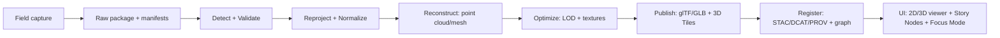

# 🏺 Archaeology Site Analysis — `<site-slug>`


> 📌 **File location:** `web/assets/3d/archaeology/sites/<site-slug>/analysis/README.md`  
> ✍️ **Replace every** `<like-this>` placeholder before merging.

---

## 🎯 What this folder is

This folder is the **site’s analysis “front door”**: a human-readable index of **what exists**, **how it was made**, **what it means**, and **what’s safe to publish**.

It is designed to bridge:

- 🧱 **Web-ready 3D assets** (glTF/GLB, 3D Tiles tilesets, thumbnails)
- 🧾 **Catalog + provenance** (STAC/DCAT/PROV + knowledge graph)
- 🎬 **Storytelling** (Story Nodes / narrative playback)
- 🧠 **AI explainability** (Focus Mode + citation-backed answers)

---

## 🗺️ Site snapshot (fill this in)

| Field | Value |
|---|---|
| **Site name** | `<Human-readable name>` |
| **Site slug** | `<site-slug>` |
| **Region / county** | `<county / area>` |
| **Approx location policy** | `<Public / Sensitive / Restricted>` |
| **Displayed geometry** | `<Point / Polygon / Hex-bin / Hidden>` |
| **Chronology** | `<e.g., Late Woodland, 900–1400 CE>` |
| **Cultural affiliation** | `<if applicable + permitted>` |
| **Primary steward(s)** | `<tribal nation / org / agency / PI>` |
| **Research status** | `<survey / excavation / monitoring / reconstruction>` |
| **Primary license** | `<e.g., CC BY 4.0 / custom / restricted>` |
| **Last updated** | `<YYYY-MM-DD>` |

---

## 🔐 Sensitivity & ethics (non-negotiable)

Archaeological sites often require **location protection** and **community-governed sharing**.

### Rules of thumb ✅
- **Do not publish exact coordinates** for sensitive sites unless explicit permission exists.  
- Prefer **generalized map representations** (e.g., hexagon / coarse polygon) for public layers.
- Treat **cultural data sovereignty** as first-class (CARE: Collective Benefit, Authority to Control, Responsibility, Ethics).

### Recommended sensitivity tiers
| Tier | Publish? | Location handling | Typical use |
|---|---:|---|---|
| **Public** | ✅ Yes | Precise or simplified | Interpretive/public education content |
| **Sensitive** | ⚠️ Limited | Generalize (hex/polygon), warnings | Research summaries, non-looting risk |
| **Restricted** | ❌ No public | Hidden / access-controlled | Active excavation, sacred contexts, private agreements |

> 🧯 **Safety reminder:** if you’re unsure, treat as **Sensitive** and escalate to stewards.

---

## 📁 Folder map (recommended)

```text
📁 web/assets/3d/archaeology/sites/<site-slug>/
├─ 📁 analysis/                         ← you are here
│  ├─ 🧾 README.md                      ← analysis index (this file)
│  ├─ 📄 site-analysis.md               ← narrative + findings (recommended)
│  ├─ 📁 qa/                            ← validation + budgets + checks
│  │  ├─ 📄 mesh-metrics.json
│  │  ├─ 📄 tileset-validation.md
│  │  └─ 📄 visual-review.md
│  ├─ 📁 provenance/                    ← “how it was made”
│  │  ├─ 📄 prov.jsonld
│  │  ├─ 📄 sources.md
│  │  └─ 📄 license-and-permissions.md
│  ├─ 📁 exports/                       ← screenshots, figures
│  │  ├─ 🖼️ hero.jpg
│  │  └─ 🖼️ orthoslice.png
│  └─ 📁 pulse/                         ← optional: field “micro-events”
│     └─ 🧵 pulse-YYYYMMDDTHHMMZ.json
├─ 📁 tiles/                            ← Cesium 3D Tiles tileset(s)
│  └─ 🧱 tileset.json
├─ 📁 models/                           ← glTF/GLB (LOD variants)
├─ 📁 textures/                         ← KTX2/JPEG/PNG
├─ 🧾 site.json                         ← site metadata (recommended)
└─ 🧾 sensitivity.json                  ← display rules + access policy
```

> ✅ Keep **large** raw point clouds / raw scans **out of** `web/assets/…` unless they’re tiled/streamable.  
> Use tilesets, LODs, and manifests so the browser isn’t crushed.

---

## 🧩 Asset inventory (fill in / maintain)

| Asset | Purpose | Path | Status |
|---|---|---|---|
| **3D Tiles tileset** | Streaming large 3D content | `../tiles/tileset.json` | ⬜ planned / ✅ ready |
| **Primary GLB** | Simple model preview | `../models/<site-slug>.glb` | ⬜ planned / ✅ ready |
| **LOD models** | Performance scaling | `../models/lod*/...` | ⬜ planned / ✅ ready |
| **Hero thumbnail** | Cards + Story Nodes | `./exports/hero.jpg` | ⬜ planned / ✅ ready |
| **QA metrics** | Budgets & validation | `./qa/mesh-metrics.json` | ⬜ planned / ✅ ready |
| **PROV bundle** | Reproducibility | `./provenance/prov.jsonld` | ⬜ planned / ✅ ready |

---

## 🧰 Capture + processing notes (site-specific)

### 📥 Capture sessions
- **Capture type(s):** `<photogrammetry / LiDAR / total station / drone / hybrid>`
- **Dates:** `<YYYY-MM-DD …>`
- **Teams / roles:** `<who did what>`
- **Hardware:** `<camera/lens, scanner, GNSS, etc.>`
- **Ground control:** `<GCPs / targets / none>`
- **Coordinate reference:** `<original CRS + vertical datum>`

### 🧪 Processing pipeline (recommended stages)



---

## ✅ QA checklist (merge gate)

### Geometry & spatial
- [ ] **CRS tracked** (original CRS recorded; served in web-friendly CRS)
- [ ] **Scale sanity** (meters vs feet; “human-sized” checks)
- [ ] **Orientation** (north/up; no 90° roll surprises)
- [ ] **Georeference** (ground truth matches map context)

### Web performance
- [ ] **Triangle budget** documented (per LOD)
- [ ] **Texture budget** documented (size + count + format)
- [ ] **LOD present** for interactive viewing
- [ ] **Mobile test** passes (basic orbit/zoom without crashing)

### 3D Tiles (if used)
- [ ] `tileset.json` loads in Cesium viewer
- [ ] Bounding volumes sane (no “Earth-sized” box)
- [ ] LOD transitions acceptable (no “popping” disaster)
- [ ] Metadata present (at least minimal attribution)

### Provenance & governance
- [ ] `prov.jsonld` or equivalent provenance included
- [ ] Sources & license present
- [ ] Sensitivity classification present + enforced
- [ ] No restricted info in public web assets

---

## 🧩 Story Nodes & narrative integration

KFM Story Nodes are designed so contributors can add narratives via **Markdown + configuration**, enabling interactive playback (map state, layers, timeline, etc.).:contentReference[oaicite:0]{index=0}

### If you create a Story Node for this site
- Use the site’s **public-safe** geometry and assets only
- Include citations / provenance links (evidence-first)
- Keep story assets lightweight (thumbnails, short clips, optimized models)

**Suggested linkage fields**
- `siteSlug: "<site-slug>"`
- `layers: ["archaeology:<site-slug>:tileset", "archaeology:<site-slug>:footprint"]`
- `cameraPreset: "<2D/3D view preset>"`

---

## 🧠 Focus Mode integration (AI + evidence)

KFM’s AI layer is built around:
- **ontologies + knowledge graph structure**
- **citations / provenance in answers**
- **governance-first safety** (don’t leak sensitive sites)

This analysis folder should contain:
- ✅ “Curated highlights” a model can cite (what matters most)
- ✅ Provenance bundle pointers (how we know what we know)
- ✅ “Don’t say” sensitivity rules (what must not be surfaced)

---

## 🧵 Optional: Pulse Threads (field micro-events)

Pulse Threads are a proposed lightweight way to log **geo-tagged “micro-events”** with provenance (who/what/when/where) and then attach them to map narratives and analysis threads.

**Example (public-safe) pulse event**
```json
{
  "id": "pulse-20260125T153000Z",
  "siteSlug": "<site-slug>",
  "timestamp": "2026-01-25T15:30:00Z",
  "locationPolicy": "generalized",
  "summary": "Texture seam fixed on LOD1; regenerated tileset manifest.",
  "links": [
    {"type": "asset", "path": "../tiles/tileset.json"},
    {"type": "qa", "path": "./qa/tileset-validation.md"}
  ]
}
```

---

## 🎯 Optional: Conceptual Attention Nodes (analysis focus graph)

Conceptual Attention Nodes are a proposed way to mark “high-signal” nodes/edges in the knowledge graph to power **Focus Mode** and “guided exploration.”

Use this when a site has many features/artifacts but only a subset should be emphasized publicly (or for a particular research question).

---

## 🧊 Optional: VoxelMaps / 4D site reconstructions

VoxelMaps / 4D Digital Twins are proposed for time-sliced reconstructions, letting users explore historical layers and changes over time (especially useful for stratigraphy, phased reconstructions, or monitoring).

If adopted for this site:
- Store phase/time slices as separate assets
- Keep public vs restricted reconstructions clearly separated
- Tie each slice to a PROV activity + sources

---

## 🕶️ Optional: AR / field mode (future)

AR is envisioned as a *new client* using the same standardized APIs and data endpoints, with **layer filtering** and **simplified geometry** for usability.

If AR is added for this site, define:
- An “AR-safe” layer subset
- A simplified mesh/marker representation
- A trigger radius / geofence policy (and a sensitivity policy)

---

## 🧪 Contributor workflow (quick steps)

1. **Add / update** analysis artifacts in this folder  
2. Update sibling **`site.json`** and **`sensitivity.json`** (as needed)  
3. Regenerate/validate 3D assets (LOD + tileset)  
4. Ensure provenance + sources updated  
5. Confirm **no sensitive location leaks**  
6. Submit PR with:
   - before/after screenshots
   - QA summary
   - provenance confirmation

---

## 📚 Project doc index (used to define this standard)

<details>
<summary>📌 KFM evidence + architecture references (click to expand)</summary>

### Core KFM docs
- 🧭 **UI system** (Story Nodes, 2D/3D viewer, governance, AR) :contentReference[oaicite:5]{index=5}  
  - Story Nodes as Markdown + config; file-based contributions:contentReference[oaicite:6]{index=6}
  - Cesium 3D mode + 3D Tiles streaming:contentReference[oaicite:7]{index=7}
  - Sensitivity enforcement (e.g., hexagon generalization)
- 📚 **Data intake guide** (STAC/DCAT/PROV + policy gates) :contentReference[oaicite:9]{index=9}  
  - Metadata backbone: STAC/DCAT/PROV + governance/policy pack:contentReference[oaicite:10]{index=10}
- 🧭🤖 **AI system overview** (ontologies + provenance in AI answers) :contentReference[oaicite:11]{index=11}  
  - Ontologies in Neo4j + provenance discipline for responses
- 🧱 **Comprehensive technical documentation** (CRS standards, web/app structure, governance) :contentReference[oaicite:13]{index=13}  
  - WGS84 serving standard + CRS tracking
  - Sensitive site generalization + CARE principles
  - Reproducible research / Binder integration idea
- 🧩 **Comprehensive architecture/features/design** :contentReference[oaicite:17]{index=17}  
  - 3D Tiles / Cesium integration in the web stack (via viewers)

### Archaeology + 3D direction in KFM docs
- 🗺️ **Open-Source Geospatial Historical Mapping Hub Design** :contentReference[oaicite:19]{index=19}  
  - MapLibre for 2D + Cesium planned for 3D/tiles
  - 3D “time travel” + photogrammetry + exporting to glTF
- 🔎 **Design Audit (gaps & enhancements)** :contentReference[oaicite:22]{index=22}  
  - Notes on 3D (Cesium) as optional future capability

### Evidence-first pipeline patterns
- 🧾 **MARKDOWN_GUIDE_v13** (detect → validate → promote) :contentReference[oaicite:24]{index=24}  
  - Pipeline flow + “evidence artifacts” mindset:contentReference[oaicite:25]{index=25}
- 💡 **Additional Project Ideas** (domain packs, SampleUnitSpec, OCI artifact storage, FAIR/CARE) :contentReference[oaicite:26]{index=26}  
  - Domain integration template + SampleUnitSpec concept
  - OCI artifact storage + cosign/oras + PROV attachments

### “Future proposals” & “innovations”
- 🌟 **Latest Ideas & Future Proposals** :contentReference[oaicite:29]{index=29}  
  - Narrative Pattern Detection concept
  - Pulse Threads concept
  - Conceptual Attention Nodes concept
- 💡 **Innovative Concepts** :contentReference[oaicite:33]{index=33}  
  - AR / hybrid storytelling direction
  - VoxelMaps / 4D digital twins direction

### Supporting reference libraries (PDF portfolios)
These files are PDF portfolios (best opened in Acrobat/Reader; embedded docs can be extracted programmatically).  
- 🤖 AI concepts portfolio :contentReference[oaicite:36]{index=36}
- 🌍 Maps/virtual worlds/archaeology/WebGL portfolio :contentReference[oaicite:38]{index=38}
- 🗄️ Data management + architectures portfolio :contentReference[oaicite:40]{index=40}
- 🧑‍💻 Programming languages/resources portfolio :contentReference[oaicite:42]{index=42}

### Dev helpers (optional)
- 🧠 **Data mining concepts** (QA, cleaning, privacy-aware outputs) :contentReference[oaicite:44]{index=44}
- 🧭 **Geospatial analysis cookbook** (e.g., DEM → Three.js terrain visualization) :contentReference[oaicite:46]{index=46}:contentReference[oaicite:47]{index=47}
- 📝 **Markdown advanced features** (Mermaid, `<details>`, etc.) :contentReference[oaicite:48]{index=48}:contentReference[oaicite:49]{index=49}

</details>

---

## 🧷 Appendix: Extracting embedded docs from PDF portfolios (optional)

If you want to unpack the portfolio PDFs into individual references:

```python
# Requires PyMuPDF (fitz)
import fitz, os

pdf_portfolio = "Maps-GoogleMaps-VirtualWorlds-Archaeological-Computer Graphics-Geospatial-webgl.pdf"
out_dir = "docs/library/extracted/maps-portfolio"
os.makedirs(out_dir, exist_ok=True)

doc = fitz.open(pdf_portfolio)
for name in doc.embfile_names():
    data = doc.embfile_get(name)
    with open(os.path.join(out_dir, name), "wb") as f:
        f.write(data)

print("Extracted:", len(doc.embfile_names()), "files →", out_dir)
```

---

## ✅ Done criteria (definition of “complete”)

This site’s 3D archaeology integration is “done” when:

- ✅ It’s **discoverable** (catalog + metadata)
- ✅ It’s **viewable** (2D/3D UI with safe geometry)
- ✅ It’s **explainable** (provenance + citations)
- ✅ It’s **governed** (sensitivity enforced)
- ✅ It’s **storyable** (Story Node-ready)

---

> 🧭 Next: fill out `site-analysis.md` with the actual interpretation + figures, and ensure provenance + sensitivity rules are committed alongside the assets.

