# 🗺️🧱 Georeferencing (Georef) Package — `<site-slug>`

<p align="left">
  
  
  
  
  
  
</p>

> ✅ **Purpose:** This folder is the **single source of truth** for how this site’s 2D/3D assets map onto the real world.  
> 🔒 **Safety rule:** This path lives under `web/assets/…` (i.e., it ships with the web build). **Do not commit restricted coordinates, survey raws, or anything that can enable looting.**

---

## 📍 Where am I?

**Path:** `web/assets/3d/archaeology/sites/<site-slug>/georef/`

This folder holds the **alignment contract** + supporting artifacts that translate between:

- **Local/project coordinates** (photogrammetry mesh space, scan pixels, site grid, CAD units, etc.)
- **Global coordinates** used for web mapping + globe rendering

In KFM terms, this is a small, site-scoped “contract-first” package that makes archaeology assets:
- **Renderable** in 2D + 3D
- **Auditable** (what transform, what method, what inputs)
- **Governable** (sensitivity-aware by design) 🔐

---

## 🧠 What KFM expects (mental model)

```mermaid
flowchart LR
  A[🧾 Raw sources - scans photos LiDAR field notes] --> B[🧭 Georef + QA - controlled ETL]
  B --> C[📦 Web ready artifacts - GeoJSON COG 3D Tiles]
  B --> D[🧾 Evidence triplet - STAC DCAT PROV]
  C --> E[🗺️ UI - MapLibre 2D + Cesium 3D]
  D --> F[🕸️ Graph + 🤖 Focus Mode - always cited answers]
  D --> E
```



---

## 📁 Recommended folder contents

> You can start minimal and grow. Keep it boring, explicit, and reproducible ✨

```text
🌍 georef/
├── 📄 README.md
├── 🧾 georef.json                           ✅ REQUIRED (public-safe “georef contract”)
├── 🌐 public/
│   ├── 🧭 footprint_generalized.geojson     ✅ REQUIRED if sensitive (generalized geometry)
│   └── 📦 extent.json                       ⭐ recommended (public-safe bbox/extent)
├── 📍 gcp/                                  (optional: if GCP workflows were used)
│   ├── 📄 gcps.csv
│   └── 🗺️ gcps.geojson
├── 🔁 transforms/                           (optional but recommended)
│   ├── 🗺️ raster_georef.json                (affine/projective transform + residuals)
│   └── 🧊 model_transform.json               (4×4 matrix + orientation + scale)
└── 🧪 qa/                                   (optional but recommended)
    ├── 📊 residuals.csv
    └── 📝 report.md                          (short human-readable QA notes)
```

---

## ✅ Required file: `georef.json`

This file is the **contract** the web UI (and any ingest tooling) can rely on.

### 🎯 Design goals
- **Public-safe** by default (safe to ship in `web/`)
- **Explicit CRS + units**
- **Links to evidence** (IDs/refs to STAC/DCAT/PROV records elsewhere)
- **Stable keys** (avoid ad-hoc one-off fields)

### 🧩 Suggested schema (v0.1 starter)

```json
{
  "contract_version": "0.1.0",
  "site": {
    "slug": "<site-slug>",
    "title": "<human name>",
    "sensitivity": "public | restricted | cultural_sensitive",
    "public_notes": "What is safe to say publicly about location/extent."
  },

  "crs": {
    "target": "EPSG:4326",
    "source": "EPSG:XXXX | WKT | PROJJSON",
    "axis_order": "lon_lat",
    "units": {
      "horizontal": "degrees",
      "vertical": "meters"
    }
  },

  "anchor": {
    "type": "point | area",
    "lon": -98.000000,
    "lat": 38.500000,
    "z_m": 0,
    "confidence": "high | medium | low",
    "public_safe": true
  },

  "extent": {
    "bbox_wgs84": [-99.0, 38.0, -97.0, 39.0],
    "public_safe": true,
    "file": "public/extent.json"
  },

  "geometry": {
    "public_footprint": "public/footprint_generalized.geojson",
    "generalization_method": "hex | buffered_area | snapped_grid | none"
  },

  "transforms": {
    "raster": {
      "file": "transforms/raster_georef.json",
      "method": "affine | projective | polynomial | none",
      "rms_error_m": 2.5
    },
    "model": {
      "file": "transforms/model_transform.json",
      "method": "matrix4x4 | helmert7 | enu_to_ecef | none"
    }
  },

  "evidence": {
    "dcat_dataset_id": "<id>",
    "stac_item_ids": ["<id1>", "<id2>"],
    "prov_activity_id": "<id>",
    "source_summary": [
      "Scan: <cataloged source ref>",
      "Control points: <cataloged source ref>",
      "Method notes: <cataloged source ref>"
    ]
  },

  "updated": {
    "at": "YYYY-MM-DD",
    "by": "<name-or-bot>",
    "change_note": "What changed + why"
  }
}
```

> 🧠 **Rule of thumb:** If a field cannot be safely shared publicly, it does **not** belong in `web/assets/...`.

---

## 🧭 Workflow checklist

### 1) 🔍 Classify sensitivity first (before you map anything)
- If this is a **sensitive archaeology site**, the *public* footprint should be **generalized** (e.g., hex/area) and exact coordinates should stay out of the web tree.
- Put the “why” in `site.public_notes` so future contributors don’t “fix” it back to precise.

### 2) 🧷 Choose your CRS strategy
- **Target CRS for web:** `EPSG:4326` (WGS84 lon/lat)  
- **Working CRS (optional):** local projection / UTM / state plane for precision workflows  
- Always record `crs.source` and `crs.target`.

### 3) 📌 Build the transform (GCP / survey / alignment)
- If using raster scans:
  - collect GCPs (`gcp/gcps.csv`)
  - produce transform + QA (`transforms/raster_georef.json`, `qa/residuals.csv`)
- If positioning 3D models:
  - produce a stable transform (prefer 4x4 matrix) (`transforms/model_transform.json`)

### 4) 🧪 QA (non-negotiable)
- Residuals recorded (and kept)
- Visual spot-check against basemap + known features
- Extent/bbox sanity checks

### 5) 🧾 Evidence triplet linkage
Even though this folder is “web assets”, **the georef story belongs in the evidence catalogs**:
- DCAT: dataset identity, license, ownership, classification
- STAC: spatial/temporal geometry + assets
- PROV: exactly how the transform was produced (inputs → activity → outputs)

In `georef.json`, store only the IDs/refs in `evidence.*`.

### 6) 🗺️ Verify in UI
- 2D overlay aligns (MapLibre)
- 3D asset lands correctly (Cesium)
- Sensitivity behavior is correct (generalized geometry + no precise exposure)

---

## 🔌 Integration notes (2D + 3D)

### 🗺️ MapLibre (2D)
- Provide GeoJSON geometry in **WGS84 lon/lat**.
- Keep `public/footprint_generalized.geojson` lightweight and cache-friendly.

### 🌎 Cesium (3D)
KFM’s 3D side is designed around **Cesium + 3D Tiles** for streaming heavy 3D geospatial content.

If you’re positioning a model with an anchor, a common pattern in the UI is:

```js
// Example: computing a model matrix from a WGS84 anchor
const origin = Cesium.Cartesian3.fromDegrees(lon, lat, heightMeters);
const enuFrame = Cesium.Transforms.eastNorthUpToFixedFrame(origin);

// Optionally apply heading/pitch/roll + scale on top of ENU:
const hpr = new Cesium.HeadingPitchRoll(
  Cesium.Math.toRadians(headingDeg),
  Cesium.Math.toRadians(pitchDeg),
  Cesium.Math.toRadians(rollDeg)
);
const rot = Cesium.Matrix3.fromHeadingPitchRoll(hpr);
const rot4 = Cesium.Matrix4.fromRotationTranslation(rot, Cesium.Cartesian3.ZERO);

const modelMatrix = Cesium.Matrix4.multiply(enuFrame, rot4, new Cesium.Matrix4());
// ...plus scale if needed
```

> 🧠 Keep any final matrices **recorded** in `transforms/model_transform.json` so a future dev can reproduce the placement.

---

## 🧪 QA checklist (copy/paste)

- [ ] `georef.json` exists and parses
- [ ] `crs.target === EPSG:4326`
- [ ] Anchor/extent are **public-safe**
- [ ] If `sensitivity !== public` → `public/footprint_generalized.geojson` exists
- [ ] Visual alignment check done (2D)
- [ ] Visual alignment check done (3D)
- [ ] Residuals recorded (if GCP workflow)
- [ ] Evidence IDs present (DCAT + STAC + PROV)
- [ ] No restricted coords/survey raws committed under `web/assets/`

---

## 📦 Offline / field mode (optional)

KFM supports the idea of “offline packs” for use without internet (pre-rendered tiles + a mini app).  
If this site will be used in the field, keep:
- footprints lightweight
- transforms deterministic
- assets chunkable (tilesets > monolith models)

---

## 🕶️ AR / hybrid overlays (optional)

If you plan AR or “on-site overlays,” this georef package becomes the backbone:
- the anchor must be stable and reproducible
- the transform must be explainable
- sensitivity rules still apply (public vs restricted)

---

## 📚 Project reference docs (for this folder)

These are the KFM documents that define the governance + architecture assumptions this georef package follows:

- **Comprehensive Technical Documentation**
- **Comprehensive Architecture, Features, and Design**
- **AI System Overview (Focus Mode + citations + policy gates)**
- **Comprehensive UI System Overview (MapLibre + Cesium + sensitivity UX)**
- **Data Intake – Technical & Design Guide (STAC/DCAT/PROV + provenance-first)**
- **Latest Ideas & Future Proposals (offline packs, rollback thinking, governance evolution)**
- **Innovative Concepts (AR/hybrid narratives, ethical storytelling)**
- **Additional Project Ideas (design packs, evidence manifests, modular expansion)**
- **Resource portfolios:** AI Concepts & more, Data Management bundle, Programming resources bundle, Maps/Virtual Worlds/WebGL bundle

---

## 🧾 Local site notes (fill these in ✍️)

- **Site title:**  
- **Public sensitivity level:** `public | restricted | cultural_sensitive`  
- **Generalization method (if any):**  
- **Anchor confidence:** `high | medium | low`  
- **Transform method:**  
- **QA summary (1–3 bullets):**  
- **Evidence IDs (DCAT/STAC/PROV):**  

