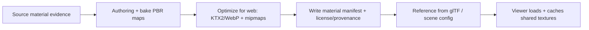

# 🧱 Shared Textures Library (Archaeology Sites)


This folder holds **shared, reusable texture sets** (PBR-ready) used across multiple archaeology site scenes and assets (e.g., generic soil/stone/wood materials, decals, atlas sheets).  
If a texture is **site-specific**, it should usually live under the site slug (e.g., `web/assets/3d/archaeology/sites/<site-slug>/textures/`) to avoid leakage and reduce accidental reuse.

---

## 📘 Overview

### ✅ Purpose
- Provide a **single canonical home** for textures that are used by **more than one** archaeology site.
- Encourage **deduplication**, consistent **PBR conventions**, and **cache-friendly** reuse in the web viewer.

### 🧭 Scope
| In Scope ✅ | Out of Scope ❌ |
|---|---|
| Shared PBR materials (tileables) | Raw photogrammetry outputs (keep in `data/processed/...` first) |
| Decals/atlases shared across sites | Per-site unique textures (put in `<site-slug>/textures/`) |
| Web-optimized distributions (WebP/KTX2) | Editing source files (PSD/BLEND/etc. store in authoring/work areas) |

### 👥 Audience
- **Web / 3D integrators** (glTF/WebGL/Cesium pipelines)
- **Archaeology content builders** (photogrammetry → material authoring)
- **Reviewers** (license/provenance + sensitivity checks)

---

## 🗂️ Directory Layout

> This README documents: `web/assets/3d/archaeology/sites/textures/`

```text
📁 web/assets/3d/archaeology/sites/
├── 📁 <site-slug>/                       # site-owned assets (preferred for unique textures)
│   └── 📁 textures/
│       └── 📄 README.md
└── 📁 textures/                           # ✅ shared texture library (this folder)
    ├── 📁 materials/                      # tileable + reusable PBR sets
    │   └── 📁 <material-id>/
    │       ├── 📄 <material-id>.material.json
    │       ├── 🖼️ <material-id>__basecolor.(webp|ktx2)
    │       ├── 🖼️ <material-id>__normal.(webp|ktx2)
    │       ├── 🖼️ <material-id>__orm.(webp|ktx2)        # packed (AO/Rough/Metal)
    │       ├── 🖼️ <material-id>__height.(webp|ktx2)     # optional
    │       ├── 🖼️ <material-id>__emissive.(webp|ktx2)   # optional
    │       └── 🖼️ preview.(webp|png)                    # small swatch/thumbnail
    ├── 📁 decals/                         # stamps, labels, soot marks, etc.
    ├── 📁 atlases/                        # packed sheets (UI/perf oriented)
    ├── 📁 _shared/                        # shared helpers (LUTs, masks, etc.)
    └── 📄 README.md
```

---

## 🧪 Texture Standards (PBR)

### 🧩 Map Types + Suffix Rules
| Map | Suffix | Color Space | Notes |
|---|---|---|---|
| Base Color / Albedo | `__basecolor` | **sRGB** | No baked lighting if possible |
| Normal | `__normal` | **Linear** | **OpenGL +Y** (glTF-friendly) |
| Occlusion–Roughness–Metallic | `__orm` | **Linear** | Packed: **R=AO, G=Roughness, B=Metallic** |
| Roughness (unpacked) | `__roughness` | **Linear** | Only if not using `__orm` |
| Metallic (unpacked) | `__metallic` | **Linear** | Only if not using `__orm` |
| AO (unpacked) | `__ao` | **Linear** | Only if not using `__orm` |
| Height / Displacement | `__height` | **Linear** | Prefer subtle; parallax optional |
| Emissive | `__emissive` | **sRGB** | Rare for archaeology; use sparingly |
| Opacity / Alpha | `__opacity` | **Linear** | Prefer alpha in basecolor if needed |

### 🧱 Recommended Formats
- **KTX2** (BasisU / GPU compressed): best for performance and memory.
- **WebP**: good fallback for browsers/pipelines that don’t ship KTX2 yet.
- **PNG/JPEG**: avoid unless required (PNG for alpha/linework; JPEG for large photo-only basecolor).

> Rule of thumb: if it tiles and appears everywhere → **KTX2**. If it’s a small decal → **WebP**.

### 📏 Size + Mipmaps
- Target **1024–2048** for most tileables.
- Use **4096** only when the material is hero-level and justified.
- Always generate **mipmaps** (especially for KTX2) to reduce shimmer.

---

## 🧰 Naming + IDs

### `<material-id>` format
Use a stable slug:
- ✅ `limestone_block_wall_v1`
- ✅ `prairie_soil_loam_v2`
- ❌ `WallTextureFinalFINAL2`
- ❌ `IMG_0039`

### File naming
```
<material-id>__<map-suffix>.<ext>
```

Examples:
- `limestone_block_wall_v1__basecolor.ktx2`
- `limestone_block_wall_v1__normal.ktx2`
- `limestone_block_wall_v1__orm.ktx2`
- `preview.webp`

---

## 🧾 Required Metadata (Per Material)

Each `materials/<material-id>/` **must** include a `<material-id>.material.json` that captures provenance + licensing.

**Minimum recommended shape:**
```json
{
  "id": "limestone_block_wall_v1",
  "title": "Limestone Block Wall (v1)",
  "description": "Generic limestone block wall material suitable for foundations and cut-stone ruins.",
  "license": "CC-BY-4.0",
  "attribution": "Source: <org/person>; Processing: KFM pipeline",
  "source": {
    "type": "photo" ,
    "reference": "TBD (STAC Item ID / DOI / archive ref / field log)"
  },
  "maps": {
    "basecolor": "limestone_block_wall_v1__basecolor.ktx2",
    "normal": "limestone_block_wall_v1__normal.ktx2",
    "orm": "limestone_block_wall_v1__orm.ktx2",
    "height": "limestone_block_wall_v1__height.ktx2"
  },
  "created": "2026-01-15",
  "updated": "2026-01-15",
  "notes": [
    "Normal map is OpenGL +Y.",
    "ORM packed as R=AO, G=Roughness, B=Metallic."
  ]
}
```

> 🧠 Evidence-first: if a texture is derived from a scan/photogrammetry run, the **source-of-truth** should exist in governed data artifacts first (e.g., `data/processed/...` + catalog/lineage), and this folder holds the **web distribution** copy.

---

## 🔁 Workflow: Adding a New Shared Texture Set

1. **Decide “shared vs site-owned”**
   - Shared if reused across ≥2 sites.
   - Otherwise put it in `.../<site-slug>/textures/`.

2. **Create the folder**
   - `materials/<material-id>/`

3. **Generate maps**
   - Prefer at least: `basecolor`, `normal`, `orm`, plus `preview`.

4. **Optimize**
   - Produce **KTX2** (and optionally WebP fallbacks).

5. **Write metadata**
   - Add `<material-id>.material.json` with license + provenance.

6. **Link from assets**
   - Reference textures from glTF materials or runtime material registry (if used).

---

## 🧭 Viewer Integration Notes

### glTF / WebGL expectations
- **Normal map orientation:** OpenGL +Y (glTF default).
- **ORM packing:** glTF commonly uses separate channels; packed `__orm` is supported by many pipelines—document your unpack/usage in the material manifest if you deviate.

### Cesium (if used)
- Use KTX2 when possible to reduce GPU memory pressure.
- Prefer **shared textures** for common surfaces to maximize caching.

---

## 🛡️ Governance, Sensitivity, and Cultural Care

Some imagery-derived textures can unintentionally reveal sensitive site information (e.g., markings, human remains, sacred patterns). Before publishing:

- ✅ Confirm **license and attribution** are explicit.
- ✅ Confirm **site permissions** (if sourced from fieldwork).
- ✅ If sensitivity applies, **do not publish here** until governance review is complete.  
  Use `care_label` escalation in the material manifest and/or relocate to controlled distribution.

---

## ✅ Definition of Done (DoD) — New Material Pack

- [ ] Folder lives in the correct place (shared vs site-owned)
- [ ] Filenames match the naming convention (`<material-id>__<suffix>.<ext>`)
- [ ] Includes `preview.(webp|png)`
- [ ] Includes `<material-id>.material.json` with **license + provenance**
- [ ] Normal map orientation is documented (OpenGL +Y)
- [ ] ORM packing (if used) is documented (R/G/B meaning)
- [ ] Texture sizes are justified; mipmaps are available
- [ ] No duplicate texture set exists elsewhere in `web/assets/3d/archaeology/sites/**`
- [ ] No restricted/sensitive content is published without explicit approval

---

## ❓ FAQ

### “When do we use `atlases/`?”
When many small decals/variants cause too many HTTP requests or state changes. Atlases should include a map describing UV regions and a clear license/provenance note.

### “Do we store authoring files here?”
No. This folder is for **runtime distribution**. Put heavy authoring sources in an appropriate working area and reference them from provenance metadata.

---

## 🗺️ Pipeline Sketch (assets perspective)


