# 📚 Landmark Citations (Evidence Pack)


This folder is the **canonical evidence + citation home** for the landmark at:

> `web/assets/3d/landmarks/<landmark_slug>/`

Every non-trivial claim about **where this 3D asset came from** (source scans, surveys, photos, datasets, publications, web pages, etc.) should be represented here in a **machine-readable** way, so the UI (and Focus Mode) can generate trustworthy attributions and “show your work” trails.

---

## 🎯 Purpose

Citations answer **“How do we know?”** for this landmark’s:

- 🧱 Geometry (mesh / 3D Tiles / point cloud)
- 🎨 Textures & materials
- 🧭 Georeferencing & transforms
- 🧪 Processing steps (photogrammetry, cleanup, decimation, retopo, baking)
- 🏛️ Historical interpretation / naming
- ⚖️ Legal use (license provenance, required attribution language)

> **Rule of thumb:** If it ships in the landmark package, it must be traceable.

---

## 🧭 Where this fits (nearby docs)

- 🧾 Licenses: `../licenses/README.md`
- 🪪 Attribution summary: `../attribution.md`
- 🧱 Source pipeline notes: `../source/README.md`
- 🎨 Texture notes: `../textures/README.md`

> Keep licensing **and** citations aligned: licenses explain *permissions*; citations explain *evidence*.

---

## 📦 Folder contract

### ✅ Required (per landmark)
- `citations.yaml` — primary machine-readable citation index (preferred)
- `README.md` — this guide + conventions

### ➕ Optional (use as needed)
- `citations.bib` — BibTeX for publications
- `links.yaml` — mapping from *artifact files → citation IDs* (recommended when the asset is complex)
- `evidence/` — small supporting artifacts (screenshots, small excerpts, checksums, receipts)
- `notes/` — curated human notes (never replaces machine index)

---

## 🗂️ Suggested layout (recommended)

```text
📁 web/assets/3d/landmarks/<landmark_slug>/citations/
├─ 📘 README.md                      # you are here
├─ 🧾 citations.yaml                 # canonical citation index (required)
├─ 🔗 links.yaml                     # artifact → citation IDs (optional, recommended)
├─ 📚 citations.bib                  # bibliography (optional)
├─ 📁 evidence/                      # optional, keep small + lawful
│  ├─ 🖼️ screenshot_source_page_01.png
│  ├─ 🧾 receipt_or_permission_email.txt
│  └─ 🔐 checksums.sha256
└─ 📁 notes/                         # optional, human-friendly context
   ├─ 🧠 modeling_decisions.md
   └─ 🧭 georeference_rationale.md
```

---

## 🧬 Citation IDs and naming rules

### 1) Stable IDs (required)
Each citation entry MUST have a stable `id` that:
- is **slug-safe** (`a-z0-9_` and `-`)
- is **unique within this landmark**
- does **not** encode fragile assumptions (avoid embedding mutable titles)

**Recommended pattern:**
- `src_<provider>_<year>_<short_slug>`
- `pub_<author>_<year>_<short_slug>`
- `web_<org>_<yyyymmdd>_<short_slug>`
- `perm_<yyyymmdd>_<short_slug>` (permissions / releases)

Examples:
- `src_usgs_2023_lidar_1m_tile`
- `pub_dellunto_2022_archaeological_3d_gis`
- `web_cityoflawrence_20250103_historic_register`

### 2) File naming (optional but nice)
If you store evidence files, prefix them with the citation ID:
- `src_usgs_2023_lidar_1m_tile__screenshot.png`
- `perm_20260101_museum_release__email.txt`

---

## 🧾 Preferred format: `citations.yaml`

Why YAML?
- Easy for humans to edit ✍️
- Easy for tooling to validate 🤖
- Great diffs in Git ✅

### Minimum recommended fields

Each entry SHOULD include:

- `id` (required)
- `title`
- `type` (dataset | publication | website | archive | interview | field_survey | other)
- `creators` (list)
- `publisher` / `organization`
- `date_published` (or best-known)
- `accessed` (required for web)
- `url` / `doi` / `archive_id` (at least one strong locator)
- `license` (SPDX when possible)
- `rights_holder`
- `usage` (how it’s used in this landmark)
- `notes` (short, factual)

### Example schema (illustrative)

```yaml
# citations.yaml (illustrative example)
citations:
  - id: "src_usgs_2023_lidar_1m_tile"
    type: "dataset"
    title: "USGS 3DEP LiDAR — 1m DEM tiles (example)"
    creators: ["USGS"]
    publisher: "U.S. Geological Survey"
    date_published: "2023-06-01"
    accessed: "2026-01-15"
    url: "https://example.gov/dataset/3dep-lidar"
    license: "Public-Domain"
    rights_holder: "US Government"
    usage:
      - "Terrain/vertical reference for landmark placement"
      - "Quality check for modeled roofline and footprint"
    notes: "Verify AOI coverage matches landmark bounds before export."

  - id: "web_city_20250103_landmark_plaque"
    type: "website"
    title: "City archive page describing landmark plaque text"
    creators: ["City Historical Office"]
    publisher: "City of <TBD>"
    date_published: "2025-01-03"
    accessed: "2026-01-15"
    url: "https://example.org/landmarks/<landmark_slug>"
    license: "All-Rights-Reserved"
    rights_holder: "City of <TBD>"
    usage:
      - "Name/alias verification"
      - "Public description shown in UI info panel"
    notes: "Do not copy images; link only. Keep quote lengths minimal."
```

> If a source is **All Rights Reserved**, citations can still exist (as references), but **do not** store copyrighted media here unless you have explicit permission.

---

## 🔗 Linking citations to actual files (recommended)

When a landmark has multiple artifacts (GLB + textures + tileset + derived renders), create `links.yaml` to map *files → citations*.

### Example

```yaml
# links.yaml (illustrative example)
links:
  - file: "../models/glb/<landmark_slug>.glb"
    cites: ["src_usgs_2023_lidar_1m_tile", "web_city_20250103_landmark_plaque"]

  - file: "../textures/albedo.png"
    cites: ["perm_20260101_museum_release"]
```

---

## 🔄 How citations flow through KFM (concept)

```mermaid
flowchart LR
  A[📦 Landmark asset files] --> B[🔗 links.yaml]
  B --> C[🧾 citations.yaml]
  C --> D[🧭 Catalog/Provenance layer]
  D --> E[🗺️ UI panels + exports]
  D --> F[🤖 Focus Mode evidence list]
```



---

## ✅ Quality gates (Definition of Done)

Before a landmark is considered “publish-ready”:

- [ ] Every major artifact (model + textures + tileset) has at least one citation link (**or** a clear statement why not applicable).
- [ ] Web sources include `accessed` dates.
- [ ] Licenses in citations align with `../licenses/` and `../attribution.md`.
- [ ] No PII, secrets, or private contact details are committed.
- [ ] Evidence files (if any) are small, lawful, and necessary.
- [ ] IDs are stable + slug-safe + unique.

---

## 🔐 Safety + legal notes

<details>
<summary>⚠️ What NOT to store here</summary>

- Full copyrighted PDFs/books, paywalled scans, or proprietary datasets (unless explicitly licensed for redistribution)
- Personal emails/phone numbers/home addresses (even if found on a source page)
- API keys, tokens, credentials, internal URLs

Store *pointers* (URLs/DOIs/archive IDs) and **minimal** supporting proof (screenshots, checksums) when appropriate.

</details>

---

## 🧩 FAQs

**Q: Can I cite something without storing it?**  
Yes. Citations are often *references*, not stored media. Prefer linking to authoritative sources.

**Q: Where do I put attribution text required by a license?**  
Put it in `../attribution.md` and/or `../licenses/`, and reference the relevant citation ID here.

**Q: Should citations be duplicated elsewhere?**  
No. This folder is the **one canonical home** for landmark citations. Other docs should link to it.

---

## 🧭 Next recommended additions

- Create `citations.yaml` (if missing) and add the first 3–10 sources.
- Add `links.yaml` once you have more than one artifact file.
- Add `evidence/checksums.sha256` for reproducibility if you’re publishing derived artifacts.

---
