<!--
📌 Path (target):
web/assets/3d/landmarks/<landmark_slug>/citations/evidence/README.md
-->

# 🧾 Evidence Pack — 3D Landmark: `<landmark_slug>` 🏛️🧭


> **Purpose:** This folder holds the **receipts** 🧾 for a landmark’s 3D asset: where it came from, how it was built, what it’s allowed to be used for, and how we prove it.

---

## 🧭 What this folder is (and isn’t)

### ✅ This folder **is**
- A **provenance + citations bundle** (human + machine friendly)
- A place to store **evidence manifests**, **PROV trails**, **rights/licensing**, and **QA receipts**
- A **trust anchor** for UI popups, Story Nodes, and Focus Mode citations

### ❌ This folder is **not**
- A dumping ground for large binaries (raw scans, huge textures, massive point clouds)
- A place for private/sensitive info that shouldn’t ship to the web client

> [!IMPORTANT]
> If a landmark’s 3D model appears in the UI, it must be traceable back to **sources + license + build steps**. “Looks right” is not enough.

---

## ✅ Definition of Done (DoD) — Minimum Evidence Set

| Status | File / Folder | What it proves |
|---:|---|---|
| ☐ | `evidence.manifest.yaml` | **Machine-readable** inventory of sources, outputs, checksums, and claims |
| ☐ | `prov.bundle.jsonld` | **Provenance graph**: inputs → processing → outputs (who/what/when) |
| ☐ | `RIGHTS.md` | License(s), attribution, permissions, restrictions, usage notes |
| ☐ | `georeference.json` | Where the model “lives” in the world: CRS, origin, scale, orientation |
| ☐ | `checksums.sha256` | Integrity: SHA-256 checksums for outputs + key evidence files |
| ☐ | `qa/` | Validation receipts (glTF validation, render sanity checks, perf budgets) |
| ☐ | `screenshots/` | Visual proof: alignment checks, before/after, “matches source” images |
| ☐ | `run_manifest.json` *(or a pointer)* | Reproducibility: tool versions, run_id, pipeline steps (optional but ideal) |
| ☐ | `MODEL_CARD.md` | Limitations + intent: what this model is good for / not good for |

---

## 📁 Recommended layout (keep it tidy)

```text
📁 web/assets/3d/landmarks/<landmark_slug>/
├─ 📁 model/                       # runtime assets (glb/gltf/tileset/texture atlases)
├─ 📁 citations/
│  ├─ 📄 CITATIONS.md              # human-friendly attribution list (optional but nice)
│  └─ 📁 evidence/                 # ✅ THIS FOLDER
│     ├─ 📄 README.md
│     ├─ 📄 evidence.manifest.yaml
│     ├─ 📄 prov.bundle.jsonld
│     ├─ 📄 RIGHTS.md
│     ├─ 📄 MODEL_CARD.md          # optional but recommended
│     ├─ 📄 georeference.json
│     ├─ 📄 render_profile.json    # optional performance + LOD policy
│     ├─ 📄 checksums.sha256
│     ├─ 📄 run_manifest.json      # or run_manifest.ref.json
│     ├─ 📁 sources/               # “source of truth” artifacts (small/critical only)
│     ├─ 📁 receipts/              # download logs, headers, scan logs, permissions
│     ├─ 📁 rights/                # license texts, permission emails (redact if needed)
│     ├─ 📁 qa/                    # validator output, perf budgets, screenshots of issues
│     └─ 📁 screenshots/           # visual proof (alignment, matches photos, etc.)
```

> [!TIP]
> If a source asset is huge: store it in a controlled artifact store (e.g., OCI registry / LFS), then reference it here by **digest + URL**.

---

## 🧬 Provenance flow (how KFM thinks)

```mermaid
flowchart LR
  S[📚 Sources] --> B[⚙️ Build / Processing Run]
  B --> O[🏛️ Runtime Outputs<br/>glb • gltf • 3D Tiles]
  S --> E[🧾 Evidence Pack<br/>Manifest • PROV • Rights • QA]
  B --> E
  E --> UI[🗺️ UI Popups & Layer Info]
  E --> SN[📖 Story Nodes]
  E --> FM[🤖 Focus Mode Citations]
  O --> UI
```



---

## 🧷 `evidence.manifest.yaml` (template)

> This manifest is your **inventory of truth**: what sources were used, what got produced, and how to verify it.

<details>
<summary>📄 Click to expand: YAML template</summary>

```yaml
manifest_version: "kfm-evidence-manifest@1.0.0"

landmark:
  slug: "<landmark_slug>"
  title: "<Human Readable Landmark Name>"
  kind: "3d_landmark_asset"
  region: "Kansas"
  created_utc: "YYYY-MM-DDTHH:MM:SSZ"
  updated_utc: "YYYY-MM-DDTHH:MM:SSZ"

sensitivity:
  level: "public" # public | restricted | sensitive | confidential
  handling_notes: >
    If sensitive, include generalized geometry and avoid precise coordinates.

rights:
  primary_license_spdx: "CC-BY-4.0" # example
  attribution_required: true
  attribution_text: "<How to credit the source(s)>"
  restrictions: []
  notes: ""

sources:
  - id: "src:reference_photos:v1"
    type: "photo_set" # photo_set | lidar | survey | archival_doc | manual_reference | other
    title: "<Source title>"
    creator: "<Person/Org>"
    date: "YYYY-MM-DD" # if known
    access:
      url: "<source URL or archive URL>"
      accessed_utc: "YYYY-MM-DDTHH:MM:SSZ"
    license:
      spdx: "CC-BY-4.0"
      license_url: "<url>"
    integrity:
      sha256: "<sha256-if-file-is-stored-here-or-fetched>"
      byte_size: 0
    citation:
      recommended_short: "<short citation>"
      recommended_full: "<full citation>"
    notes: "<what this source contributed>"

outputs:
  - id: "out:model_glb:v1"
    path: "../../model/<landmark_slug>.glb"
    media_type: "model/gltf-binary"
    integrity:
      sha256: "<sha256>"
      byte_size: 0
    geometry:
      crs: "EPSG:4326"
      units: "meters"
      bbox_wgs84: [minLon, minLat, maxLon, maxLat]
      altitude_mode: "absolute" # absolute | relativeToGround
      origin_wgs84: [lon, lat, height_m]
      heading_pitch_roll_deg: [0, 0, 0]
    lod:
      lod_policy: "lod2"
      triangle_count: 0
      texture_max_px: 2048
    notes: ""

  - id: "out:tileset_3dtiles:v1"
    path: "../../model/tileset/tileset.json"
    media_type: "application/json+3dtiles"
    integrity:
      sha256: "<sha256>"
      byte_size: 0
    notes: "Cesium 3D Tiles streaming tileset."

processing:
  run_id: "run-YYYYMMDD-HHMMSSZ-<shortid>"
  tools:
    - name: "blender"
      version: "x.y.z"
    - name: "gltf-transform"
      version: "x.y.z"
    - name: "cesium-ion-or-tiler"
      version: "x.y.z"
  steps:
    - id: "step:acquire_sources"
      used: ["src:reference_photos:v1"]
      outputs: []
      notes: ""
    - id: "step:modeling_or_photogrammetry"
      used: ["src:reference_photos:v1"]
      outputs: ["out:model_glb:v1"]
      notes: ""
    - id: "step:tiling"
      used: ["out:model_glb:v1"]
      outputs: ["out:tileset_3dtiles:v1"]
      notes: ""

qa:
  - id: "qa:gltf_validator"
    tool: "gltf-validator"
    report_path: "qa/gltf-validator.json"
    status: "pass" # pass | warn | fail
    notes: ""
  - id: "qa:render_sanity"
    tool: "manual"
    evidence_paths:
      - "screenshots/alignment-01.png"
      - "screenshots/alignment-02.png"
    status: "pass"
    notes: ""

links:
  story_nodes:
    - "<optional: story node id/slug that uses this landmark>"
  catalogs:
    stac_item: "<optional: path or URI>"
    dcat_dataset: "<optional: path or URI>"
```

</details>

---

## 🔗 `prov.bundle.jsonld` (template)

> PROV makes it graph-friendly: you can answer “what produced this model?” and “what did it use?”

<details>
<summary>📄 Click to expand: minimal PROV JSON-LD template</summary>

```json
{
  "@context": {
    "prov": "http://www.w3.org/ns/prov#",
    "kfm": "https://kansasfrontiermatrix.org/ns#",
    "xsd": "http://www.w3.org/2001/XMLSchema#"
  },
  "@graph": [
    {
      "@id": "kfm:landmark/<landmark_slug>",
      "@type": "prov:Entity",
      "prov:label": "<Human Readable Landmark Name>"
    },
    {
      "@id": "kfm:source/<landmark_slug>/reference_photos",
      "@type": "prov:Entity",
      "prov:label": "Reference Photo Set",
      "kfm:sha256": "sha256:<...>"
    },
    {
      "@id": "kfm:activity/build/<run_id>",
      "@type": "prov:Activity",
      "prov:startedAtTime": "YYYY-MM-DDTHH:MM:SSZ",
      "prov:endedAtTime": "YYYY-MM-DDTHH:MM:SSZ",
      "prov:used": [
        { "@id": "kfm:source/<landmark_slug>/reference_photos" }
      ],
      "prov:generated": [
        { "@id": "kfm:asset/<landmark_slug>/model_glb" },
        { "@id": "kfm:asset/<landmark_slug>/tileset_3dtiles" }
      ],
      "kfm:toolchain": [
        { "kfm:name": "blender", "kfm:version": "x.y.z" },
        { "kfm:name": "gltf-transform", "kfm:version": "x.y.z" }
      ]
    },
    {
      "@id": "kfm:asset/<landmark_slug>/model_glb",
      "@type": "prov:Entity",
      "prov:label": "glTF Binary (.glb)",
      "kfm:path": "web/assets/3d/landmarks/<landmark_slug>/model/<landmark_slug>.glb",
      "kfm:sha256": "sha256:<...>"
    },
    {
      "@id": "kfm:asset/<landmark_slug>/tileset_3dtiles",
      "@type": "prov:Entity",
      "prov:label": "3D Tiles tileset.json",
      "kfm:path": "web/assets/3d/landmarks/<landmark_slug>/model/tileset/tileset.json",
      "kfm:sha256": "sha256:<...>"
    }
  ]
}
```

</details>

---

## 🗺️ 3D + Geospatial specifics you must capture

### 1) CRS + units 📐
- Record the CRS you are using (KFM usually standardizes on **WGS84 / EPSG:4326** for integration).
- Confirm model units (meters is strongly preferred).
- If you converted CRS or changed units, **log it** in:
  - `evidence.manifest.yaml` → `processing.steps[]`
  - `prov.bundle.jsonld` → `prov:used` / `prov:generated` chain

### 2) World anchoring 🧷
In `georeference.json`, record:
- origin (`lon`, `lat`, `height_m`)
- orientation (`heading`, `pitch`, `roll`)
- bounding region / bbox
- altitude mode (`absolute` vs `relativeToGround`)
- any vertical exaggeration or scaling (if used)

### 3) If AR is involved 📱✨
AR adds extra burden of proof:
- How accurate is alignment? (GPS drift, compass drift, SLAM correction)
- What anchors/markers were used?
- Provide screenshots/video stills showing alignment in field testing
- Include “AR mode” constraints (what layers are safe/usable in AR, what is filtered)

---

## 🔐 Sensitivity, ethics, and rights (non-negotiable)

### 🚦 Sensitivity labeling
Set `sensitivity.level` in the manifest:
- `public`: safe for general release
- `restricted` / `sensitive`: requires gating, redaction, or generalization
- `confidential`: do **not** ship to web assets

### 🧊 Generalization (if needed)
If a location or geometry is sensitive:
- avoid exact point coordinates
- show a generalized footprint (ex: hex bin or larger region)
- document what was generalized and why

### 🪪 Rights + licensing
In `RIGHTS.md`, document:
- licenses (SPDX IDs where possible)
- attribution text
- usage restrictions (commercial use? derivative works? share-alike?)
- permission receipts (if applicable)

> [!WARNING]
> Never ship copyrighted reference imagery, restricted scans, or private emails into a public web asset bundle.
> Store a redacted proof + an internal pointer if needed.

---

## 🧪 QA receipts (make problems visible)

Recommended minimum QA:
- **glTF validation report** (`qa/gltf-validator.json`)
- Render sanity screenshots (alignment + materials + lighting)
- Performance notes:
  - triangle count
  - texture sizes
  - draw calls (if known)
  - LOD policy and/or tiling strategy

Optional but awesome:
- lightweight “golden scene” test (known camera pose screenshot matches expected)
- automated CI check that verifies checksums match `checksums.sha256`

---

## ♻️ Versioning & updates (don’t break trust)

### 🏷️ Version strategy
When the model changes in a meaningful way:
- bump a version in `evidence.manifest.yaml` (or add `outputs[].id` version suffix)
- update checksums
- update PROV with a new `run_id`

### 🧊 Determinism
If the pipeline is deterministic, say so, and capture:
- tool versions
- parameters
- run manifest digest (if available)
- content digests of outputs (SHA-256)

### 🔙 Rollback
Keep the prior manifest + digest so we can revert if needed.

---

## 🧩 How this evidence connects to the rest of KFM

### 🗺️ UI popups & provenance panels
This evidence pack powers the “click → see source + license + provenance” experience.

### 📖 Story Nodes
Story Nodes can reference this evidence pack directly:

```yaml
---
title: "Example Story Node"
evidence_manifest: "web/assets/3d/landmarks/<landmark_slug>/citations/evidence/evidence.manifest.yaml"
prov_bundle: "web/assets/3d/landmarks/<landmark_slug>/citations/evidence/prov.bundle.jsonld"
---
```

### 🤖 Focus Mode
If Focus Mode discusses this landmark/model, it should cite **this evidence pack** (or downstream catalog entries linked from it).

---

## 🧰 Quick commands (optional helpers)

```bash
# Generate checksums
sha256sum \
  ../../model/<landmark_slug>.glb \
  ../../model/tileset/tileset.json \
  evidence.manifest.yaml \
  prov.bundle.jsonld \
  RIGHTS.md \
  georeference.json \
  > checksums.sha256
```

> Replace with your platform’s equivalent if needed (`shasum -a 256`, PowerShell, etc.).

---

## 📚 Project references (design contracts you should align with)

- 📘 *Kansas Frontier Matrix (KFM) – Comprehensive Technical Documentation*
- 🧱 *Kansas Frontier Matrix (KFM) – Comprehensive Architecture, Features, and Design*
- 🧭🤖 *Kansas Frontier Matrix (KFM) – AI System Overview*
- 🖥️ *Kansas Frontier Matrix – Comprehensive UI System Overview*
- 📥 *KFM Data Intake – Technical & Design Guide*
- 🚀 *Innovative Concepts to Evolve the Kansas Frontier Matrix (KFM)*
- 🧠 *Additional Project Ideas*
- 🌟 *Kansas Frontier Matrix – Latest Ideas & Future Proposals*
- 📦 *AI Concepts & more* (portfolio of AI references)
- 🗺️ *Maps / Google Maps / Virtual Worlds / Archaeological CG / Geospatial WebGL* (portfolio)
- 🧰 *Various programming languages & resources* (portfolio)
- 🗄️ *Data Management / Architectures / Bayesian / Programming Ideas* (portfolio)

---

## 🏁 Final reminder

> **If it can’t be traced, it can’t ship.** 🧾✅  
> Evidence-first isn’t paperwork — it’s how KFM stays credible.

