---
kfm:
  kind: georeference_rationale
  landmark_slug: <landmark_slug>
  landmark_display_name: <Landmark Display Name>
  status: draft # draft | reviewed | published
  last_reviewed: YYYY-MM-DD
  reviewers: []
  related_assets:
    model:
      - "<path-to-tileset-or-gltf>"
    georeference:
      - "georeference/georeference.json"
      - "georeference/prov.jsonld"
---

# 🧭 Georeference Rationale — `<landmark_slug>`


> 🧩 **Template note:** Replace every `<placeholder>` before publishing.
>
> This file is the **human-readable “why”** behind this landmark’s georeference.  
> The **machine-readable “how”** must live alongside it (see `georeference/georeference.json` + `georeference/prov.jsonld`).

---

## 🎯 What this note is for

KFM’s design goal is that anything visible in the UI (including 3D landmarks) can be traced back to sources, processing steps, and governance rules — no “mystery layers.”

This note explains:

- **Where** the model is anchored (lat/lon/height) and **why that point** was chosen 📍
- **How** the model’s local axes + units map into KFM’s canonical CRS 🧭
- **What evidence** supports the placement (and where those citations live) 🧾
- **How uncertainty** and **sensitivity/obfuscation** were handled 🔒
- **How to reproduce** or update the transform without breaking provenance 🔁

---

## ✅ Publish gate checklist (maintainers)

- [ ] Every coordinate/orientation value is traceable to **at least one** cited source (`citations/sources/*`)
- [ ] Canonical CRS + any working CRS are declared
- [ ] Vertical reference (datum) is declared
- [ ] Machine-readable transform exists (`georeference/georeference.json` or equivalent)
- [ ] PROV record links inputs ➜ activity ➜ outputs (`georeference/prov.jsonld` or equivalent)
- [ ] Uncertainty is quantified (even if approximate)
- [ ] Sensitivity is classified and enforced (exact / generalized / withheld)
- [ ] Model passes visual QA in both 2D + 3D views

---

## 🗺️ One-page decision summary

| Decision | Chosen value | Rationale |
|---|---:|---|
| Canonical CRS (storage + API) | **EPSG:4326 (WGS84)** | KFM-wide consistency for spatial assets |
| Working CRS (if any) | `<EPSG:#### / local CRS>` | Used for measurement/alignment; must be recorded |
| Anchor type | `<survey marker / entrance / centroid / footprint vertex / other>` | Pick a point that is stable & verifiable |
| Anchor (lat, lon) | `<##.######, -##.######>` | From authoritative source(s) + cross-check |
| Height (meters) | `<###.##>` | See vertical datum & ground-fit notes below |
| Vertical datum | `<WGS84 ellipsoid / EGM96 / NAVD88 / unknown>` | Declare what “height” means |
| Orientation | yaw `<deg>` / pitch `<deg>` / roll `<deg>` | Align to true north + terrain |
| Scale | `<1.0>` (meters) | Ensure model units match KFM meters |
| Horizontal uncertainty | `<± m>` | Estimated from evidence + method |
| Vertical uncertainty | `<± m>` | Estimated from evidence + terrain fit |
| Sensitivity handling | `<none / generalized / withheld>` | Governance first (see below) |
| Confidence | 🟢 / 🟡 / 🔴 | Overall confidence in placement |

---

## 🧱 KFM-aligned constraints this georeference must satisfy

### 1) Provenance-first & contract-first 🧾

Georeferencing is treated as **data**, not an ad-hoc editor tweak:

- All inputs must be catalog-able (source, license, time, processing notes)
- All outputs must be reproducible and attributable (metadata + provenance)

### 2) Deterministic, reviewable transforms 🔁

A reviewer should be able to:

- Re-run the transform from the same inputs
- Get the same output (within floating-point tolerance)
- See a clean diff when something changes

### 3) UX transparency (“map behind the map”) 🗺️

Users should be able to ask:

- “Why is this model here?”
- “What sources were used?”
- “Is this exact or generalized?”

…and get a consistent, evidence-backed answer (including in Focus Mode).

### 4) Sensitivity-aware publishing 🔒

Some landmarks (especially archaeological / culturally sensitive sites) must not expose precise coordinates.

This note must explicitly record whether the published location is:

- **Exact** (full precision)
- **Generalized** (blurred / snapped / binned)
- **Withheld** (no public geometry)

---

## 🔎 Evidence used for georeferencing

> 📌 **Rule of thumb:** The anchor point should be defensible using **at least two independent checks** (e.g., an authoritative coordinate + imagery overlay).

### Primary anchor evidence (required)

1. **Anchor coordinate source** → `citations/sources/<source_id_1>.md`  
   - Type: `<survey / GIS dataset / official register / field GPS / published paper>`
   - License: `<...>`
   - Date accessed/collected: `<YYYY-MM-DD>`
2. **Independent spatial cross-check** → `citations/sources/<source_id_2>.md`  
   - Type: `<imagery / topo map / parcel footprint / LiDAR hillshade>`
3. **Ground truth (optional but ideal)** → `citations/sources/<source_id_3>.md`  
   - Type: `<field photos + GPS track / GCPs / measured dimensions>`

### Secondary sanity checks (recommended)

- `<OpenStreetMap / local government footprint / historical photo alignment>` → `citations/sources/<source_id_4>.md`
- `<DEM/terrain surface used in 3D view>` → `citations/sources/<source_id_5>.md`

---

## 🧭 CRS, units, and datum decisions

### Canonical CRS (what KFM stores/serves)

- **CRS:** EPSG:4326 (WGS84)
- **Coordinates:** decimal degrees (lon/lat)
- **Units:** meters (for height & model scale)

> ✅ Even if you do alignment in a local CRS (State Plane, UTM, etc.), **store the final anchor in EPSG:4326** and record the working CRS.

### Working CRS (if used)

| Field | Value |
|---|---|
| EPSG code | `<EPSG:####>` |
| Why used | `<measurement accuracy / surveying / photogrammetry pipeline requires it>` |
| Transform method | `<proj pipeline / GIS tool / scripted reprojection>` |

### Vertical reference (what “height_m” means)

Pick one and **document it**:

- **Ellipsoidal height** (WGS84) — matches globe math cleanly
- **Orthometric height** (mean sea level, e.g., NAVD88/EGM96) — matches many GIS datasets
- **Terrain-clamped** — height is derived dynamically from terrain

| Field | Value |
|---|---|
| Vertical datum | `<...>` |
| Height strategy | `<fixed / terrain-clamp / hybrid>` |
| Notes | `<e.g., adjusted +1.2m to avoid z-fighting with terrain>` |

---

## 📍 Anchor point definition & rationale

### What “anchor point” means in KFM

The anchor point is the **single reference coordinate** that connects:

- the model’s local origin `(0,0,0)` **or** a known pivot point
- to a real-world location in EPSG:4326

> 🧠 Choose an anchor point that will still make sense 10 years from now, even if imagery, tiles, or UI changes.

### Anchor point record (fill-in)

| Attribute | Value |
|---|---|
| Anchor description | `<e.g., main entrance threshold / survey monument / centroid of footprint>` |
| Latitude | `<##.######>` |
| Longitude | `<-##.######>` |
| Height (m) | `<###.##>` |
| Horizontal uncertainty | `<± m>` |
| Vertical uncertainty | `<± m>` |
| Source IDs | `<source_id_1, source_id_2, ...>` |
| Notes | `<why this point beats alternatives>` |

### Rationale: why this point (not another)

- **Stability:** `<why this point is unlikely to move/change>`
- **Interpretability:** `<a user can understand what it represents>`
- **Verifiability:** `<other sources can confirm it>`
- **Alignment quality:** `<reduces visible drift in 3D vs 2D overlays>`

---

## 🧭 Orientation, scale, and axis conventions

### Coordinate axes (declare explicitly)

| Item | Value |
|---|---|
| Model native axes | `<glTF default / custom>` |
| “Up” axis in model | `<Y-up / Z-up>` |
| KFM local frame | `<ENU (East-North-Up) / other>` |
| Unit scale | `<meters / centimeters>` |

### Orientation record

| Attribute | Value |
|---|---|
| Yaw (deg) | `<...>` |
| Pitch (deg) | `<...>` |
| Roll (deg) | `<...>` |
| How derived | `<compass bearing / GIS alignment / manual fit with imagery>` |
| Source IDs | `<...>` |

### Scale record

| Attribute | Value |
|---|---|
| Scale factor | `<1.0>` |
| How derived | `<known dimension measurement / metadata in scan / photogrammetry scale>` |
| Source IDs | `<...>` |

---

## 🔁 Transform method & reproducibility (how we got from local model ➜ world)

### High-level pipeline (👀 reviewer-friendly)

```mermaid
flowchart LR
  A[📦 Raw 3D model - glTF OBJ + textures] --> B[📐 Normalize units and axes - meters up axis]
  B --> C[📍 Anchor selection - lat lon height]
  C --> D[🧭 Compute transform - rotation translation scale]
  D --> E[🌐 Package for web - 3D Tiles glTF]
  E --> F[✅ QA in KFM UI - 2D + 3D]
  F --> G[🛡️ Publish gate - policy + provenance]
```



### Machine-readable companion files (expected)

- `georeference/georeference.json` — canonical parameters (anchor, CRS, datum, orientation, scale, uncertainty)
- `georeference/transform_matrix.json` (optional) — explicit 4×4 matrix if needed by renderer/tiler
- `georeference/prov.jsonld` — PROV activity linking sources ➜ georeference activity ➜ outputs

### Suggested `georeference.json` shape (example)

```json
{
  "version": "1.0",
  "landmark_slug": "<landmark_slug>",
  "crs": "EPSG:4326",
  "vertical_datum": "<WGS84_ELLIPSOID | NAVD88 | EGM96 | UNKNOWN>",
  "anchor": { "lat": 0.0, "lon": 0.0, "height_m": 0.0, "anchor_type": "<...>" },
  "orientation": { "yaw_deg": 0.0, "pitch_deg": 0.0, "roll_deg": 0.0, "basis": "<true_north>" },
  "scale": { "factor": 1.0, "units": "meters" },
  "model_axes": { "up": "<Y|Z>", "forward": "<X|Z|...>", "handedness": "<right>" },
  "uncertainty": { "horizontal_m": 0.0, "vertical_m": 0.0, "method": "<...>" },
  "obfuscation": { "mode": "<none|generalized|withheld>", "radius_m": null, "grid": null },
  "sources": [
    { "id": "<source_id_1>", "role": "primary_anchor" },
    { "id": "<source_id_2>", "role": "imagery_crosscheck" }
  ],
  "notes": "<short human note>"
}
```

---

## ✅ QA & validation checklist (minimum)

### Visual alignment (2D + 3D)

- [ ] Anchor point falls in correct location on the 2D map (vector footprints / imagery)
- [ ] In 3D, the model is not floating or sunk (reasonable ground contact)
- [ ] Orientation matches real-world heading (north alignment or known bearing)
- [ ] No obvious scale mismatch vs known measurements
- [ ] Bounding box is sane (no extreme extents from bad transforms)

### Technical & metadata checks

- [ ] `georeference.json` validates against schema (if present)
- [ ] PROV links include all sources used
- [ ] Licenses present for every source asset (including model + imagery/GCPs)
- [ ] Performance is acceptable (tile size, LODs, textures)

### Provenance UX check

- [ ] A reviewer can answer: “why is it here?” using only `citations/` + `georeference.json`

---

## 🔒 Sensitivity & obfuscation (if applicable)

If this landmark is sensitive:

1. Decide obfuscation strategy:
   - blur radius (e.g., 250m)
   - snap to grid
   - show only an area polygon / hex bin
   - withhold public geometry entirely
2. Record it **here** and in `georeference.json`
3. Ensure UI + API respect the classification

| Field | Value |
|---|---|
| Sensitivity level | `<public / restricted / sensitive>` |
| Public geometry | `<exact / generalized / withheld>` |
| Method | `<blur / grid / hex / none>` |
| Parameters | `<radius_m / grid_size_m / ...>` |
| Rationale | `<why this is needed>` |
| Reviewer sign-off | `<name/date>` |

---

## 🧾 Change control & provenance log

> 🔁 Any georeference change is a *semantic change* — treat it like code:
>
> - small diffs
> - review required
> - provenance updated
> - publish gate must pass

### Change log

| Date | Change | Why | Author | Reviewer |
|---|---|---|---|---|
| `<YYYY-MM-DD>` | `<...>` | `<...>` | `<...>` | `<...>` |

---

## 📂 Expected folder layout (reference)

```text
📁 web/assets/3d/landmarks/<landmark_slug>/
├─ 📁 model/                         # 🗿 3D content (glTF / 3D Tiles / textures)
├─ 📁 georeference/
│  ├─ 🧭 georeference.json            # canonical parameters
│  ├─ 🧮 transform_matrix.json        # optional 4×4 matrix
│  └─ 🧾 prov.jsonld                  # provenance record
└─ 📁 citations/
   ├─ 📁 sources/                     # source records (one per evidence item)
   └─ 📁 notes/
      └─ 📝 georeference_rationale.md # ✅ this file
```

---

## 📚 Reference key (project-level docs this note aligns with)

- **[KFM-TD]** Kansas Frontier Matrix (KFM) – Comprehensive Technical Documentation  
- **[KFM-ARCH]** Kansas Frontier Matrix (KFM) – Comprehensive Architecture, Features, and Design  
- **[KFM-UI]** Kansas Frontier Matrix – Comprehensive UI System Overview  
- **[KFM-AI]** Kansas Frontier Matrix (KFM) – AI System Overview 🧭🤖  
- **[KFM-INTAKE]** 📚 Kansas Frontier Matrix (KFM) Data Intake – Technical & Design Guide  
- **[KFM-IDEAS]** 🌟 Kansas Frontier Matrix – Latest Ideas & Future Proposals  
- **[KFM-INNOV]** Innovative Concepts to Evolve the Kansas Frontier Matrix (KFM)  
- **[KFM-ADDONS]** Additional Project Ideas  

### 📦 Reference library portfolios (background)

These portfolios are part of the project’s internal reference library. Use them when you need deeper detail on GIS theory, projections, WebGL, or data engineering:

- **AI Concepts & more** — AI foundations, explainability, governance, and safe-assistant design 🤖
- **Data Management / Theories / Architectures** — CI/CD for data, metadata practices, reproducibility, privacy 🧠
- **Maps / GoogleMaps / VirtualWorlds / Geospatial WebGL** — map projections, GIS basics, WebGL + geoprocessing 🌍
- **Various programming languages & resources** — geospatial analysis primers + general programming references 🧰

