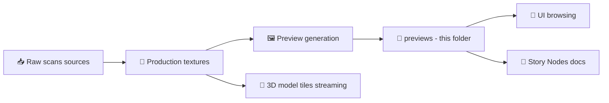

# 🧩 Texture Preview Thumbnails (Landmark Materials)


> **TL;DR ✅** This folder holds **tiny, UI-friendly preview images** of the texture maps used by this landmark’s materials (basecolor/normal/etc.).  
> These previews are optimized for **fast browsing**, **storytelling**, and (future) **offline/AR packs** — not for rendering quality.

---

## 📍 Folder Location

`web/assets/3d/landmarks/<landmark_slug>/textures/previews/`

- `<landmark_slug>` = lowercase kebab-case landmark identifier (e.g., `monument-rocks`, `pawnee-rock`).
- This README is intended to live **inside each landmark’s** `textures/previews/` directory.

---

## 🎯 Why This Folder Exists

### 🚀 UX + Performance
Texture previews let the web UI show “what’s in the box” **without loading full-resolution textures** (which are heavy and slow). This keeps browsing snappy and reduces accidental downloads.

### 🧭 Storytelling + Education
Previews are also useful in Story Nodes / documentation for quick “material callouts” like *“this limestone basecolor is derived from X scan set”*.

---

## ✅ Folder Contract

### ✅ What belongs here
- **Downscaled preview images** for each texture map used by landmark materials.
- **Small, predictable filenames** so UI + tooling can discover them.
- Optional: a lightweight `manifest.json` describing what’s present (recommended 🔒).

### ❌ What does NOT belong here
- Full-resolution textures (put them in the proper `textures/` location, an artifact store, or the agreed pipeline output location).
- Raw photogrammetry scans or source photo sets.
- Anything with unclear license/attribution or unresolved sensitivity rules.

---

## 🗂 Recommended Layout

### Option A: Material subfolders (recommended ✅)
Keeps filenames simple and scales to multiple materials.

```text
📁 web/assets/3d/landmarks/<landmark_slug>/
  📁 textures/
    📁 previews/
      📄 README.md  👈 you are here
      📄 manifest.json  (optional but recommended)
      📁 <material_slug>/
        🖼️ basecolor.webp
        🖼️ normal.webp
        🖼️ orm.webp              (packed Occlusion/Roughness/Metallic)
        🖼️ emissive.webp         (if used)
        🖼️ opacity.webp          (if used)
```

### Option B: Flat files (acceptable if only one material)
```text
📁 previews/
  🖼️ basecolor.webp
  🖼️ normal.webp
  🖼️ orm.webp
```

---

## 🏷️ Naming Convention

### ✅ Texture “roles” (preferred)
Use role-based names so tools don’t have to guess.

| Role (filename) | Meaning | Notes |
|---|---|---|
| `basecolor.webp` | Albedo / Base Color | Usually **sRGB** |
| `normal.webp` | Normal map | Keep as-is; don’t color-correct |
| `orm.webp` | Packed **O**cclusion **R**oughness **M**etallic | Common PBR packing (R/G/B) |
| `roughness.webp` | Roughness map | If not using packed ORM |
| `metallic.webp` | Metallic map | If not using packed ORM |
| `occlusion.webp` | Ambient occlusion | If not using packed ORM |
| `emissive.webp` | Emissive map | If used |
| `opacity.webp` | Opacity/alpha | If used |

### 🧱 Material slug rules
- `<material_slug>` should be **kebab-case** (e.g., `limestone`, `sandstone-wall`, `prairie-grass`).
- Keep it stable; changing it breaks references.

---

## 🖼️ Preview Image Specs (House Style)

These are **defaults**. If your landmark has special needs, document them here 👇.

| Spec | Recommendation |
|---|---|
| Format | `webp` (preferred), `png` only if necessary |
| Dimensions | `512×512` (default) or `1024×1024` if detail is critical |
| File size target | **≤ 250 KB** each (smaller is better) |
| Metadata | Strip EXIF/ICC baggage unless needed |
| Tiling | If the texture tiles, preview may show a **2×2 tile** view (optional but helpful) |

> 💡 Rule of thumb: **preview = “recognizable”, not “production quality.”**

---

## 🧪 Suggested Generation Recipes

<details>
<summary><strong>🛠 ImageMagick (example)</strong></summary>

```bash
# Basecolor → 512px WebP (center-crop square)
magick basecolor.png \
  -resize 512x512^ -gravity center -extent 512x512 \
  -strip -quality 82 \
  ./previews/<material_slug>/basecolor.webp

# Normal map → 512px WebP (avoid any color correction)
magick normal.png \
  -resize 512x512^ -gravity center -extent 512x512 \
  -strip -quality 82 \
  ./previews/<material_slug>/normal.webp

# Packed ORM → 512px WebP
magick orm.png \
  -resize 512x512^ -gravity center -extent 512x512 \
  -strip -quality 82 \
  ./previews/<material_slug>/orm.webp
```

✅ If your textures are already square, you can replace `-resize … -extent …` with a simple `-resize 512x512`.

</details>

<details>
<summary><strong>🧊 Blender workflow (high-level)</strong></summary>

- Confirm each material’s texture slots (Base Color / Normal / ORM or separate maps).
- Export previews by:
  - Rendering flat texture planes, **or**
  - Exporting texture images and downscaling them.
- Ensure previews are named per **role** and stored in the matching `<material_slug>/` folder.

</details>

---

## 🧾 Provenance & Governance (Non-Negotiable)

Even though these are “just previews,” they are still **user-facing artifacts** and must be governed like everything else:

- ✅ Every preview must be traceable to:
  - a source texture (or packed texture),
  - a deterministic transform (resize/compress),
  - and an allowed license / attribution chain.
- ✅ If a landmark or texture set is **sensitive**:
  - do **not** publish previews that reveal restricted details,
  - use a safer surrogate (blurred / stylized / placeholder),
  - and document the reason here.

---

## 📦 Optional: `manifest.json` (Recommended)

If you add a manifest, keep it **tiny** and helpful:

**Suggested fields** (example shape):
```json
{
  "schema_version": "kfm.texture_previews.v1",
  "landmark_slug": "<landmark_slug>",
  "materials": [
    {
      "material_slug": "<material_slug>",
      "previews": [
        { "role": "basecolor", "file": "basecolor.webp" },
        { "role": "normal", "file": "normal.webp" },
        { "role": "orm", "file": "orm.webp" }
      ]
    }
  ]
}
```

> 🔒 If checksums and provenance references are handled elsewhere in your pipeline, keep this manifest focused on **discovery** (what files exist and what they represent).

---

## 🧷 Quick Embed Examples

### 📝 In Story Markdown (local preview)
```md

```

### 🧭 “Material gallery” (optional)
> Replace `<material_slug>` with a real one once files exist.

| Map | Preview |
|---|---|
| Basecolor | /basecolor.webp" width="180" /> |
| Normal | /normal.webp" width="180" /> |
| ORM | /orm.webp" width="180" /> |

---

## ✅ PR Checklist

- [ ] Preview images are present for every required role in the material(s)
- [ ] Filenames match the role naming convention (`basecolor.webp`, `normal.webp`, `orm.webp`, …)
- [ ] Files are small (target ≤ 250 KB each) and reasonable resolution (512–1024px)
- [ ] No sensitive details leaked (or a placeholder is used and explained)
- [ ] Attribution / license / provenance chain is recorded in the agreed place (and review passes)

---

## 🧠 Tiny Pipeline Map (Mental Model)



---

## 📝 Notes (Landmark-Specific)

Use this section to document anything unique about this landmark’s textures:

- 🪨 Material list:
  - `<material_slug>` — what it represents:
  - `<material_slug>` — what it represents:

- 🎨 Special handling:
  - (e.g., “ORM is not used; separate roughness/metallic maps exist.”)
  - (e.g., “Previews are 1024px due to fine inscriptions.”)

- 🔐 Sensitivity:
  - (e.g., “High-frequency texture detail is restricted; previews are stylized.”)

