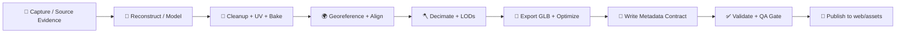

# 🏛️ 3D Landmarks Asset Library (`web/assets/3d/landmarks/`)


> [!IMPORTANT]
> **No “mystery landmarks.”** Every 3D model in this folder must ship with a **metadata contract** + **citations** so KFM can generate attribution, provenance traces, and trusted answers in Focus Mode.

---

## 🎯 What lives here (and what doesn’t)

This directory contains the **web-ready, optimized 3D landmark models** used by the KFM frontend for interactive exploration (tilt-to-3D, fly-to landmark, story scenes, etc.).

✅ **Belongs here**
- 🧊 `*.glb` (glTF 2.0 binary) models (LOD-ready)
- 🖼️ `preview.*` images for UI cards / pins
- 🧾 `landmark.meta.json` (contract + provenance hooks)
- 📎 `citations/` evidence artifacts (docs, screenshots, scan references, etc.)

❌ **Does NOT belong here**
- 📸 Raw drone imagery sets, raw LiDAR point clouds, Metashape/RealityCapture projects
- 🧱 Unoptimized meshes (multi-million poly) without LODs
- 🔒 Anything without a clear license or source chain

> [!TIP]
> If the source data is huge, store it in “cold storage” (external bucket / archive), and **link it** in the metadata contract. This folder stays lean so the web can stay fast.

---

## 🧭 Quick navigation

- [📁 Folder layout](#-folder-layout)
- [🧾 Asset contract (`landmark.meta.json`)](#-asset-contract-landmarkmetajson)
- [🌍 Georeferencing & coordinate systems](#-georeferencing--coordinate-systems)
- [🚀 LOD & performance budgets](#-lod--performance-budgets)
- [➕ Add a new landmark](#-add-a-new-landmark)
- [✅ QA checklist (PR gate)](#-qa-checklist-pr-gate)
- [📚 Project reference library](#-project-reference-library)

---

## 📁 Folder layout

```text
📁 web/assets/3d/landmarks/
├─ 📄 README.md
├─ 🗂️ index.json                         # registry of available landmarks (fast discovery)
├─ 🗂️ _schema/                           # optional: local schemas for validation tooling
│  └─ 📄 landmark.meta.schema.json
└─ 📁 <landmark_slug>/                   # one folder per landmark
   ├─ 🧾 landmark.meta.json               # REQUIRED: data contract + provenance hooks
   ├─ 🖼️ preview.jpg                      # REQUIRED: UI preview (small, optimized)
   ├─ 🧊 lod0.glb                         # REQUIRED: highest quality (still web-friendly)
   ├─ 🧊 lod1.glb                         # recommended
   ├─ 🧊 lod2.glb                         # recommended
   ├─ 📁 textures/                        # optional: if not embedded in GLB
   ├─ 📁 citations/                       # REQUIRED: evidence + license proofs
   └─ 📁 source/                          # optional: NOT usually committed (raw refs / notes)
```

---

## 🧩 Naming conventions

### Landmark folder name (`<landmark_slug>`)
Use **kebab-case**, keep it stable, and make it uniquely identifiable:

- ✅ `courthouse-topeka-ks`
- ✅ `monument-rocks-gove-county-ks`
- ✅ `flint-hills-overlook-chase-county-ks`
- ❌ `newModel2`
- ❌ `test_landmark_FINAL_FINAL`

### Asset filenames
Keep them predictable for loaders + CI:

- `lod0.glb`, `lod1.glb`, `lod2.glb`
- `preview.jpg`
- `landmark.meta.json`

> [!NOTE]
> Treat `slug` + `id` as **stable identifiers**. Display names can evolve; IDs should not.

---

## 🧾 Asset contract (`landmark.meta.json`)

This file is the “passport” for every landmark. It enables:

- ✅ **Contract-first ingestion** (schema-valid or rejected)
- ✅ **Provenance-first trust** (citations + license required)
- ✅ Auto-generated **attribution** and **method traces**
- ✅ Durable referencing from stories, graph nodes, and UI

### Required companion files

| File | Required | Purpose |
|---|:---:|---|
| `landmark.meta.json` | ✅ | Metadata contract + provenance hooks |
| `preview.jpg` | ✅ | UI card/marker preview |
| `lod0.glb` | ✅ | Primary model |
| `citations/` | ✅ | Proof of source + license + capture notes |
| `lod1.glb`, `lod2.glb` | ⭐ | Progressive loading + mobile friendliness |
| `textures/` | optional | External textures if not embedded |

### Minimal example (starter)

```json
{
  "schema_version": "1.0",
  "id": "kfm-lmk-courthouse-topeka-ks",
  "slug": "courthouse-topeka-ks",
  "title": "Shawnee County Courthouse (Topeka, KS)",
  "description": "Web-ready 3D landmark model for KFM stories and map scenes.",
  "tags": ["landmark", "courthouse", "architecture", "kansas"],

  "license": {
    "spdx": "CC-BY-4.0",
    "attribution": "Source attribution text that KFM can render in UI.",
    "notes": "Clarify any restrictions (commercial use, derivatives, etc.)."
  },

  "geo": {
    "display_crs": "EPSG:4326",
    "anchor_wgs84": {
      "lon": -95.6767,
      "lat": 39.0483,
      "alt_m": 290.0
    },
    "orientation": { "heading_deg": 0, "pitch_deg": 0, "roll_deg": 0 },
    "scale_m_per_unit": 1.0,
    "uncertainty_m": { "horizontal": 5, "vertical": 10, "notes": "Estimate + method." }
  },

  "assets": {
    "preview": "preview.jpg",
    "lods": [
      { "lod": 0, "path": "lod0.glb", "triangles": 180000, "bytes": 12400000 },
      { "lod": 1, "path": "lod1.glb", "triangles": 60000,  "bytes": 4800000  },
      { "lod": 2, "path": "lod2.glb", "triangles": 15000,  "bytes": 1200000  }
    ]
  },

  "provenance": {
    "sources": [
      {
        "type": "photogrammetry",
        "title": "Drone image set + processing log",
        "where": "citations/drone_capture_notes.md",
        "capture_date": "2025-09-12",
        "collector": "KFM team",
        "license_evidence": "citations/LICENSE_SOURCE.txt"
      }
    ],
    "processing_steps": [
      { "step": "reconstruction", "tool": "Metashape", "version": "1.x", "notes": "Settings + alignment notes in citations/" },
      { "step": "cleanup", "tool": "Blender", "version": "4.x", "notes": "Decimation + UV + bake notes in citations/" },
      { "step": "export", "tool": "glTF exporter", "notes": "Exported GLB with PBR materials" }
    ],
    "checksums": {
      "lod0.glb": "sha256:PUT_REAL_HASH_HERE"
    }
  }
}
```

> [!IMPORTANT]
> If it’s not in `landmark.meta.json`, it effectively “doesn’t exist” for the trust + citation pipeline. 🧾

---

## 🌍 Georeferencing & coordinate systems

### The KFM stance (practical + consistent)
- Use **WGS84 (EPSG:4326)** for display and interoperability in the web stack.
- Track original CRS in provenance (if the source data used something else).
- Standardize elevation units (meters) and **declare units** in metadata.

### Placement strategy (recommended)
To avoid floating-point jitter and keep authoring sane:

1. **Author the mesh in local coordinates** (meters; origin near the landmark).
2. Store a **geodetic anchor** (`lon/lat/alt`) in metadata.
3. Store orientation (`heading/pitch/roll`) and scale.
4. The runtime converts anchor → engine coordinates (Cesium ENU frame / local tangent plane, etc.).

> [!NOTE]
> Many real-world 3D models arrive **without spatial references**. Our workflow supports “shifting” and “aligning” assets into place — but the decision must be documented in `provenance.processing_steps` and backed by citations.

---

## 🧊 Formats & texture rules

### Model format
- ✅ Preferred: **glTF 2.0** binary **`.glb`** (single-file payload)
- ✅ PBR materials (baseColor / normal / metallicRoughness / occlusion / emissive as needed)
- ⭐ Compression encouraged when safe:
  - Geometry compression (e.g., meshopt / Draco) *if supported by target runtime*
  - Texture compression (e.g., KTX2/Basis) *if your pipeline supports it*

### Texture rules (web-first)
- Keep textures **small enough for mobile GPUs**
- Prefer **power-of-two** sizes where practical (1024/2048/4096)
- Avoid shipping dozens of textures when a single baked atlas works

---

## 🚀 LOD & performance budgets

These are **starting budgets** (tune as we profile). The goal: stable FPS, fast initial paint, graceful degradation.

| LOD | Intended use | Target triangles | Typical texture cap | Notes |
|---:|---|---:|---:|---|
| 0 | Desktop / close-up | 100k–300k | 2K–4K | “Hero” model, still web-optimized |
| 1 | Default mid-range | 30k–100k | ≤2K | Primary for most users |
| 2 | Mobile / far / overview | 5k–25k | ≤1K | Should load fast over slow networks |

> [!TIP]
> If LOD0 is “too pretty to ship,” keep it in `source/` or external storage and ship LOD1 as the highest public tier.

---

## 🧬 Pipeline (from evidence ➜ web asset)



---

## ➕ Add a new landmark

### 1) Create the folder
```bash
mkdir -p web/assets/3d/landmarks/<landmark_slug>/{citations,textures}
```

### 2) Drop in required deliverables
- `lod0.glb` (and ideally `lod1.glb`, `lod2.glb`)
- `preview.jpg`
- `citations/` (source proof + license proof + notes)

### 3) Write the contract
Create `landmark.meta.json` with:
- stable `id`, stable `slug`
- license + attribution
- WGS84 anchor + uncertainty
- LOD list + sizes
- provenance steps + evidence pointers
- checksums (at least for lod0)

### 4) Register it
Update `index.json` (so the app can discover landmarks without directory crawling).

Example `index.json` shape (suggested):
```json
{
  "schema_version": "1.0",
  "generated_at": "2026-01-14",
  "landmarks": [
    { "id": "kfm-lmk-courthouse-topeka-ks", "slug": "courthouse-topeka-ks", "meta": "courthouse-topeka-ks/landmark.meta.json" }
  ]
}
```

### 5) Run validation (local + CI)
Minimum validations we expect:
- JSON schema validation for `landmark.meta.json`
- glTF validation for each `.glb`
- size / triangle budget checks
- license + citations presence checks

---

## ✅ QA checklist (PR gate)

**Every landmark PR should satisfy:**

- [ ] 🧾 `landmark.meta.json` exists and is schema-valid
- [ ] 📎 `citations/` includes **source proof** + **license proof**
- [ ] 🧊 All referenced `.glb` files load and render (no missing textures)
- [ ] 🌍 Anchor is correct (lon/lat/alt) + orientation is sensible
- [ ] 📏 Units are documented (`scale_m_per_unit`)
- [ ] 🧪 Uncertainty is captured (even if approximate)
- [ ] 🖼️ `preview.jpg` is optimized (small but readable)
- [ ] ⚡ LODs exist or the PR justifies why not
- [ ] 🧹 No unused junk files / no “final_final_v7.glb”

> [!IMPORTANT]
> **If provenance is missing, the asset is not accepted into the official catalog.**

---

## 📚 Project reference library

<details>
<summary><strong>🗂️ How the project PDFs map to 3D landmarks work</strong></summary>

### 🌐 Web + Rendering
- **WebGL Programming Guide** → runtime constraints, GPU realities, client-side 3D
- **Responsive Web Design (HTML5/CSS3)** → progressive loading + mobile-first UI patterns

### 🗺️ GIS + Geospatial + Remote Sensing
- **Archaeological 3D GIS** → workflows for integrating and shifting 3D models into GIS contexts
- **Making Maps (GIS design)** → cartographic clarity, legibility, and narrative map design
- **Python Geospatial Analysis Cookbook** → geospatial tooling patterns, APIs, PostGIS workflows
- **Cloud-Based Remote Sensing with Google Earth Engine** → imagery-derived context layers and workflows
- **Mobile Mapping** → field capture realities, device constraints, spatial storytelling

### 🧾 Provenance + Cataloging + Architecture
- **KFM Comprehensive Technical Documentation** → contract-first + provenance-first rules, WGS84 standard, CI validation
- **MARKDOWN_GUIDE / KFM profiles** → STAC/DCAT/PROV alignment expectations & deterministic pipeline invariants
- **Data Spaces** → modular data products, architecture patterns for evolvable systems

### 📈 Scientific Method (treat assets like evidence)
- **Scientific Modeling & Simulation (NASA-grade)** → verification/validation mindset, uncertainty as first-class
- **Understanding Statistics & Experimental Design** → reproducibility culture (document what you did)
- **Regression Analysis (Python / slides)** & **Graphical Data Analysis (R)** → analytical discipline for derived metrics

### 🔐 Security + Ethics
- **Introduction to Digital Humanism** → human-centered constraints + transparency expectations
- **AI Law foundations paper** → accountability framing
- **Ethical Hacking / Gray Hat Python** → reminder: treat assets and pipelines as attack surfaces (validate inputs)

### 📚 Programming mega-shelves (A…X)
- A / B-C / D-E / F-H / I-L / M-N / O-R / S-T / U-X programming books → general engineering patterns that show up everywhere in the pipeline

</details>

---

## 🧯 Common pitfalls (avoid these)

- ❌ **Wrong axis / up vector** → model appears sideways or underground  
- ❌ **Origin far from the mesh** → jitter at runtime (floating-point pain)  
- ❌ **No license evidence** → can’t ship it  
- ❌ **LOD0 is 800MB** → nobody loads it  
- ❌ **Texture spam** → 40 textures for a tiny object is a mobile crash waiting to happen  

---

## 🧪 TODO (recommended next files)

- `web/assets/3d/landmarks/_schema/landmark.meta.schema.json`
- `scripts/validate-landmarks.{js,py}` (schema + glTF + budgets + citations)
- `web/assets/3d/landmarks/_examples/` with one “gold standard” landmark folder
