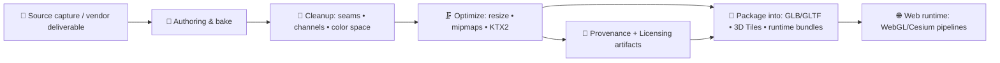

# 🧵 Landmark Texture Library (Shared)

This folder is the **landmark-scoped** home for **reusable texture sets** used by *multiple* landmark assets (multiple LODs, multiple exports, multiple packaging targets), **without** promoting them to global “shared” materials.

> ✅ Use this folder when a texture set is reused across *two or more landmark assets or variants* **and** its licensing/provenance should remain **within the Landmarks domain**.  
> ❌ If a texture set is only used by a single landmark, store it in that landmark’s folder:  
> `web/assets/3d/landmarks/<landmark_slug>/textures/`  
> 🌎 If a texture set is truly general-purpose for the whole platform, prefer:  
> `web/assets/3d/shared/textures/` (see: `../../shared/textures/README.md`)

---

## 🧭 Quick Links

- 🗺️ Landmarks root: `../README.md`
- 🧱 Global 3D texture system: `../../shared/textures/README.md`
- 🧩 Shared materials (global): `../../shared/textures/materials/README.md`
- 🧾 Per-landmark attribution: `../<landmark_slug>/attribution.md`
- 📜 Per-landmark licenses: `../<landmark_slug>/licenses/README.md`

---

## 🗂️ Expected Structure

```text
📁 web/assets/3d/landmarks/textures/
├─ 📄 README.md
├─ 📁 <texture_set_id>/
│  ├─ 🧾 texture-set.json
│  ├─ 🧾 attribution.md
│  ├─ 📁 licenses/              # if licensing is not already covered upstream
│  │  ├─ 📄 README.md
│  │  └─ 📄 LICENSE-*.txt
│  ├─ 🖼️ preview.jpg            # optional human-friendly preview
│  ├─ 🖼️ <name>_bc.ktx2         # baseColor / albedo (sRGB)
│  ├─ 🖼️ <name>_n.ktx2          # normal (linear)
│  ├─ 🖼️ <name>_orm.ktx2        # packed Occlusion/Roughness/Metallic (linear)
│  ├─ 🖼️ <name>_e.ktx2          # emissive (sRGB) (optional)
│  └─ 🖼️ <name>_h.png|ktx2      # height (linear) (optional)
└─ 📁 _notes/                   # optional: migration notes, audit notes, deprecation logs
```

### 🧷 ID rules (`<texture_set_id>`)
- **Stable, unique, kebab-case** (no spaces): `cottonwood-falls-courthouse-v1`
- Never encode secrets or personal info.
- Once referenced by downstream assets/manifests, treat as **immutable** (new version → new id or `-v2`).

---

## 🧠 Canonical Placement Rules (No-Duplicates Contract)

### ✅ Put textures here when…
- The same texture set is referenced by **multiple landmark assets** (or multiple output formats/LODs) and
- You want a **single canonical home** under **Landmarks** for governance + audit.

### ✅ Put textures in per-landmark folders when…
- The texture set is **only** used by a single landmark.
- You need “asset adjacency” for hand-editing and review.

### ✅ Put textures in global shared textures when…
- The texture is **not landmark-specific** and is a general reusable material library.

### ❌ Avoid
- Copy/pasting the same texture into multiple landmark folders.
- “Mystery textures” with no provenance or licensing trail.
- Untracked edits to baked textures without updating the manifest.

---

## 🧪 Texture Pipeline (Conceptual)



> This repo may implement this pipeline with dedicated tooling; this README defines the **contract** the outputs must satisfy.

---

## 🎨 Texture Types & Color Space Rules

### 🟦 Base Color / Albedo (`*_bc.*`)
- **sRGB**
- Alpha only when needed (opacity/cutout); document the intent.

### 🟩 Normal (`*_n.*`)
- **Linear**
- Confirm normal orientation for your runtime (OpenGL-style vs DirectX-style). If you had to flip Y, record it in the manifest.

### 🟫 Packed ORM (`*_orm.*`)
- **Linear**
- Standard channel packing (recommended):
  - **R = Occlusion (AO)**
  - **G = Roughness**
  - **B = Metallic**

### ✨ Emissive (`*_e.*`)
- **sRGB**
- Keep emissive energy sane; avoid blown-out bloom unless intentional.

### 🏔️ Height / Displacement (`*_h.*`)
- **Linear**
- Prefer 16-bit where necessary (document bit-depth + scaling).

---

## 📦 Formats (Runtime vs Source)

### ✅ Runtime (preferred)
- `*.ktx2` (Basis/ETC/ASTC target via transcoding)
- Includes mipmaps (or is produced with mipmaps by pipeline)

### ✅ Source / Edit (only when needed)
- High-quality `*.png` or `*.tif` kept **out of runtime hot paths**
- If stored here, document why and ensure licensing is crystal clear

> 🔥 Keep runtime bundles lean: **avoid shipping raw bake outputs** unless there’s a verified need.

---

## 🏷️ Required Metadata Files

### 1) `texture-set.json` (required)
A minimal contract (extend as needed):

```json
{
  "texture_set_id": "cottonwood-falls-courthouse-v1",
  "name": "Cottonwood Falls Courthouse - Stone + Trim",
  "owner": "KFM",
  "scope": "landmarks",
  "created": "2026-01-15",
  "sources": [
    {
      "type": "photogrammetry|vendor|archive|in-house",
      "citation": "See attribution.md",
      "license_ref": "licenses/README.md"
    }
  ],
  "maps": {
    "basecolor": {"file": "courthouse-stone_bc.ktx2", "colorspace": "sRGB"},
    "normal":    {"file": "courthouse-stone_n.ktx2",  "colorspace": "linear"},
    "orm":       {"file": "courthouse-stone_orm.ktx2","colorspace": "linear"}
  },
  "notes": {
    "normal_y_flip": false,
    "channel_packing": "ORM (R=AO,G=Roughness,B=Metallic)",
    "intended_use": "Exterior stone + trim for landmark assets only"
  }
}
```

### 2) `attribution.md` (required)
- Human-readable credits
- Link to upstream sources
- Link to any per-landmark attribution if applicable

### 3) `licenses/` (required when not inherited)
If a texture set has licensing that is **not already fully covered** by a landmark’s license pack, include `licenses/` here so reuse doesn’t break compliance.

---

## ✅ Pre-Commit QA Checklist

- [ ] 🧾 `texture-set.json` present and valid JSON
- [ ] 🧾 `attribution.md` present and complete
- [ ] 📜 Licensing is explicit (and compatible with intended reuse)
- [ ] 🎨 Correct color spaces (sRGB vs linear) per map type
- [ ] 🧠 Normal map orientation verified (and recorded)
- [ ] 📏 Texture sizes are appropriate (no accidental 8K unless justified)
- [ ] 🗜️ Runtime textures use `*.ktx2` (or documented exception)
- [ ] 🔁 No duplicated copies elsewhere (canonical home respected)
- [ ] 🧪 Visual spot-check in viewer (no seams, no inverted roughness, no gamma issues)
- [ ] 🧯 No embedded PII (faces, readable license plates, EXIF GPS) in source imagery

---

## 🧷 Naming Conventions

### ✅ File naming
- `lowercase-kebab-case` for IDs and folders
- Map suffixes:
  - `_bc` baseColor
  - `_n` normal
  - `_orm` packed occlusion/roughness/metallic
  - `_e` emissive
  - `_h` height

**Example**
- `courthouse-stone_bc.ktx2`
- `courthouse-stone_n.ktx2`
- `courthouse-stone_orm.ktx2`

### ❌ Avoid
- Spaces, `FINAL`, `new_new`, `temp`, ambiguous names
- Unlabeled channel-packed textures

---

## 🧩 How Landmark Assets Should Reference These Textures

- Prefer references by **relative paths** from the asset bundle that consumes them.
- If a build step copies textures into a packaged output, preserve:
  - `texture_set_id`
  - attribution and licensing links
  - hashes/checksums if your pipeline supports it

> 🧾 Provenance-first rule: every runtime-reachable texture must be traceable back to a manifest + attribution.

---

## 🆘 Troubleshooting

**Texture looks “washed out”**  
- Likely sRGB/linear mismatch. BaseColor should be sRGB; ORM/Normal should be linear.

**Metal looks like plastic**  
- Roughness inverted or mispacked channels. Confirm ORM packing and that roughness is in **G**.

**Normals look “inside-out”**  
- Y channel flipped (DirectX vs OpenGL). Flip Y and record `normal_y_flip`.

**Performance tanks**  
- Too-large textures, missing mipmaps, or shipping PNG/JPG instead of KTX2.

---

## 🔒 Compliance & Safety Notes

- 🧾 **Do not** add textures without clear licensing and attribution.
- 🧬 If derived from scans or photos, ensure no sensitive embedded metadata (EXIF GPS, personal faces).
- 🧱 Trademarks/logos: treat as restricted unless you have explicit permission.

---

## 🧰 Related READMEs (You’ll Want These)

- `../<landmark_slug>/textures/README.md` → landmark-local texture usage
- `../../shared/textures/_source/README.md` → global authoring conventions
- `../../shared/textures/materials/README.md` → globally reusable materials

---
🧭 **North Star:** one canonical home per asset, provenance always attached, licensing never ambiguous. 🧾✨
