# 🧱 Shared 3D Materials

   

A **shared, reusable material library** for KFM’s 3D ecosystem. Materials here are designed to be **portable** across models (GLB/glTF, tilesets, terrain meshes) and **auditable** (what textures + parameters produced the look, and under what license).

> 🧠 Mental model: **Textures are pixels**; **materials are meaning** (shader + parameters + texture bindings + rendering rules).

---

## 📘 Overview

### Purpose
Provide a **single canonical home** for reusable 3D material definitions used by KFM’s web 3D viewers (e.g., Three.js, Cesium) and asset pipelines.

### Scope

| ✅ In scope | ❌ Out of scope |
|---|---|
| Material definitions (PBR params, texture slot mapping, alpha rules) | Raw/baked texture images (see textures library) |
| Reusable presets (terrain/rock/wood/metal, decals, UI-safe variants) | Per-landmark one-off materials (keep local unless promoted) |
| Schemas + examples for validating material JSON | DCC “working” files unless explicitly stored under `_source/` |
| Provenance + licensing metadata for shared materials | Runtime-generated procedural shaders (unless standardized & documented) |

### Audience
- **Primary:** 3D asset authors, pipeline maintainers, web rendering engineers
- **Secondary:** data stewards reviewing licensing/provenance, UI implementers

### Definitions (quick)
- **PBR:** Physically Based Rendering (consistent lighting response)
- **glTF:** Standard 3D asset format; GLB is the binary container
- **Material:** Shader configuration + parameters + texture bindings
- **Variant:** A controlled override of a base material (e.g., “selected”, “night”, “snow”)

---

## 🗂️ Directory Layout

> 🧭 This folder should stay **small, curated, and reusable**. If something is asset-specific, it belongs with that asset until it proves broadly reusable.

```text
web/assets/3d/shared/materials/
├─ 📘📄 README.md                           # 📘 You are here 📌 What “shared materials” are + how to reference them from models
├─ 🧾🗂️ manifest.materials.json             # Optional but recommended registry: materialId → path + tags + preview + license refs
├─ 🧩 schema/                               # Validation contracts for material definitions
│  ├─ ✅📐🧾 kfm.material.schema.json        # JSON Schema for KFM material defs (fields, texture roles, constraints)
│  └─ 🧪 examples/                          # Minimal working examples (known-pass fixtures for CI/docs)
├─ 🧱 library/                              # Canonical reusable material library (runtime-safe, small, versionable)
│  └─ 📦 <material_slug>/                   # One folder per material (stable slug used by manifests/models)
│     ├─ 🧾 material.kfm.json               # KFM material definition (PBR params + texture refs + defaults)
│     ├─ 🖼️ preview.webp                    # Optional small render preview (UI cards / quick review)
│     ├─ 📝 notes.md                        # Gotchas + intended usage (scale, tiling, channel packing, color space)
│     ├─ ⚖️ licenses/                       # License + attribution (required if upstream attribution is non-trivial)
│     └─ 🧾 sources/                        # Source refs/receipts (where textures came from, tooling, digests) if needed
└─ 🎨 _source/                              # Optional DCC source assets (opt-in; not served; keep lightweight or externalize)
   └─ 🧰 <material_slug>/                   # Blender/Substance/etc. source files (only when required for reproducibility)
```

### Naming rules ✅
- Use **kebab-case** for folders: `weathered-steel`, `prairie-soil-dry`
- Keep filenames consistent:
  - `material.kfm.json` (definition)
  - `preview.webp` (optional)
  - `notes.md` (optional)
- Prefer **promoting** reusable materials into `library/` instead of duplicating across assets.

---

## 🧱 Material Definition Standard (KFM)

KFM materials are defined as **portable JSON** that can be:
- **Applied** as overrides to glTF materials (preferred)
- **Instantiated** by a web renderer (Three.js/Cesium)
- **Validated** via JSON Schema (CI-friendly)

### ✅ Required capabilities
- PBR core: baseColor, metallic, roughness, normal, occlusion, emissive
- Alpha behavior: `opaque | mask | blend`, plus cutoff when relevant
- Double-sided rules (rare; must be explicit)
- Texture slot mapping with **color space correctness**

### 🎯 Suggested minimal shape (example)

```json
{
  "id": "kfm_mat:prairie-soil-dry:v1",
  "name": "Prairie Soil (Dry)",
  "version": "1.0.0",
  "tags": ["terrain", "soil", "pbr"],
  "pbr": {
    "baseColorFactor": [0.62, 0.53, 0.41, 1.0],
    "metallicFactor": 0.0,
    "roughnessFactor": 0.92
  },
  "textures": {
    "baseColor": "web/assets/3d/shared/textures/materials/prairie-soil-dry/basecolor.ktx2",
    "normal": "web/assets/3d/shared/textures/materials/prairie-soil-dry/normal.ktx2",
    "orm": "web/assets/3d/shared/textures/materials/prairie-soil-dry/orm.ktx2"
  },
  "rendering": {
    "alphaMode": "OPAQUE",
    "doubleSided": false
  },
  "provenance": {
    "source": "TBD",
    "license": "TBD",
    "attribution": "TBD"
  }
}
```

> 🧠 Texture channel convention (recommended): **ORM** = `R: occlusion`, `G: roughness`, `B: metallic`

### 🎨 Color space rules (non-negotiable)
- **sRGB**: baseColor/albedo, emissive
- **Linear**: normal, metallic/roughness/occlusion, height, AO, masks

---

## 🔗 How Materials Are Used

### 1) Embedded (glTF/GLB)
Most models ship with embedded glTF materials. Shared materials act as:
- **Overrides** (swap textures/params without re-exporting the mesh)
- **Standard presets** (keep “look” consistent across many assets)

### 2) External binding (recommended)
A renderer can load:
- `GLB model` ➜ identify material slots ➜ apply `material.kfm.json` by `id` or tag rules.

### 3) Variants
Variants should be expressed as **delta overrides**, not full redefinitions:
- Example: “selected” variant increases emissive + adds outline in renderer layer.
- Keep variant logic in a **standard place** (either in material JSON as `variants`, or in the viewer’s material override system).

---

## 🧰 Authoring Workflow

### ✅ Add a new shared material (promotion path)
1. **Start local** (asset folder) if uncertain it’s reusable.
2. When it repeats across assets, **promote** it into `shared/materials/library/<slug>/`.
3. Create or reuse textures under:
   - `web/assets/3d/shared/textures/materials/<slug>/...`
4. Write `material.kfm.json` and validate it (schema + references).
5. (Optional) Add `preview.webp` (small, fast to load).
6. Add entry to `manifest.materials.json` (if used).

### 🧪 Quick rendering sanity checks
- Rotate a neutral HDRI / directional light
- Verify normal map strength (no “inside-out” lighting)
- Confirm roughness response (not plastic/glossy unless intended)
- Confirm no missing textures / broken paths

---

## 🧪 Validation & CI Expectations

### Required checks (fail-closed)
- ✅ JSON Schema validation (material defs)
- ✅ Reference resolution (all texture paths exist)
- ✅ License presence for non-original/derived assets
- ✅ Size/perf budgets (project-defined; keep previews small)

### Recommended checks
- 🔍 Lint: ordering, naming conventions, stable IDs
- 🧯 Visual regression test (golden renders) for core materials (if/when tooling exists)

---

## ⚖ Licensing, Attribution, and Provenance

Materials are **compositions**. Track:
- Texture source licenses
- Any shader/source code licensing (if applicable)
- Attribution text (minimum viable)
- “What changed?” notes if adapted

If a material pulls from third-party sources, store receipts in:
- `library/<slug>/licenses/`
- `library/<slug>/sources/`

> 🚫 Never import textures/materials without explicit license clarity.

---

## 🗺️ Diagram: Material → Viewer Path

```mermaid
flowchart LR
  A["🎨 Authoring (DCC / Bake)"] --> B["🧵 Textures Library\n(shared/textures/...)"]
  A --> C["🧱 Material Def\n(shared/materials/library/<slug>/material.kfm.json)"]
  B --> C
  C --> D["🌐 Web Viewer\n(Three.js / Cesium)"]
  D --> E["🗺️ KFM UI Scenes\n(landmarks • terrain • archaeology)"]
```



---

## 🔗 Related Paths

- 🧵 Textures (material maps): `web/assets/3d/shared/textures/materials/README.md`
- 🧱 Shared textures authoring: `web/assets/3d/shared/textures/_source/README.md`
- 📦 GLB models: `web/assets/3d/shared/models/glb/README.md`
- 🧩 Tilesets: `web/assets/3d/shared/models/tilesets/README.md`
- 🏔️ Terrain packs & schema: `web/assets/3d/terrain/schema/examples/README.md`

---

## ✅ Definition of Done (this folder)

- [ ] Front-matter present + matches KFM-MDP v11.2.6
- [ ] Directory layout matches this README (no “mystery files”)
- [ ] Every shared material has:
  - [ ] `material.kfm.json` (validated)
  - [ ] textures resolved in shared textures library
  - [ ] license/provenance fields filled (or explicitly `TBD` with a tracking issue)
- [ ] No duplicate “near-identical” materials (promote + version instead)
- [ ] Links in this README are valid (CI link-check clean)

---
