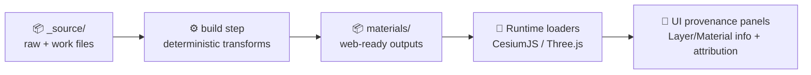

# 🎨 Material: `<material_slug>`


> **Purpose:** This folder is the **source-of-truth** for the `<material_slug>` material used by KFM’s web 3D viewers (CesiumJS/Three.js) and 3D storytelling scenes.

<p align="center">
   material on a sphere">
</p>

---

## ✅ Quick facts

| Field | Value |
|---|---|
| **Slug** | `<material_slug>` |
| **Display name** | `TODO (human-friendly name)` |
| **Category** | `TODO (ground / wood / stone / metal / fabric / water / FX / other)` |
| **Workflow** | `PBR (metallic-roughness)` |
| **Intended scale** | `TODO (e.g., 1 tile = 1 meter)` |
| **Default tiling** | `TODO (e.g., repeat 4×4)` |
| **License** | `TODO (required)` |
| **Sensitivity** | `PUBLIC` / `RESTRICTED` / `INTERNAL` (pick one) |

---

## 🧠 How this fits into KFM (why we’re strict)

KFM is **contract-first + provenance-first**: anything that renders in the UI should be traceable back to a known source and license. Materials are treated like **governed evidence artifacts**, not “mystery textures”.

That means this material must ship with:

- 📜 **Clear license + attribution**
- 🧾 **Source/provenance record**
- 🧬 **A machine-readable contract** (`material.contract.json`)
- 🔐 **Sensitivity + cultural protocol tags** (if applicable)

> [!IMPORTANT]
> If you can’t state the license or provenance, **do not use this material in user-facing scenes**.

---

## 🗺️ Pipeline overview



---

## 📁 Folder layout

> [!TIP]
> Keep `_source/` **human-editable**. Keep **web-ready** outputs **outside** `_source/` (generated).

```text
📁 web/assets/3d/shared/materials/
├─ 📁 _source/
│  └─ 📁 <material_slug>/
│     ├─ 📄 README.md                 👈 you are here
│     ├─ 📄 material.contract.json    ✅ required
│     ├─ 📄 source.json               ✅ required (license + provenance)
│     ├─ 📁 preview/                  🖼️ required (small web images)
│     │  ├─ 🖼️ sphere.webp
│     │  ├─ 🖼️ flat.webp
│     │  └─ 🖼️ thumb.webp
│     ├─ 📁 raw/                      🧱 high-res, lossless inputs
│     │  ├─ 🖼️ <material_slug>_basecolor_8k.tif
│     │  ├─ 🖼️ <material_slug>_normal_8k.exr
│     │  ├─ 🖼️ <material_slug>_roughness_8k.tif
│     │  ├─ 🖼️ <material_slug>_metallic_8k.tif
│     │  ├─ 🖼️ <material_slug>_ao_8k.tif
│     │  └─ 🖼️ <material_slug>_height_8k.exr        (optional)
│     ├─ 📁 work/                     🧪 editable project files
│     │  ├─ 🧩 <material_slug>.spp / .sbsar / .blend / .kra (optional)
│     │  └─ 📄 notes.md                               (optional)
│     └─ 📁 refs/                     🔗 receipts + reference links
│        ├─ 📄 checksums.sha256        (recommended)
│        └─ 📄 citations.md            (optional)
└─ 📁 <material_slug>/                ⚙️ GENERATED (do not hand-edit)
   ├─ 📄 material.json
   └─ 📁 textures/
      ├─ 🧊 basecolor.ktx2
      ├─ 🧊 normal.ktx2
      ├─ 🧊 orm.ktx2
      └─ 🧊 emissive.ktx2 (optional)
```

---

## 🧾 Slug rules

- ✅ **kebab-case** (lowercase, hyphens)
- ✅ ASCII only
- ✅ Starts with a letter
- ❌ No spaces, underscores, emojis, or version numbers in the slug

Examples:

- ✅ `prairie-dirt`
- ✅ `limestone-cut`
- ❌ `Prairie Dirt`
- ❌ `limestone_cut_v2`

---

## 📄 Required files (minimum bar)

### 1) `material.contract.json` ✅

This is the **contract-first** entry that code and tooling can rely on.

<details>
<summary><strong>📦 Minimal template (copy/paste)</strong></summary>

```json
{
  "id": "kfm.material.<material_slug>",
  "slug": "<material_slug>",
  "title": "TODO: Display Name",
  "description": "TODO: One sentence describing where/why we use this material.",
  "tags": ["TODO", "kfm", "pbr"],
  "pbrWorkflow": "metallicRoughness",

  "units": "meters",
  "uv": {
    "metersPerTile": 1.0,
    "defaultRepeat": [1, 1]
  },

  "textures": {
    "baseColor": {
      "source": "raw/<material_slug>_basecolor_8k.tif",
      "build": "textures/basecolor.ktx2",
      "colorSpace": "sRGB"
    },
    "normal": {
      "source": "raw/<material_slug>_normal_8k.exr",
      "build": "textures/normal.ktx2",
      "colorSpace": "linear",
      "normalFormat": "OpenGL"
    },
    "orm": {
      "description": "Packed channels: R=AO, G=Roughness, B=Metallic",
      "source": "raw/<material_slug>_ao_8k.tif + raw/<material_slug>_roughness_8k.tif + raw/<material_slug>_metallic_8k.tif",
      "build": "textures/orm.ktx2",
      "colorSpace": "linear"
    }
  },

  "defaults": {
    "roughness": 0.7,
    "metallic": 0.0,
    "normalScale": 1.0
  },

  "governance": {
    "license": "TODO: SPDX (or human-readable) license string",
    "attribution": "TODO: Required credit line",
    "sensitivity": "PUBLIC",
    "culturalProtocols": ["NONE"]
  }
}
```

</details>

**Notes**
- `id` should remain stable forever.
- If you change any texture source, update `source.json` and checksums.

---

### 2) `source.json` ✅

This is the **provenance + license receipt** (the “why we’re allowed to use this” file).

<details>
<summary><strong>🧾 Minimal template (copy/paste)</strong></summary>

```json
{
  "material": "<material_slug>",
  "sources": [
    {
      "type": "scan",
      "title": "TODO: Where this came from",
      "author": "TODO",
      "url": "TODO (or null if local capture)",
      "retrieved_at": "TODO (YYYY-MM-DD)",
      "license": "TODO (include link if possible)",
      "attribution": "TODO (credit line)",
      "notes": "TODO"
    }
  ],
  "sensitivity": "PUBLIC",
  "culturalProtocols": ["NONE"],
  "checksums": {
    "raw/<material_slug>_basecolor_8k.tif": "sha256:TODO",
    "raw/<material_slug>_normal_8k.exr": "sha256:TODO"
  }
}
```

</details>

> [!NOTE]
> If this material is tied to culturally sensitive heritage, set `culturalProtocols` accordingly (e.g., TK labels / community restrictions) and **do not publish it openly**.

---

## 🧱 Texture standards (PBR)

### ✅ Map set (recommended)

| Map | Required | Notes |
|---|---:|---|
| `baseColor` | ✅ | sRGB |
| `normal` | ✅ | Linear, **OpenGL** normal convention |
| `orm` | ✅ | Linear, packed channels: **R=AO, G=Roughness, B=Metallic** |
| `height` | ⛔ optional | Linear (EXR/TIFF recommended for source) |
| `emissive` | ⛔ optional | sRGB |
| `opacity` | ⛔ optional | Prefer alpha in baseColor if needed |

### 📛 Naming

Use:

- `<material_slug>_basecolor_<res>.tif`
- `<material_slug>_normal_<res>.exr`
- `<material_slug>_roughness_<res>.tif`
- `<material_slug>_metallic_<res>.tif`
- `<material_slug>_ao_<res>.tif`
- `<material_slug>_height_<res>.exr` (optional)

Where `<res>` is `1k | 2k | 4k | 8k`.

### 🎛️ Technical rules

- ✅ Power-of-two sizes (1024, 2048, 4096, …)
- ✅ Seamless tiling (unless explicitly a *unique unwrap* material)
- ✅ No baked lighting/shadows in `baseColor`
- ✅ Avoid JPEG for `_source` (lossless preferred)
- ✅ If normals come in **DirectX** (green channel flipped), convert to **OpenGL** and document it

---

## ⚙️ Build outputs (generated)

The build step should create **web-friendly** textures and a small `material.json` (or equivalent) that the runtime loader can consume.

### Suggested build targets

- 🧊 `KTX2` (Basis Universal) for GPU-friendly compression
- 🖼️ `WebP` for previews and thumbnails
- 🧾 `checksums.sha256` for reproducibility

> [!IMPORTANT]
> Generated files should be deterministic. If outputs change, that should be explainable by changes in inputs or code—not by manual editing.

---

## 🧪 Local preview (fast)

If you just need to sanity-check the previews:

```bash
# from this folder
python -m http.server 8080
# then open http://localhost:8080
```

> [!TIP]
> A simple Three.js preview page can render a sphere + plane using the built textures. Keep the preview lightweight so it works on low-end machines.

---

## 🧩 Usage in KFM (pseudocode)

### Three.js

```ts
// PSEUDOCODE — adapt to the actual KFM material registry APIs
const mat = await KfmMaterialRegistry.load("<material_slug>");

mesh.material = new THREE.MeshStandardMaterial({
  map: mat.baseColor,
  normalMap: mat.normal,
  aoMap: mat.ao,
  roughnessMap: mat.roughness,
  metalnessMap: mat.metallic
});
```

### CesiumJS

```ts
// PSEUDOCODE — options vary by how the asset is applied (glTF vs CustomShader)
const material = await KfmMaterialRegistry.load("<material_slug>");

// Option A: Use in glTF PBR texture slots (recommended for portability)
// Option B: Bind textures into a Cesium.CustomShader for procedural effects
```

---

## ✅ PR checklist (don’t skip) 🔍

- [ ] `README.md` completed (no `TODO` left for license/provenance)
- [ ] `material.contract.json` exists and matches texture files
- [ ] `source.json` exists and includes **license + attribution**
- [ ] Previews exist: `preview/sphere.webp`, `preview/flat.webp`, `preview/thumb.webp`
- [ ] Raw textures are lossless and named correctly
- [ ] Normal map format is documented (`OpenGL` vs `DirectX`)
- [ ] Checksums updated (recommended)
- [ ] If sensitive: `sensitivity != PUBLIC` and access rules are documented

---

## 🗓️ Changelog

| Date | Change | Author |
|---|---|---|
| `YYYY-MM-DD` | Initial import | `@you` |

---

## 🧭 See also

- 📚 KFM contribution rules (contracts + provenance): `/docs/MASTER_GUIDE_v13.md`
- 🧠 KFM evidence standards (STAC/DCAT/PROV): `/docs/standards/`
- 🧭 UI transparency expectations (layer info / attribution): `/docs/ui/`

