# 🧱 Material: <Material Display Name> (`<material_slug>`)


> ✨ **Purpose:** A shared, reusable PBR material for KFM’s web 3D stack (2D/3D toggle, story scenes, AR).  
> 🧾 **Contract-first:** `material.json` + `provenance.jsonld` + `checksums.sha256` are the source-of-truth.  
> 🚫 **Fail-closed:** If license/provenance is missing → treat as **NOT shippable**.

---

## 🧭 Material Snapshot

| Field | Value |
|---|---|
| **Slug** | `<material_slug>` |
| **Category** | `surface` \| `decal` \| `foliage` \| `interior` \| `utility` |
| **Workflow** | `metallicRoughness` (glTF-friendly) |
| **Default scale** | `<meters_per_repeat>` meters per UV repeat |
| **Texel density** | `<px_per_meter>` px/m |
| **Alpha mode** | `OPAQUE` \| `MASK` \| `BLEND` |
| **Classification** | `public` \| `restricted` \| `confidential` |
| **License (SPDX)** | `TBD` |
| **Attribution required?** | `yes` \| `no` |
| **Primary use** | `terrain detail` \| `buildings` \| `props` \| `story scene` \| `AR overlay` |
| **Last verified** | `YYYY-MM-DD` |

---

## 🖼️ Preview

> 🧠 Tip: keep previews small + representative. Show repetition + alpha behavior if relevant.

| Swatch | On sphere | In scene |
|---|---|---|
| `./previews/swatch.png` | `./previews/sphere.webp` | `./previews/scene.webp` |

<details>
<summary>📸 Preview guidance</summary>

- **Swatch**: flat sample that matches “legend swatch” expectations (helps UI consistency).
- **Sphere**: shows roughness/metalness response under light.
- **Scene**: shows tiling scale in context (and any shimmer/noise problems).

</details>

---

## 🗂️ Folder Layout

```text
📁 web/assets/3d/shared/materials/library/<material_slug>/
├─ 📄 README.md                       # ← you are here
├─ 📄 material.json                   # ✅ required: material “contract”
├─ 📄 provenance.jsonld               # ✅ required: source + transforms (PROV)
├─ 📄 ATTRIBUTION.md                  # ✅ required if license needs attribution
├─ 📄 LICENSE.md                      # ✅ required: SPDX + full text if needed
├─ 📄 checksums.sha256                # ✅ required: integrity + cache-busting
├─ 📁 previews/                       # ✅ required: repo-friendly images
│  ├─ 🖼️ swatch.png
│  ├─ 🖼️ sphere.webp
│  └─ 🖼️ scene.webp
├─ 📁 textures/
│  ├─ 📁 source/                      # 📦 optional: original authoring files (high-res)
│  │  ├─ 🖼️ baseColor.png
│  │  ├─ 🖼️ normal.png
│  │  └─ 🖼️ orm.png
│  ├─ 📁 png/                         # ✅ optional: optimized PNG fallbacks
│  │  ├─ 🖼️ baseColor.png
│  │  ├─ 🖼️ normal.png
│  │  └─ 🖼️ orm.png
│  └─ 📁 ktx2/                        # ✅ preferred: GPU-compressed runtime textures
│     ├─ 🖼️ baseColor.ktx2
│     ├─ 🖼️ normal.ktx2
│     └─ 🖼️ orm.ktx2                  # R=Occlusion, G=Roughness, B=Metallic
└─ 📁 samples/                        # ✅ optional: test geometry for quick QA
   ├─ 🧊 sample_plane.glb
   └─ 🧊 sample_sphere.glb
```

---

## 🔄 Lifecycle (how this material gets “made”)

```mermaid
flowchart LR; A[🧵 Source textures scans] --> B[🧼 Clean tile color correct]; B --> C[🧰 Pack channels - ORM + author contract]; C --> D[🗜️ Compress - KTX2 + generate previews]; D --> E[🧾 Provenance license checksums]; E --> F[🛡️ Policy gate checks]; F --> G[🚀 Ship - web runtime offline packs];
```



---

## 📜 Material Contract (`material.json`)

This file is the **single source of truth** for how this material loads, scales, and renders.

<details>
<summary>🧾 Example <code>material.json</code></summary>

```json
{
  "schema_version": "kfm.material.v1",
  "id": "mat.<material_slug>",
  "slug": "<material_slug>",
  "title": "<Material Display Name>",
  "description": "<short_description>",
  "tags": ["kansas", "terrain", "historic"],

  "classification": "public",
  "license_spdx": "CC-BY-4.0",

  "attribution": {
    "required": true,
    "text": "<Author/Org> — <Source Title> (<Year>), <License>"
  },

  "pbr": {
    "workflow": "metallicRoughness",
    "doubleSided": false,
    "alphaMode": "OPAQUE",
    "alphaCutoff": 0.5,

    "baseColorFactor": [1, 1, 1, 1],
    "metallicFactor": 1.0,
    "roughnessFactor": 1.0,

    "normalScale": 1.0,
    "emissiveFactor": [0, 0, 0]
  },

  "scale": {
    "meters_per_repeat": 2.0,
    "uv_repeat": [1, 1],
    "texel_density_px_per_meter": 512
  },

  "textures": {
    "baseColor": {
      "uri": "./textures/ktx2/baseColor.ktx2",
      "colorSpace": "sRGB"
    },
    "normal": {
      "uri": "./textures/ktx2/normal.ktx2",
      "colorSpace": "linear",
      "convention": "OpenGL"
    },
    "orm": {
      "uri": "./textures/ktx2/orm.ktx2",
      "colorSpace": "linear",
      "packing": { "r": "occlusion", "g": "roughness", "b": "metallic" }
    }
  },

  "provenance": {
    "prov_bundle": "./provenance.jsonld",
    "source_urls": ["<url_1>", "<url_2>"],
    "toolchain": ["<tool>@<version>", "<tool>@<version>"]
  }
}
```

</details>

✅ **Contract rules**
- Use **relative URIs** so the folder is portable (offline packs, mirrors, future registries).
- Treat texture keys like an **API**. If you change them, add compat aliases or bump `schema_version`.
- Keep `classification` aligned with source restrictions (propagate the most restrictive label).

---

## 🎨 Texture & Color Rules

### ✅ Color spaces
- **Base color / albedo:** `sRGB`
- **Normal / ORM / height / masks:** `linear`

### ✅ Required maps (minimum shippable set)
- `baseColor`
- `normal`
- `orm` (packed): **R=occlusion, G=roughness, B=metallic**

### ➕ Optional maps
- `height` (parallax/displacement)
- `emissive` (night lights, signage, indicators)
- `opacity` / alpha in `baseColor` (foliage/decals)

### 🧵 Tiling + scale
- If it tiles: document seam handling + show repetition in `scene.webp`.
- Always specify **real-world scale** (`meters_per_repeat`) to keep 3D scenes consistent and believable.

---

## 🚀 Usage

### Option A: three.js (MeshStandardMaterial)

<details>
<summary>🧩 Example loader snippet (pseudo-code)</summary>

```ts
/**
 * Pseudo-code: wrap this in your KFM material loader.
 * If you use KTX2 at runtime, initialize KTX2Loader once during app bootstrap.
 */
import * as THREE from "three";

async function loadKfmMaterial(defUrl: string) {
  const def = await fetch(defUrl).then(r => r.json());

  // TODO: use KTX2Loader if def.textures.*.uri ends in .ktx2
  const loader = new THREE.TextureLoader();

  const baseColor = loader.load(def.textures.baseColor.uri);
  baseColor.colorSpace = THREE.SRGBColorSpace;

  const normal = loader.load(def.textures.normal.uri);
  const orm = loader.load(def.textures.orm.uri);

  const mat = new THREE.MeshStandardMaterial({
    map: baseColor,
    normalMap: normal,

    // glTF-friendly packing: roughness=G, metalness=B, occlusion=R
    roughnessMap: orm,
    metalnessMap: orm,
    aoMap: orm
  });

  // Scale (tiling)
  const [u, v] = def.scale.uv_repeat ?? [1, 1];
  for (const t of [baseColor, normal, orm]) {
    t.wrapS = t.wrapT = THREE.RepeatWrapping;
    t.repeat.set(u, v);
  }

  return mat;
}
```

</details>

### Option B: glTF authoring
- Use `orm` as both `occlusionTexture` and `metallicRoughnessTexture` (channel-compatible).
- Keep `material.json` as the **human contract** even if `.glb` is the final runtime asset.

---

## 📦 Performance Budget

> 🎯 The goal is “looks great” **without** blowing up load time in 3D/AR.

**Recommended defaults**
- ✅ Max texture size: `2048×2048` (desktop), `1024×1024` (mobile/AR)
- ✅ Prefer `KTX2` for runtime
- ✅ Keep total payload (baseColor + normal + orm) under: **~2–6 MB** (platform-dependent)

**If you exceed budget**
- Provide a `variants` block (LOD / platform) and corresponding folders (e.g. `ktx2_1k/`).
- Regenerate previews to match the default variant.

<details>
<summary>🔁 Optional: variants (LOD / platform)</summary>

```json
{
  "variants": [
    { "id": "desktop", "maxTextureSize": 2048, "texturesRoot": "./textures/ktx2/" },
    { "id": "mobile",  "maxTextureSize": 1024, "texturesRoot": "./textures/ktx2_1k/" }
  ]
}
```

</details>

---

## 🛡️ Policy Gates (recommended)

> ✅ These are “repo rules” you can enforce with CI (policy-as-code).  
> 🔒 Default posture: **fail closed**.

- **KFM-MAT-001** — `LICENSE.md` exists + SPDX set
- **KFM-MAT-002** — `provenance.jsonld` exists + source URLs listed
- **KFM-MAT-003** — `checksums.sha256` exists + matches runtime files
- **KFM-MAT-004** — payload budget met (or variants provided)
- **KFM-MAT-005** — classification set + propagated correctly
- **KFM-MAT-006** — no secrets / keys / tokens in any file

---

## 🧾 Provenance & Licensing

### ✅ Minimum required files
- `LICENSE.md` (SPDX + full text if needed)
- `ATTRIBUTION.md` (if attribution required)
- `provenance.jsonld` (what/where/how this was made)
- `checksums.sha256` (integrity + caching)

### 🧬 Provenance checklist
- Source URLs + retrieval date
- Original author / organization
- Transform steps (crop, tile, color-correct, channel packing, compression)
- Toolchain versions (so we can reproduce)
- Any restrictions (commercial, share-alike, no-derivatives, etc.)

---

## 🧩 Adding a New Material (copy/paste workflow)

1. 🏷️ Create folder: `web/assets/3d/shared/materials/library/<material_slug>/`
2. 📄 Copy this README + create `material.json`
3. 🎨 Add textures:
   - preferred runtime: `textures/ktx2/`
   - optional fallback: `textures/png/`
4. 🖼️ Generate previews (`previews/swatch.png`, `sphere.webp`, `scene.webp`)
5. 🔐 Add `LICENSE.md` + `ATTRIBUTION.md` (if required)
6. 🧾 Create `provenance.jsonld`
7. 🧷 Generate `checksums.sha256`
8. ✅ Run local QA (visual + budget), then open PR

---

## ✅ QA Checklist (ship it 🚢)

- [ ] `material.json` exists and validates (schema_version present)
- [ ] `LICENSE.md` exists + `license_spdx` set
- [ ] `ATTRIBUTION.md` exists if required
- [ ] `provenance.jsonld` exists + source URLs included
- [ ] `checksums.sha256` generated for all runtime files
- [ ] Previews exist (`swatch`, `sphere`, `scene`)
- [ ] All runtime textures are power-of-two and mipmapped
- [ ] BaseColor is tagged `sRGB`; others are `linear`
- [ ] Payload within budget (or has variants)
- [ ] Classification + sensitivity are correct (no accidental leaks)
- [ ] Looks correct in 3D + AR contexts (no excessive shimmer / noise)

---

## 🧪 Change Log

> Keep it lightweight — we mainly care about visual changes, packing changes, and licensing.

- `YYYY-MM-DD` — v0.1.0 — Initial import
- `YYYY-MM-DD` — v0.2.0 — Packed ORM + KTX2 compression
- `YYYY-MM-DD` — v1.0.0 — Locked contract + verified provenance

---

## 👥 Maintainers

- Primary: `<name_or_handle>`
- Backup: `<name_or_handle>`
- Reviewers: `<team_or_channel>`

