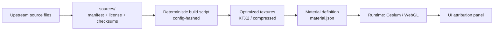

# 🧱 Material Sources — `<material_slug>`

     

> [!IMPORTANT]
> This folder is the **upstream evidence** for the material used in KFM’s 3D experiences (Cesium / WebGL).  
> If we can’t prove **where it came from**, **what it allows**, and **how we transformed it**, we **don’t ship it**. ✅  
> <!-- Rationale: provenance-first UI + traceability expectations :contentReference[oaicite:0]{index=0} -->

---

## 🔎 Where am I?

You are here:

```text
web/assets/3d/shared/materials/library/<material_slug>/sources/
```

- `<material_slug>` is the canonical, stable identifier for this material (kebab-case recommended).
- Everything in `sources/` is **audit-first** and **immutability-first**.

---

## 🎯 Purpose

KFM’s UI philosophy is “**the map behind the map**” — every visualization should trace back to source data + metadata.  
For 3D materials, this becomes: **“the material behind the model.”**  
<!-- UI traceability principle :contentReference[oaicite:1]{index=1} -->

This directory exists so we can:

- ✅ **Attribute** correctly (in UI + exports)
- ✅ **Audit** licensing and usage restrictions
- ✅ **Rebuild** textures/material definitions deterministically
- ✅ **Answer lineage questions** later (e.g., “Which models used this material?”)  
  <!-- Evidence-first lineage idea :contentReference[oaicite:2]{index=2} -->

---

## 🧩 What belongs in `sources/`

### ✅ YES (put it here)
- Upstream downloads (original texture set archives, scan outputs, photos, reference images)
- Source documentation (PDFs, README from vendor/creator)
- License text (or a verified copy), attribution requirements
- Screenshots / captures of the source page at acquisition time (helps when URLs rot)
- `source.json`, checksums, provenance records for the transformation pipeline

### ❌ NO (don’t put it here)
- Optimized runtime textures (e.g., `.ktx2`, `.basis`) → these belong in the **material output** folders (e.g., `../textures/` or `../build/`)
- Hand-edited “mystery” files with unknown origin
- Anything without a license you can explain

---

## 🗂️ Folder contract

At minimum, every material source bundle should follow this:

```text
sources/
  README.md                    # you are here
  source.json                  # REQUIRED: source + license + attribution + acquisition info
  checksums.sha256             # REQUIRED: SHA-256 for *every* file in sources/
  LICENSE.txt                  # REQUIRED: license text or a “license stub” with URL + terms
  prov.material.jsonld         # RECOMMENDED: W3C PROV JSON-LD lineage (source → transforms → outputs)
  upstream/                    # raw downloads, unmodified
    <provider_or_origin>/      
      <version_or_date>/
        ...
  notes/                       # optional: manual notes, screenshots, correspondence
    screenshots/
    emails/
    decisions.md
```

> [!TIP]
> Keep upstream file names whenever possible. If renaming is necessary, record a mapping in `notes/decisions.md`.

---

## 🔐 Governance rules (hard gates)

KFM uses **policy gates** and “fail closed” behavior: if required metadata or provenance is missing, the change should be rejected.  
<!-- Automated policy gates incl. license + provenance completeness :contentReference[oaicite:3]{index=3} -->

**For materials, that means:**

- **License must be present** (and compatible with KFM distribution).
- **Provenance must be present** (at least `source.json` + checksums; PROV strongly recommended).
- **If AI assisted generation** was used, it must be labeled and traceable.
  <!-- AI additions should be provenance-first + marked AI-generated :contentReference[oaicite:4]{index=4} -->

CI should validate:
- checksums exist and match,
- required files exist,
- and nothing violates policy (missing license/provenance, broken references, etc.).  
<!-- CI validation gates expectation :contentReference[oaicite:5]{index=5} -->

---

## 🧾 `source.json` template (copy/paste)

> [!IMPORTANT]
> `source.json` is **not optional**. It is the minimum evidence required for ingestion gatekeeping.  
> <!-- Ingestion gate checks: checksums + license/source citation via source.json :contentReference[oaicite:6]{index=6} -->

```json
{
  "id": "kfm:material:<material_slug>:source:<origin_key>:<version>",
  "material_slug": "<material_slug>",

  "title": "<Human readable material name>",
  "description": "<What this material represents + intended use in KFM>",

  "origin": {
    "type": "texture_pack | scan | photo | procedural | ai_generated | mixed",
    "provider": "<vendor/author/org/person>",
    "upstream_url": "<https://...>",
    "retrieved_at": "YYYY-MM-DD",
    "retrieved_by": "<github_handle_or_service>",
    "original_license": {
      "spdx": "<SPDX_ID_IF_KNOWN>",
      "license_url": "<https://...>",
      "license_file": "LICENSE.txt",
      "attribution_required": true,
      "attribution_text": "<exact required attribution if specified>"
    }
  },

  "usage": {
    "intended_context": ["webgl", "cesium", "3d_tiles", "story_nodes"],
    "allowed_distribution": "yes | no | conditional",
    "notes": "<Any restrictions (e.g., non-commercial, attribution, share-alike)>"
  },

  "files": [
    {
      "path": "upstream/<provider>/<version>/albedo.png",
      "sha256": "<sha256>",
      "content_type": "image/png",
      "bytes": 1234567
    }
  ],

  "transforms": [
    {
      "name": "optimize-textures",
      "tool": "kfm-material-pipeline",
      "version": "<tool_version>",
      "config_hash": "<hash_of_transform_config>",
      "outputs_expected": [
        "../textures/basecolor.ktx2",
        "../textures/normal.ktx2",
        "../textures/orm.ktx2"
      ]
    }
  ],

  "sensitivity": {
    "classification": "public | restricted",
    "reason": "<usually public for materials>"
  }
}
```

---

## 🔏 `checksums.sha256` (required)

Store SHA-256 hashes for **every file** under `sources/` (including license + screenshots).

Example:

```text
<sha256>  source.json
<sha256>  LICENSE.txt
<sha256>  upstream/provider/2026-01-01/albedo.png
<sha256>  upstream/provider/2026-01-01/normal.png
```

This mirrors KFM’s ingestion gate approach (integrity checks + manifests) used elsewhere in the platform.  
<!-- Ingestion gate: SHA-256 checksums and recorded manifests :contentReference[oaicite:7]{index=7} -->

---

## 🧬 Provenance (`prov.material.jsonld`) — recommended

KFM’s broader ecosystem treats PROV as mandatory for publishing and governance; the same mindset applies to 3D assets.  
<!-- PROV used in governance + required for publishing idea :contentReference[oaicite:8]{index=8} -->

Minimal PROV JSON-LD pattern (source → activity → outputs):

```json
{
  "@context": "https://www.w3.org/ns/prov.jsonld",
  "entity": {
    "kfm:src": { "prov:label": "Upstream texture pack (raw)", "prov:type": "prov:Entity" },
    "kfm:mat": { "prov:label": "KFM optimized material textures", "prov:type": "prov:Entity" }
  },
  "activity": {
    "kfm:build": {
      "prov:label": "Build material <material_slug>",
      "prov:startTime": "YYYY-MM-DDTHH:MM:SSZ",
      "prov:endTime": "YYYY-MM-DDTHH:MM:SSZ"
    }
  },
  "used": {
    "_:use1": { "prov:activity": "kfm:build", "prov:entity": "kfm:src", "prov:role": "input" }
  },
  "wasGeneratedBy": {
    "_:gen1": { "prov:entity": "kfm:mat", "prov:activity": "kfm:build" }
  },
  "wasAssociatedWith": {
    "_:assoc1": { "prov:activity": "kfm:build", "prov:agent": "kfm:agent:<user_or_ci>" }
  }
}
```

<!-- Pattern based on PROV JSON-LD example provided for ingestion lineage :contentReference[oaicite:9]{index=9} -->

---

## 🧰 Deterministic build path (how sources become runtime textures)

KFM emphasizes deterministic, replayable pipelines with validation at the gate.  
For materials, we mirror that approach:



- KFM’s stack already supports 2D + 3D modes (MapLibre + optional Cesium), so 3D materials must remain **web-performance aware**.  
  <!-- UI: MapLibre + optional Cesium integration :contentReference[oaicite:10]{index=10} -->

- KFM’s 3D mode supports Cesium and 3D Tiles for large 3D content streams; materials should be compatible with that pipeline.  
  <!-- Cesium + 3D Tiles support in UI :contentReference[oaicite:11]{index=11} -->

---

## 🎨 PBR texture conventions (recommended)

> [!NOTE]
> These conventions are project-local standards for consistency across the shared library.

### Naming (keep it boring, keep it consistent)
| Map | Filename | Color space | Notes |
|---|---|---|---|
| Base Color / Albedo | `basecolor.*` | sRGB | No baked lighting |
| Normal | `normal.*` | Linear | Tangent-space |
| ORM pack | `orm.*` | Linear | **R=Occlusion, G=Roughness, B=Metallic** |
| Emissive (optional) | `emissive.*` | sRGB | Only if needed |
| Height (optional) | `height.*` | Linear | Prefer for parallax/displacement pipelines |

### Source vs Output
- `sources/` keeps **raw** (PNG/TIFF/EXR/etc.)
- optimized outputs should live in the material folder (e.g., `../textures/`) and can be regenerated

---

## 🏷️ Attribution in UI (why we’re so strict)

KFM is designed so users can always see where what they’re viewing came from:
- layers show source attribution,
- AI answers come with citations,
- exported views carry credits.  
<!-- UI focus on provenance + credits :contentReference[oaicite:12]{index=12} -->

For 3D materials, we treat attribution the same way:
- every material should have **human-readable credit text** in `source.json`,
- and the runtime UI can surface it via the 3D object info panel (future-friendly).

---

## 📦 Optional: OCI packaging + signing for large source bundles

If a material source pack is huge (e.g., multi-GB scans), consider storing it as an **OCI artifact** and referencing it here, instead of committing the binaries directly.

Why:
- content-addressed storage,
- signing (Cosign),
- attach provenance/SBOM attestations.  
<!-- OCI + ORAS + Cosign + provenance attachments concept :contentReference[oaicite:13]{index=13} -->

You can still keep `source.json`, `checksums.sha256`, and `prov.material.jsonld` here, with the OCI reference in `source.json`.

---

## ✅ PR checklist (materials)

Before merging a new/updated material source:

- [ ] `source.json` exists and is complete (license + attribution included)
- [ ] `LICENSE.txt` included (or a clearly documented license stub)
- [ ] `checksums.sha256` covers **all files**
- [ ] No “mystery” assets (unknown origin)
- [ ] Provenance recorded (`prov.material.jsonld` recommended)
- [ ] If AI-assisted generation: clearly labeled + reproducible prompt/config captured
- [ ] Resulting material remains web-friendly (3D is opt-in and heavier; don’t blow up bundles)  
  <!-- 3D is heavier + opt-in idea :contentReference[oaicite:14]{index=14} -->

---

## 📚 Project references (for maintainers)

<details>
<summary><strong>📎 KFM docs + project library that inform this folder’s rules</strong></summary>

### Core KFM design docs
- 📚 Data Intake — ingestion gates, checksums, license presence, provenance-first processing  
- 🧭 AI System Overview — traceability + source linking
- 🗺️ UI System Overview — “map behind the map”, attribution surfaced in UI
- 🏗️ Architecture & Design — policy gates (license/provenance), “fail closed” philosophy
- 🧪 Technical Documentation — `web/` app structure (React + MapLibre + optional Cesium)

### Ideas / roadmap / governance
- 🌟 Latest Ideas & Future Proposals — supply-chain rigor (attestations), automation discipline
- 💡 Additional Project Ideas — evidence manifests, OCI+ORAS+Cosign packaging patterns

### Supporting research library (optional deep dives)
- 🧠 AI Concepts & more (reference compendium)
- 🌍 Maps / Virtual Worlds / WebGL compendium
- 🗃️ Data Management / Architectures / Bayesian Methods compendium
- 🧰 Various Programming Languages & Resources compendium

</details>

<!-- Link markers (non-GitHub; helpful in this workspace UI):
:contentReference[oaicite:15]{index=15} :contentReference[oaicite:16]{index=16} :contentReference[oaicite:17]{index=17} :contentReference[oaicite:18]{index=18} :contentReference[oaicite:19]{index=19} :contentReference[oaicite:20]{index=20} :contentReference[oaicite:21]{index=21}
-->

---

## 🧠 FAQ

**Q: What if the upstream license is unclear?**  
A: Don’t add it. Track it in an issue and find a clean alternative.

**Q: Can we use AI-generated textures?**  
A: Yes, but only if clearly labeled, reproducible, and compliant with the model/tool terms. Include prompts/config and provenance.

**Q: Why so strict for “just textures”?**  
A: Because KFM’s credibility depends on traceability and auditability across *everything* users see — 2D, 3D, and AI outputs alike.  
<!-- Policy-driven, provenance-first ecosystem approach :contentReference[oaicite:22]{index=22} -->

