# 🧱 KFM Shared Materials — Schema Examples


Welcome to the **example library** for the **KFM shared materials schema** ✨  
These examples exist to make 3D styling **repeatable**, **portable**, and **auditable** across KFM’s web mapping stack (2D ↔ 3D, story playback, Focus Mode surfaces, and any future AR-ish presentation layers).

> [!NOTE]
> The **schema** (one level up in `../`) is the source of truth ✅  
> This folder is the *living showcase* — examples should be **valid**, **small**, and **explain one concept well**.

---

## 🧭 What “material” means in KFM

In KFM, a “material” is more than just color/texture — it’s a **declarative styling contract** that can:

- 🎨 Define **appearance** (color ramps, textures, transparency, emission, outlines, masks, etc.)
- 🔁 Map to **multiple render targets** (ex: MapLibre paint rules in 2D + Cesium/3D Tiles rules in 3D)
- 🧾 Carry **provenance & governance metadata** (license, attribution, sensitivity flags) so the UI can remain “the map behind the map” 🗺️🔎

---

## 🧩 How these examples are typically used

```mermaid
flowchart LR
  ex[📁 schema/examples/*.json] --> val[✅ Schema Validation]
  val --> reg[📚 Material Registry]
  reg --> map2d[🗺️ 2D Viewer]
  reg --> globe3d[🌍 3D Viewer]
  reg --> story[📖 Story Nodes]
  reg --> focus[🎯 Focus Mode Surfaces]
```



---

## 🧰 Folder layout (context)

```text
📦 web/
└─ 📂 assets/
   └─ 📂 3d/
      └─ 📂 shared/
         └─ 📂 materials/
            ├─ 📂 schema/
            │  ├─ 📜 (one or more) *.schema.json
            │  └─ 📂 examples/
            │     └─ 📘 README.md   👈 you are here
            ├─ 🧱 (optional) registry.json / index.json
            └─ 🖼️ (optional) textures/  (recommended for local/offline packs)
```

---

## 🏷️ Example naming convention

Pick a convention and keep it consistent. Recommended:

- `ex.<intent>.<variant>.material.json`  
  Examples:
  - `ex.terrain.drape-ortho.material.json`
  - `ex.tiles.highlight-selected.material.json`
  - `ex.debug.wireframe.material.json`

> [!TIP]
> If you add a new example file, add it to the **Example Index** below so future you doesn’t have to “hunt the folder.” 🧭

---

## ✅ Example checklist (keep examples “KFM-grade”)

**Every example should:**
- [ ] Validate against the schema in `../` ✅
- [ ] Include a stable `id` (treat it like an API contract) 🆔
- [ ] Include basic `metadata` (name/description/tags) 🏷️
- [ ] Include `governance` info:
  - [ ] `license` (SPDX if possible)
  - [ ] `attribution` (who/what needs credit)
  - [ ] optional `sourceRefs` (dataset IDs / catalog IDs) 🧾
- [ ] Make the 2D ↔ 3D story clear (if the material supports both) 🔁
- [ ] Avoid “mystery meat” values:
  - [ ] units declared (meters/feet, opacity 0–1, etc.)
  - [ ] named presets or comments where needed 🧠

---

## 🗂️ Example Index

| Example (suggested filename) | Intent | Demonstrates |
|---|---|---|
| `ex.base.solid-color.material.json` | baseline | Minimal, deterministic starter material |
| `ex.terrain.drape-ortho.material.json` | terrain | Ortho drape w/ opacity + offline-safe asset refs |
| `ex.tiles.color-by-attribute.material.json` | 3D Tiles | Styling by feature property (conditions/ramp) |
| `ex.tiles.highlight-selected.material.json` | interaction | Selection glow/outline + fallback behavior |
| `ex.sensitive.generalized.material.json` | governance | “Generalize / obscure” styling for sensitive layers 🔒 |
| `ex.debug.wireframe.material.json` | debugging | Wireframe / high-contrast troubleshooting |

---

## 🧪 Example patterns (copy/paste starters)

> [!IMPORTANT]
> These snippets are **illustrative**.  
> Keep them aligned with the **actual schema fields** (update as the schema evolves).

---

### 1) 🟫 Minimal “solid color” baseline

Use this when you just need something deterministic to prove the pipeline works.

```json
{
  "$schema": "../material.schema.json",
  "id": "kfm.material.base.solid.sand.v1",
  "version": "1.0.0",
  "name": "Solid Sand (Baseline)",
  "description": "Minimal baseline material (no textures).",
  "tags": ["baseline", "solid", "terrain"],
  "appearance": {
    "baseColor": "rgba(222, 202, 166, 1.0)",
    "opacity": 1.0
  },
  "targets": {
    "maplibre": {
      "layerType": "fill",
      "paint": {
        "fill-color": "rgba(222, 202, 166, 1.0)",
        "fill-opacity": 1.0
      }
    },
    "cesium": {
      "mode": "color",
      "rgba": [222, 202, 166, 255]
    }
  },
  "governance": {
    "license": "CC0-1.0",
    "attribution": "KFM (generated example)",
    "sensitivity": "public"
  }
}
```

---

### 2) 🛰️ Terrain drape (orthophoto-style overlay)

Use when draping raster imagery over a DEM/terrain surface. This should work well for **timeline scenes** and **story playback**.

```json
{
  "$schema": "../material.schema.json",
  "id": "kfm.material.terrain.drape.ortho.v1",
  "version": "1.0.0",
  "name": "Terrain Drape (Ortho)",
  "description": "Ortho imagery drape with adjustable opacity and offline-friendly asset references.",
  "tags": ["terrain", "drape", "raster", "overlay"],
  "assets": {
    "textures": {
      "baseColor": "../textures/ortho/kansas-ortho-2048.webp"
    }
  },
  "appearance": {
    "opacity": 0.85
  },
  "targets": {
    "maplibre": {
      "layerType": "raster",
      "paint": {
        "raster-opacity": 0.85,
        "raster-resampling": "linear"
      }
    },
    "cesium": {
      "mode": "imageryLayer",
      "alpha": 0.85
    }
  },
  "governance": {
    "license": "CC-BY-4.0",
    "attribution": "Example only — replace with real imagery attribution",
    "sensitivity": "public",
    "sourceRefs": [
      "dcat:example.dataset.orthoimagery",
      "stac:example.collection.orthoimagery"
    ]
  }
}
```

---

### 3) 🧊 3D Tiles — color by attribute (conditions/ramp)

This pattern is useful for **classified tilesets** (buildings, parcels, surveys, “era layers”, etc.) where you want consistent logic (including story-friendly styling).

```json
{
  "$schema": "../material.schema.json",
  "id": "kfm.material.tiles.color-by-era.v1",
  "version": "1.0.0",
  "name": "Tiles: Color by Era",
  "description": "Colors tiles by an 'era' attribute with simple conditions.",
  "tags": ["3d-tiles", "classification", "era"],
  "targets": {
    "cesium3dTiles": {
      "style": {
        "color": {
          "conditions": [
            ["${era} === 'pre-1854'", "color('gold', 0.85)"],
            ["${era} === '1854-1900'", "color('orange', 0.85)"],
            ["${era} === '1900-1950'", "color('skyblue', 0.85)"],
            ["true", "color('white', 0.55)"]
          ]
        }
      }
    },
    "maplibre": {
      "layerType": "fill",
      "paint": {
        "fill-color": [
          "match",
          ["get", "era"],
          "pre-1854",
          "rgba(255, 215, 0, 0.85)",
          "1854-1900",
          "rgba(255, 165, 0, 0.85)",
          "1900-1950",
          "rgba(135, 206, 235, 0.85)",
          "rgba(255, 255, 255, 0.55)"
        ]
      }
    }
  },
  "governance": {
    "license": "CC-BY-4.0",
    "attribution": "Example only — replace with tileset attribution",
    "sensitivity": "public"
  }
}
```

---

### 4) ✨ Selected feature highlight (interaction material)

A common “shared” need: selection state should be consistent across viewers.

```json
{
  "$schema": "../material.schema.json",
  "id": "kfm.material.interaction.selected-highlight.v1",
  "version": "1.0.0",
  "name": "Selected Highlight",
  "description": "Highlights selected features (outline/glow) with a safe fallback if outline isn't supported.",
  "tags": ["interaction", "selected", "highlight"],
  "appearance": {
    "baseColor": "rgba(255, 255, 0, 0.9)"
  },
  "targets": {
    "cesium3dTiles": {
      "style": {
        "color": {
          "conditions": [
            ["${selected} === true", "color('yellow', 0.90)"],
            ["true", "color('white', 0.35)"]
          ]
        }
      }
    },
    "maplibre": {
      "layerType": "line",
      "paint": {
        "line-color": "rgba(255, 255, 0, 0.9)",
        "line-width": [
          "case",
          ["==", ["get", "selected"], true],
          3,
          0.5
        ]
      }
    }
  },
  "governance": {
    "license": "CC0-1.0",
    "attribution": "KFM (interaction style)",
    "sensitivity": "public"
  }
}
```

---

### 5) 🔒 Sensitive/generalized styling (privacy & ethics aware)

This is not “security theater” — it’s a **visual contract** that supports governance and safer defaults.

```json
{
  "$schema": "../material.schema.json",
  "id": "kfm.material.sensitive.generalized.v1",
  "version": "1.0.0",
  "name": "Sensitive: Generalized",
  "description": "Fallback style for sensitive layers: reduce precision, increase translucency, avoid sharp markers.",
  "tags": ["sensitive", "generalized", "governance"],
  "appearance": {
    "baseColor": "rgba(200, 200, 200, 0.45)",
    "opacity": 0.45,
    "patternHint": "hatch"
  },
  "targets": {
    "maplibre": {
      "layerType": "fill",
      "paint": {
        "fill-color": "rgba(200, 200, 200, 0.45)",
        "fill-opacity": 0.45
      }
    },
    "cesium": {
      "mode": "color",
      "rgba": [200, 200, 200, 115]
    }
  },
  "governance": {
    "license": "CC0-1.0",
    "attribution": "KFM (sensitive/generalized example)",
    "sensitivity": "restricted",
    "handling": {
      "uiBadge": "LOCK",
      "displayRule": "generalize-or-obscure"
    }
  }
}
```

---

### 6) 🧪 Debug / wireframe (when reality disagrees with your brain)

Keep one of these around — it’s the fastest way to spot normals, topology, Z-fighting, and layer ordering issues.

```json
{
  "$schema": "../material.schema.json",
  "id": "kfm.material.debug.wireframe.v1",
  "version": "1.0.0",
  "name": "Debug: Wireframe",
  "description": "High-contrast wireframe/debug material for geometry inspection.",
  "tags": ["debug", "wireframe"],
  "appearance": {
    "baseColor": "rgba(0, 255, 255, 1.0)",
    "opacity": 1.0
  },
  "targets": {
    "threejs": {
      "materialType": "MeshBasicMaterial",
      "params": {
        "wireframe": true
      }
    }
  },
  "governance": {
    "license": "CC0-1.0",
    "attribution": "KFM (debug example)",
    "sensitivity": "public"
  }
}
```

---

## 📖 Story Nodes integration (pattern)

Materials should be easy to reference from narrative steps. A typical pattern is: **story step config references material IDs**.

```json
{
  "stepId": "flyover-1890-wichita",
  "camera": {
    "mode": "3d",
    "destination": [-97.3301, 37.6872, 1200]
  },
  "layers": [
    {
      "layerId": "tiles.wichita.buildings",
      "materialId": "kfm.material.tiles.color-by-era.v1"
    }
  ]
}
```

---

## 🧾 Validation & policy gates (recommended)

You can validate these examples with any JSON Schema validator.

### Option A: Ajv (Node)
```bash
npx ajv validate \
  -s ../material.schema.json \
  -d "./*.json" \
  --all-errors
```

### Option B: Python jsonschema
```bash
python -m jsonschema \
  --instance ./ex.base.solid-color.material.json \
  --schema   ../material.schema.json
```

> [!WARNING]
> In KFM, schema validation is only the first gate. Treat materials like data artifacts:
> - license must exist ✅
> - provenance should exist ✅
> - sensitivity must be explicit ✅
> - fail closed 🔒

---

## ⚡ Performance notes (web + 3D)

- 🖼️ Prefer **compressed textures** (WebP/KTX2 where supported) and keep sizes intentional (ex: 512/1024/2048).
- 🧠 Avoid “unique material per feature” explosions — keep materials shared and parameterized when possible.
- 🧯 Use opacity sparingly (transparent surfaces are expensive in WebGL).
- 🧊 For tilesets: test with dense scenes + story playback to catch perf regressions early.

---

## 🤝 Contributing new examples

1) 📄 Add a new `ex.*.material.json` file  
2) ✅ Validate against schema  
3) 🗂️ Add to the **Example Index** table  
4) 🧾 Ensure `governance.license` + `governance.attribution` are present  
5) 🔁 If it supports both 2D & 3D, include both targets (or document why not)

---

## 🔮 Nice next examples to add

- 🌊 Water material (animated/normal map)  
- 🏛️ “Historical parchment” overlay (timeline-friendly)  
- 🧊 Point cloud intensity ramp  
- 🧭 “Heatmap glow” for density layers  
- 🧪 “X-ray ghost” material for seeing through buildings (storytelling)

---

