# 🧩 Shared 3D Models (Web)


> **📍 Folder:** `web/assets/3d/shared/models/`  
> **🎯 Goal:** Keep a small, reusable library of client-bundled 3D models that the KFM web app can load quickly (e.g., story landmarks, illustrative artifacts, UI demo models).  
> The KFM web viewer stack is designed around **MapLibre GL JS (2D)** and **CesiumJS (3D)**, including support for streaming geospatial 3D content with **3D Tiles**.:contentReference[oaicite:0]{index=0}

> [!IMPORTANT]
> KFM is **contract-first + provenance-first**: anything that appears in the UI must be traceable to cataloged sources and provable processing — **no “mystery layers.”** Apply the same standard to every model in this folder.:contentReference[oaicite:1]{index=1}

---

## 🧭 Quick Navigation

- [✅ What belongs here](#-what-belongs-here)
- [📁 Recommended layout](#-recommended-layout)
- [🧾 Model metadata contract](#-model-metadata-contract)
- [🧭 Coordinates, CRS, and pivot/origin](#-coordinates-crs-and-pivotorigin)
- [⚡ Performance budgets](#-performance-budgets)
- [🧪 PR checklist](#-pr-checklist)
- [📚 References](#-references)

---

## ✅ What belongs here

| ✅ Put here | 🚫 Don’t put here |
|---|---|
| Small-to-medium **shared** 3D models used across the web UI | Massive terrain/point cloud/building datasets |
| glTF 2.0 models (`.glb` preferred) | Raw LiDAR / raw photogrammetry meshes / giant texture sets |
| Models with **clear attribution + license + provenance** | Unsourced assets (“found online”) / unclear licensing |
| Models intended for fast “storybook” moments / UI augmentation | Anything that should be streamed as **3D Tiles** |

> [!NOTE]
> For large geospatial 3D datasets, KFM’s approach is to use Cesium-friendly streaming formats (e.g., **3D Tiles**, CZML) instead of shipping huge assets in the web bundle.:contentReference[oaicite:2]{index=2}:contentReference[oaicite:3]{index=3}

---

## 📁 Recommended layout

```text
web/assets/3d/shared/models/
├─ 📄 README.md
│
├─ 🪨 monument-rocks/
│  ├─ 🧊📦 model.glb
│  ├─ 🧾 model.meta.json
│  ├─ 🖼️ preview.webp
│  ├─ 🏷️ ATTRIBUTION.md
│  └─ 🧪 sources/            # (optional; keep tiny, or store raw elsewhere)
│
└─ 🧩 _template/
   ├─ 🧊📦 model.glb
   ├─ 🧾 model.meta.json
   ├─ 🖼️ preview.webp
   └─ 🏷️ ATTRIBUTION.md
```

### 🧠 Naming conventions

- Folder names: `kebab-case` (stable URL paths)
- Model file: `model.glb` (so consumers don’t need per-model filename logic)
- Metadata: `model.meta.json` (asset contract)
- Preview image: `preview.webp` (used in catalogs/menus)
- Attribution: `ATTRIBUTION.md` (human-readable, paste-ready)

---

## 🧾 Model metadata contract

KFM’s data philosophy is that **metadata, licensing, and provenance are first-class** and validated (contract-first), enabling the system to generate attributions/method traces and provide citations in UI/AI answers.:contentReference[oaicite:4]{index=4}

This folder follows the same idea by requiring a **per-model metadata contract**:

- ✅ Who made it / where it came from
- ✅ License and attribution text
- ✅ Spatial reference (if georeferenced)
- ✅ Processing steps (how the runtime model was produced)

> [!TIP]
> KFM’s dataset “data contract” example is a great template for the kinds of fields we care about (id/title/license/spatial/temporal/provenance). We mirror that shape for 3D assets here.:contentReference[oaicite:5]{index=5}

### ✅ Minimal `model.meta.json` (recommended)

```json
{
  "id": "monument_rocks_lowpoly_v1",
  "title": "Monument Rocks — low-poly landmark model",
  "description": "Optimized landmark model intended for fast web loading and story moments.",
  "schema_version": "v1.0.0",
  "license": "CC-BY-4.0",

  "provenance": {
    "source_url": "https://example.org/source/monument-rocks",
    "creator": "Example Org / Photographer / Artist Name",
    "issued": "2025-06-01",
    "processing_steps": [
      "Mesh cleaned + decimated",
      "PBR textures baked",
      "Exported to glTF 2.0 (.glb) for web runtime"
    ],
    "notes": "If derived from scans/photogrammetry, describe capture method + validation."
  },

  "spatial": {
    "crs": "EPSG:4326",
    "bbox": [-101.95, 38.85, -101.94, 38.86],
    "anchor": { "lon": -101.9455, "lat": 38.8552, "height_m": 0.0 }
  },

  "rendering": {
    "format": "glb",
    "units": "meters",
    "up_axis": "Y",
    "default_transform": {
      "scale": [1, 1, 1],
      "rotation_euler_deg": [0, 0, 0],
      "translation_m": [0, 0, 0]
    }
  },

  "attribution": {
    "text": "Monument Rocks model © Example Org (CC-BY-4.0). Processing by KFM contributors."
  }
}
```

### Optional (but encouraged) fields

- `temporal`: if the model represents a historical time slice (e.g., “Fort Leavenworth, 1860”)
- `faircare`: if there are ethical constraints (mirroring dataset FAIR/CARE concepts)
- `lods`: if you provide `model_lod0.glb`, `model_lod1.glb`, etc.
- `hashes`: to support integrity checks (sha256 of `model.glb`)

---

## 🧭 Coordinates, CRS, and pivot/origin

### 🌍 Geospatial consistency (when the model is placeable on the map)

KFM standardizes web-facing geospatial content to **WGS84 (EPSG:4326)** and tracks original CRS in metadata so everything lines up and remains auditable.:contentReference[oaicite:6]{index=6}

**Rule of thumb for placeable models:**
- Store `spatial.crs = "EPSG:4326"`
- Use meters for heights (`height_m`)
- Keep transforms predictable: bake scale/rotation into the model when possible, then keep `default_transform` simple

### 🧱 Local placement (when the model is “just a model”)

Each 3D model has its own **local coordinate system**, and where you place the origin affects how easily you can position it in the world (e.g., character models often use an origin at the feet).:contentReference[oaicite:7]{index=7}

**Preferred pivot conventions:**
- Landmarks/statues: origin at ground contact point (centered)
- Buildings: origin at footprint center, z=0 at ground
- Markers/icons: origin at “tip” or intended anchor point

---

## ⚡ Performance budgets

KFM notes that 3D views are **computationally heavier** and likely used only when needed — so the 3D assets we ship should be aggressively optimized.:contentReference[oaicite:8]{index=8}

**Recommended budgets (shared models):**
- 📦 `model.glb` ≤ **5–10 MB** (prefer ≤ 5 MB when possible)
- 🧊 Texture total ≤ **4K** per material set (prefer 1K–2K for most)
- 🔺 Triangle count: keep “story” models lightweight; consider LOD if > ~150k tris
- 🧼 Remove:
  - hidden geometry
  - unused materials/textures
  - unneeded vertex colors/UV sets
  - excessive animation clips (unless essential)

> [!TIP]
> If you need to ship something heavy, that’s usually a signal it should be published as a streamed dataset (e.g., **3D Tiles**) rather than bundled here.:contentReference[oaicite:9]{index=9}

---

## 🧪 PR checklist

Before merging a model into `shared/models/`:

- [ ] `model.glb` loads correctly in the intended viewer (no missing textures/materials)
- [ ] `model.meta.json` exists and includes:
  - [ ] `license`
  - [ ] provenance (`source_url`, `creator`, `issued`, `processing_steps`)
- [ ] `ATTRIBUTION.md` exists (human-readable attribution + license summary)
- [ ] `preview.webp` exists (clean background, readable silhouette)
- [ ] File sizes meet performance budgets (or justified in PR)
- [ ] If georeferenced:
  - [ ] `spatial.crs` is `EPSG:4326`
  - [ ] `anchor` is correct and units documented
- [ ] No raw, massive sources checked into the web bundle

---

## 🧠 Provenance flow (why we’re strict)

KFM’s overall pipeline mindset is: raw sources → processing → catalog/provenance → UI/story consumption, preserving traceability end-to-end.:contentReference[oaicite:10]{index=10}

```mermaid
flowchart LR
  A[🧾 Source / Scan / Reference] --> B[🛠️ Processing + Optimization]
  B --> C[📦 model.glb]
  B --> D[🧷 model.meta.json]
  C --> E[🌐 Web Viewer]
  D --> E
  E --> F[📚 Story Nodes / UI Attribution]
```



> [!NOTE]
> The broader project uses staged data lifecycle layouts (raw → work → processed) to make audits easy; keep big/raw 3D sources out of the web bundle and only ship optimized runtime artifacts here.:contentReference[oaicite:11]{index=11}

---

## 📚 References

- **KFM – Comprehensive Technical Documentation** :contentReference[oaicite:12]{index=12}  
  - Contract-first + provenance-first, no mystery layers:contentReference[oaicite:13]{index=13}  
  - Web viewer stack (React + MapLibre + Cesium) + 3D Tiles streaming:contentReference[oaicite:14]{index=14}

- **Kansas Frontier Matrix – Open-Source Design Doc** :contentReference[oaicite:15]{index=15}  
  - CesiumJS for 3D expansion + CZML/3D Tiles for streaming:contentReference[oaicite:16]{index=16}

- **Comprehensive Markdown Guide (KFM)** :contentReference[oaicite:17]{index=17}  
  - Pipeline traceability + staging conventions:contentReference[oaicite:18]{index=18}:contentReference[oaicite:19]{index=19}

- **WebGL Programming Guide** :contentReference[oaicite:20]{index=20}  
  - Local coordinate systems + origin/pivot considerations:contentReference[oaicite:21]{index=21}

- *(Optional / inspiration)* **Archaeological 3D GIS** :contentReference[oaicite:22]{index=22}  
  - Useful context for 3D web GIS and model workflows:contentReference[oaicite:23]{index=23}
