<!-- Path: web/assets/3d/shared/models/monument-rocks/sources/reconstruction/README.md -->

# 🪨 Monument Rocks — 3D Reconstruction Sources


-informational)


This folder is the **evidence-first reconstruction workspace** for the Monument Rocks 3D model 🧱.  
It holds **source capture**, **reconstruction projects**, and **intermediate artifacts** used to build the **web‑ready** model that KFM renders in **Cesium (3D)** and references in **Stories / Focus Mode**.

> [!IMPORTANT]
> **This is not a runtime import folder.** Anything in `sources/reconstruction/` is treated like **work + evidence**.
> The actual **optimized assets** that ship to production should live in the *model’s runtime/export area* (usually outside `sources/`).

---

<details>
<summary><strong>📚 Table of Contents</strong></summary>

- [🎯 What this folder is for](#-what-this-folder-is-for)
- [🗂️ Directory layout](#️-directory-layout)
- [🔁 Reconstruction workflow](#-reconstruction-workflow)
- [🧾 Required metadata & provenance](#-required-metadata--provenance)
- [📐 Georeferencing & placement](#-georeferencing--placement)
- [📦 Runtime deliverables](#-runtime-deliverables)
- [🧪 QA & validation gates](#-qa--validation-gates)
- [🔐 Ethics, sensitivity, and licensing](#-ethics-sensitivity-and-licensing)
- [🧰 Tooling notes](#-tooling-notes)
- [🤝 Contribution checklist](#-contribution-checklist)
- [🔗 Related KFM docs & references](#-related-kfm-docs--references)

</details>

---

## 🎯 What this folder is for

### ✅ In-scope (belongs here)
- 📸 **Capture evidence** (photos, LiDAR/point clouds, GCPs, GPS logs, field notes)
- 🧩 **Reconstruction project files** (COLMAP, Metashape/RealityCapture projects, Blender scenes)
- 🗿 **High-fidelity intermediates** (dense cloud, high-poly mesh, raw textures)
- 🧾 **Provenance + metadata** that proves:
  - where the data came from,
  - what you did to it,
  - how to reproduce it.

### 🚫 Out-of-scope (do NOT put here)
- Anything the web app loads directly in production (unless explicitly designed as a runtime export)
- Personal data, sensitive imagery, or “mystery assets” with no license/source
- Huge caches (dense reconstruction caches, temp files, render caches) — use `.gitignore` + external storage pointers

---

## 🗂️ Directory layout

> [!NOTE]
> This is the **recommended** structure. If the folder already exists with different names, keep the spirit:
> **raw evidence is immutable**, **work is reproducible**, **exports are validated**.

```text
🪨 monument-rocks/
└─ 🧱 sources/
   └─ 🧩 reconstruction/
      ├─ README.md ✅ (you are here)
      │
      ├─ 🧾 manifest/                 # “contract-first” + checksums
      │  ├─ model.contract.json
      │  ├─ run-manifest.json
      │  ├─ checksums.sha256
      │  ├─ prov.jsonld               # provenance chain for this model build
      │  ├─ stac-item.json            # optional: STAC Item for 3D artifacts
      │  └─ dcat-dataset.jsonld       # optional: DCAT Dataset/Distribution
      │
      ├─ 🧊 raw/                      # immutable evidence (do not edit in-place)
      │  ├─ photos/
      │  ├─ lidar/
      │  ├─ gcp_gnss/
      │  └─ field-notes/
      │
      ├─ 🛠️ work/                     # reconstruction “projects”
      │  ├─ colmap/
      │  ├─ metashape_or_rc/          # if used
      │  ├─ blender/
      │  └─ scripts/                  # repeatable steps + configs
      │
      ├─ 🗿 processed/                # high-fidelity outputs (non-web)
      │  ├─ dense-cloud/
      │  ├─ mesh-highpoly/
      │  ├─ textures-raw/
      │  └─ qa/
      │
      └─ 🚀 exports/                  # web-ready candidates (validated)
         ├─ gltf/                     # .glb / .gltf + textures (KTX2 recommended)
         ├─ 3dtiles/                  # tileset.json + tiles (optional)
         ├─ thumbnails/
         └─ attribution/              # short credits + license text for UI
```

---

## 🔁 Reconstruction workflow

KFM’s governing principle is **reproducibility**: if someone else has the same inputs + config, they should be able to regenerate the same exports.

```mermaid
flowchart LR
  A[📸 Raw capture<br/>photos / lidar / notes] --> B[🧩 Reconstruction<br/>alignment + dense cloud]
  B --> C[🗿 High-poly mesh + raw textures]
  C --> D[🧼 Cleanup + retopo + UVs]
  D --> E[🎛️ Bake PBR maps<br/>normal/roughness/AO]
  E --> F[⚡ Optimize + LODs<br/>glTF/GLB + KTX2]
  F --> G[🌍 Georeference<br/>WGS84 anchor + orientation]
  G --> H[📦 Package<br/>GLB + optional 3D Tiles + thumbnails]
  H --> I[🧾 Catalog + Provenance<br/>Contract + STAC/DCAT/PROV]
  I --> J[🗺️ KFM UI<br/>MapLibre 2D / Cesium 3D]
```



### 🧩 Rule of thumb
- **`raw/`** = evidence ✅ (immutable)
- **`work/`** = reproducible projects ✅
- **`processed/`** = “truthy” intermediate outputs ✅
- **`exports/`** = optimized + validated deliverables ✅

> [!IMPORTANT]
> If you “fix” something manually (mesh edits, texture paintovers), that’s fine — but it must be captured as:
> - a repeatable step (script/config), **or**
> - a documented manual action with tool version + exact file diff + checksum updates.

---

## 🧾 Required metadata & provenance

KFM is **contract-first** and **provenance-first**. For 3D models, we apply the same mindset as any other dataset:
no opaque assets, no unlabeled sources, no untraceable transformations.

### ✅ Minimum required files (in `manifest/`)
| File | Why it exists 🧠 | Must include |
|---|---|---|
| `model.contract.json` | The “data contract” for this model | title, description, license, source(s), spatial/temporal extent, processing summary |
| `run-manifest.json` | Reproducibility + audit trail | tool versions, config hashes, inputs/outputs, timestamps, operator |
| `checksums.sha256` | Integrity & cache busting | SHA-256 for every tracked artifact |
| `prov.jsonld` | Chain-of-custody (PROV) | inputs → activities → outputs (+ agents) |

### Optional but strongly recommended (KFM-aligned)
| File | When to add it |
|---|---|
| `stac-item.json` | When you want this model discoverable as an “asset” with spatial/temporal query support |
| `dcat-dataset.jsonld` | When you want “publisher/license/distributions” to appear consistently in catalog + UI |

> [!TIP]
> Treat this model like a “dataset”: **STAC** helps spatial/temporal indexing, **DCAT** helps catalog + attribution,
> **PROV** proves lineage. 🧾⛓️

### 🧷 Example: `model.contract.json` (template)
```json
{
  "id": "kfm.ks.monument-rocks.3d.v1",
  "title": "Monument Rocks — 3D Reconstruction",
  "description": "Photogrammetry/LiDAR-derived 3D model for KFM 3D exploration and story playback.",
  "license": "TBD",
  "source": [
    {
      "type": "field-capture",
      "date_range": "YYYY-MM-DD/YYYY-MM-DD",
      "collector": "TBD",
      "location_notes": "Monument Rocks, Kansas",
      "rights": "TBD"
    }
  ],
  "spatial": {
    "crs": "EPSG:4326",
    "bbox": [0, 0, 0, 0],
    "anchor": { "lon": 0, "lat": 0, "height_m": 0 }
  },
  "outputs": [
    { "role": "runtime-glb", "path": "../exports/gltf/monument-rocks_lod0.glb", "sha256": "..." },
    { "role": "thumbnail", "path": "../exports/thumbnails/monument-rocks.webp", "sha256": "..." }
  ],
  "processing": {
    "summary": "Reconstruction → cleanup → bake → optimize → export",
    "tools": ["COLMAP", "Blender", "gltfpack"],
    "notes": "All transforms documented in run-manifest.json"
  },
  "sensitivity": { "classification": "public" }
}
```

---

## 📐 Georeferencing & placement

KFM standardizes web display on **WGS84 (EPSG:4326)** 🌍. For 3D, that means you must define how this model sits on Earth.

### ✅ Required placement facts
- **Units**: meters (1 Blender unit = 1 meter) 📏
- **Up axis**: consistent with your glTF export (document it)
- **Anchor point**: `lat/lon/height_m` for a stable model origin
- **Orientation**: heading/pitch/roll (or a quaternion) so Cesium places it correctly
- **Ground truth**: if using GCPs, include the measurement source + accuracy

> [!WARNING]
> If you change the anchor or orientation, you **must**:
> - bump the model contract version (or add a change log entry),
> - update checksums,
> - update provenance (`prov.jsonld`) and the run manifest.

---

## 📦 Runtime deliverables

These are the artifacts KFM most commonly needs for a smooth 3D experience (Cesium) + story playback ✨

| Deliverable | Format | Where it should live | Why |
|---|---|---|---|
| Web model (primary) | `.glb` (glTF 2.0) | `exports/gltf/` (then promoted to runtime) | fast load + broad support |
| Optional streamable tiles | 3D Tiles | `exports/3dtiles/` | huge scenes / LOD streaming |
| Thumbnails | `.webp`/`.png` | `exports/thumbnails/` | UI previews, story cards |
| Attribution bundle | `.md`/`.txt` | `exports/attribution/` | credits + license display |
| Metadata bundle | JSON/JSON‑LD | `manifest/` | provenance + catalog + trust |

> [!NOTE]
> The KFM UI is designed to surface **source + license + processing summary** in Layer Info / Provenance panels.
> Your deliverables must enable that by shipping clean metadata. 🧾✅

---

## 🧪 QA & validation gates

Before promoting anything from `exports/` into runtime:

### ✅ Geometry
- [ ] Model loads in a standard glTF viewer without errors
- [ ] No “exploded” scale (units are meters)
- [ ] Normals are consistent (no inside-out faces)
- [ ] Reasonable triangle budget for web (document target budgets per LOD)

### ✅ Materials & textures
- [ ] PBR textures are coherent (baseColor/normal/roughness/metallic/AO as needed)
- [ ] Textures are power-of-two where possible
- [ ] Compression strategy documented (KTX2/Basis recommended)

### ✅ Placement
- [ ] Anchor coordinates verified
- [ ] Orientation correct in Cesium (north alignment checked)
- [ ] Bounding volume reasonable (doesn’t cull incorrectly)

### ✅ Provenance & compliance
- [ ] License and attribution are explicit
- [ ] Checksums updated for every changed artifact
- [ ] `run-manifest.json` updated with tools + versions + configs
- [ ] `prov.jsonld` updated to reflect the new lineage chain

---

## 🔐 Ethics, sensitivity, and licensing

KFM is built around **FAIR + CARE** and visible governance 🧭⚖️

### 🔒 Common issues to watch for
- **People in photos** (faces) → don’t publish, or blur/remove before inclusion
- **Private property** or restricted access areas → keep out of public exports
- **Overly precise sensitive points** (if any arise) → generalize or restrict access

> [!IMPORTANT]
> If anything about capture/placement is sensitive, mark it in metadata and ensure the UI can display a lock/warning state.
> “Public by default” is **not** the rule — “governed by metadata” is. 🔐

### 🧾 Licensing rules (non-negotiable)
- Every source must have **rights clarity**: who captured it, under what terms.
- Every derived artifact must have a license compatible with KFM distribution.
- Put attribution text in `exports/attribution/` so the UI can show it.

---

## 🧰 Tooling notes

KFM is open-standards oriented, so prefer **repeatable + auditable** tooling.

### 🛠️ Common pipeline options
- 📸 Photogrammetry:
  - Open: COLMAP + OpenMVS / Meshroom
  - Commercial: Metashape / RealityCapture (document version + settings!)
- 🧼 Cleanup & retopo:
  - Blender (store `.blend` in `work/blender/`)
- ⚡ Web optimization:
  - glTF export + mesh optimization + texture compression (document choices!)
- 🧊 Streaming:
  - 3D Tiles if the scene size demands it (especially for point clouds)

> [!TIP]
> If raw capture is too large for Git: store it externally and keep **content-addressable pointers + checksums**
> in `manifest/` (e.g., OCI registry artifacts, object storage, etc.). 📦🔗

---

## 🤝 Contribution checklist

If you’re submitting a PR that touches reconstruction:

- [ ] Added/updated reconstruction inputs (or pointers) in `raw/` (immutable)
- [ ] Updated reproducible project files in `work/`
- [ ] Regenerated exports into `exports/`
- [ ] Updated `manifest/`:
  - [ ] `model.contract.json`
  - [ ] `run-manifest.json`
  - [ ] `checksums.sha256`
  - [ ] `prov.jsonld`
- [ ] Added/updated attribution text + license clarity
- [ ] Verified placement in Cesium (screenshots or notes in `processed/qa/`)
- [ ] No caches, temp files, or secrets committed 🚫

---

## 🔗 Related KFM docs & references

These project documents define the architectural expectations this folder follows:

- 📘 **KFM – Comprehensive Technical Documentation**
- 🏗️ **KFM – Comprehensive Architecture, Features, and Design**
- 🧭 **KFM – AI System Overview** (Focus Mode, citations, governance)
- 🗺️ **KFM – Comprehensive UI System Overview** (2D/3D, Cesium, provenance panels)
- 📥 **KFM Data Intake – Technical & Design Guide** (provenance-first, STAC/DCAT/PROV)
- 💡 **Innovative Concepts to Evolve KFM** (future 3D/AR + governance ideas)
- 🧪 **Additional Project Ideas** (artifact packaging, OCI/ORAS/Cosign patterns)
- 🌟 **Latest Ideas & Future Proposals** (offline packs, 4D/time travel roadmap)
- 📚 Supplemental references (broad background):
  - 🤖 *AI Concepts & more*
  - 🧠 *Data Management / Architectures / Bayesian Methods*
  - 🌍 *Maps / Google Maps / Virtual Worlds / Archaeological / Geospatial WebGL* (PDF portfolio)
  - 🧰 *Various programming languages & resources*

---

