# 🪨 Monument Rocks — Texture Sources 🎨

`PBR` `Source Textures` `WebGL/Cesium-friendly` `Provenance-first` `Do-not-load-directly`

This folder contains the **source texture inputs** for the **Monument Rocks** 3D model used in Kansas Frontier Matrix (KFM) 2D/3D storytelling (MapLibre + Cesium) and future AR experiences.[^kfm-3d-stack][^kfm-kansas-from-above][^kfm-ar]

> [!IMPORTANT]
> **/sources/** is the evidence-grade, provenance-tracked input layer.
> - ✅ Put *raw / authored* textures here.
> - ❌ Do **not** point the runtime renderer at this folder.
> - ✅ Generate optimized runtime textures (KTX2/WebP/etc.) in your build output location.

---

## 🧭 Why this folder exists (KFM context)

KFM’s UI stack includes **MapLibre GL JS for 2D** and **CesiumJS for 3D globe/terrain**, and uses **3D Tiles** to stream geospatial 3D content.[^kfm-3d-stack] A planned 3D showcase story (“**Kansas From Above**”) explicitly calls out using an iconic site like **Monument Rocks** (or the Flint Hills) and potentially including a 3D model.[^kfm-kansas-from-above]  

KFM is also designed around **traceability** (“the map behind the map”) where visual layers and outputs are meant to be explainable and linked back to sources and metadata.[^kfm-ui-trust][^kfm-ai-traceability] That applies to 3D assets too: textures need **clear origin, license, and build lineage** before they’re allowed into UI/graph use.[^kfm-intake-provenance]

---

## 📁 Folder map (you are here)

```text
🌐 web/
└── 🧰 assets/
    └── 🧊 3d/
        └── 🤝 shared/
            └── 🧩 models/
                └── 🪨 monument-rocks/
                    └── 🧪 sources/
                        └── 🧵 textures/                     👈 📍 YOU ARE HERE
                            ├── 📄 README.md                 (how texture sources are organized + used)
                            ├── 🔗 SOURCES.yml               ✅ required (fill in!)
                            ├── 📜 LICENSE.md                ✅ required (or link to parent)
                            ├── 🔐 checksums.sha256          ✅ recommended
                            ├── 🧱 raw/                      ✅ optional (camera/scan exports; keep pristine)
                            ├── 🛠️ authored/                 ✅ optional (cleaned/baked sources: PSD/KRA/EXR/etc.)
                            └── 🖼️ previews/                 ✅ optional (renders/screenshots for QA + review)
```

> [!NOTE]
> If your repo layout differs, keep the **spirit**: “immutable-ish sources + derived runtime outputs + provenance”.

---

## ✅ What belongs in `/sources/textures/`

### ✅ Good candidates (source-of-truth)
- High-res **PNG/TIFF** (albedo/basecolor, normal, roughness, metallic, AO, ORM packs)
- **EXR/TIFF** for height/disp or HDR data (if needed)
- “Authoring masters” from Substance/Photoshop exports (not engine-optimized)

### ❌ Not here
- Engine/runtime compressed outputs (KTX2, DDS, pre-baked mip chains)
- Build artifacts generated by CI
- Random downloads without attribution

---

## 🎛️ Texture set contract (PBR-ready)

KFM’s 3D content is expected to work in modern web renderers (Cesium/Three/WebGL). The recommended baseline is a glTF-style PBR set:

| Map role | Suggested suffix | Color space | Notes |
|---|---:|---:|---|
| Base Color / Albedo | `_basecolor` | **sRGB** | No baked lighting if possible |
| Normal (tangent) | `_normal` | **Linear** | Prefer +Y (OpenGL) unless project standard differs |
| ORM packed (Occlusion/Roughness/Metallic) | `_orm` | **Linear** | **R=AO, G=Roughness, B=Metallic** (glTF convention) |
| Emissive (optional) | `_emissive` | **sRGB** | Only if the asset glows (rare for rocks) |
| Height/Displacement (optional) | `_height` | **Linear** | Use sparingly; can be expensive |

> [!TIP]
> For rocks, you often get the best results with **BaseColor + Normal + ORM**. Height/displacement is usually optional.

---

## 🏷️ Naming conventions

Keep names predictable and grep-able:

```text
monument-rocks_<material-or-region>_<mapRole>_<res>.<ext>
```

Examples:
```text
monument-rocks_main_basecolor_4k.png
monument-rocks_main_normal_4k.png
monument-rocks_main_orm_4k.png
monument-rocks_detailA_basecolor_2k.png
```

Rules of thumb:
- ✅ Use `kebab-case`
- ✅ Always include **map role** + **resolution**
- ✅ If there are multiple materials, include a short region/material label (`main`, `detailA`, `cave`, etc.)
- ❌ Avoid spaces, `final_final_v7.png`, and ambiguous names like `texture1.png`

---

## 🌈 Color management & bit depth

**Common gotchas that break realism:**
- BaseColor accidentally treated as Linear → looks washed out
- ORM accidentally treated as sRGB → roughness/metallic behave wrong
- Normal maps saved with gamma correction → shading artifacts

Recommended defaults:
- BaseColor/Emissive: **8-bit sRGB**
- Normal/ORM: **8-bit Linear** (or 16-bit if banding is visible, then downsample carefully)
- Height: **16-bit** if used

---

## ⚡ Performance targets (web-first)

Because these assets ultimately ship into a browser (WebGL/Cesium), assume:
- GPU memory is limited
- Bandwidth matters
- Mipmaps are non-negotiable for stable filtering

Suggested guardrails:
- ✅ Prefer **power-of-two** sizes for predictable mip behavior (e.g., 1024/2048/4096)
- ✅ Keep “hero” textures at **2K–4K**, supporting details at **1K–2K**
- ✅ Use packed ORM to reduce sampler count

---

## 🏗️ Build pipeline: source → runtime outputs

A typical flow:

```mermaid
flowchart LR
  A[📸 Capture / Author textures] --> B[🧾 Store sources in /sources/textures]
  B --> C[🔎 QA: naming, color space, seams]
  C --> D[🧰 Build step: generate runtime textures]
  D --> E[📦 Package: KTX2/WebP + mipmaps]
  E --> F[🧱 Attach to glTF / 3D Tiles]
  F --> G[🌍 UI: MapLibre 2D ↔ Cesium 3D stories]
```



KFM stories are often driven by **Markdown narrative + JSON step configs** (Story Nodes), which can include switching map/3D states.[^kfm-3d-stack] Your runtime textures must therefore be:
- deterministic to build (CI-friendly)
- easy to swap per story step (predictable naming)

---

## 🧾 Provenance, licensing, and “don’t break trust”

KFM explicitly prioritizes **traceability** and **provenance-first publishing**:
- “All data must have provenance before any graph or UI use”
- “No stage is allowed to skip the previous”[^kfm-intake-provenance]

And the UI design centers this kind of transparency (“map behind map”).[^kfm-ui-trust]

### ✅ Required files (minimum)
Create/maintain these alongside textures:

#### 1) `SOURCES.yml` ✅
A lightweight manifest of origins + license constraints.

Example:
```yml
asset_id: monument-rocks-textures
model_id: monument-rocks
created_by: "TBD"
created_on: "TBD"
license_summary: "TBD (must be explicit before merge)"
sources:
  - type: "photogrammetry"
    captured_on: "TBD"
    captured_by: "TBD"
    location: "Monument Rocks, KS"
    notes: "TBD"
  - type: "reference"
    url: "TBD"
    license: "TBD"
derivations:
  - step: "bake_normals"
    tool: "TBD"
    ai_assisted: false
```

#### 2) `LICENSE.md` ✅
- If the textures are original: state copyright holder + allowed uses
- If derived: include attribution + license compliance notes

#### 3) `checksums.sha256` ✅ recommended
- Ensures integrity and supports reproducibility

---

## 🤖 AI-assisted textures (allowed, but MUST be labeled)

KFM’s AI tooling is designed to be **advisory-only** and **evidence-backed**.[^kfm-ai-citations] If any texture maps are AI-assisted (e.g., synthesizing roughness/normal from photos), treat them like any other derived artifact:
- record the tool/model used
- record input sources
- mark the output as AI-assisted

KFM explicitly calls for AI additions to be **logged and marked as AI-generated** where applicable.[^kfm-ai-logged]

> [!CAUTION]
> “Looks right” is not a provenance strategy 😅  
> If it’s AI-assisted, we label it. If it’s derived, we record lineage.

---

## ♻️ Versioning & immutability

KFM favors **append-only** behavior (no silent rewrites) and versioned additions.[^kfm-append-only]  
Apply the same mindset here:

- ✅ If you need to change textures: create a **new version** (new filenames or a versioned subfolder)
- ✅ Keep old versions for reproducibility when feasible
- ❌ Don’t overwrite source textures without leaving a paper trail

---

## 📦 Large files: storage & distribution options

Some texture sources can get huge. KFM roadmap ideas include treating big artifacts like deployable packages:
- Store assets in an **OCI registry** (using ORAS) and optionally **sign with cosign** for integrity/trust.[^kfm-oci]

That approach can complement (or replace) Git LFS depending on repo strategy.

---

## 🔒 Sensitivity & safety notes

Even when data is “just textures,” derived outputs can still leak sensitive information in other contexts (faces, private property details, etc.). KFM’s broader governance acknowledges that data outputs can have disclosure risks.[^kfm-privacy-note]  

For Monument Rocks specifically this is likely low-risk, but the rule stands: **classify and review** if imagery includes people, plates, or private areas.

---

## ✅ Contribution checklist (PR-ready)

Before requesting review:

- [ ] `SOURCES.yml` filled out (origin + license + derivations)
- [ ] `LICENSE.md` present/updated
- [ ] Filenames follow convention (`monument-rocks_*_<role>_<res>.<ext>`)
- [ ] Color spaces correct (BaseColor sRGB; Normal/ORM Linear)
- [ ] No runtime-compressed textures in `/sources/`
- [ ] Checksums generated (recommended)
- [ ] Optional: add a `previews/` render so reviewers can sanity-check

---

## 🧩 Troubleshooting quick hits

<details>
<summary>😬 “The rock looks like plastic”</summary>

- Roughness too low (G channel in ORM)
- ORM accidentally treated as sRGB
- BaseColor includes baked highlights/shadows

</details>

<details>
<summary>🌀 “Normals look inside-out / dents become bumps”</summary>

- Normal Y channel convention mismatch (+Y vs -Y)
- Normal map gamma corrected
- Tangent basis mismatch in export pipeline

</details>

<details>
<summary>🔍 “Shimmering / crawling at distance”</summary>

- Missing mipmaps in runtime textures
- Texture too high-frequency without proper filtering
- Non-power-of-two sizes in a pipeline that disables mips

</details>

---

## 📚 Related KFM docs & reference libraries

These docs shape the standards used in this folder:

### Core KFM design & architecture
- **Comprehensive Technical Documentation** (web structure, MapLibre + Cesium, Story Nodes, 3D Tiles)[^kfm-3d-stack]
- **Architecture, Features, and Design** (Focus Mode evidence/citations; multi-domain “living atlas” vision)[^kfm-ai-citations]
- **AI System Overview** (traceability: results link back to sources)[^kfm-ai-traceability]
- **UI System Overview** (traceability + “map behind map” UX)[^kfm-ui-trust]
- **Data Intake Guide** (policy packs, provenance-first publishing, append-only philosophy)[^kfm-intake-provenance][^kfm-append-only]

### Future-facing 3D / AR direction
- **Innovative Concepts to Evolve KFM** (4D digital twins + AR + hybrid 2D/3D storytelling)[^kfm-ar]
- **Latest Ideas & Future Proposals** (Kansas From Above storytelling + 2D→3D transitions)[^kfm-kfa-proposals]

### Supporting reference portfolios (embedded libraries)
- **AI Concepts & more** (AI/ML reference bundle)
- **Maps / GoogleMaps / Virtual Worlds / Geospatial WebGL** (graphics + virtual worlds bundle)
- **Data Management / Architectures / Data Science / Bayesian Methods** (data eng + pipeline bundle)
- **Various programming languages & resources** (TypeScript/JS/React/etc. bundle)

---

## 🔎 Footnotes (evidence hooks)

[^kfm-3d-stack]: KFM front-end structure: React app integrates MapLibre GL JS for 2D and CesiumJS for 3D globe/terrain; 3D geospatial content streams via 3D Tiles; Story Nodes use Markdown + JSON configs.:contentReference[oaicite:0]{index=0}
[^kfm-kansas-from-above]: Kansas From Above 3D demo concept includes preparing high-res 3D terrain tiles for an iconic site like Monument Rocks or Flint Hills, blending 2D and 3D, possibly including a 3D model.:contentReference[oaicite:1]{index=1}
[^kfm-kfa-proposals]: Future story direction includes a Kansas From Above narrative that transitions from 2D historical maps to 3D terrain and sets conventions for mixed 2D/3D storytelling.:contentReference[oaicite:2]{index=2}
[^kfm-ui-trust]: UI philosophy emphasizes “map behind the map” traceability and transparent provenance across layers and visuals.:contentReference[oaicite:3]{index=3}:contentReference[oaicite:4]{index=4}
[^kfm-intake-provenance]: Policy Rule 3: provenance-first publishing; all data needs provenance before graph/UI use; no stage may skip previous steps.:contentReference[oaicite:5]{index=5}
[^kfm-ai-citations]: Focus Mode is advisory-only and provides evidence/citations, aligned with accountability and empowerment goals.:contentReference[oaicite:6]{index=6}
[^kfm-ai-traceability]: AI system emphasizes traceability: search results link back to sources; hybrid retrieval pulls from graph and docs.:contentReference[oaicite:7]{index=7}
[^kfm-ai-logged]: KFM calls for AI enhancements that are provenance-first, with AI-suggested additions logged and marked as AI-generated where applicable.:contentReference[oaicite:8]{index=8}
[^kfm-append-only]: KFM ingestion philosophy includes append-only behavior and avoiding silent rewrites; changes are versioned additions.:contentReference[oaicite:9]{index=9}
[^kfm-ar]: KFM innovation direction includes 4D digital twins (time-travel through spatial data) and AR/hybrid 2D/3D storytelling patterns relevant to future 3D assets/textures.:contentReference[oaicite:10]{index=10}
[^kfm-oci]: Proposed approach for large artifacts: store in OCI registry (ORAS) and sign/verify with cosign for integrity/trust.:contentReference[oaicite:11]{index=11}:contentReference[oaicite:12]{index=12}
[^kfm-privacy-note]: General governance reminder: outputs of analysis can disclose sensitive information in some contexts, so privacy review is part of quality control.:contentReference[oaicite:13]{index=13}

<!--
CHAT-ONLY SOURCE LINKS (for this chat UI; remove if undesired in-repo):

- :contentReference[oaicite:14]{index=14}
- :contentReference[oaicite:15]{index=15}
- :contentReference[oaicite:16]{index=16}
- :contentReference[oaicite:17]{index=17}

- KFM UI Overview: :contentReference[oaicite:18]{index=18}
- KFM Data Intake Guide: :contentReference[oaicite:19]{index=19}
- KFM Technical Docs: :contentReference[oaicite:20]{index=20}
- KFM Architecture: :contentReference[oaicite:21]{index=21}
- KFM AI System Overview: :contentReference[oaicite:22]{index=22}
- Innovative Concepts: :contentReference[oaicite:23]{index=23}
- Future Proposals: :contentReference[oaicite:24]{index=24}
- Additional Ideas (OCI/Cosign): :contentReference[oaicite:25]{index=25}

- Portfolio libraries:
  - AI Concepts & more (portfolio): :contentReference[oaicite:26]{index=26}
  - Maps/Virtual Worlds/WebGL (portfolio): :contentReference[oaicite:27]{index=27}
  - Data Management/Bayesian/etc (portfolio): :contentReference[oaicite:28]{index=28}
  - Programming Languages resources (portfolio): :contentReference[oaicite:29]{index=29}
-->

